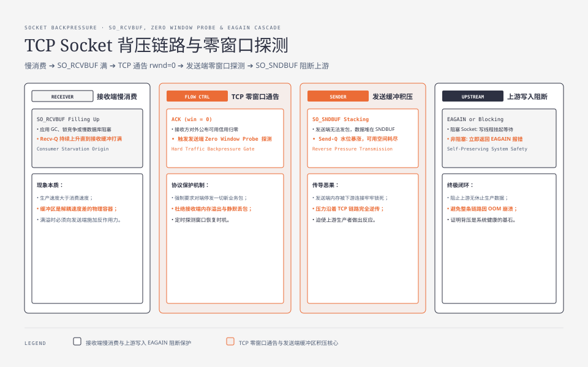
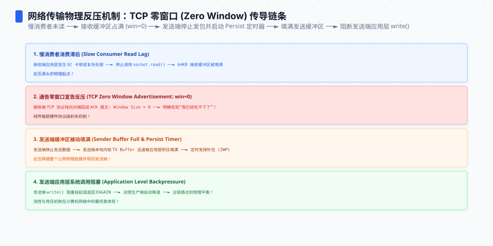
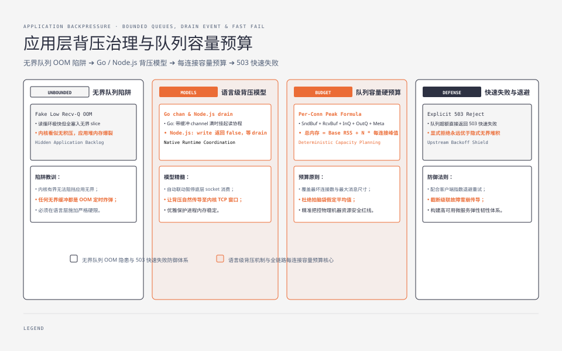

**TL;DR：** 慢消费者的压力确实可能沿着“应用队列 → socket 缓冲 → TCP 流量控制 → 上游写入”逐跳传导，但**应用队列、`SO_RCVBUF`、`rwnd` 和 `SO_SNDBUF` 不是同一层，也没有一个跨平台的默认大小**。`ss` 只能给出 Linux 上某个时刻的内核快照：`Recv-Q` 高说明本端有未读数据，`Send-Q` 高说明本端仍有待发送数据；它们不能单独证明根因。可靠诊断要把队列上限、增长速率、`EAGAIN`/部分写入、超时和应用队列一起放进同一条时间线。

## 一、先讲清楚：背压为什么必须存在



背压不是 bug，是系统的**自我保护机制**。没有缓冲区的两端直连，发送方每写一个字节都要等接收方消费完——那就是"逐字节同步"，吞吐为零。缓冲区存在的意义就是**解耦速度差**：快的一端可以多写一点，慢的一端慢慢消化。

问题出在缓冲区是**有界的**：

1. **接收缓冲**（`SO_RCVBUF`）——接收方内核从网卡取数据放这里，应用不读就可能一直堆。具体默认值、上限和 TCP 自动调节策略由操作系统、协议栈和 socket 配置共同决定；不能把某次 Linux 机器上的数值写成通用默认值。
2. **TCP 接收窗口**（`rwnd`）——接收方对外公布的流量控制额度，受接收缓冲和 window scale 等协议状态影响。应用变慢不会在第一个字节到来时立即把窗口置零；只有可用接收信用耗尽时，对端才会看到零窗口。
3. **发送缓冲**（`SO_SNDBUF`）——发送方内核维护的发送内存，包含待发送和等待确认的协议数据；其记账方式与平台实现有关，不等于“应用还没发出的字节数”。
4. **应用层队列**——应用可能在 `send()` 之前就把消息放进内存队列，也可能在 `Read` 之后把字节放进解码队列。非阻塞 socket 在当前无法接受更多写入时可能返回 `EAGAIN`/`EWOULDBLOCK`；阻塞 socket 则可能让调用线程等待。

于是背压的传导链完整了：


**关键认知**：背压不会凭空消失，它只会**换位置**；但内存到底由哪一层占用，必须量出来。比如“每条连接额外保留 256 KiB、共有 10,000 条连接”这个假设会得到约 2.44 GiB（按二进制单位计算），它只是容量模型，不是任意系统的 socket 默认值，也不等于 RSS 的最终增量。真正的预算至少要拆成内核接收/发送记账、应用入队、应用出队、解码对象和连接基础开销。




## 二、用 ss 缩小背压范围

排查背压不靠猜，但也不能把一张快照当成因果证明。`ss` 是 Linux/iproute2 工具，输出字段会随命令选项和版本变化；下面的表格是教学化简，真实机器应保留完整原始输出。

```bash
# 看所有 ESTABLISHED 连接的缓冲区水位
ss -m -t state established

# 教学化简示例（真实输出还会包含状态、地址和 skmem/tcp-info 字段）
# Send-Q: 本端尚未发出或尚未完成发送的队列快照
# Recv-Q: 本端已经收到、但应用尚未取走的队列快照
Recv-Q  Send-Q  Local Address   Peer Address
0       65536   :8080           :60000   <- 发送方堆满，上游在等
524288  0       :8080           :60001   <- 接收方堆满，这个连接在拖死你
```

判读时先记住三条边界：

1. **`Recv-Q` 持续上升** → 本端内核收到的数据没有及时被应用取走；原因可能是读循环停顿、协议解析慢、事件循环没有重新注册可读事件，不能只归因于 GC。
2. **`Send-Q` 持续上升** → 本端有数据没有完成发送；原因可能是对端消费慢，也可能是路径拥塞、对端通告窗口小或本端应用持续生产。只在本机执行 `ss` 看不到对端的 `Recv-Q`。
3. **单次高水位不等于背压源头** → 需要连续采样，和应用队列深度、读写速率、超时、重传以及连接状态对齐；`-m` 的 `skmem` 也不能直接当作进程 RSS 的逐连接分摊。

```bash
# 想看 TCP 状态和窗口：在 Linux 上保留 tcp-info 快照
ss -tin state established
# 字段名称与格式随 iproute2 版本变化；关注窗口/重传等字段的连续变化，
# 不要把一行输出硬编码成跨平台解析协议。
```

**接收窗口持续为零是这一跳流量控制已经收紧的强证据**——它说明接收方暂时没有给发送方更多信用；但它仍然不能单独区分“应用没读”“应用读入了一个已满的队列”或更下游的处理停顿。要定位源头，必须继续向应用队列和处理耗时追。

## 三、先把三种队列放进同一张图

最容易误判的情况是：`Recv-Q` 很低，但进程仍然 OOM。原因是读循环很勤快，马上把 socket 数据搬进了一个没有上限的应用队列。反过来，`Recv-Q` 很高也不必然说明 TCP 本身有问题；应用可能只是暂时被调度、锁或下游调用挡住。

至少要分别记录下面三类量：

| 层 | 它回答的问题 | 应该记录的信号 | 不能直接推出的结论 |
| :--- | :--- | :--- | :--- |
| 内核 socket | 字节是否还停留在本端 socket | `Recv-Q`、`Send-Q`、`ss -m` 快照 | 进程 RSS、对端 `Recv-Q`、业务是否成功 |
| TCP 流量控制 | 对端现在允许发送多少 | 接收窗口、重传、拥塞控制相关 tcp-info | 应用处理速度、业务队列长度 |
| 应用队列 | 已读/待写的数据是否有界 | 入队字节、出队速率、年龄、丢弃数、`EAGAIN` 次数 | 内核是否已经释放相同数量的内存 |

容量预算可以先写成一个上界模型，而不是背一个“每连接固定 256 KB”的数字：

```text
每连接峰值 ≈ socket receive + socket send
           + application input queue + application output queue
           + decoder/message objects + connection bookkeeping
总峰值 ≈ base RSS + active_connections × 每连接峰值
```

这仍然是预算模型，不是内核实际记账公式。要让它可操作，需要给应用入队和出队都设上限，并明确超过上限时是暂停读取、让上游重试、丢弃可重建消息，还是关闭连接。否则“内核有界”只是在掩盖“应用无界”。

非阻塞写入还要处理两个语义：一次 `write` 可能只接受部分字节，`EAGAIN` 只表示“现在不能继续”，不是消息失败。事件循环应保存未写完的 offset，在可写事件到来后继续；不能在 `EAGAIN` 上忙等，否则背压会从内存问题变成 CPU 问题。文章中的 `ss` 观察必须和这条写队列一起看。




## 四、慢消费者的典型形态

背压源头通常长成这几张脸：

| 形态 | 症状 | 排查入口 |
| :--- | :--- | :--- |
| 消费线程被 GC/阻塞占住 | Recv-Q 持续上升直到满 | GC 日志、线程 dump 看读循环是否停 |
| 消息处理是串行队列 | 队列长度增长，单条消息耗时飙高 | 队列深度指标（Redis/内存队列 size） |
| 下游 API 变慢 | 本服务 Recv-Q 满、Send-Q 满混合 | 全链路追踪（见[分布式追踪](/writing/distributed-tracing-otel)） |
| 死循环/线程饿死 | 单条连接永不消费 | 进程内每个连接的 Recv-Q 曲线 |

一个重要的"受害者"视角：**背压传导时，最先死的是最上游**。中间的服务只是堆缓冲，最上游的客户端在等响应超时，然后重试，把更多请求打进来——雪崩就是这么来的。所以做容量规划时，**慢消费者的容忍度不是"它自己的内存"，是"它往上传染到第几跳"**。

## 五、生产里五件该做的事

背压无法消灭（它是保护机制），但可以**设计出它的边界**：

1. **给消费者设明确的速率承诺**。任何“接收方”都要有可观测的消费速率（QPS、单条耗时、队列年龄），慢的迹象在 `Recv-Q` 满之前出现。
2. **给每一层队列设预算**。应用入队按字节和消息数双重限额；内核 socket 只作为传输缓冲，不能拿它替代业务队列上限。容量计算要覆盖最坏连接数和消息大小，而不是只看平均值。
3. **限流 + 背压要配合**。见[限流、熔断与降级](/writing/rate-limiting-circuit-breaker)：限流挡的是“进来的太多”，背压挡的是“出去的太慢”。一个是入口准入，一个是处理能力反馈，缺一不可。
4. **显式拒绝优于隐式缓冲**。能返回 503 让上游退避的，就别默默把请求堆在内存队列里；可重建的实时消息可以丢弃或合并，不能丢的数据要配持久化队列和重试预算。队列只是把失败延后，不能凭空增加处理能力。
5. **把连接生命周期也纳入策略**。读超时、写超时、最大消息大小、半关闭、客户端断开和重试退避都要有明确合同。否则“保护慢消费者”的无限等待，会把连接数和文件描述符也拖到上限。

## 六、结论：队列预算比单个水位更接近背压根因

背压是处理能力不足向生产端传播的反馈，不是某一个 socket 字段。`Recv-Q`、`Send-Q` 和接收窗口能说明内核传输层正在发生什么；应用入队、出队、消息年龄和 `EAGAIN` 才能说明业务是否把压力继续藏进内存。生产排查应当连续采样并对齐同一时间线，再决定限流、暂停读取、丢弃、重试还是关闭连接。

下一步：在 Linux 目标机保存一段原始快照，例如 `ss -tnmi state established > /tmp/ss-established.txt`，同时导出应用入/出队字节、连接数、读写速率、超时和 `EAGAIN` 计数。不要把示例输出当作当前项目已经获得的生产证据；这篇文章没有把某台机器的 `ss` 快照冒充通用结论。

## 参考资料

1. Linux 手册：socket(7)（SO_SNDBUF / SO_RCVBUF）—— https://man7.org/linux/man-pages/man7/socket.7.html
2. Linux 手册：tcp(7)（TCP 窗口与发送队列）—— https://man7.org/linux/man-pages/man7/tcp.7.html
3. ss 命令手册（iproute2）—— https://man7.org/linux/man-pages/man8/ss.8.html
4. TCP 流量控制经典讲解（RFC 793 的窗口语义）—— https://www.rfc-editor.org/rfc/rfc793#section-3.7
5. Erlang/OTP 关于背压的设计哲学（把背压当一等公民）—— https://www.erlang.org/doc/design_principles

> 延伸阅读：背压的"慢"在传输层还有个更细的分支——接收方不读导致的窗口关闭只是其中一种，丢包与重传是另一种，见[TCP 超时与重传：丢包后网络在赌什么](/writing/tcp-retransmit-timeout-rto)；把背压往上层接，见[限流、熔断与降级](/writing/rate-limiting-circuit-breaker)；跨服务全链路怎么定位"慢的那一跳"，见[分布式追踪](/writing/distributed-tracing-otel)。
