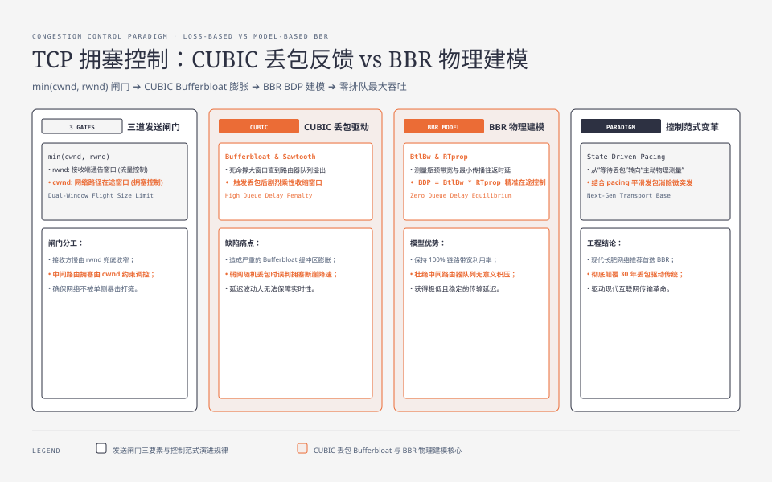
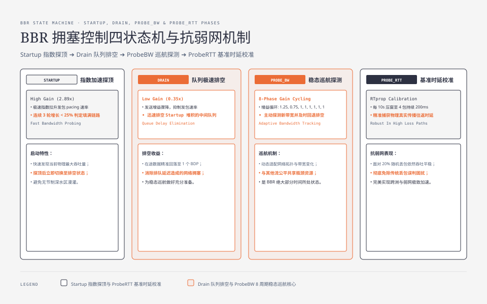

**TL;DR：** TCP 发送得慢，不一定是“带宽不够”。一条连接的在途数据同时受 `cwnd`（网络侧拥塞控制）和 `rwnd`（接收端流量控制）约束，应用发送缓冲、网卡队列和中间设备队列还会在这两个窗口之外继续排队。Reno/CUBIC 主要用丢包信号收缩窗口；BBR 用近期的交付速率、RTT 和丢包率建立路径模型，并同时控制 pacing、在途数据和发送批次。它们都不是“把带宽锁定在某个值”的开关。本文先把这些边界拆开，再说明如何用 `ss`、`nstat` 和隔离的 `netem` 实验判断真正的瓶颈。本文不把论文或单机观测改写成生产吞吐承诺。


---



## 一、先把“能发多少”拆成三个不同问题

发送方是否能继续发数据，至少要经过三道闸门：应用有没有数据、接收端是否还有窗口、拥塞控制是否允许把更多数据放进网络。简化后可以写成：

```text
允许在途的数据 ≤ min(cwnd, rwnd)
```

这条式子只描述未确认数据的上限，不是网卡的线速，也不是应用最终观察到的吞吐。应用写入 socket 之后，数据还可能停留在发送缓冲、排队规则或瓶颈链路的队列里。


因此，`ping` 很低而下载很慢时，不能直接归因于拥塞控制。接收端 `rwnd` 太小、应用没有及时读取、发送端 CPU 或磁盘供数不足、路径上的整形器，以及单连接仍处于慢启动，都可能得到同一个表象。




## 二、标准基线：慢启动和丢包恢复如何收缩发送窗口

RFC 5681 描述了四个相互配合的基本算法：慢启动、拥塞避免、快速重传和快速恢复。它还明确区分 `cwnd` 与接收端通告的 `rwnd`，并把 `ssthresh` 作为慢启动和拥塞避免的切换状态。

### 2.1 慢启动不是“慢”，而是从未知容量开始探路

连接刚开始时，发送方不知道路径容量，只能让 ACK 回来的速度成为反馈。慢启动在每个新数据被确认时增加窗口，宏观上通常表现为每个 RTT 增长一轮窗口，直到达到 `ssthresh` 或观察到拥塞。

初始窗口不是跨实现、跨版本都固定的“10 个 MSS”。具体初始值受标准演进、MSS、实现和配置影响。文章里如果需要讨论冷启动成本，应记录实际的 MSS、初始窗口和 RTT，而不是把某个 Linux 发行版的默认值写成 TCP 的永久合同。

### 2.2 拥塞避免是近似的加性增长，不是唯一的公平公式

经典拥塞避免通常以每个 RTT 约增加一个完整段为直觉模型，丢包后再降低发送能力。这个模型能解释 Reno 的锯齿，但“加一减半是唯一能保证公平的规则”是不成立的。不同算法可以有不同的响应函数，公平性还取决于 RTT、队列管理、ECN、流的开始时间和实现细节。

### 2.3 快速重传、RTO 与 ECN 是不同信号

经典快速重传把三个重复 ACK 作为疑似丢包信号，在不等待重传定时器的情况下发送缺失段。重复 ACK 也可能来自乱序，现代实现还会使用 SACK 等更强的恢复机制，所以“重复 ACK 就等于拥塞”仍然只是一个控制假设。

重传超时是另一条路径。RFC 6298 给出基于 `SRTT` 和 `RTTVAR` 的 RTO 计算，并将初始 RTO 从传统的 3 秒降为 1 秒，随后按重传失败指数退避。Linux 实际实现还会有自己的定时器粒度和下限，不能把 RFC 的初始值直接写成所有平台看到的 `rto`。

ECN 则让网络设备在不丢包的情况下标记拥塞。支持 ECN 的端点可以把“队列压力”作为反馈的一部分。排障时，丢包、ECN、RTT 上升和应用超时不应被压缩成一个“网络不稳定”计数器。

## 三、CUBIC 与 BBR 的差异是控制模型，不是快慢排名

### 3.1 CUBIC：把窗口增长函数改成对大 BDP 更友好的形状

CUBIC 属于 loss-based 家族。它在观察到拥塞后记录此前窗口，再用三次函数安排后续探索，核心意图是：接近上一次拥塞窗口时增长慢一些，远离该点时恢复得更快。常见的教学式可以写成：

```text
cwnd(t) = C × (t - K)^3 + Wmax
```

这不是完整的 Linux CUBIC 实现。实际实现还涉及时间基准、TCP-friendly 机制、拥塞事件处理、ACK 行为和版本差异。它仍然把丢包或 ECN 等拥塞信号放进控制回路，因此随机丢包、深队列和共享队列会影响它的表现。

### 3.2 BBR：用路径模型同时控制速率和在途量

BBR 的名称来自 bottleneck bandwidth 和 round-trip propagation time。它使用近期的交付速率、RTT 和丢包率构造路径模型，再控制发送速率与允许的在途数据。这个模型的目标是高利用率和较低队列压力，但它不意味着“排队永远为零”或“吞吐永远不降”。测量窗口、路径变化、共享流的算法、ACK 聚合和实现版本都会改变结果。

尤其要区分 BBRv1 的历史文章与今天的实现。当前 IETF 草案描述的是 BBRv3，并明确把它视为 Experimental 文档；Linux 中的 BBR 版本、内核补丁和发行版配置需要单独核对。不能把早期论文中的 phase、gain 或性能数字无条件套到所有 `tcp_bbr` 上。

| 维度 | Reno / CUBIC 类 loss-based | BBR 类 model-based |
| --- | --- | --- |
| 主要观测 | 丢包、ACK、ECN 等拥塞信号 | 交付速率、RTT、丢包率等路径样本 |
| 主要控制 | `cwnd` 的增长与收缩 | pacing、`cwnd`、发送批次等多个控制量 |
| 典型风险 | 把随机丢包当成拥塞，或把队列填满后才收缩 | 模型过期、共享公平性、版本差异和探测开销 |
| 选择依据 | 现有网络、实现默认值、兼容性和观测结果 | 同样需要灰度测量，不能只看算法名字 |

BBR 的优势应写成条件句：在某些浅缓冲或随机丢包路径上，模型可能比单纯依赖丢包的算法更有利；在其他路径上，公平性、队列交互或实现成熟度可能更重要。没有同一链路、同一连接数、同一消息大小和重复轮次的对照，不能写“BBR 快多少倍”。


## 四、用 BDP 判断容量，用队列和窗口判断症状

带宽时延积的单位是字节：

```text
BDP = 瓶颈带宽（byte/s）× 最小传播 RTT（s）
```

例如 10 Gbit/s 和 100 ms 的路径，理想 BDP 约为 `10×10^9 / 8 × 0.1 = 125,000,000` 字节，也就是约 125 MB。这个结果只说明“填满路径需要大约这么多在途数据”，不说明某个算法一定会把 `cwnd` 设成这个值，也不说明应用能拿到 10 Gbit/s。

排障先把窗口和队列放到同一张表里：

| 观察 | 更可能说明什么 | 还需要排除什么 |
| --- | --- | --- |
| `cwnd` 小、RTT 接近最小值、连接刚建立 | 仍在慢启动或流量太短 | 初始窗口、MSS、应用供数 |
| RTT 随吞吐升高，`Send-Q` 也持续堆积 | 路径或本机队列有排队 | qdisc、接收端、共享流 |
| `rwnd` 接近零，接收端应用读取慢 | 接收端流量控制限制 | 接收缓冲、消费线程、GC |
| 重传与 RTO 增加 | 丢包、路径故障或严重拥塞 | ECN、MTU、无线链路、CPU |
| `cwnd` 正常但应用吞吐低 | 瓶颈可能在应用或磁盘 | socket 缓冲、加密、线程池 |

Linux 上可以先记录同一连接的 `ss -tin`，再记录接口统计与队列：

```bash
ss -tin dst <server-ip>
nstat -az TcpRetransSegs TcpTimeouts TcpExtTCPRcvQDrop
tc -s qdisc show dev <interface>
```

这些命令提供观测入口，不自动证明根因。采集时应保存内核版本、拥塞算法、MSS、RTT、连接数、发送量、接收量和时间窗口；一张脱离时间轴的 `ss` 快照不能证明“长期丢包”或“算法正在收敛”。

## 五、实验先隔离变量，再比较拥塞算法

如果要比较 CUBIC 与 BBR，至少要固定以下变量：同一对端、同一 RTT/丢包/带宽模型、同一并发连接数、同一 payload、同一 socket 缓冲、相同预热时间和多轮结果。实验最好放在 network namespace 中，避免直接改变宿主机流量：

```bash
# 仅示意实验步骤，要求 Linux、root 权限和隔离的 netns；当前仓库没有 Linux raw 输出。
tc qdisc add dev <if> root netem delay 40ms loss 0.1%
iperf3 -s
iperf3 -c <server-ip> -t 30 -P 1 --json > cubic.json
ss -tin dst <server-ip> > cubic.ss
```

然后只切换拥塞算法，再重复相同轮次：

```bash
sysctl -w net.ipv4.tcp_congestion_control=cubic
sysctl -w net.ipv4.tcp_congestion_control=bbr
```

上面的 `tc`、`iperf3` 和 `sysctl` 是实验协议，不是本文已经运行过的生产测量。报告至少应同时给出 goodput、RTT 分位数、重传/ECN、队列长度和公平性；只给吞吐一列，很容易把“更激进”误写成“更好”。

## 六、结论：先定位队列归属，再决定是否换算法

遇到“带宽忽高忽低”时，先按这个顺序排查：

1. 确认应用确实持续供数，且不是发送缓冲、接收端消费或磁盘成为瓶颈。
2. 用 `cwnd`、`rwnd`、RTT、重传、ECN 和 qdisc 统计区分网络拥塞与端点流量控制。
3. 只有在同语义、同链路、重复轮次的实验中看到差异，才讨论 CUBIC、BBR 或其他算法的取舍。
4. 把算法版本、内核版本和发行版配置写进结果。BBRv1 的文章、BBRv3 的草案和某个云厂商的默认值不是同一份合同。

TCP 拥塞控制解决的是“网络允许我把多少数据放在路上”，不是“服务必然拿到多少带宽”。把这句话和 `min(cwnd, rwnd)`、队列观测、实验分母一起保留下来，才足以解释一次真实的慢请求，而不是给它贴一个算法标签。

## 参考资料

- [RFC 5681：TCP Congestion Control](https://www.rfc-editor.org/rfc/rfc5681)：慢启动、拥塞避免、快速重传和快速恢复。
- [RFC 6298：Computing TCP's Retransmission Timer](https://www.rfc-editor.org/rfc/rfc6298)：SRTT、RTTVAR、RTO 和指数退避。
- [RFC 9293：Transmission Control Protocol](https://www.rfc-editor.org/rfc/rfc9293)：TCP 当前标准文档对拥塞控制规范的索引。
- [IETF：BBR Congestion Control draft](https://datatracker.ietf.org/doc/draft-ietf-ccwg-bbr/)：BBRv3 的当前草案状态与模型描述，草案不是已发布 RFC。
- [Linux kernel：IP sysctl](https://docs.kernel.org/networking/ip-sysctl.html)：Linux TCP 拥塞控制相关配置入口。
- [Google Research：BBR Congestion-Based Congestion Control](https://research.google/pubs/bbr-congestion-based-congestion-control/)：BBR 早期论文与实验背景，不能替代当前实现核对。
