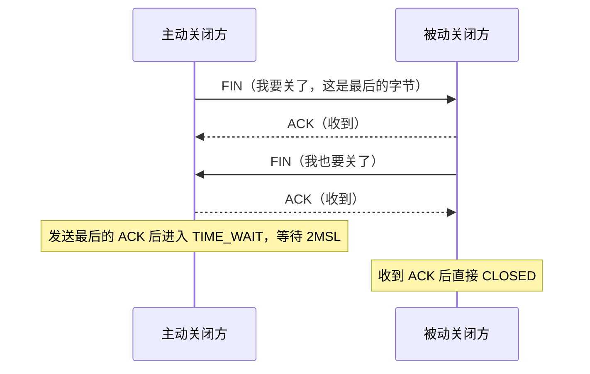
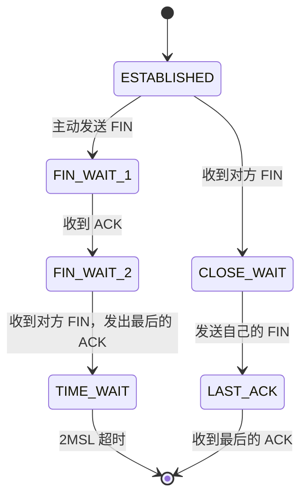

**TL;DR：** TIME_WAIT 不是可以随便调小的“状态残留”，它让主动关闭的一方在一段时间内继续处理迟到报文和对端重传的最后 ACK。持续堆积通常说明连接创建/关闭速率和端口预算不匹配，但 `EADDRNOTAVAIL`、`ECONNREFUSED` 和 TIME_WAIT 数量不能直接互相归因。Linux 的 `tcp_tw_reuse` 是带条件的出站复用机制，默认值和 loopback 行为要按当前内核文档核对；`tcp_tw_recycle` 已移除。真正常见的连接复用方案仍是连接池、keep-alive 和减少主动关闭，而不是盲调 sysctl。

## 一、事故现场：短连接风暴里的两类报错

一次例行发布后，一个内部服务开始周期性报错：调用下游的 HTTP 客户端在高峰时段大量返回 `connect: Cannot assign requested address`，夹着少量 `connect: Connection refused`。报错集中在发布窗口后出现，业务侧的第一反应是"下游挂了"，但下游的监控一切正常。

`ss` 的第一眼就给出了方向：

```bash
$ ss -tan state time-wait | wc -l
184203
$ ss -s
TCP:   1882 established, 184203 time-wait, 0 close-wait, 0 fin-wait-1
```

将近 18 万个 TIME_WAIT，established 只有不到两千。这个比例已经说明问题不在下游的可用性，而在连接的生命周期本身。再看错误的时间分布：高峰时段的连接创建速率超过了某个临界值，之后周期性恢复——这是典型的"资源耗尽后恢复"曲线，耗尽的东西是本地端口。

两类报错的指向不同：

| 报错 | 谁在拒绝 | 原因 |
| :--- | :--- | :--- |
| `EADDRNOTAVAIL`（Cannot assign requested address） | 客户端自己 | 出站连接找不到可用本地端口，本地端口在 TIME_WAIT 里被占用 |
| `ECONNREFUSED`（Connection refused） | 对端或中间路径返回拒绝 | 监听器不存在、端口未开放、服务端主动拒绝或路径策略；不能仅凭它归因 TIME_WAIT |

两条线索指向同一个词：**TIME_WAIT**。理解它，得从 TCP 关闭那一刻的状态机开始。

## 二、TIME_WAIT 从哪来：主动关闭方的宿命

一次正常的四次挥手长这样：



注意一个常见但不绝对的不对称：正常的主动关闭方通常发送最后一个 ACK 并进入 TIME_WAIT，被动关闭方从 `LAST_ACK` 进入 CLOSED；同时关闭等异常时序可能让双方都进入 TIME_WAIT。不能仅凭“谁先调用 close”推断所有实现和时序的状态。



2MSL 是“两个最大报文段生存期”（Maximum Segment Lifetime）的协议模型。RFC 793 的历史文字给过 MSL 示例和 2MSL 规则，但实际操作系统的 TIME_WAIT 持续时间是实现和版本相关的。Linux 常见实现使用约 60 秒的固定值，但应以目标内核源码/文档和观测为准，不要把它写成所有平台的运行时合同，也不要据此断言没有任何内核版本差异。

TIME_WAIT 期间，旧连接的四元组和序列空间仍影响新连接的判定。**同一四元组能否复用**取决于协议规则、时间戳/PAWS、端点角色、监听 socket 选项和内核实现；不能把它简单写成“60 秒内一律冻结”或“设置一个开关就安全复用”。

## 三、TIME_WAIT 在保护谁：三个具体的险情

说"TIME_WAIT 防止旧报文干扰新连接"是对的，但太抽象。具体到报文层面，它保护三件事。

**险情一：迟到的重复段污染新连接。**

假设没有 TIME_WAIT：连接 A 关闭后，四元组立刻被复用建立连接 B。连接 A 的一个段在网络里多绕了一圈，60 秒后才到达——连接 B 的接收方把它当作连接 B 的数据收下。如果序号恰好落在连接 B 的窗口内，数据就错了；序号不在窗口内，则触发一个莫名其妙的 ACK/重传循环，双方都不知道这段数据是哪来的。

现代内核的 ISN 生成和 PAWS 时间戳会降低旧报文被新连接接受的风险，但不能让应用层随意复用四元组。TIME_WAIT 的等待期给序列空间和对端重传留下缓冲；具体保护强度受 MSL 假设、时间戳协商和内核实现影响，文章不把某个 60 秒数值外推成所有路径的“最坏情况”。

**险情二：最后的 ACK 丢了，谁负责重发。**

主动关闭方发出的最后一个 ACK 如果丢失，被动关闭方会一直停在 LAST_ACK，周期性重传自己的 FIN。这时候：

- 如果主动方还在 TIME_WAIT：收到重传的 FIN，重新发送 ACK——被动方正常进入 CLOSED；
- 如果主动方已经把 socket 销毁：重传的 FIN 到达一个不存在的连接，内核回一个 RST——被动方以为对方在报错，把"正常关闭"误判成异常。

TIME_WAIT 是主动关闭方为"对方可能没收到我的最后一句"预留的兜底：**它让"关闭"这个动作变成可靠握手，而不是发完就消失**。

**险情三：双向的承诺，不能单方面作废。**

把上面两个险情放在一起看：TIME_WAIT 保护的其实是**两个方向**。旧连接的残留报文，要等足够久才能保证已经消失在网络里（险情一）；对方的重传请求，要等足够久才能保证对方已经收到我的确认（险情二）。2MSL 取的是两者的较大值，并且留了一倍余量。任何"关掉 TIME_WAIT 提高性能"的方案，都是在同时放弃这两层保护。

## 四、为什么不能缩短：三个常见的错误直觉

**直觉一："改个参数把 TIME_WAIT 缩短到 5 秒。"** 不要假设有一个跨版本通用的 sysctl 可以这样做。Linux 常见实现的 TIME_WAIT 时长由内核代码和协议路径决定，`tcp_max_tw_buckets` 只是限制系统同时保留的 TIME_WAIT 数量；超过后强制回收会牺牲协议保护，不是正常的性能调优。它的默认值和行为应在目标内核上核对，调大也只是推迟资源压力。

**直觉二："有 tcp_tw_recycle，直接复用。"** 这条路径已经不存在了。`tcp_tw_recycle` 在 Linux 4.12 被移除，原因是它按源 IP 记忆时间戳并据此提前销毁 TIME_WAIT，在 NAT 后面会误伤正常流量：NAT 出口后面所有客户端共享一个公网 IP，各自的时间戳基准不同，后来者的 SYN 可能因为"时间戳比记忆值旧"而被直接丢弃——表现为"一部分用户连不上，另一部分正常"，且极难排查。移除它是对"拿保护换性能"的一次盖棺定论。

**直觉三："SO_REUSEADDR 能修复 TIME_WAIT。"** 它主要改变本地 `bind()` 的地址复用规则，常用于服务端重启时重新绑定监听地址；它不等于允许所有旧四元组安全复用，也不等于解决出站端口耗尽。是否能绑定、是否能建立连接，要分开用 syscall 返回值和 TCP 状态观测验证。

## 五、tcp_tw_reuse：唯一活着的内核对策，以及它的边界

`net.ipv4.tcp_tw_reuse` 是 Linux 提供的带条件复用机制，但它的生效范围窄到很多人用错。当前内核文档把它定义为整数选项：`0` 禁用、`1` 全局启用、`2` 只对 loopback 启用，默认值需要按目标内核核对，当前文档的默认值为 `2`：

**它主要影响出站连接的复用判断。** 当客户端挑选本地端口建立新连接时，内核会依据时间戳、目标地址和其他协议条件判断某个 TIME_WAIT 是否可复用；它不是入站监听的通用开关，也不保证所有本地端口都可复用。服务端重启、监听绑定和客户端出站端口耗尽是三个不同问题。

所以它最多是出站端口压力的一种缓解手段，不能用来解释或修复所有 `ECONNREFUSED`。它依赖协议和时间戳条件，若对端重启、时间戳协商或路径条件不满足，复用仍可能被拒绝；最终要看目标内核的状态与计数器。

## 六、真正的解法：别让连接在 TIME_WAIT 里过冬

内核参数都是止血。TIME_WAIT 问题的根源通常是**连接创建速率超过了端口预算**，但端口范围、并发目的地址和实际 TIME_WAIT 时长都要现场读取。若单个本地 IP 的可用端口数为 `P`、观测到的平均 TIME_WAIT 时长为 `T`，粗略的同一目的地址创建速率上限才是：

**`P ÷ T ≈ 每秒可承受的新连接数`**

```bash
$ cat /proc/sys/net/ipv4/ip_local_port_range
<low>	<high>   # P = high - low + 1，需以目标主机输出为准
```

如果连接创建速率长期高于这个粗略预算，TIME_WAIT 可能增长并造成端口压力；实际还受目的地址复用、连接失败、并发和内核复用策略影响。所以正确顺序是先算账，再动手：

1. **把短连接变成长连接。** HTTP keep-alive、连接池、HTTP/2 多路复用可以减少连接创建率。它通常是最先验证的方向，但要确认服务端 idle timeout、连接池上限、负载均衡和故障重连策略。
2. **分开处理出站与入站。** 出站端口压力可以评估 `tcp_tw_reuse`、本地端口范围和多本地 IP；监听端口重绑要评估 `SO_REUSEADDR` 和监听 socket 行为。不要用一个 sysctl 同时解释两类问题。
3. **不要用 `ECONNREFUSED` 反推 TIME_WAIT。** 先确认监听 socket、backlog、服务端日志、SYN/ACK/RST 抓包和网络策略，再判断是否有连接生命周期问题。
4. **观察保留压力。** `ss -s`、`/proc/net/sockstat`、端口分布和连接创建速率应放在同一时间窗口，`tcp_max_tw_buckets` 只表示保留上限，不是健康阈值。

如果要写成事故结论，至少要保存连接池配置、连接创建速率、端口耗尽错误、`ss`/sockstat 时间序列和修复后的对照窗口。本文没有当前环境可追溯的这些 raw，因此不再声称“18 万降到几百”或把 `ECONNREFUSED` 与 TIME_WAIT 绑定为同一根因。

## 七、结论：TIME_WAIT 是连接复用前必须支付的协议保护成本

TIME_WAIT 保护的是 TCP 关闭协议的可靠性，不是可以被“调优”掉的性能残留：它为迟到段和对端重传留下等待窗口。持续堆积时，先测连接创建率、端口范围、内核复用条件和主动关闭方，再选择连接池或更精细的端点配置；不要从一张 `ss` 快照推导固定时长和根因。

`tcp_tw_reuse` 是带条件的 Linux 出站复用机制，`tcp_tw_recycle` 已经不存在。看到 TIME_WAIT 堆积，先算连接创建速率与端口预算的账，再评估连接池、关闭方向和当前内核配置；连接复用通常比盲目增加回收上限更值得验证。

下一步可做的事：

```bash
$ ss -s                                    # 看 TIME_WAIT 总量与端口预算对比
$ ss -tan state time-wait | awk '{print $4}' | sort | uniq -c | sort -rn | head
                                           # 找出 TIME_WAIT 集中在哪个本地端口（哪条业务路径）
$ cat /proc/sys/net/ipv4/ip_local_port_range   # 算出端口预算
```

## 参考资料

1. RFC 793：Transmission Control Protocol（MSL 定义与 TIME_WAIT 状态）—— https://www.rfc-editor.org/rfc/rfc793
2. Linux 内核文档：ip-sysctl（tcp_tw_reuse、tcp_max_tw_buckets、ip_local_port_range）—— https://docs.kernel.org/networking/ip-sysctl.html
3. Linux 内核文档：ip-sysctl（tcp_tw_recycle 自 4.12 起从内核移除）—— https://docs.kernel.org/networking/ip-sysctl.html
4. RFC 7323：TCP Extensions for High Performance（时间戳与 PAWS）—— https://www.rfc-editor.org/rfc/rfc7323
5. BSD Sockets 手册：SO_REUSEADDR 与 TIME_WAIT —— https://man7.org/linux/man-pages/man7/socket.7.html

> 延伸阅读：TIME_WAIT 管的是连接的生命周期，带宽与拥塞是另一笔账——见[TCP 拥塞控制：从慢启动到 BBR，带宽为什么忽高忽低](/writing/tcp-congestion-control-bbr)；连接建立与释放的开销，在 HTTPS 里还有 TLS 握手那几毫秒——见[TLS 握手全流程：HTTPS 那几毫秒里发生了什么](/writing/tls-handshake-deep-dive)。
