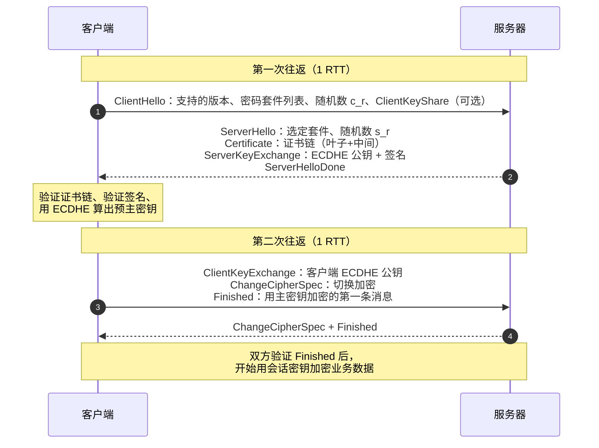

**TL;DR：** HTTPS 握手要同时建立身份、密钥和记录层保护，不能简化成“非对称加密交换一个对称密钥”。TLS 1.2 的完整 ECDHE 握手通常需要 2 个网络往返，TLS 1.3 通常把完整握手压到 1 个往返；恢复连接时还要区分 1-RTT PSK 握手和可以携带早期数据的 0-RTT。真正的工程成本往往来自往返延迟、连接建立频率、证书链和验证失败，而不是一句“RSA 比 AES 慢多少”。本文把握手消息、前向保密、0-RTT 重放风险和排障命令放在同一条证据链里。

## 一、 没有 TLS 的网络是什么样

TCP 只保证"字节流到达"，不保证"到达的内容是原装的"。一个明文 HTTP 请求在公网上要经过十几台路由器和运营商网关，任何一个环节都可以：

- **窃听**：看到你的 Cookie、密码、请求体（被动，不可检测）。
- **篡改**：改掉响应里的下载链接，注入广告或恶意脚本（主动，校验和也拦不住——TCP 校验和防的是线路噪声，不是恶意改写）。
- **冒充**：让客户端以为自己是银行，收下账号密码（DNS 劫持、伪造证书场景）。

三个威胁对应 TLS 的三个能力：**机密性**（加密）、**完整性**（MAC/AEAD 认证）、**真实性**（证书链）。只加密不认证等于裸奔——任何中间人都能直接换掉你的公钥。

为什么不全用非对称加密？公钥算法的计算和消息长度约束都不适合承载大量应用数据，而且现代 TLS 更常用临时 Diffie-Hellman 做密钥协商，而不是把应用数据交给 RSA。于是 TLS 的架构应写成：**用证书证明身份，用临时密钥交换协商密钥，用 AEAD 保护记录数据**。RSA-2048 的密文块上限是 256 字节，但这只是未考虑填充的块大小，不能拿它当成 TLS 应用载荷的通用上限。

## 二、 TLS 1.2 的完整握手：两个来回谈成合同

以最常见的 TLS 1.2 + ECDHE_RSA + AES-GCM 为例，一次全新握手长这样：



拆开每一步：

1. **ClientHello**：客户端宣告"我会 TLS 1.2 及以下，支持这些密码套件"。这里有个 16 字节的随机数 `c_r`，后面参与密钥派生，防重放。
2. **ServerHello**：服务器选一个套件。随后是重头戏——**证书**。证书里装的是服务器的**公钥**，服务器私钥从不离手。
3. **ServerKeyExchange**：服务器生成一对 ECDHE 临时密钥，把**临时公钥** 发给客户端，并用自己证书里的私钥对这段内容签名。
4. **客户端验证**：这是握手最重的计算点，三件事：① 验证证书链是否受信；② 验证签名（证明"说话的人持有证书私钥"）；③ 用临时公钥与自己的临时私钥做 ECDH，算出预主密钥（pre-master secret）。
5. **密钥派生**：预主密钥 + 两个随机数，过 PRF（伪随机函数）派生出一堆会话密钥：加密密钥、MAC 密钥、IV。
6. **Finished**：第一条用新密钥加密的消息是握手摘要的 MAC——对方解不开就说明密钥不一致，握手失败。

### 2.1 ECDHE 为什么是必需品：前向保密

TLS 1.2 时代的主流密钥交换有两种：RSA 交换（客户端拿服务器公钥加密预主密钥）和 ECDHE（双方各自生成临时密钥对，用 ECDH 协商）。它们的区别在**前向保密（Forward Secrecy）**：

- RSA 交换：客户端用服务器证书公钥保护预主密钥。**如果服务器私钥日后泄露**，攻击者在握手记录完整且没有额外保护的情况下可能解密历史流量。
- ECDHE：预主密钥由双方的**临时**密钥协商得出，临时私钥不等于证书私钥。证书私钥日后泄露仍会影响身份冒充和未来连接，但不能单凭它解出已经完成的 ECDHE 会话。

所以现代基线是"RSA 证书（身份）+ ECDHE 交换（密钥）"，这也是 `ECDHE_RSA` 套件名的含义。TLS 1.3 更进一步：直接**删除** 了所有 RSA 交换套件，只留 DHE/ECDHE——前向保密从选项变成唯一选项。

### 2.2 证书链：谁给谁背书

客户端凭什么信任那张证书？不是凭"证书是真的"，而是凭**信任链**：

```text
根证书（预装在系统/浏览器里，自签名，信任锚）
   └─ 签发 → 中间 CA 证书（可有多级）
        └─ 签发 → 服务器叶子证书（含域名与公钥）
```

验证过程是自下而上：叶子证书的签名用"签发者（中间 CA）的公钥"验；中间 CA 证书的签名用"根证书的公钥"验；根证书在系统信任存储里，是链的终点。任何一级签名对不上、过期、或者域名不匹配（`CN`/`SAN`），验证立即失败。

生产事故里证书问题的比例高得惊人，且几乎总是这三类：

- **证书过期**：Let's Encrypt 证书 90 天有效期，忘了续期 = 全站挂。这是"周五下午 5 点"事故第一名。
- **链不完整**：只发了叶子证书没发中间 CA，客户端爬到根时断链。多数浏览器会尝试补全，但 `curl`、Go、Java 等严格实现直接失败——这就是"浏览器能开、curl 报 `unable to get local issuer certificate`"的经典场景。
- **域名不匹配**：证书签发给了 `example.com`，访问的是 `www.example.com`。泛域名证书只覆盖单层子域，`*.example.com` 不覆盖 `a.b.example.com`。

## 三、 TLS 1.3：把两个 RTT 砍成一个

TLS 1.3（2018，RFC 8446）改的不是加密强度，而是**把协商提前到第一个包**：

```text
客户端 → 服务器：ClientHello（内含支持的密钥共享，把 ECDHE 的客户端临时公钥直接带上）
服务器 → 客户端：ServerHello（选定密钥共享 + 加密握手消息 + Finished）
客户端 → 服务器：Finished（加密）
```

服务器收到 ClientHello 时，手上已经有"客户端 key share + 自己的临时私钥"，可以计算握手密钥并把后续握手消息加密发回。完整 TLS 1.3 握手通常压到一个 RTT，但具体网络时间还要加上 TCP 建连、地址解析、HelloRetryRequest 和应用开始发送的排队；不能把“一个 TLS RTT”写成“整个 HTTPS 请求只要一个 RTT”。

它怎么敢提前带密钥共享？因为密钥共享（key share）只是一对**临时** 公钥，不涉及身份：猜错了大不了多一个 HelloRetryRequest 重来，没有安全损失。真正需要"先验证再谈"的身份证书，依然在服务器发出的第一条加密消息里——所以安全强度没降，只是把"谈条件"和"给身份"解耦了。

TLS 1.3 还干掉了几个历史包袱：全部 RSA 交换、全部 CBC 模式套件（统一 AEAD）、压缩（CRIME 攻击的根源）、重协商（明文注入的根源）。这就是 1.3 配置短到只剩三行（`TLS_AES_128_GCM_SHA256` 等）的原因——不是选项变少了，是"不安全的选择"被删光了。

### 3.1 0-RTT：快但危险

会话恢复（PSK resumption）是 1.3 的另一项性能武器：服务器签发一张加密的 **session ticket**，其中携带用于恢复的 PSK 身份和状态，而不是把可直接复用的应用会话密钥明文交给客户端。客户端下次连接可以用 PSK 参与握手；只有在启用 early data 时，才会在服务器完成握手确认前发送 0-RTT 应用数据。

但 0-RTT 数据有**重放风险**：被录下来的第一批请求可能被原样重发。HTTP 方法名里的“幂等”也不自动等于业务上的 replay-safe，GET 可能触发计费、审计或缓存刷新，POST 也可能在应用层通过幂等键变得可重放。正确做法是只允许经过业务审核的 replay-safe 请求，并配合 anti-replay 窗口、幂等键和服务端策略；不能用“只放 GET”代替分析。

## 四、 握手之后：记录层与密钥更新

握手产出的会话密钥接下来保护的是**记录层**：每条应用数据被切成分片，用 AEAD（如 AES-256-GCM）加密并附带认证标签，接收方解密并验标签。AEAD 同时保证机密性（看不懂）与完整性（改不了）——这就是 TLS 1.2 时代"加密 + 独立 MAC"两件套被 1.3 合并成一套的原因。

1.3 还有一个 1.2 没有的机制：**密钥更新**。加密密钥可以通过 KeyUpdate 派生新一轮，限制单个记录密钥的使用范围；但 KeyUpdate 不等于重新进行一次 DH 密钥交换，也不能把它宣传成“历史记录即使会话密钥泄露也绝不会被反解”。前向保密的主要来源仍是临时密钥交换和会话密钥的生命周期。

## 五、 工程视角：握手的成本在哪里

**1. 最贵的常常不是计算，而是往返。** 一次完整 TLS 1.2 握手通常要两个 RTT，TLS 1.3 通常要一个 RTT；本地密钥交换和证书验证的实际耗时则受硬件、算法、证书链和库版本影响，不能写成固定的“纳秒级”或“毫秒级”。对 200ms RTT 的路径，额外往返本身就可能达到数百毫秒，所以：

- **连接池必须开**。HTTP/1.1 的 keep-alive 与 HTTP/2 的连接复用，本质都是让"一次握手服务多次请求"。Go 的 `http.Transport` 默认复用连接，但 `DisableKeepAlives` 一开性能直接腰斩。
- **会话复用** 要分开写：TLS 1.2 的 abbreviated handshake 通常仍需要一个 RTT；TLS 1.3 PSK 恢复的完整握手通常可以在一个 RTT 内完成，启用 early data 才涉及 0-RTT 应用数据。开启 TLS 会话缓存或 ticket 机制能减少完整握手，但必须同时处理 ticket 生命周期和 0-RTT 的重放合同。
- **HTTP/3 的 QUIC 握手** 把 TLS 1.3 握手嵌进 QUIC，避免 TCP 三次握手再叠加一次 TLS 往返；它仍受地址验证、丢包、路径变化和 0-RTT 合同影响，不能把“减少一次握手往返”直接写成所有 5G 或弱网请求都会下降的固定收益。

**2. 排障先确认验证目标。** 握手失败可能来自协议版本、证书链、主机名、SNI、信任库或中间设备；`openssl s_client` 可以把这些维度拆开，但不能用一句“90% 是证书问题”替代证据：

```bash
$ openssl s_client -connect example.com:443 -servername example.com \
    -verify_hostname example.com -verify_return_error -brief </dev/null
```

`Verify return code: 0 (ok)` 是当前信任库和验证参数下的绿灯；`20 (unable to get local issuer certificate)` 指向本地信任链无法构建；`10 (certificate has expired)` 指向过期。主机名校验要显式使用 `-verify_hostname`，否则不能仅凭链验证判断域名匹配。`-tls1_3` 与 `-tls1_2` 可以强制协议版本，比较服务端支持矩阵；命令本身不能证明中间设备一定在篡改 ClientHello。

**3. mTLS：客户端也要证明自己。** 双向 TLS 是服务器请求客户端证书，客户端出示自己的证书链，服务器再按信任策略验证它。Kubernetes service mesh 的 sidecar 之间、部分 Kafka 部署和 gRPC 的双向 TLS 都可能使用 mTLS；但 `SASL_SSL` 本身只说明 Kafka 使用 TLS 加密，不等于一定启用了客户端证书认证。代价是证书签发、轮换、撤销和身份映射都变成双向运维合同。

一句话总结：TLS 是"非对称换密钥、对称传数据、证书验身份、AEAD 保完整"的流水线。新连接的延迟大头是 RTT 而不是计算，所以性能优化的头号抓手永远是连接复用；而可靠性优化的头号抓手永远是证书生命周期管理——两者都比改密码套件重要得多[^1]。

[^1]: 延伸阅读：RFC 8446（TLS 1.3）的开头部分比任何二手资料都清晰；《Bulletproof TLS and PKI》是证书体系最完整的参考；`ssl_session_cache` 与 `session_ticket` 的 nginx 配置文档能直接对应到本文的会话复用部分。

## 六、参考资料：握手、重放与记录层

- [RFC 8446：The Transport Layer Security Protocol Version 1.3](https://www.rfc-editor.org/rfc/rfc8446/)：TLS 1.3 握手、0-RTT、密钥派生与记录保护。
- [RFC 8446 §4.2.10：Early Data](https://www.rfc-editor.org/rfc/rfc8446.html#section-4.2.10)：0-RTT 重放风险与应用层限制。
- [RFC 5246：TLS 1.2](https://www.rfc-editor.org/rfc/rfc5246)：TLS 1.2 握手与记录层基线。
- [OpenSSL `s_client`](https://docs.openssl.org/3.4/man1/openssl-s_client/)：证书链、协议版本与握手排障命令。
