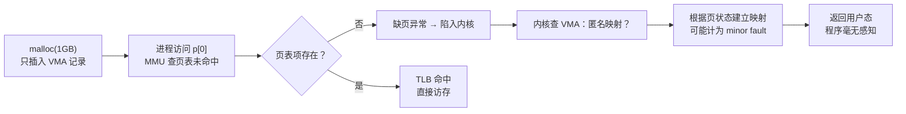
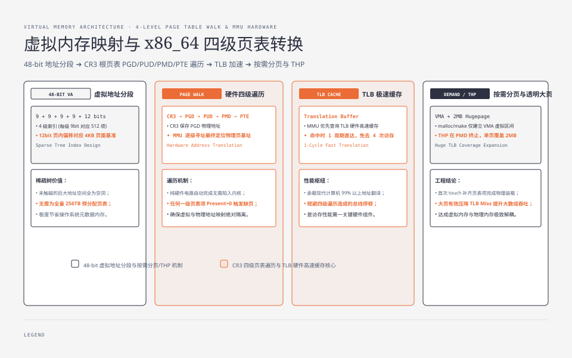

**TL;DR：** 地址空间预留、物理页驻留和文件 I/O 是三件事：C 的 `malloc` 可能通过 `brk`/`mmap` 获得虚拟地址，Go 的 `make` 还要经过运行时堆管理；首次访问匿名页可能触发缺页，但页大小、THP、预触碰和内核回收会改变次数与成本。Linux 的 minor/major 计数是诊断信号，不是固定的微秒/毫秒 SLA。要解释 Go 的 RSS 和 P99，必须把匿名页、文件页、页表、COW、cgroup/overcommit 和 swap 的证据放在同一时间线上。

## 一、地址空间预留不等于物理页驻留

写一个最简单的程序：

```go
// 关键片段：这里只创建切片，不遍历写入全部元素。
p := make([]byte, 1<<30) // 申请 1 GiB 的逻辑长度
fmt.Println(len(p))
// 进程随后不访问 p 的大部分范围
```

进程申请了 1 GiB，但它是否立刻占用 1 GiB 物理内存，取决于运行时、内核、分配器和访问路径。在某些 Linux/Go 组合中，未被触碰的范围主要表现为虚拟地址空间增长，`VmSize` 与 `VmRSS` 的差距很大；预触碰、透明大页、分配器策略或内核配置会改变这个观察结果。`VmRSS` 也只是一个统计口径，不能单独证明“内存没有被承诺”或“不会触发 OOM”。

这就是虚拟内存的第一课：**分配地址空间 ≠ 分配物理内存**。

Linux 上，glibc 的 `malloc` 可能使用 `brk` 或 `mmap`，阈值和实现细节会随版本与配置变化；Go 的 `make` 通常由 Go runtime 管理堆，并不等于“调用 glibc 的 malloc”。对一个匿名 `mmap` 区域来说，建立 VMA 主要描述了地址范围和权限，物理页可以延迟到首次访问；但内核可能预分配、合并大页或复用共享零页，所以不能把“每次 mmap 都没有任何页表项”写成普遍保证。

对一个未预触碰、使用普通页的匿名映射，第一次写入某个页可能触发**缺页异常**：MMU 发现当前映射不能满足访问，内核根据 VMA、权限和页状态选择分配匿名页、建立映射或返回错误。这是 demand paging（按需分页）的一个典型路径；读未写入的匿名页还可能先看到共享的零页，不能用“每个首次访问都分配一个私有物理页”概括所有路径。

所以“缺页”不是错误，它是虚拟内存的正常工作方式；但“每一个写过的页恰好一次缺页”只是关闭 THP、预取、预触碰、回收和共享页等因素后的教学假设。



在“4 KiB 普通页、按字节写满、没有 THP 或预触碰”的简化模型里，1 GiB ÷ 4 KiB = 262,144 个页，因此第一次写满可能产生同量级的匿名页建立工作。真实数量和耗时应通过 `perf stat`、`/proc/<pid>/stat` 或运行时指标验证；惰性分配只是把成本推迟到了访问时，并不保证成本为零。




## 二、 页表：一张按需构建的稀疏树

虚拟内存要把“虚拟地址 → 物理地址”的映射关系记下来。最简单的线性页表会为每个虚拟页准备一个表项，地址空间一大，页表本身就可能占用不可接受的内存。因此常见架构使用**多级页表**，只为实际需要的范围分配下级表。以 4 KiB 页、x86-64 四级分页和 48-bit 虚拟地址的教学模型为例，每级索引通常是 9 bit；启用 LA57 时是五级，ARM 等架构的层级和命名也可能不同。


*图注：malloc 的大块内存只在 VMA 里有记录，页表树里没有对应分支；首次 touch 才分配物理页并补齐页表项。*

在上述 x86-64 四级、4 KiB 页的模型中，虚拟地址可以写成：

```text
虚拟地址 = [PGD 索引 9bit] [PUD 索引 9bit] [PMD 索引 9bit] [PTE 索引 9bit] [页内偏移 12bit]
```

在 x86 上，CPU 从 `cr3` 关联的根页表开始做硬件 page walk；具体层数、缓存和权限检查由架构决定。TLB 缓存“虚拟页号 → 物理页号”的转换，命中时可以跳过大部分遍历；miss 时也不应简单等同于“固定多四次内存访问”，因为 paging-structure cache、缓存层级、huge page 和硬件实现都会改变成本。跨架构讨论时，要以目标 CPU 的手册和计数器为准。

**THP（Transparent Huge Page）** 可以在满足条件时用更大的页映射，例如 2 MiB 页；这能扩大单个 TLB 项覆盖的范围，但也可能带来整理、分裂、内存碎片或 COW 成本。是否启用、使用 `always`/`madvise`/`never`，应根据目标工作负载的 fault、TLB、内存和尾延迟数据决定，不能从“大数组扫描通常受益”直接推出数据库或云环境的统一配置。

## 三、 缺页的两种档位：minor 与 major

Linux 的统计通常把 page fault 分成 minor 和 major；它们首先是“是否需要阻塞等待 I/O”的分类，不是固定的性能档位：

- **minor fault（次要缺页）**：处理 fault 时不需要等待磁盘 I/O。匿名页建立映射、已在内存中的文件页建立进程映射等路径可能计入这一类；具体路径仍取决于内核状态。
- **major fault（主要缺页）**：处理 fault 需要等待存储 I/O，例如文件页或 swap 页尚未驻留。耗时由设备、队列、文件布局、缓存和并发决定，不能用“机械盘几毫秒、SSD 几百微秒”替代实测。

Linux 上可以用工具记录计数，但它们不是跨平台统一接口。GNU `time -v` 只给出进程级汇总，下面只展示命令，不伪造本机输出：

```bash
$ /usr/bin/time -v ./my-server 2>&1 | grep -E "Minor|Major|Context"
```

长期运行的服务如果在请求路径持续产生 major fault，确实值得排查文件映射、内存压力、swap 和工作集，但“应该趋近于零”仍是工作负载相关的目标，不是平台保证。建议把 `perf stat -e page-faults,minor-faults,major-faults`、`vmstat` 的 `si/so`、应用请求延迟和 off-CPU/系统 I/O 迹象放在同一时间窗口；CPU profile 看不到阻塞等待本身，不能据此把每个延迟尖峰都归因于缺页。


## 四、文件页与页缓存：mmap 只省掉特定复制路径

虚拟内存机制不仅管匿名页，也管文件。Linux 通过 `read()` 读取普通文件时，内核通常把数据放入**页缓存**（page cache），再把数据复制到用户缓冲区；这可以用“存储 → 页缓存 → 用户缓冲区”理解，但实际路径还会受到 direct I/O、缓存命中和文件系统的影响。

`mmap` 把文件映射到进程的虚拟地址空间；访问尚未建立映射的页时，内核可能通过页缓存和缺页路径完成映射。它可以避免每次显式 `read()` 的用户缓冲区复制，但不等于“没有拷贝、没有 fault 或没有 I/O”：首次访问可能阻塞，预取和缓存状态会改变路径，`MAP_SHARED`、`MAP_PRIVATE`、写权限与 `msync`/关闭时机也决定可见性与持久化语义。把它称为“零拷贝”时，必须说明是省掉哪一次复制、对哪个调用路径而言。

这解释了为什么一些数据库和搜索系统会在特定访问模式下评估 mmap：重复访问、页缓存和预取可能带来收益，但随机访问、内存压力、故障恢复和尾延迟也可能让普通 `read()` 或 direct I/O 更合适。网络服务若每次访问的数据不重复，mmap 可能把 fault 和页缓存抖动引入请求路径；是否更稳定需要用目标文件集、并发和内存上限做同语义基准，不能从“mmap 更接近直接访存”推出普遍结论。

## 五、写时复制：fork 只推迟了部分复制成本

`fork()` 创建子进程时，内核通常不会立即复制父进程的全部物理页；它要建立子进程的地址空间/页表视图，并把可写共享页标成需要 COW 的状态。父子进程一方写入时，才可能触发缺页并复制相关页。页表建立、调度、锁和内核元数据仍然要付成本，所以“没有复制全部物理页”不等于“fork 瞬间完成”。这就是 **COW（Copy-On-Write，写时复制）**。

```text
# 伪代码：Redis 等程序在 Unix 上可能采用类似 fork + COW 的路径
pid = fork()           # 不是 Go 的通用用户态 API
if pid == 0 {
    dumpRdb()          # 子进程按 fork 时的地址空间视图读取
    exit(0)
}
wait(pid)              # 父进程继续服务，但仍可能承受 fork/COW 开销
```

RDB 之所以可以把序列化工作放到子进程，依赖的确实是 COW 快照视图；但 fork 本身、页表建立、父进程后续写入造成的 COW、磁盘带宽和内存峰值都可能影响主进程。被父子进程分别写入的页会产生额外的私有物理页，监控中是否“RSS 翻倍”还取决于 RSS/PSS 的统计口径，不能当作固定现象。

COW 有两个需要实测的坑。其一，父进程地址空间越大，fork 的页表和内核元数据工作可能越重；“子进程随后 exec 所以没有复制用户页”也不代表调用不会影响尾延迟。其二，启用 THP 时，COW 可能涉及大页拆分或更大的复制粒度，具体路径依赖内核和映射属性。不要把某个 Go 版本的 `GOMEMLIMIT`、某个发行版的 THP 行为和 fork 成本直接绑定；应分别采集 fork 延迟、minor fault、RSS/PSS 和 cgroup 事件。

## 六、overcommit 与 OOM：内存压力如何变成故障

虚拟内存的承诺可以超过物理内存，这个设计叫 **overcommit（过度承诺）**。Linux 有 `vm.overcommit_memory` 等策略，默认值和容器/发行版配置必须现场核对，不能把模式 `0` 写成所有系统的默认。内存压力可能在“承诺集中兑现”时暴露，也可能先表现为回收、swap、cgroup OOM 或分配失败；物理内存、swap、提交限制和 cgroup 上限是不同的约束。

`OOM killer` 会依据内核计算的 badness/`oom_score`、`oom_score_adj`、cgroup 层级和当前 OOM 场景选择受害者；不是一个只按 RSS、启动时间和优先级排序的清单。它的目标是回收可用内存，而不是保证业务重要性。因此：

- 数据库、JVM 和 Go 服务都必须为堆外内存、页表、文件页、sidecar、内核和突发峰值留预算；`innodb_buffer_pool_size` 或 `-Xmx` 不能脱离机器/容器总预算单独决定。
- `mmap`、匿名页、文件映射、swap 和 `CommitLimit` 的计费关系受 overcommit 模式和映射属性影响；裸机与 cgroup 环境应分别读取 `/proc/meminfo`、`/proc/sys/vm/overcommit_memory` 和 cgroup memory events。
- swap 是容量和延迟的取舍，不是“必开”或“必关”的共识。要比较它的价值，至少需要目标延迟、swap-in/out、回收压力和 OOM 结果；延迟敏感服务可能选择严格限制，批处理服务可能接受部分 swap。

工程上的收尾结论是：**把 RSS、匿名/文件页、minor/major fault、swap、cgroup memory events 和应用堆指标放在同一时间线上**。单独盯 RSS 不能解释泄漏，单独看到 major fault 也不能证明所有 p99 都由它造成。

## 七、回到 Go：RSS 为什么可能比 heap 大

把视角切回 Go。一个 Go 服务“live heap 约 500 MiB”但 RSS 是 1.2 GiB，不足以判断泄漏。需要先确认两者的统计时点、单位和组成，常见解释包括：

1. **runtime 保留的堆与碎片**：Go runtime 以 span/arena 等粒度向操作系统管理地址空间和物理页；live object 小于已保留或暂未归还的页时，RSS 可能更大。
2. **文件映射与共享页**：`mmap`、共享库和其他文件映射会让进程看到文件页；`os.ReadFile` 本身主要是读入 Go 堆，不能把所有文件访问都叫作“页缓存计入 heap”。需要结合 `RssAnon`、`RssFile`、`RssShmem`、PSS 和映射表判断。
3. **GC 与归还策略**：Go runtime 会在条件满足时把部分页归还给操作系统，但归还速度、保留的缓存和 `GOMEMLIMIT` 的 GC 目标不是同一个开关。`runtime/metrics` 的 `/memory/classes/*`、`/gc/heap/*` 与 `/memory/classes/heap/released` 比“RSS 不降就是特性”更能说明发生了什么。
4. **COW 或 cgo 交互**：Go 不提供普通用户代码直接调用 `fork` 的安全抽象；`os/exec` 在 Unix 上可能经过 fork/exec 路径，cgo 库也可能自行 fork。若存在这类路径，应单独分析 COW 和运行时约束。

判断方法可以落成一组证据：先读 `/proc/<pid>/status` 的 `VmRSS`、`RssAnon`、`RssFile`、`RssShmem` 和 `VmSwap`，再看 `/proc/<pid>/smaps_rollup` 的 PSS，结合 `vmstat` 的 `si/so`、cgroup `memory.current`/`memory.events`、Go runtime metrics 和 heap profile。只有这些曲线在同一时间窗共同指向增长、回收或 I/O，才足以把“内存泄漏”缩小到具体类别。

[^1]: 本文没有附带 Linux 机器上的原始压测输出；文中的 1 GiB、262,144 页和 500/1,200 MiB 只是解释模型或排查场景，不能当作性能基线。实验时应固定内核、架构、页大小、THP、swap、cgroup 限制和 Go 版本，并保留完整命令与原始计数。

## 八、参考资料：Linux 内核对地址空间的定义

- [Linux kernel：Process Address Space](https://docs.kernel.org/mm/process_addrs.html)：VMA、进程地址空间与映射关系。
- [Linux kernel：Overcommit Accounting](https://docs.kernel.org/mm/overcommit-accounting.html)：提交限制与 overcommit 策略。
- [Linux kernel：Transparent Hugepage Support](https://docs.kernel.org/admin-guide/mm/transhuge.html)：THP 的模式、收益与限制。
- [`mmap(2)` manual](https://man7.org/linux/man-pages/man2/mmap.2.html)：匿名映射、文件映射和保护属性。
- [`proc_pid_status(5)` manual](https://man7.org/linux/man-pages/man5/proc_pid_status.5.html)：`VmSize`、`VmRSS` 等进程内存统计字段。
- [Go `runtime/metrics` 文档](https://pkg.go.dev/runtime/metrics)：运行时内存类别与 GC 指标的定义。
