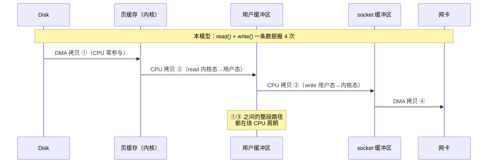
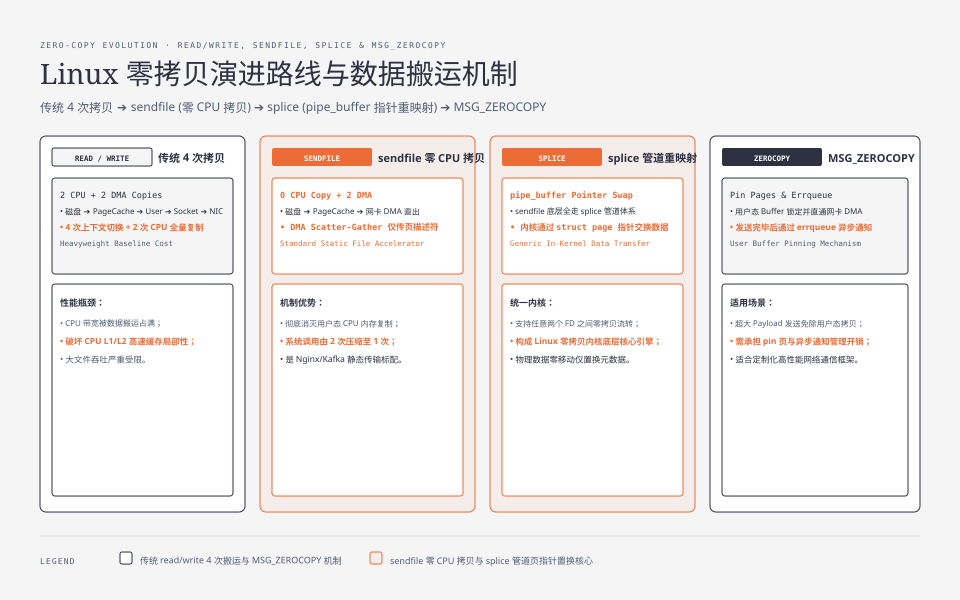
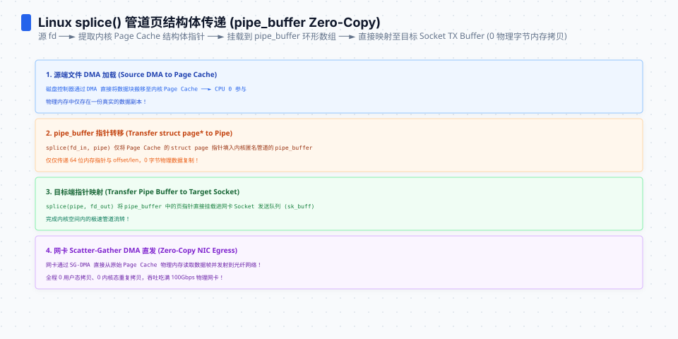
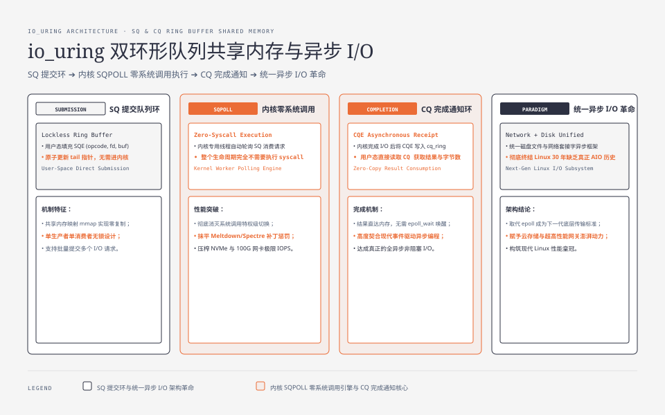
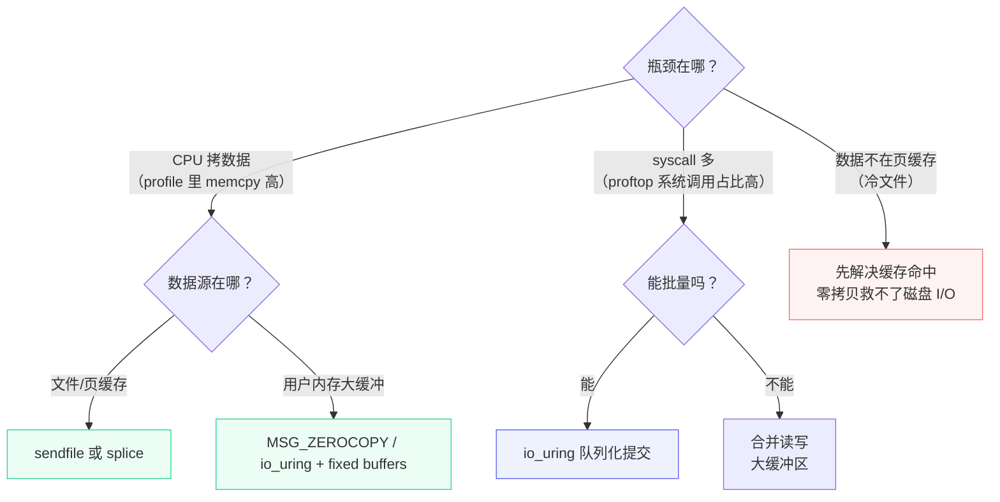

**TL;DR：** 在本文的 buffered file-to-socket 模型里，传统 `read + write` 经过 2 次 CPU copy 和 2 次 DMA；Linux 的兼容 `sendfile` 路径可以把用户态 CPU copy 降到零，但具体是否保留页引用、是否落回 copy 取决于文件系统、socket、网卡和中间层。`MSG_ZEROCOPY` 是带完成通知的 copy-avoidance hint，`io_uring` 主要改变提交/完成路径。零拷贝省不掉 DMA，也不自动适用于 TLS、任意数据变换或所有设备。**先量瓶颈，再选路径。**

## 一、四次搬运的账单：read + write 的每一笔都记在 CPU 上

最朴素的静态文件发送是循环 `read` + `write`。下面是用于说明搬运路径的简化 C 片段，真实服务还要处理 `EINTR`、短写、背压和连接关闭：

```c
int fd = open("bigfile.bin", O_RDONLY);
char buf[64 * 1024];
ssize_t n;
while ((n = read(fd, buf, sizeof buf)) > 0) {
    for (ssize_t sent = 0; sent < n;) {
        ssize_t m = write(sock, buf + sent, (size_t)(n - sent));
        if (m <= 0) { /* 真实代码应按 errno 分类处理 */ break; }
        sent += m;
    }
}
```

在“文件命中页缓存、socket 走普通 TCP、没有 TLS 和额外变换”的教学模型里，每一块数据经过 4 次搬运、2 次系统调用和 4 次用户态/内核态切换。这里的切换是特权级边界，不是调度意义上的线程上下文切换：进程可能始终在同一个 CPU 上运行。



三条路径的搬运次数放在一起看，差距一目了然——在支持的理想路径上，`sendfile` 可以省掉用户态 CPU copy，`MSG_ZEROCOPY` 把一部分 copy 成本换成 pin 与异步完成通知；两者都可能因端点或设备能力回退到 copy：



`read` 的两次内核陷阱各是一次用户态/内核态边界：保存必要的寄存器状态 → 进入内核 → 拷贝 → 返回用户态。64KB 缓冲区循环发 1GB 文件，在不考虑 EOF、短写和错误重试的教学算术下，约有 16384 轮 × 2 次系统调用；**syscall 数量本身就是可测的开销**。CPU copy 还会消耗带宽并可能污染 cache，但污染程度取决于工作集和微架构，不能把每个字节直接等同于一次 cache line eviction。

账单结论：**该路径在“大文件、高带宽”场景下可能把 CPU copy 变成瓶颈**。nginx 从早期版本就提供 `sendfile` 指令；静态文件是否受益，要结合文件是否命中页缓存、TLS 是否在用户态终止、网卡能力和真实 profile 验证，不能从指令名推出固定收益。




## 二、sendfile：一次 syscall，CPU 拷贝归零

在 Linux 支持的文件到 socket 路径上，`sendfile` 允许内核直接在页缓存与 socket 发送路径之间传递数据，应用不需要把文件内容搬进用户态；但这不是“所有文件系统/设备都零 copy”的保证：不支持的端点、TLS、额外数据变换或内核 fallback 都可能重新产生 copy。

```c
off_t off = 0;
for (;;) {
    ssize_t n = sendfile(sock, fd, &off, file_size - off);
    if (n == 0) break;
    if (n < 0) { /* 真实代码应按 errno 分类处理 */ break; }
}
// sendfile 也可能短写，调用方必须循环处理
```

在支持页引用传递的理想路径上，链路可以近似为：磁盘 →（DMA）→ 页缓存 →（scatter-gather/可能的 DMA）→ 网卡。中间的用户态 CPU copy 被省掉，syscall 也可能从“每块 2 次”减少到按批次调用；实际返回次数、短写和 fallback 仍需按目标系统验证。

`sendfile` 能省 CPU 拷贝的底层原因是 **DMA scatter-gather**：网卡驱动并不需要一块连续的物理内存，它拿到"页缓存里的一个页列表"，就能让 DMA 引擎按列表逐个搬运。

于是，在满足 endpoint/driver 条件时，“页缓存 → socket 缓冲区 → 网卡”的数据副本路径可以被页引用和 scatter-gather 代替。**这是内核把一部分 copy 变成引用传递的典型手法，但不是应用可以无条件观察到的硬保证。**

`sendfile` 的适用边界同样明确：

- 数据必须能走页缓存或目标内核的对应读取路径——冷文件首次发送依然要等磁盘 I/O，sendfile 省不掉这段等待；
- 只支持"文件 → socket"方向，不能凭空合成数据、不能改写；
- 传统 `sendfile` 的返回值只表示内核已接受/处理了多少字节，不等价于对端应用已经收到；需要端到端确认时仍要设计应用层协议。
- TLS 终止、压缩、加密或响应拼接通常需要用户态处理，不能直接把 file-to-socket 的 sendfile 路径套上去。

## 三、页缓存与预读：零拷贝的前提

第二节的适用边界里有一句"数据必须已在页缓存"——这不是细节，而是整个零拷贝家族的共同前提：**页缓存里的页可以按引用送上网卡，磁盘上的字节不行**。先把页缓存与预读讲清楚，后面所有方案的边界都能从这里推出来。

Linux 的缓冲 I/O 全部经由页缓存：`read` 命中时从页缓存拷进用户缓冲，未命中时先按页把文件读进页缓存再拷贝；`write` 同样先写页缓存，脏页由内核稍后回写落盘。缓存对应用透明——"第二次读同一个文件特别快"就是这个原因。

预读（readahead）在 `mm/readahead.c` 实现，完全由内核自主决策：

- **一次预读 = 同步段 + 异步段**：应用读一个不在缓存里的页时，内核把它要的那部分同步读上来（应用必须等），同时把后面一截"异步段"也提交读盘；异步段第一页打上 `PG_readahead` 标记，应用读到它时触发对下一窗口的预读——不阻塞应用；
- **窗口自适应**：`struct file_ra_state` 按打开的文件描述符记录预读状态，顺序读确认后窗口近似翻倍（`get_next_ra_size`：小于上限 1/16 时 ×4、不足一半时 ×2、否则取上限），上限 `ra_pages` 来自设备的 `read_ahead_kb` 配置；`prev_pos` 跟踪上次读的位置用于判定顺序性，随机读会把窗口打回初始小窗口；
- **顺序读稳定后预读全异步**：窗口不再有同步成分，每次 `read` 都命中缓存，磁盘 I/O 与应用"思考"的时间重叠——大文件顺序发送"越读越快"就是这个机制。

应用可以用 `posix_fadvise` 表态：

| 建议 | 效果 |
| :--- | :--- |
| `POSIX_FADV_SEQUENTIAL` | 预读上限翻倍；nginx 的 `read_ahead` 指令在 Linux 上就只发这一句 |
| `POSIX_FADV_RANDOM` | 预读上限归零，完全关闭预读 |
| `POSIX_FADV_WILLNEED` | 立即预读指定范围，用于提前预热 |
| `POSIX_FADV_DONTNEED` | 丢弃范围内干净页，读一次的大文件用完即弃 |

两个推论直接作用于选型：

- **冷文件首击不"零拷贝"**：页缓存未命中时，`sendfile` 也得先等磁盘 DMA 把页读上来——省掉的只是 CPU 拷贝，磁盘等待一分不少。内核源码注释还直说：交错进行的并发读"会互相破坏对方的预读状态"（`mm/readahead.c`）——多个连接同时打一个冷文件，预读窗口互相干扰，效果打折。预热（`WILLNEED`）或接受首击惩罚，必须选一个；
- **O_DIRECT 是平行路线**：绕过页缓存与预读，DMA 直达用户缓冲，省掉页缓存这一层双缓冲；代价是丢掉缓存复用。数据库自己管理缓冲池才用，静态文件服务器几乎不用。




## 四、源码解剖：sendfile 的真相——它是进程私有管道上的 splice

`sendfile` 不是一套独立实现的数据搬运通道，它的内核实现（Linux v6.6，`fs/read_write.c:1180` 起）是**拿 splice 拼出来的**：

```c
// fs/read_write.c,v6.6(L1180 起,节选)
static ssize_t do_sendfile(int out_fd, int in_fd, loff_t *ppos, size_t count, loff_t max)
{
	...
	opipe = get_pipe_info(out.file, true);
	if (!opipe) {
		retval = rw_verify_area(WRITE, out.file, &out_pos, count);
		...
		retval = do_splice_direct(in.file, &pos, out.file, &out_pos, count, fl);
	} else {
		retval = splice_file_to_pipe(in.file, opipe, &pos, count, fl);
	}
	...
}
```

内核按“目标是不是管道”分两路：目标是 socket（非管道）就走 `do_splice_direct`，目标是管道就走 `splice_file_to_pipe`——**两条路都是 splice 家族函数，不存在一套独立的 sendfile 搬运逻辑**。`do_splice_direct` 的注释（L1155 起）把这层关系说得非常直白：

```c
// fs/splice.c,v6.6(L1155 起,节选,do_splice_direct 注释)
/**
 * do_splice_direct - splices data directly between two files
 * ...
 *    For use by do_sendfile(). splice can easily emulate sendfile, but
 *    doing it in the application would incur an extra system call
 *    (splice in + splice out, as compared to just sendfile()). So this helper
 *    can splice directly through a process-private pipe.
 */
```

关键词是最后一句：**process-private pipe**。splice 需要一个临时管道做中转，`splice_direct_to_actor`（L1000 起）把这个管道按进程缓存复用，避免每次调用都分配：

```c
// fs/splice.c,v6.6(L1000 起,节选,splice_direct_to_actor)
	pipe = current->splice_pipe;      // 进程私有管道,缓存复用
	if (unlikely(!pipe)) {
		pipe = alloc_pipe_info();
		...
		current->splice_pipe = pipe;
	}
	...
	while (len) {
		ret = vfs_splice_read(in, &pos, pipe, len, flags);   // 页缓存 → 管道
		...
		ret = actor(pipe, sd);                                 // 管道 → 目标文件
	}
```

三段代码拼出完整结论：

- **sendfile = “文件 → 进程私有管道 → socket” 的 splice 链**：`current->splice_pipe` 首次调用时分配、此后整个进程生命周期复用，省掉了每次 sendfile 的管道建拆成本；
- **为什么通常没有用户态拷贝**：`vfs_splice_read` 在支持的路径上可以把页缓存的引用挂进 pipe 的 buf 数组，避免把内容复制到用户缓冲；后续是否由网卡 DMA 直接读取、是否发生 deferred copy，仍由 socket、驱动和设备能力决定；
- **为什么应用层别用两个 splice 替代 sendfile**：注释原话 “an extra system call（splice in + splice out，as compared to just sendfile()）”——手动拼接等于每次多付一次 syscall 与管道管理成本，这正是 sendfile 存在的理由。

可运行对比：`cd experiments && go run ./zero-copy <文件>`，在自己机器上量 read+write 与 sendfile 的差距。

这个 probe 只记录当前操作系统 API 的本地时间，代码包含 macOS/Linux 的 offset 差异处理，不能把 macOS 的 `syscall.Sendfile` 结果当成 Linux v6.6 内核或真实网卡的 zero-copy 证据。它也没有 TLS、加密、真实磁盘冷缓存、网卡 fallback 或多轮统计；要发表性能结论，必须在目标 Linux 内核、文件系统、网卡和 TLS/非 TLS 路径上保存原始输出。

## 五、mmap + write 与 splice：同一个内核，另外两把钥匙

如果发送前需要对数据做一点点处理（加个 HTTP 头、改个字节），`sendfile` 就不够用了。两条替代路径：

**mmap + write**——把页缓存直接映射进用户地址空间，`write` 时内核把"页缓存 → socket"的搬运交给 DMA。省掉 read 的 CPU 拷贝，用户代码能"看到"文件内容（可以改写、可以算 checksum），代价是**页故障处理**：访问尚未载入的页会触发缺页异常进内核。拷贝次数为 **1 次 CPU + 2 次 DMA**——write 仍有一次页缓存 → socket 缓冲的 CPU 拷贝，这正是 mmap+write 与 sendfile 的分水岭；syscall 更少（mmap 一次映射，之后零拷贝 read）。

### 一个常见的误解：mmap + write 不是零拷贝

**“mmap + write 和 sendfile 一样零拷贝”是错的。** mmap 只省掉了“页缓存 → 用户缓冲”那一次 CPU 拷贝（read 干的活），`write` 时内核走的是普通写路径：页缓存 → socket 缓冲，仍是**一次实打实的 CPU 拷贝**——普通 write 不会做页引用传递，内核无法在发送期间保证用户视图与页缓存一致。sendfile 的零 CPU 拷贝来自 splice 的**页引用传递**（上面 `vfs_splice_read` 拿的是页引用），mmap 没有这层机制。所以表格里 mmap+write 是 1+2、sendfile 是 0+2，差的正是“普通 write 那一次 CPU 拷贝”。

**splice**——把"页缓存/其他 fd → pipe → socket"串起来，在支持的路径上避免用户态 copy，且可以处理**非文件**的数据源（两个 socket 之间、socket 与 pipe 之间）。是否真的走零 copy 仍取决于端点和驱动；边界是需要临时 pipe 作为中转（`pipe` + 两次 `splice` 调用），并增加 pipe 缓冲与生命周期管理。

## 六、MSG_ZEROCOPY 与 io_uring：把"拷贝"换成"pin"

如果数据不在页缓存里——比如刚算出来的响应体、加密后的报文、内存里的序列化结果——以上所有方案都失效，因为**内核根本没有这块数据的副本**，必须进一次用户态拷贝。`MSG_ZEROCOPY`（内核 4.14+）解决的就是这个场景：**把用户缓冲区 pin 住（锁页防止换出），让网卡 DMA 直接读用户内存**，发送完成后再 unpin：

```c
int one = 1;
setsockopt(sock, SOL_SOCKET, SO_ZEROCOPY, &one, sizeof one);

struct msghdr msg = { .msg_iov = iov, .msg_iovlen = 1 };
if (sendmsg(sock, &msg, MSG_ZEROCOPY) < 0) {
    // 不支持时退回普通 sendmsg——语义等价，性能降级
}
// 之后必须用 poll + MSG_ERRQUEUE 消费 "已完成" 通知，
// 才能安全复用该缓冲区
```

注意三个细节，它们是"零拷贝不是魔法"的注脚：

1. **pin 有成本**：锁页 + 增加页引用计数，对短小报文而言，pin 的开销可能超过被省掉的拷贝——`MSG_ZEROCOPY` 明确建议只对大缓冲（官方文档说通常 > 10KB 量级）使用；
2. **完成后通知是异步的**：`sendmsg` 返回只表示"内核收下任务"，复用缓冲区必须等 `MSG_ERRQUEUE` 上的完成通知，否则就是在改一块网卡还在读的内存；
3. **它不省 syscall**：与 `io_uring` 组合后才同时拿到"提交开销前置"的好处。

**io_uring** 的思路更进一步：把提交和完成组织成共享环形队列，应用可以批量准备 SQE，内核在 CQE 中回填结果；普通提交仍可能需要 `io_uring_enter`，只有 SQPOLL 等配置才可能减少提交 syscall。配合 registered buffers（`IORING_REGISTER_BUFFERS`，把 buffer 提前注册进内核，减少每次的校验/固定操作），可以把 pin 成本前置，但不自动保证发送路径零拷贝。

```c
// 概念级：io_uring 发送路径的提交形态
struct io_uring_sqe *sqe = io_uring_get_sqe(&ring);
io_uring_prep_sendmsg(sqe, sock, &msg, MSG_ZEROCOPY);
io_uring_sqe_set_flags(sqe, IOSQE_FIXED_FILE);   // 文件/连接提前注册
io_uring_submit(&ring);                          // 一次提交，批量下发
// 普通 sendmsg+MSG_ZEROCOPY 的完成通知仍走 socket 的 MSG_ERRQUEUE，
// CQE 完成不表示可复用缓冲；需要 CQE 通知请使用内核 6.1+ 的 IORING_OP_SEND_ZC
```

## 七、MSG_ERRQUEUE 完成通知：零拷贝的异步契约

第六节的示例里有一句"之后必须用 poll + MSG_ERRQUEUE 消费已完成通知"——这句承诺了整个零拷贝的时序安全，值得整节展开。内核文档对 MSG_ZEROCOPY 的定性值得逐字引用：

> "Passing flag MSG_ZEROCOPY is a hint to the kernel to apply copy avoidance, and a contract that the kernel will queue a completion notification. It is not a guarantee that the copy is elided."

翻译成契约语言：**它保证"内核会排队完成通知"，不保证"拷贝被省掉"**。通知的完整机制：

- socket 内部维护一个 u32 计数器，每次成功的零拷贝发送 +1（计数调用次数，不是字节数）；
- 通知排在 socket 的 error queue 上：先 `poll` 等 `POLLERR`（不需要在 events 里申请，错误无条件报告），再 `recvmsg(MSG_ERRQUEUE)` 读出来；
- 通知按标准错误格式 `sock_extended_err` 编码：`SOL_IP` + `IP_RECVERR`（IPv6 对应 `IPV6_RECVERR`），`ee_origin == SO_EE_ORIGIN_ZEROCOPY`，完成序号范围落在 `[ee_info, ee_data]` 闭区间。

```c
// 消费 MSG_ZEROCOPY 完成通知（结构参照内核文档 Documentation/networking/msg_zerocopy.rst）
#include <poll.h>
#include <sys/socket.h>
#include <netinet/in.h>
#include <linux/errqueue.h>

int zc_wait_notify(int sock, unsigned *lo, unsigned *hi, int *copied)
{
    struct pollfd pfd = { .fd = sock, .events = 0 }; // POLLERR 无需申请
    if (poll(&pfd, 1, -1) <= 0 || !(pfd.revents & POLLERR))
        return -1;

    char cbuf[CMSG_SPACE(sizeof(struct sock_extended_err))];
    struct msghdr msg = { .msg_control = cbuf, .msg_controllen = sizeof cbuf };
    if (recvmsg(sock, &msg, MSG_ERRQUEUE) < 0)
        return -1;

    struct cmsghdr *cm = CMSG_FIRSTHDR(&msg);
    if (!cm || cm->cmsg_level != SOL_IP || cm->cmsg_type != IP_RECVERR)
        return -1;

    struct sock_extended_err *serr = (void *)CMSG_DATA(cm);
    if (serr->ee_origin != SO_EE_ORIGIN_ZEROCOPY || serr->ee_errno != 0)
        return -1;

    *lo = serr->ee_info;       // 完成范围 [lo, hi]，闭区间
    *hi = serr->ee_data;
    *copied = (serr->ee_code == SO_EE_CODE_ZEROCOPY_COPIED);
    return 0;
}
```

三个容易踩的坑：

1. **通知不是"每条 sendmsg 一条"**：内核把相邻通知合并成范围，TCP 上甚至可以只剩一条挂起——判断"能否复用缓冲区"要按序号区间，不能按条数；
2. **通知不代表"数据已发到线上"**：它只承诺"内核不再持有这块内存"。设备不支持 scatter-gather、或数据中途转成拷贝（deferred copy）时，通知会提前到，此时 `ee_code` 带 `SO_EE_CODE_ZEROCOPY_COPIED` 标志——一个连接上持续收到 COPIED，说明零拷贝根本没生效，应该关掉这个 socket 的 `SO_ZEROCOPY`；
3. **loopback 一律转拷贝**：本机回环（含 tcpdump、tun 设备）的数据全部走 deferred copy——本地压测出来的 MSG_ZEROCOPY 收益不能代表真实网络。

## 八、io_uring 解剖：队列、注册与 SEND_ZC

第六节把 io_uring 概括成"提交/完成变成共享内存队列"，这里补齐三个决定开销的机制：

**SQ/CQ 双环 + 提交开销前置**。submission queue 与 completion queue 是内核与进程共享的两块内存：应用写一条 SQE、提交一次，内核处理完在 CQ 写一条 CQE。一次 I/O 的开销从"系统调用"降为"共享内存写入"。提交频率再高还可以开 `SQPOLL`——内核起一个专用线程轮询 SQ，连 syscall 都省掉，适合每秒百万级提交的场景。

**registered buffers 与 registered files**。`IORING_REGISTER_BUFFERS` 把用户缓冲提前注册进内核：内核一次性校验并 pin 住全部页，后续每次 I/O 不再逐请求做页表校验与锁页；`IORING_REGISTER_FILES` 同理，把 socket/fd 的表引用前置。对零拷贝发送而言，注册这一步就是把 pin 成本从"每请求一次"变成"启动时一次"。

**IORING_OP_SEND_ZC（内核 6.1+）** 补上了 io_uring 零拷贝的最后一环：普通 io_uring + MSG_ZEROCOPY 的完成通知仍然走 socket 的 error queue（第六节代码注释里说的就是这个），而 SEND_ZC 让完成语义完全并入 CQ。关键细节（LWN 900083 补丁集）：

- **buffer-free 通知与请求解耦**：内核在 CQ 里发"缓冲区可复用"通知，但"不是每个请求一条"——用户可以把多个请求显式绑到一个通知上，按自己的节奏合并；
- **registered buffers 免页引用**：配合已注册的缓冲，内核直接跳过页引用计数，这是相对 MSG_ZEROCOPY 的净收益；
- **收益随报文变小而消失**：补丁集的基准数据——真实网卡上 4KB 报文 +22%、1.5KB +4.5%、1KB +1.2%、600B +0.4%，4KB 以下几乎白忙。

```c
// liburing：注册 + SEND_ZC 的组合（概念级）
struct iovec iov = { .iov_base = buf, .iov_len = buf_len };
io_uring_register_buffers(&ring, &iov, 1);   // 页一次性 pin 住
io_uring_register_files(&ring, &sock, 1);    // socket 引用前置

struct io_uring_sqe *sqe = io_uring_get_sqe(&ring);
io_uring_prep_send_zc(sqe, 0 /* 固定文件索引 */, buf, buf_len, 0, 0);
io_uring_sqe_set_flags(sqe, IOSQE_FIXED_FILE);
io_uring_submit(&ring);
```

## 九、nginx 静态文件发送：一次配置拆解

第一节提到 nginx 的 `sendfile` 指令，把 nginx 的静态文件配置从头拆一遍，正好把前几节的概念收拢到一份真实配置上。小型静态文件的标准模板：

```nginx
server {
    sendfile           on;      # 支持的文件 → socket 路径；TLS/变换路径另算
    tcp_nopush         on;      # TCP_CORK：响应头+文件开头合并成一个大包
    sendfile_max_chunk 2m;      # 单次 sendfile 上限，防单连接霸占整个 worker
}
```

- **tcp_nopush**：Linux 上对应 `TCP_CORK`，且"只在 sendfile 生效时才有意义"（nginx 文档原话）。效果是把响应头和文件起始段塞进同一个包、文件用整包发送——把零拷贝省下来的 CPU 换成更少的报文数；
- **sendfile_max_chunk**：默认 2m（1.21.4 起）。文档对它的描述值得整句引用："Without the limit, one fast connection may seize the worker process entirely"——零拷贝太快，单连接能把整个 worker 的 CPU 吃光，限流是必须的。

大文件/高并发下载（nginx 文档的官方示例结构）：

```nginx
location /video/ {
    sendfile       on;
    aio            on;
    directio       8m;      # ≥8MB 的文件走 O_DIRECT + AIO 读
    output_buffers 1 128k;  # AIO 模式下用于读盘的缓冲（默认 2 32k）
}
```

- **aio on 在 Linux 上必须配 directio，否则读是阻塞的**（nginx 文档原话"or otherwise reading will be blocking"）——AIO 读盘时 worker 不用干等，磁盘等待被异步化；
- **directio 8m 是分水岭**：≥8MB 的文件用 `O_DIRECT` 绕过页缓存、走 AIO；小于它的走 sendfile。理由从第三节推出来：大文件页缓存复用率低、缓存污染高，与其缓存不如直通；小文件恰好相反；
- **directio 对齐是 512 字节（XFS 上要 4K）**，文件末尾未对齐的部分会回退成阻塞读——字节范围请求和 FLV 从文件中间开始读的情况都会遇到阻塞段；
- **read_ahead 在 Linux 上就是 `posix_fadvise(POSIX_FADV_SEQUENTIAL)`**（第三节的表格），nginx 默认对文件读就是这么表态的。

这份配置的每一行都能在本文前几节找到出处：sendfile 的 splice 链、页缓存与预读、DMA 与 AIO 的分工——零拷贝从来不是一条指令，而是一组边界条件的组合。

## 十、什么时候不值得零拷贝

**一个常见的误解：「零拷贝是免费的」。** 每个方案都有对价：MSG_ZEROCOPY 的 pin 锁页与通知处理、io_uring 的注册与队列管理、directio 的对齐限制、以及全部方案共享的"缓冲区复用时序"复杂度。下面的场景里，拷贝反而是更优解：

1. **小报文**：内核文档明说 MSG_ZEROCOPY "generally only effective at writes over around 10 KB"；SEND_ZC 的基准数据印证了这一点（600B 时收益 +0.4%，勉强覆盖 pin 的开销）。小请求走普通 send，简单且快；
2. **冷数据**：页缓存未命中时，磁盘 DMA 等待一分不少（第三节），零拷贝省下的 CPU 拷贝在磁盘延迟面前不值一提——先解决缓存命中，再谈零拷贝；
3. **环境不支持 scatter-gather**：设备不支持时内核会静默转成拷贝（第七节的 COPIED 标志），这时你付出了通知处理的开销却什么也没省到；
4. **瓶颈不在拷贝**：`perf` 量出来 CPU 花在业务逻辑或锁上，省拷贝毫无意义——先量瓶颈，再选路径，这正是下一节路线图的第一原则。

## 十一、路线图：先量瓶颈，再选路径

| 路径 | 拷贝（CPU + DMA） | syscall | 数据来源 | 典型场景 |
| :--- | :--- | :--- | :--- | :--- |
| read + write | 2 + 2 | 每块 2 次 | 任意 | 小数据、通用兜底 |
| sendfile | 理想路径 0 + 2，可能 fallback | 按批次，可能短写 | 文件（页缓存/支持路径） | 静态文件、代理转发 |
| mmap + write | 模型 1 + 2 | 映射后每块 1 次 | 文件（可改写） | 模板合成、需要读文件内容 |
| splice | 理想路径避免用户态 copy | 每块 2 次（+pipe） | 任意（含 socket，视端点） | socket 间转发 |
| MSG_ZEROCOPY | hint 路径 0 + 2，可能 deferred copy | 每块 1 次 + 异步通知 | 用户内存（大缓冲） | 大响应体、加密/压缩结果 |
| io_uring + ZEROCOPY | 注册/设备支持时减少 copy | 队列化提交，仍有配置条件 | 用户内存（大缓冲） | 高并发代理、网关 |



选型的第一原则：**零拷贝省的是"搬运成本"，不是"产生成本"**。如果瓶颈是磁盘读太慢（冷数据、随机读），`sendfile` 不会让磁盘变快；如果瓶颈是业务逻辑本身，省下的 CPU 拷贝也无济于事。先用 `perf` 量出 CPU 花在哪——profile 方法见[先采样再优化:perf 火焰图与 CPU 时间到底去哪了](/writing/perf-flamegraph-sampling)。

## 参考资料

1. Linux man page：sendfile(2)（DMA scatter-gather 语义）—— https://man7.org/linux/man-pages/man2/sendfile.2.html
2. Linux 内核文档：msg_zerocopy（MSG_ZEROCOPY 的 pin、完成通知契约与适用规模原文）—— https://docs.kernel.org/networking/msg_zerocopy.html
3. io_uring 官方文档：io_uring 与 registered buffers（IORING_REGISTER_BUFFERS）—— https://docs.kernel.org/io_uring/io_uring.html
4. lwn.net：Introducing io_uring（内核 I/O 接口的设计动机与队列模型）—— https://lwn.net/Articles/810414/
5. Cloudflare Blog：How to receive a million packets per second（DMA 与 syscall 成本的工程视角）—— https://blog.cloudflare.com/how-to-receive-a-million-packets/
6. nginx 官方文档：ngx_http_core_module（sendfile/aio/directio/tcp_nopush/sendfile_max_chunk/read_ahead 指令原文）—— https://nginx.org/en/docs/http/ngx_http_core_module.html
7. Linux Kernel Source Code：`fs/read_write.c`（`do_sendfile`，v6.6，L1180 起）—— https://github.com/torvalds/linux/blob/v6.6/fs/read_write.c
8. Linux Kernel Source Code：`fs/splice.c`（`do_splice_direct` 与 `splice_direct_to_actor`，v6.6）—— https://github.com/torvalds/linux/blob/v6.6/fs/splice.c
9. Linux Kernel Source Code：`mm/readahead.c`（预读总览、`file_ra_state` 与 `get_next_ra_size` 的窗口增长）—— https://github.com/torvalds/linux/blob/v6.6/mm/readahead.c
10. lwn.net：Readahead: the documentation I wanted to read（同步/异步预读的区分与窗口语义）—— https://lwn.net/Articles/888715/
11. Linux man page：posix_fadvise(2)（SEQUENTIAL/RANDOM/WILLNEED/DONTNEED 对预读的影响）—— https://man7.org/linux/man-pages/man2/posix_fadvise.2.html
12. lwn.net：io_uring zerocopy send 补丁集（buffer-free 通知机制与分报文大小的基准数据）—— https://lwn.net/Articles/900083/
13. liburing 仓库（`io_uring_prep_send_zc`、`io_uring_register_buffers` 等 API）—— https://github.com/axboe/liburing

> 延伸阅读：零拷贝省下的 CPU 周期去哪了——先采样再优化，见[先采样再优化:perf 火焰图与 CPU 时间到底去哪了](/writing/perf-flamegraph-sampling)；发送路径的时序语义，见[时间戳会骗人:时钟回拨与分布式系统的顺序幻觉](/writing/clock-skew-distributed-systems)。
