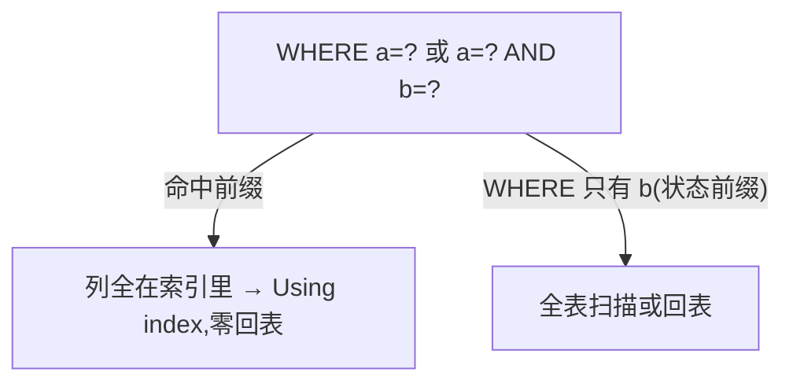

**TL;DR：** InnoDB 的二级索引（非主键索引）叶子不存整行，只存"索引键 + 主键"。所以用二级索引查一条记录，通常要两步：先在二级索引里定位主键，再拿主键去聚簇索引（主键那棵 B+Tree）回表一次，才能拿到完整行。这一步多一次随机 IO——是点查里最被忽略的成本。覆盖索引（让查询要的列全在索引里）能把两步合成一步，零回表，是所有点查优化的头号手段。本文用 `EXPLAIN` 把两种路径摆开，纠正"用上了索引就够快"的认知。

## 一、一次查一行：两次 B+Tree 的账

表 `orders(id, user_id, amount, created_at)` 上有普通索引 `idx_user(user_id)`，查询：

```sql
SELECT id, amount FROM orders WHERE user_id = 123;
```

物理上发生两次"定位"：

1. 在 `idx_user` 这棵索引 B+Tree 里按 user_id=123 找到叶子，**叶子装的是 user_id + 主键 id**（不是整行）。
2. 拿到 id，再用 id 去聚簇索引（主键 B+Tree）把整行的 amount 读出来——这次叫**回表**。


**回表为什么贵**：第二次定位是**随机 IO**——主键对应的叶子页和二级索引叶子页在磁盘上不相邻。极端情况叶子页都在缓冲池里，回表就是一次几乎免费的内存查找；**一旦有冷页，就是一次磁盘随机读（约 1–5ms 量级）**。数据库最怕"一条 where 多了 N 次随机读"——点查几条 → 回表几次 → 这就是"列表页变慢"最常见的成因之一。

## 二、EXPLAIN 翻译成人话

`EXPLAIN SELECT ...` 的 `Extra` 是这张账的晴雨表：

| `key` / `Extra` | 含义 | IO 次数 |
| :--- | :--- | :--- |
| `idx_user`（无 Extra） | 用了二级索引，还差回表 | 索引叶 N 行 + 回表 |
| `Using index` | **只读索引就够了**：select 的列全在索引里 | N 行，零回表 |
| `Using index condition` | 索引筛选部分列，剩余列要去表里拿 | 索引 + 回表若干 |

一句话区别：`Using index` 说"这一步全靠索引完成"，`Using where` 说"得拿行再去 where 判一次"。写出覆盖索引的 SQL，`Extra` 就会从 `Using where` / `Using filesort` 变成干净的 `Using index`。

## 三、覆盖索引：把读账单提前

**覆盖索引**就是"把查询要返回的列都塞进索引"。例如 `SELECT user_id, amount FROM orders WHERE user_id=123`，把 `(user_id, amount)` 建为联合索引 → 叶子页同时有 user_id 和 amount → **回表省略**：

```bash
# 无覆盖: 二级索引命中 N 行,每行再回主表一次
EXPLAIN SELECT user_id, amount FROM orders WHERE user_id=123;  # 索引仅 (user_id)
--> type=ref, key=idx_user, Extra=(无)

# 有覆盖: 同一条 WHERE,零回表
EXPLAIN SELECT user_id, amount FROM orders WHERE user_id=123;  # 索引 (user_id, amount)
--> type=ref, key=idx_user, Extra=Using index  ← 覆盖命中
```

一句判断口诀：**`Using index` 出现 = 这一次查询不用回表，索引自己给了全部要的列。**

## 四、最左前缀：联合索引的顺序为什么如此关键

联合索引 `(a, b)` 只对"前缀命中"生效：

- 查询能命中 `(a)` 或 `(a, b)`；**只查 `b` 不查 `a` 就完全用不上**（失去最左前缀，索引退化成全表）。
- 所以列顺序是设计决策：把"等值多、范围少"的列放前面。

它与回表的叠加：`SELECT` 只要 a、b 就不回表；只要再要一个不在索引里的列（如 `created_at`、`amount`），又退回回表。



## 五、用索引的三条 mini 经验

1. **覆盖列要克制**：多加一列进索引，索引更大、`INSERT`/`UPDATE` 的写放大更高，不一定划算。只把"点查热点"里真正高频返回的那两三个列塞进去。
2. **写入成本代价**：覆盖索引是额外一棵 B+Tree，每次写都要多更新一支，写放大与[LSM 与 B+Tree 的 IO 战争](/writing/lsm-vs-btree-io-amplification)是同一个账。
3. **一次查询尽量少一次回表**：不要把一个 JOIN 拆成 N 条单行 SQL 再在业务层"回表"——那是最贵的、用满 TP 换的业务回表。

## 六、回到发现它的方法：永远 EXPLAIN

`Using index` 是最优路，`Using where; Using filesort` 是最差路。优化顺序永远是：**先 EXPLAIN，再决定加不加覆盖列，最后才谈到调参**。调参之前不查计划，等于给一辆方向盘歪的车调油耗。

## 结论：覆盖索引把回表折叠成一次索引读

二级索引的叶子只装"键 + 主键"，回表是"查索引后再查主表"的一次随机读账。**覆盖索引把整条读账单压缩成一次索引读——`Using index` 就是压缩成功的表示。** 最左前缀决定你索引能覆盖多少条查询；列顺序不是只优化一列，往往是把整条点查路径一次覆盖。口诀：先 EXPLAIN、后加列、最后调参。

下一步：把你慢查询 Top-3 贴进 `EXPLAIN`，看 `Extra` 是 `Using index` 还是 `Using where; Using filesort`——凡后者，就是覆盖索引的机会被浪费了。

## 参考资料

1. MySQL 官方：CREATE INDEX 语法—— https://dev.mysql.com/doc/refman/8.0/en/create-index.html
2. MySQL 官方：EXPLAIN 输出（Extra 各取值）—— https://dev.mysql.com/doc/refman/8.0/en/explain-output.html
3. MySQL 官方：used index 的优化—— https://dev.mysql.com/doc/refman/8.0/en/covering-index.html

> 延伸阅读：回表是"随机读"，随机读与顺序读的账本见[一次网络请求的数据被搬了几次](/writing/zero-copy-sendfile-io-uring)；B+Tree 与 LSM 的写/读放大账见[LSM 与 B+Tree 的 IO 战争](/writing/lsm-vs-btree-io-amplification)；索引与锁叠加的坑见[死锁不是靠重试](/writing/database-deadlock-wait-graph)。
