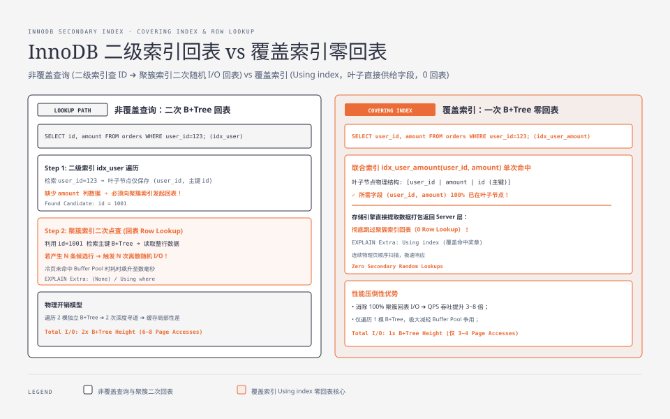
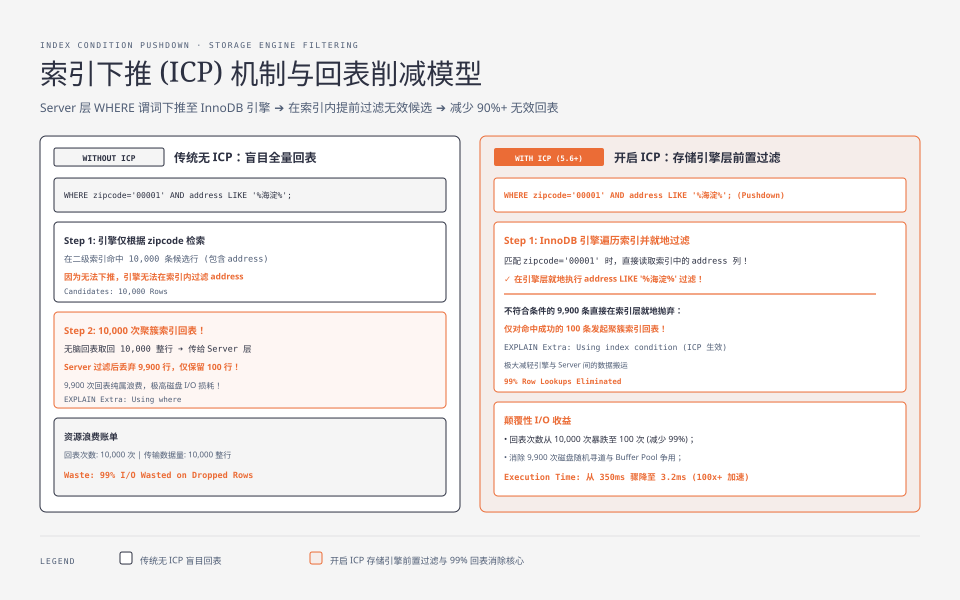
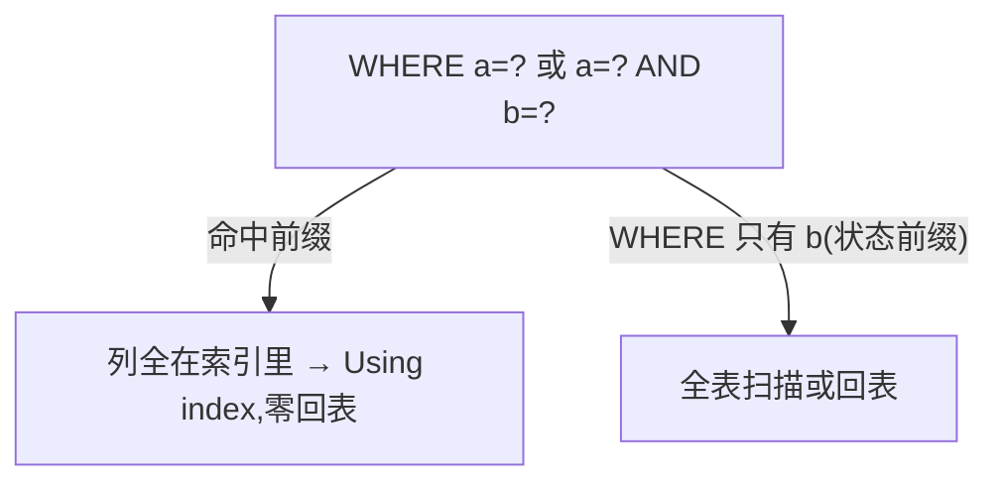

**TL;DR：** InnoDB 的二级索引叶子通常保存“索引键 + 主键”，不是整行。非覆盖查询先用二级索引得到候选主键，再从聚簇索引取需要的列；覆盖索引让优化器可以只读索引完成所需列，但不自动保证更快。`Using index`、`Using index condition`、`Using where` 和 `Using filesort` 是不同层次的信号，不能混成“用了索引/没用索引”。本文用 `EXPLAIN` 拆开回表、ICP、MVCC 可见性、最左前缀和覆盖列的写放大，并给出不应加覆盖索引的反例。


---



## 一、一次查一行：两次 B+Tree 的账

表 `orders(id, user_id, amount, created_at)` 上有普通索引 `idx_user(user_id)`，查询：

```sql
SELECT id, amount FROM orders WHERE user_id = 123;
```

物理上发生两次"定位"：

1. 在 `idx_user` 这棵索引 B+Tree 里按 user_id=123 找到叶子，**叶子装的是 user_id + 主键 id**（不是整行）。
2. 拿到 id，再用 id 去聚簇索引（主键 B+Tree）把整行的 amount 读出来——这次叫**回表**。


**回表为什么可能贵**：第二次定位可能访问与二级索引叶子页不相邻的聚簇索引页。若页在 buffer pool 中，它主要是内存访问；若是冷页，成本由存储设备、并发、预读和 buffer pool 状态共同决定，不能用固定的 1–5ms 代替所有环境。数据库真正怕的是“一个查询产生 N 个候选，再触发 N 次分散的 row lookup”——列表页、低选择性条件和深分页都会放大这个形状。

## 二、EXPLAIN 翻译成人话

`EXPLAIN SELECT ...` 的 `Extra` 是这张账的晴雨表：

| `key` / `Extra` | 含义 | IO 次数 |
| :--- | :--- | :--- |
| `idx_user`（无 `Using index`） | 访问路径使用二级索引，但返回列或过滤条件可能仍需 row lookup | 索引叶 N 行 + 可能的回表 |
| `Using index` | **当前计划可从索引覆盖所需列**，通常不需要为返回列回聚簇索引 | 索引扫描/查找；仍受扫描行数和可见性影响 |
| `Using index condition` | Index Condition Pushdown 在存储引擎侧先过滤部分候选，剩余查询仍可能需要取整行 | 索引 + 过滤后的回表若干 |

一句话区别：`Using index` 主要说明“所需列可由索引覆盖”；`Using index condition` 说明部分谓词被下推到索引访问层；`Using where` 只是仍有条件在 server 层判断；`Using filesort` 是排序策略名，不等于一定慢。写出覆盖索引可能让计划出现 `Using index`，但最终仍要看扫描行数、排序、锁和真实 buffer pool 状态。

## 三、覆盖索引：把读账单提前

**覆盖索引**就是"把查询要返回的列都塞进索引"。例如 `SELECT user_id, amount FROM orders WHERE user_id=123`，把 `(user_id, amount)` 建为联合索引 → 叶子页同时有 user_id 和 amount → **回表省略**：

```bash
# 无覆盖: 二级索引命中 N 行,每行再回主表一次
EXPLAIN SELECT user_id, amount FROM orders WHERE user_id=123;  # 索引仅 (user_id)
--> type=ref, key=idx_user, Extra=(无)

# 有覆盖: 同一条 WHERE,零回表
EXPLAIN SELECT user_id, amount FROM orders WHERE user_id=123;  # 索引 (user_id, amount)
--> type=ref, key=idx_user, Extra=Using index  ← 覆盖命中
```

一句判断口诀：**`Using index` 出现 = 这一次查询不用回表，索引自己给了全部要的列。**

这句口诀要加两个限定：第一，`Using index` 是执行计划/存储引擎路径的信号，不是“整条 SQL 只访问一个物理页”；索引仍可能扫描很多叶子页。第二，InnoDB 二级索引记录的事务可见性信息不等同于聚簇记录的全部版本信息，更新冲突、删除标记和一致性读可能引入额外的存储引擎工作。因此文章把它称为“减少 planned row lookup”，而不是承诺绝对零 IO。




## 四、最左前缀：联合索引的顺序为什么如此关键

联合索引 `(a, b)` 只对"前缀命中"生效：

- 查询能命中 `(a)` 或 `(a, b)`；**只查 `b` 不查 `a` 就完全用不上**（失去最左前缀，索引退化成全表）。
- 所以列顺序是设计决策：把"等值多、范围少"的列放前面。

它与回表的叠加：`SELECT` 只要 a、b 可能形成覆盖；只要再要一个不在索引里的列（如 `created_at`、`amount`），就可能退回 row lookup。`WHERE a = ? AND b > ?` 与 `WHERE b > ?` 也不是同一个访问路径：前者可以利用 `(a,b)` 的前缀缩小范围，后者缺少首列约束，可能只能扫描更大的索引范围或选择其他计划。

“等值列在前、范围列在后”是常见起点，不是优化器的绝对定理。还要看排序、分组、连接条件、选择性、统计信息和写入成本；为了一个查询把十几个列塞进索引，可能让所有写事务和 buffer pool 都付费。



## 五、用索引的三条 mini 经验

1. **覆盖列要克制**：多加一列进索引，索引更大、`INSERT`/`UPDATE` 的写放大更高，不一定划算。只把"点查热点"里真正高频返回的那两三个列塞进去。
2. **写入成本代价**：覆盖索引是额外一棵 B+Tree，每次写都要多更新一支，写放大与[LSM 与 B+Tree 的 IO 战争](/writing/lsm-vs-btree-io-amplification)是同一个账。
3. **一次查询尽量少一次回表**：不要把一个 JOIN 拆成 N 条单行 SQL 再在业务层"回表"——那是最贵的、用满 TP 换的业务回表。

## 六、反例：覆盖索引也可能让查询更糟

覆盖索引减少的是 row lookup，不会自动减少扫描、排序、锁或写入成本。至少保留四个反例：

1. **低选择性条件**：`status = 'active'` 命中大多数行时，走二级索引再回表可能比顺序扫描更差；“索引存在”不代表“索引应该被选中”。
2. **索引过宽**：把 `amount`、`created_at`、多个展示列全部塞进去，会放大索引页、写入维护、建索引时间和 buffer pool 占用；一个读查询省掉的 row lookup，可能让所有写请求变贵。
3. **排序/分组不匹配**：覆盖索引只解决列来源，不一定解决 `ORDER BY` 或 `GROUP BY`。计划可能仍然需要排序；`Using filesort` 是实现路径，不应仅凭名字判定失败。
4. **锁与一致性读**：`SELECT ... FOR UPDATE`、`UPDATE` 和 `DELETE` 的目标是锁定/修改记录，不能因为 `SELECT` 列被索引覆盖，就假设主表访问、锁范围或冲突全部消失。

因此验收一条索引不能只问“Extra 有没有 `Using index`”，而应同时记录：估算 rows、实际 rows、过滤后 rows、排序/临时表、读写比例、锁等待和 buffer pool 命中。`EXPLAIN ANALYZE` 会实际执行查询，适合在受控环境核对估算偏差，但不能拿一次分析结果直接当生产 p99。

## 七、回到发现它的方法：先看计划，再看实际行数

优化顺序应是：**先确认查询合同，再看 EXPLAIN 的访问路径和估算 rows；在可控环境用 EXPLAIN ANALYZE 对照实际 rows；最后才决定增加覆盖列或调整统计信息**。调参之前不查计划，等于给一辆方向盘歪的车调油耗。

| 观察 | 可能的问题 | 下一步 |
| --- | --- | --- |
| `Using index` 但扫描 rows 很大 | 覆盖了列，却没有缩小范围 | 调整前缀/谓词，核对选择性 |
| `Using index condition` 且实际 rows 远大于估算 | ICP 减少了回表，但统计或谓词仍不准 | `EXPLAIN ANALYZE`、刷新统计、分桶看数据 |
| 有索引却选全表 | 低选择性、成本模型或缓存状态 | 不要强制索引，先比较实际代价 |
| 查询变快但写入/锁变差 | 覆盖列过宽或索引重复 | 看写放大、索引大小和锁等待 |

## 八、结论：覆盖索引减少一类账，不会抹平所有成本

二级索引的叶子通常只装“键 + 主键”，覆盖索引可以减少从二级索引到聚簇索引的 planned row lookup；但扫描范围、排序、MVCC、锁、统计误差和写放大仍然存在。**`Using index` 是一个有用的计划信号，不是“查询一定快”的奖章。** 先按查询形状设计前缀，再用估算/实际行数和读写成本验证，最后才决定是否把列覆盖进去。

下一步：把慢查询 Top-3 的 SQL、数据分布、索引定义和 `EXPLAIN`/`EXPLAIN ANALYZE` 结果放在同一份记录里；把“减少回表”与“整体 p99/写入/锁等待改善”分开验收。当前文章没有可复现的 MySQL 实例 raw，不把示例计划冒充本机 benchmark。

## 九、参考资料

1. MySQL 官方：CREATE INDEX 语法—— https://dev.mysql.com/doc/refman/8.0/en/create-index.html
2. MySQL 官方：EXPLAIN 输出（Extra 各取值）—— https://dev.mysql.com/doc/refman/8.0/en/explain-output.html
3. MySQL 官方：used index 的优化—— https://dev.mysql.com/doc/refman/8.0/en/covering-index.html

> 延伸阅读：回表是"随机读"，随机读与顺序读的账本见[一次网络请求的数据被搬了几次](/writing/zero-copy-sendfile-io-uring)；B+Tree 与 LSM 的写/读放大账见[LSM 与 B+Tree 的 IO 战争](/writing/lsm-vs-btree-io-amplification)；索引与锁叠加的坑见[死锁不是靠重试](/writing/database-deadlock-wait-graph)。
