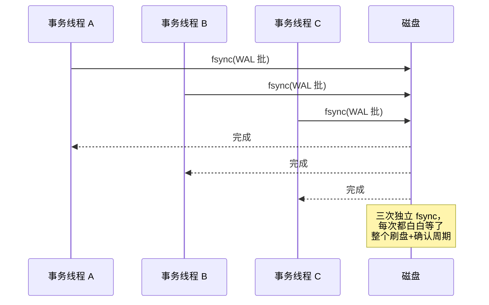
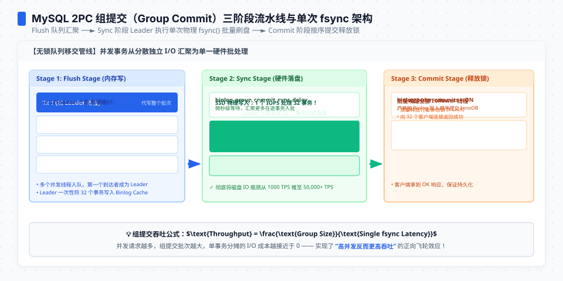
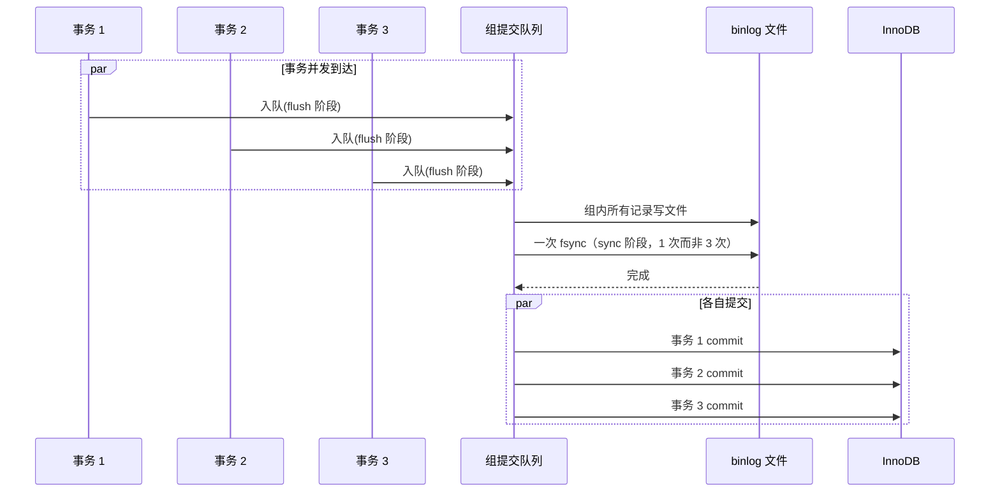

**TL;DR：** 对普通文件写入，`write()` 成功通常只表示数据进入内核缓存；数据库还要依赖 `fsync`、`fdatasync`、`O_SYNC`/`O_DSYNC` 或平台等价机制，把 WAL 推到操作系统和设备承诺的稳定存储边界。group commit 把“每个事务各自等待同步”变成“一批事务共享一次同步”，用批内等待换吞吐；代价是批内最慢的成员影响提交延迟。`synchronous_commit=off` 等降档不是关闭 WAL，而是把成功响应与本地 durable commit 分开，必须把风险窗口和故障模型写进合同。

## 一、write() 返回了，数据却没到磁盘

先做一个 Linux 语义实验。在一个空目录里写一个文件；`conv=fdatasync` 是关键，它要求 `dd` 在结束前对文件调用一次数据同步：

```bash
# 输出数字随内核、文件系统和设备变化；重点检查是否出现 write + fdatasync
$ strace -c -e trace=write,fsync,fdatasync dd if=/dev/zero of=f bs=1M count=128 conv=fdatasync status=none
```

对普通 regular file 且未使用 `O_DIRECT`/`O_SYNC` 的路径，`dd` 的 `write()` 返回并不是数据已经稳定落盘的证据，而是内核收下了一笔债务：脏页进入页缓存，真实写回由操作系统和文件系统调度。`dirty_expire_centisecs`、`dirty_ratio` 等是 Linux 版本和配置相关的写回参数，不能当成所有发行版的固定默认值。断电时未完成同步的缓存可能丢失；`write()` 返回成功而数据尚未稳定，是允许的系统调用语义。

所以持久化需要一个同步边界：`fsync()` 会同步文件数据和相关元数据，`fdatasync()` 在满足后续数据读取所需的范围内减少元数据同步，`O_SYNC`/`O_DSYNC` 则把类似要求放进写调用语义。Linux 手册还特别提醒，目录项可能需要单独对目录 fd 调用 `fsync()`；设备、文件系统和虚拟化层是否正确透传 flush 也属于耐久性合同。同步调用成功是应用拿到“系统已完成该同步请求”的依据，但不是替硬件诚实性、复制或备份作保证。


*图注：普通 write() 通常只走到页缓存；同步机制才把数据推进到文件系统/设备承诺的边界。图中的任何一层缓存都可能改变耐久性结论，见第五节。*

这套语义有个直接推论：**durable commit 必须等某种等价的同步边界，但不一定字面调用 `fsync()`**。一个事务的提交通常要求 WAL 记录满足数据库所选的本地/远程耐久性合同；其余工作可以先在内存里完成。于是提交延迟会受到同步延迟和批次组织影响，提交吞吐也不应简单等同于“单位时间能调用多少次字面 `fsync()`”。

写这篇文章时，我特意把 WAL 那篇[WAL 是数据库的命根子](/writing/wal-crash-recovery)里讲过的内容（torn write、checkpoint、档位表、硬件防线的清单）留在那边，这篇只谈 fsync 本身：它的语义、它的延迟去哪了、group commit 怎样把它的次数压下来。

## 二、一次 fsync 的时间去哪了

fsync 的延迟不是恒定的。同一块盘上，空闲时和写满时测出来的数字可能差很多；设备类型只能提供方向，不能提供目标 SLO。应在目标机器上用 `pg_test_fsync`、`fio` 或数据库自身的 WAL I/O 计数测量，并保存负载、文件系统、队列深度和重复轮次。

两个反直觉的事实藏在数字后面：

**第一，fsync 延迟会受到前面积压的 I/O 影响。** 内核刷这个文件的脏页时，要与设备上已有的写请求竞争。设备队列越满，同步等待可能越久。所以 fsync 的延迟波动，不能只归因于“这次 sync 本身慢”，也要看前面欠了多少账。把 `dirty_ratio` 调大可能改变批量和单次等待，但具体方向必须测，不能把某个内核参数写成普遍因果。

**第二，fsync 和 fdatasync 不是同一件事。** `fsync()` 除了刷数据，还刷文件元数据（inode、目录项）；`fdatasync()` 只管数据。对固定大小、预先分配的 WAL 段文件，元数据几乎不变，所以 `fdatasync` 通常更快，这正是 PostgreSQL 在 Linux 上默认 `wal_sync_method=fdatasync` 的原因[^fsync]。RocksDB 的 `recycle_log_file_num` 复用旧文件也是为了省掉元数据刷新的开销。第一节的 strace 已经能看出这层差别：128 次 `write()` 只占百分之几的时间，真正的时间几乎全堆在最后一次同步刷盘上。

`pg_test_fsync` 是 PostgreSQL 自带的工具，可以把这台机器上不同 `wal_sync_method` 的同步能力打出来。它的输出是本机当前环境的测量，不应复制成跨机器的默认数字：

```bash
# 示例命令；本文不保存本机 pg_test_fsync raw
$ pg_test_fsync
```

注意一个陷阱：**`pg_test_fsync` 测的是“这台机器此刻的延迟”，不是“这台设备会不会撒谎”**。它能帮助比较方法和暴露 I/O 瓶颈，但证明不了设备掉电保护、虚拟化透传或复制链路可靠。后者要靠目标平台的耐久性测试和故障演练。

## 三、单线程每次提交都同步，吞吐被一把锁锁死

现在把数学摆出来。单线程、每次提交一次 fsync 的模型下：

在“单线程、每次提交都要等待同一次同步完成、没有批处理”的简化模型里：**提交吞吐 ≈ 1 / 同步延迟**。

这是硬上限：线程只能"提交 → 等 fsync 返回 → 再提交"，串行循环。fsync 1ms，吞吐上限就是每秒约 1000 次提交；fsync 10ms，就掉到每秒约 100 次。这个模型解释了所有"为什么加并发也没有用"的困惑——多个线程各自等自己的 fsync，互不合并，锁还在：



三个线程的 fsync 是三个独立请求，每个都完整地走一遍"排队 → 刷盘 → 确认"。吞吐依然是约 1/fsync，只是并发把等待藏进了别的线程里。

这就是 group commit 的全部动机：**如果三个事务的 WAL 记录本来就在同一个缓冲区里挨着，为什么不能让一个人去 fsync，三个人一起等？**

## 四、group commit：把 fsync 从"次数"变成"批次"

### 4.1 原理：leader-follower，一次 fsync 服务一批



group commit（组提交）的结构一句话：**多个提交者并发时，第一个到达的人成为 leader，把整批的日志刷走；其余人看到自己的 LSN 已被刷过，直接返回成功，不重复 fsync**。WAL 是纯顺序追加，这保证了"挨在一起的记录，一次 fsync 全部覆盖"——PostgreSQL 官方文档对它的定义就是一句话："one fsync of the WAL file may suffice to commit many transactions"。

```go
// group commit 概念示意（非任何数据库的真实源码）
func commit(w *WALWriter, buf *WALBuffer) error {
    lsn := buf.Append(commitRecord) // 1. 追加自己的 COMMIT 记录，拿到 LSN

    w.group.Lock()
    if w.flushedLSN < lsn {         // 2. 自己是否落后于最新 flush 位置
        w.flushedLSN = lsn
        w.fsync()                   // 3. 只有 group leader 执行真正的 fsync
    }
    w.group.Unlock()                // 4. 其余线程醒来发现自己的 LSN 已落盘
    return nil                      // 5. 向客户端返回 COMMIT
}
```

在理想的批处理模型里，**提交吞吐 ≈ 批次大小 × (1 / 同步延迟)**。例如同步延迟取 1ms、平均一批 20 个事务，模型上限从约 1000 次同步/秒变成约 2 万次事务/秒；这不是生产吞吐承诺。批次大小受并发到达、日志缓冲区、锁和调度影响，并发增加只是在有等待者时可能提高合并收益。

### 4.2 PostgreSQL：从 commit_delay 到默认的自动组提交

PostgreSQL 的提交路径是 `XLogInsertRecord`（把记录追加进 WAL 缓冲区）加 `XLogFlush`（把缓冲区刷到磁盘），后者主要在事务提交时触发。组提交在早期版本里并不自动：`commit_delay` 参数让 leader 在持有锁后先睡一会儿，等更多人加入本批再刷，需要配合 `commit_siblings` 规定"至少攒几个"才值得等。这个设计的本质是"用延迟换批次"——主动等，批次才够大。

现代 PostgreSQL 的提交路径会让等待者共享一次 WAL flush：等待者阻塞在“刷盘完成”这个事件上，leader 完成后唤醒整批。`commit_delay` 默认通常为 0；高并发下的自然组提交不等于 leader 必须主动睡眠，只有刻意设置 delay 才是在用额外提交延迟换更大的加入窗口。

这里有个容易被误读的点：**"每次提交都 fsync"不等于"每个事务单独调用一次 fsync"**。commit 时 flush 的是 WAL 缓冲区，里面通常攒着多个事务的记录，一次 fsync 覆盖整批。真正的"一事务一 fsync"只在并发为 1 时近似成立。

### 4.3 MySQL：两份日志为什么需要三阶段组提交

MySQL 的组提交史是一段更长的弯路，值得单独讲，因为它把 group commit 的难点暴露得最清楚。

当 MySQL 同时启用 InnoDB redo 与 binlog 的 durable 提交时，提交路径必须协调两份日志的顺序和可见性：redo prepare、binlog 写入/同步、InnoDB commit 不能被随意打乱。若每个事务都独立完成两份日志的同步，等待会串行叠加；现代 MySQL 用 flush → sync → commit 三阶段组提交，让一组事务共享 binlog 的同步阶段，再处理各自的 InnoDB commit。具体 durability 仍取决于 `sync_binlog`、`innodb_flush_log_at_trx_commit` 和版本实现。

5.6 的修复是"三阶段组提交"：把提交路径拆成 **flush（把各自的 binlog cache 写入文件）→ sync（一次 fsync 刷整组 binlog）→ commit（InnoDB 层提交）** 三个阶段，每个阶段都是"一个 leader 干活、整组人共享"：



三个阶段各自有锁（`LOCK_flush`、`LOCK_sync`、`LOCK_commit`），组长持锁干活、组员排队等结果。fsync 的次数从"事务数 × 2"变成"组数 × 2"——批次的粒度从单个事务提升到整个并发组。

这个提交路径说明一件事：**group commit 不是脱离语义的微优化，而是把同一 durability 边界按批次摊开的组织方式**。它能减少重复同步，但不会消除 redo/binlog 顺序、故障恢复和配置一致性的约束。

### 4.4 三引擎的组提交横截面

| 维度 | PostgreSQL | MySQL InnoDB + binlog | RocksDB |
| :--- | :--- | :--- | :--- |
| **合并单位** | WAL 缓冲区 | flush / sync / commit 三阶段组 | 写队列里的 WriteBatch 组 |
| **触发方式** | 并发到达自动组批 | 阶段锁 + leader-follower | 写线程排队，同步写共享一次 fsync |
| **代价** | 批内最慢决定批延迟 | 阶段间等待放大了尾延迟 | 单写线程等待整组 |
| **手动旋钮** | `commit_delay`（默认 0） | `binlog_group_commit_sync_delay`（默认 0） | `WriteOptions.sync`（默认 false） |

### 4.5 组提交的代价：批次是别人替你做决定的等待

组提交优化的不是延迟，是吞吐。这个区分必须清楚：**批内所有成员拿到结果的时间 = 批内最后一个成员的日志就绪时间 + 一次 fsync**。也就是说，你的事务可能本来 0.5ms 就能提交，因为要等批里最慢的人，实际花了 1ms。批越大，吞吐越高，单事务延迟的尾部越长——这是组提交的固定税。

所以 group commit 之后，数据库的提交延迟分布会变"胖"：p50 下降（多数人搭了便车），p99 上升（最慢的成员带动整批）。性能评估看 p99 而不是 p50 的人，会误判"group commit 让数据库变慢了"。它没有，它只是把延迟从"每个事务各自承担"变成了"批内均摊"。

## 五、降档：账期拉长，价签必须写清楚

fsync 的等待还能不能更少？能，但只有一种方式：**减少"必须等待 fsync 的提交"的占比**，即放宽账期。WAL 那篇的[档位表](/writing/wal-crash-recovery)已经把这笔账算完，这里只重复结论和一个前提：

- `synchronous_commit=off` 不是关掉 WAL，是让提交不等待本地 durable flush；后台 WAL writer 之后会刷未同步记录。官方文档指出风险窗口的最大值是 `3 × wal_writer_delay`，而不是固定写死的 200ms；实际值取决于版本和配置；
- `innodb_flush_log_at_trx_commit=0/2` 也把事务提交与每次本地 redo flush 解耦；刷盘间隔、`innodb_flush_log_at_timeout`、设备和故障类型共同决定风险窗口，不能直接写成通用的 1 秒上限；
- 降档的前提是两件事同时成立：压测证明瓶颈在提交路径的 fsync 上，且业务写得出一句"能丢多久"。缺任何一个，都留在默认档。

为什么数据库“宁可慢”？因为 durable 档位的语义最简单：提交成功意味着 WAL 满足所选的本地/远程耐久性条件。降档是把成功响应与 durable commit 分开，必须知道风险窗口、进程崩溃与主机/断电故障的差异。

最后一种情况比降档更危险：**同步调用失败，或硬件/虚拟化层没有兑现它的承诺**。Linux `fsync(2)` 文档描述了 `EIO` 等失败返回；PostgreSQL 也会把关键路径的写入错误当成严重故障处理。带电池的 RAID 控制器（BBU）如果驱动不转发 flush、虚拟化平台不透传写、消费级 SSD 没有掉电保护（PLP），应用拿到“同步成功”也不能替它们完成验证。数据库能做的是选择正确同步方法、暴露失败并通过故障演练验证平台，而不是把字面 `fsync` 当成整个存储栈的保险单。

## 六、结论：group commit 让持久性成本按批次摊平

回到开头的问题：数据库为什么宁可慢，也要等 fsync？答案分三层：

1. **语义层**：write() 只到页缓存，fsync 才到设备——"提交成功"这个概念本身必须建立在一个无法绕过的同步点上，否则就是谎报。
2. **性能层**：等 fsync 不等于吞吐低。group commit 把成本从"每事务一次"摊成"每批一次"，用批内均摊的延迟换取数量级上的吞吐；觉得"fsync 慢"之前，先确认自己的提交路径有没有走到 group commit（并发够不够、`commit_delay` 之类旋钮有没有被乱动）。
3. **决策层**：降档唯一合法的理由，是压测证明 fsync 是瓶颈、且业务明确写下了可接受丢失窗口。写不出来的，默认档就是答案。

下一步可做的事，就三条命令：

```bash
$ pg_test_fsync                              # 这台机器上 fsync 到底多慢
$ psql -c 'SHOW synchronous_commit;'
$ mysql -e 'SHOW VARIABLES LIKE "innodb_flush_log_at_trx_commit";'
```

## 参考资料

1. PostgreSQL 官方文档：Write-Ahead Logging (WAL)（"one fsync of the WAL file may suffice to commit many transactions"）—— https://www.postgresql.org/docs/current/wal-intro.html
2. PostgreSQL 官方文档：WAL Configuration（XLogInsertRecord / XLogFlush、commit_delay、checkpoint_completion_target）—— https://www.postgresql.org/docs/current/wal-configuration.html
3. PostgreSQL 官方文档：WAL Reliability（fsync 语义与硬件缓存）—— https://www.postgresql.org/docs/current/wal-reliability.html
4. PostgreSQL 官方文档：pg_test_fsync —— https://www.postgresql.org/docs/current/pgtestfsync.html
5. MySQL 官方文档：Binary Log Group Commit（flush/sync/commit 三阶段）—— https://dev.mysql.com/doc/refman/8.4/en/binary-log-group-commit.html
6. MySQL 官方文档：innodb_flush_log_at_trx_commit —— https://dev.mysql.com/doc/refman/8.4/en/innodb-parameters.html#sysvar_innodb_flush_log_at_trx_commit
7. RocksDB Wiki：Write Ahead Log (WAL)（WriteOptions.sync 与组写入）—— https://github.com/facebook/rocksdb/wiki/Write-Ahead-Log-(WAL)
8. LWN：Postgres, fsync, and OSs（fsync 错误语义与 PANIC 处理）—— https://lwn.net/Articles/753184/
9. Linux 内核文档：dirty_expire_centisecs / dirty_ratio 写回参数 —— https://docs.kernel.org/admin-guide/sysctl/vm.html

> 延伸阅读：fsync 只是 WAL 纪律的一个零件——日志先行、崩溃恢复与 checkpoint 的完整账本，见[WAL 是数据库的命根子](/writing/wal-crash-recovery)；复制延迟的账单与读路径设计的三种姿势，见[主从复制延迟 300ms 的账单：读路径设计的三种姿势](/writing/replication-lag-read-paths)。

[^fsync]: 严格说还有 `fdatasync`——只刷数据不刷文件元数据；`O_SYNC`/`O_DSYNC` 把同步语义搬进 `open()` 标志。本文统称 fsync，指"把数据送到稳定存储并等待确认"这组语义。
