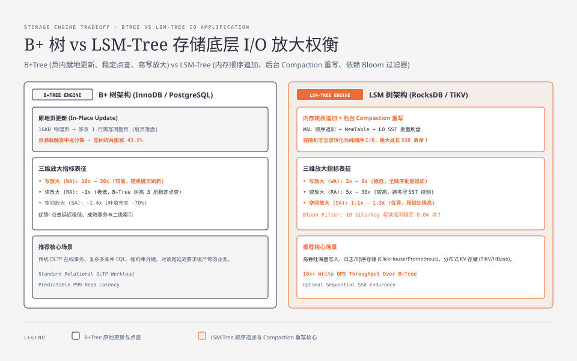
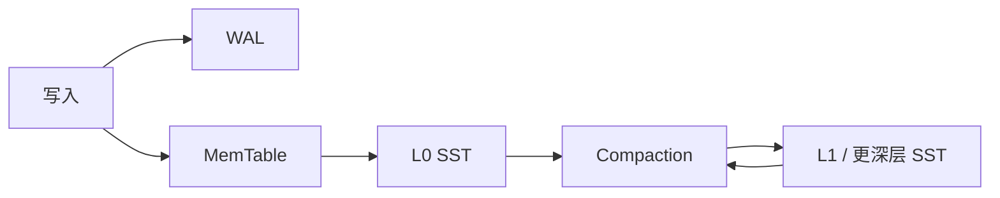

**TL;DR：** B+Tree 与 LSM 不是“谁快”之争，而是把成本分给不同阶段：B+Tree 倾向于用页内更新、索引维护和分裂换取较稳定的点查与范围访问；LSM 把写入先变成 memtable/WAL/SST，再用 compaction 付重写成本，换取更顺序化的写路径。仓库里的固定输入模拟显示：当层倍数 `T=8` 时，Leveled 写放大为 `5.38`、Size-Tiered 为 `2.69`；当 `T=40` 时，Size-Tiered 不存在键在不使用 Bloom filter 时平均探测 `28.0` 次，而 Leveled 为 `5.0` 次。它们是内存教学模型的放大率，不是 RocksDB、SSD 或生产 p99。真正的选型还要把事务、范围扫描、尾延迟、compaction 预算和故障恢复一起算进去。

## 一、先把“放大”定义清楚：同一个词可能在算三种东西



存储引擎的第一道误导来自分母。有人把“写放大”算成物理写入字节 ÷ 用户写入字节，有人把它算成设备写 I/O 次数；有人把“读放大”算成访问的 SST/页数量，有人把它算成真实设备读次数。没有统一分母，表格里的 `3x` 没有可比性。

本文先使用教学模型里的定义：

| 放大 | 模型定义 | 生产中还要补什么 |
| :--- | :--- | :--- |
| 写放大 | `flush 输出字节 + compaction 输出字节` ÷ 用户写入字节 | WAL、压缩、校验和、复制、设备写放大、后台并发 |
| 读放大 | 一次点查在 SST 上发生的随机探测次数 | page cache、block cache、Bloom filter、预读、实际设备 I/O |
| 空间放大 | 运行期存储峰值字节 ÷ 逻辑存活字节 | WAL、旧版本、tombstone、临时 compaction 文件、文件系统保留空间 |

这三个指标不是严格的“不可能三角”，因为缓存、压缩、批量大小、compaction 调度和硬件都能改变它们；但它们确实会把成本推向不同方向。选型不能只看一张“写入 QPS”榜单，而要先回答：**这次操作最不能超支的是哪一笔？**

## 二、B+Tree 把成本放在页更新和索引维护上

B+Tree 以有序页组织键空间。一次点查先走根和内部节点，再到叶页；树高给出的是逻辑访问路径，不等于真实磁盘 I/O 次数：热页可能全部在 Buffer Pool，冷页则会受到存储设备、并发和预读影响。这个区别很重要——“树高 3 层”不能直接写成“每次请求 3 次磁盘读”。

一次更新通常要同时考虑几件事：

1. 找到承载记录的叶页并在内存中修改，页随后变成脏页；
2. 通过 WAL/redo 记录恢复所需的修改，提交时再受持久化策略约束；
3. 如果页空间不足，发生页分裂并更新父节点，可能继续向上分裂；
4. 维护二级索引、唯一约束、锁和 MVCC 版本，具体成本取决于数据库和语句。

因此 B+Tree 的“写放大”不能简化成“每改一行就随机写一个整页”。同一页上的多次修改可能被合并，脏页可能被反复淘汰，redo/undo、doublewrite、checkpoint 和文件系统也会改变最终设备写入。更准确的判断是：**B+Tree 的原地页更新让读路径和范围访问更直接，但页分裂、索引维护与随机访问可能把成本推向写侧。**

它在这些场景通常更自然：点查和范围扫描都重要、需要成熟的事务/锁/唯一约束、索引条件复杂，或者读路径的尾延迟比后台 compaction 更难接受。这里的“更自然”不是“永远更快”，仍需在目标数据库上用同一数据和同一事务语义验证。

## 三、LSM 把写路径拆成 memtable、SST 和 compaction

LSM 的典型写路径是：先写 WAL 和内存表，内存表冻结后顺序生成 SST，再由后台 compaction 合并多个文件。它让主写路径更偏向追加和批量，但“偏向顺序”不等于“磁盘上不存在随机写”：WAL、元数据、索引块、缓存淘汰、文件创建和 compaction 读取仍由实现、文件系统和设备共同决定。



点查的顺序也不同：先看 memtable 和 immutable memtable，再按新旧顺序探测 L0 和更深层文件。键范围判断与 Bloom filter 可以在内存中排除一部分文件；排除失败后才需要读取索引块或数据块。于是“存在键”和“不存在键”是两种不同实验：不存在键会把 Bloom 假阳性和层/文件数量暴露出来，不能只用命中键的结果代表读放大。

更新和删除使 LSM 更复杂。同一个键的新旧版本可能短时间共存，删除通常先写 tombstone，只有在确认不会再遇到被删除版本时才能清理。compaction 的收益是把版本和 tombstone 合并掉，代价是读取并重写数据；如果 compaction 跟不上写入，读放大、空间占用和后台 I/O 可能同时上升。

Leveled 与 Size-Tiered 的差别可以先这样记：

| 策略 | 结构倾向 | 主要收益 | 主要风险 |
| :--- | :--- | :--- | :--- |
| Leveled | 深层按键域尽量不重叠 | 点查更容易限制在每层少量候选 | 合并要与下一层重叠数据一起重写，写放大可能更高 |
| Size-Tiered | 同层先积攒多个大小相近的 run | 合并批次更大，短期重写压力通常较低 | run 重叠，读放大、空间峰值和旧版本滞留可能更高 |

这不是两个固定产品标签的性能排名，而是 compaction 调度在不同负载下作出的语义取舍。

## 四、固定输入的 mini-LSM sweep：数字只证明模型里的方向

为了避免把没有 raw 的 `db_bench` 样张写成“实测”，本文引用仓库已有的内存教学模拟器 `experiments/mini-lsm`。它实现 memtable → L0/tier0 → 逐级合并，保留同键最新版本，用字节账计算写放大/空间放大，用 SST 随机探测次数计算读放大；不碰真实磁盘。

复现实验：

```bash
cd experiments
go run ./mini-lsm -num 300000 -writes 400000 -mem 6000 -sweep -csv
```

固定输入是 `num=300000`、`writes=400000`、`mem=6000`、Bloom filter 每键 `10` bits、`k=7` 个哈希、固定随机种子。环境是 macOS 26.5.1、Darwin arm64、Go 1.25.1；原始 CSV 保存在 [`evidence/mini-lsm-write-amplification/2026-08-16-local/raw/sweep.csv`](/Users/lianghaoyu/codes/github-blog/evidence/mini-lsm-write-amplification/2026-08-16-local/raw/sweep.csv)，实验定义和边界见 [`experiments/mini-lsm/README.md`](/Users/lianghaoyu/codes/github-blog/experiments/mini-lsm/README.md)。

从同一份 raw 摘录几个有解释价值的点：

| `T` | 策略 | 写放大 | 空间放大 | 不存在键：无 Bloom | 不存在键：有 Bloom |
| :---: | :--- | ---: | ---: | ---: | ---: |
| 8 | Leveled | 5.38 | 1.19 | 5.0 | 0.04 |
| 8 | Size-Tiered | 2.69 | 1.27 | 4.0 | 0.03 |
| 40 | Leveled | 6.42 | 1.27 | 5.0 | 0.04 |
| 40 | Size-Tiered | 1.60 | 1.33 | 28.0 | 0.23 |

这组结果支持三个具体判断：

1. 在这个输入和模型定义下，Size-Tiered 的重写字节低于 Leveled；`T=40` 时差距更明显，但空间峰值并没有因此消失。
2. `T=40` 的 Size-Tiered 让不存在键面对更多重叠 run；Bloom filter 把平均探测从 `28.0` 降到 `0.23`，但假阳性仍会留下少量探测。
3. `T` 不是免费旋钮：它改变层数、合并批次、重叠范围和旧版本滞留，不能只凭“写放大更低”调大。

不能从这组数字推出：RocksDB 在 SSD 上的写放大、机械盘与 NVMe 的延迟比例、压缩收益、并发 compaction 的尾延迟、WAL fsync 成本、生产空间上界，或某个数据库应该使用哪种策略。模型没有实现真实 block cache、设备队列、压缩格式、tombstone 保留规则和多线程 compaction；这也是为什么文章保存 raw，却不把它叫作 RocksDB benchmark。

## 五、把结构选择落到业务合同，而不是落到“写多读少”

“写多就选 LSM、读多就选 B+Tree”只能当第一句，不能当决策。至少把下面几条放进同一张评审表：

| 业务约束 | 更值得先评估 | 必须补的验证 |
| :--- | :--- | :--- |
| 点查、范围扫描、唯一约束和事务边界都重要 | B+Tree 系数据库 | 真实 Buffer Pool 状态、锁等待、索引计划、提交与恢复语义 |
| 持续写入、批量合并可接受、点查可用 Bloom/filter 缓解 | LSM 系引擎 | compaction backlog、读写放大、空间峰值、tombstone 和恢复时间 |
| 历史事件要长期保留并允许多个消费者独立回放 | 带日志保留语义的 LSM/日志系统 | retention、消费者进度、重放成本和版本兼容 |
| 读写混合且尾延迟严格 | 不先押结构 | 固定数据集、相同 durability、预热、多轮 p50/p95/p99 和后台 I/O |
| 需要跨行事务、复杂二级索引或强约束 | 先从提供这些语义的数据库评估 | 不要用单键 KV benchmark 替代事务 workload |

还要问三个容易漏掉的问题：

- compaction 的 I/O 和 CPU 预算从哪里来？如果它与前台请求争抢设备，平均吞吐提升可能换来尾延迟恶化；
- 删除和更新的版本多久能清理？没有 tombstone/旧版本生命周期，空间放大不会因为“最后只有一份数据”自动消失；
- 故障后要恢复什么？WAL、manifest、checkpoint、事务日志和副本的恢复语义，往往比一张写放大表更决定能否上线。

## 六、结论：选的是放大预算与恢复语义

B+Tree 把成本更多放在页更新、索引维护和随机访问的组织上，换取直接的有序读路径与成熟事务语义；LSM 把写入拆成 WAL、memtable、SST 和 compaction，换取更批量化的写路径，再把成本转移到读放大、空间峰值和后台重写。Leveled 与 Size-Tiered 也不是“好/坏”二选一，而是对写放大、读放大和空间放大重新分配预算。

下一步不要只跑一次 `fillrandom` 就下结论。先用同一份输入跑本地模型，再在目标引擎上固定 key/value 大小、更新比例、删除比例、durability、cache、compaction 参数和预热轮次；最后同时记录用户写入字节、flush/compaction 字节、读探测、空间峰值、后台队列和恢复时间。只有这些分母一致，`x` 才有资格进入设计评审。

## 参考资料

1. RocksDB 官方文档：Compaction—— https://github.com/facebook/rocksdb/wiki/Compaction
2. RocksDB 官方文档：布隆过滤器与 Block Based Table—— https://github.com/facebook/rocksdb/wiki/Block-Based-Table-Format
3. RocksDB 官方博客：读写放大率如何度量—— https://rocksdb.org/blog/2021/03/26/rocksdb-amp.html
4. InnoDB 官方文档：B+Tree 索引结构—— https://dev.mysql.com/doc/refman/8.0/en/innodb-index-types.html
5. LevelDB（LSM 鼻祖）设计文档—— https://github.com/google/leveldb/blob/main/doc/impl.md
6. db_bench 工具说明—— https://github.com/facebook/rocksdb/wiki/Benchmarking-tools

> 延伸阅读：LSM 的写链路里有一笔躲不开的顺序写——WAL，见[数据库为什么宁可慢，也要等你 fsync](/writing/fsync-group-commit)；同一存储结构在分布式里还有主从复制的账单，见[主从复制延迟 300ms 的账单](/writing/replication-lag-read-paths)。
