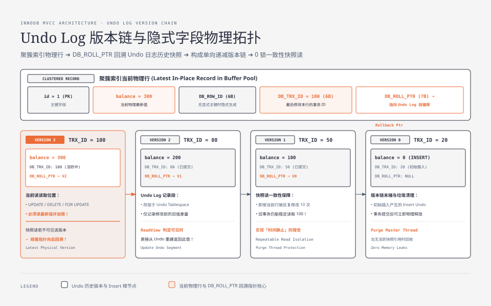
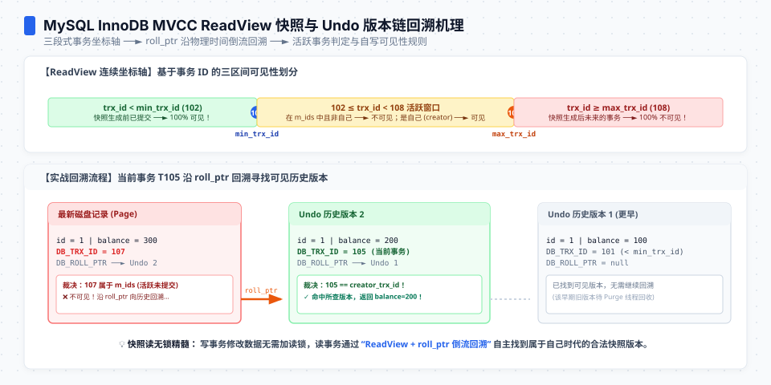
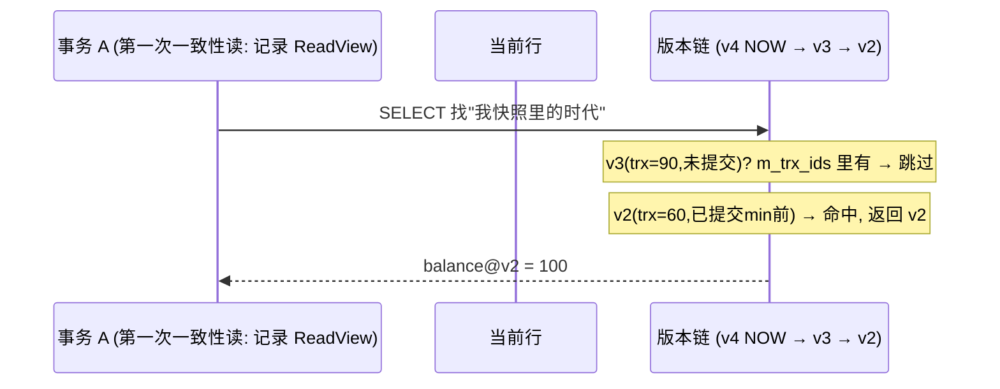
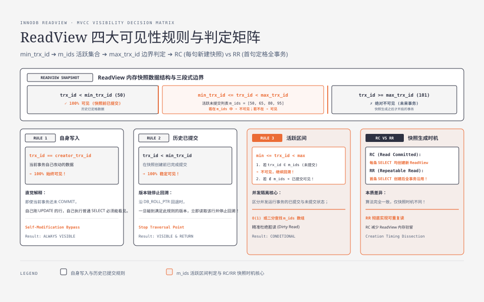

**TL;DR：** MySQL 的「可重复读」不是用锁把数据冻住的，而是用 MVCC 给了每个事务一个"时间机器"：InnoDB 用 undo log 连接行的历史版本，RR 下第一次一致性读通常建立 ReadView，后续一致性读沿用它；显式 `START TRANSACTION WITH CONSISTENT SNAPSHOT` 可以把建立时机提前。于是"别人改了行"对你的快照读不可见，不是因为行被锁住，而是因为那个版本不在可见性范围内。当前读（UPDATE、DELETE、`FOR UPDATE`、`FOR SHARE`）仍要读最新版本并参与锁竞争。本文拆开这组语义，并给出双会话实验。

## 一、隔离级别是张背出来的表

可重复读（REPEATABLE READ）、读已提交（READ COMMITTED）、读未提交、串行化——几乎每个后端工程师都背过这张表：哪个级别防脏读、哪个防不可重复读、哪个防幻读。背诵的代价是产生了三个流行误解：

1. **隔离是锁锁出来的**。错。默认 RR + 读走快照，锁只出现在"当前读"上。
2. **可重复读是无条件成立**的。错。带条件的"当前读"视角下它破功，见第五节。
3. **隔离级别是从这四种里挑一种**。错。MySQL 的 RR 和 RC 在快照读上用的是同一套 MVCC，只是**快照生成的时机**不同。

本文把这张表翻译回 InnoDB 的资源账：行版本、undo 链、ReadView、当前读。读完你不再需要背表——因为你能自己推出为什么表格长那样。




## 二、行不是一行，是一串版本

`UPDATE users SET balance = 100` 在 InnoDB 里做的事情，不是"覆写"一行，而是"**新建一个版本，并把旧版本链接在它下面**（通过版本链）。聚簇记录包含隐藏的事务元数据，例如 `DB_TRX_ID`（最近改本行的事务 ID）和 `DB_ROLL_PTR`（指向 undo 记录）；没有显式主键时还可能有 `DB_ROW_ID`。这些不是应用可以直接依赖的四个公开字段，版本链的具体物理布局仍受存储格式和版本实现约束。


这一串版本链，就是一个"行"的完整账本。现在的问题只剩一个：**给定一个事务 T，它该看链上哪个版本？** 答案就是 ReadView——快照。

## 三、ReadView：一致性读建立的一张“当时还有谁活着”的名单



在 RR 下，第一次一致性读建立 ReadView；如果使用显式一致性快照，则在 `START TRANSACTION` 时建立。ReadView 概念上记录：快照时仍活跃的事务 ID 集合、用于划分事务 ID 的上下边界，以及创建者事务。判断版本能否被看到时，沿版本链向旧版本回退，直到找到一个在该快照中可见的版本：

- 快照建立前已经提交、且不属于仍活跃事务的版本 → **可见**，停。
- 事务 ID 属于快照建立后才出现的事务，或属于建立快照时仍在运行的事务 → **不可见，往旧版本找**。
- 当前事务自己写出的版本 → **可见**，即使它的事务仍未提交。

一句话：快照读看到的是“对这个 ReadView 可见的已提交版本，加上自己的写入”。所以 RR 的“重复”只对沿用同一 ReadView 的一致性读成立；它不是整个事务所有语句都停在同一帧，当前读和锁定读有另一套语义。

换到物理形态画出来，链路应是：



在读到那一刻，**行被谁改、改完没，都与我无关**——因为我从不看"现在"，我只读"过去我定格的那一页"。




## 四、快照读 vs 当前读：版本账本必须分开记

如果全是快照读，MVCC 就太平了。但 `UPDATE`、`DELETE`、`SELECT ... FOR UPDATE` 不能读旧版本——**写必须基于最新值，否则覆盖就丢了**。MySQL 把读分成两类：

- **快照读**（普通 SELECT）：读版本链上"我看得见"的那个版本，**不加锁**。走的是 ReadView。
- **当前读**（UPDATE / DELETE / `FOR UPDATE` / `FOR SHARE`）：读**最新版本并按语句要求加锁**，走的是"锁 + 版本链的当前值"。`LOCK IN SHARE MODE` 是旧写法，现代 MySQL 文章优先使用 `FOR SHARE`。

这两类读的并存，是 MySQL 事务模型所有奇怪行为的根源。两个经典案例：

1. **事务内先 UPDATE 再普通 SELECT，能读到自己的 UPDATE**——因为写的时候，你自己抢占了"当前值"并把新版本事务 ID 记成了自己；之后快照读虽然看旧账本，但账本规则说"自己写的可见"，于是新值现身。
2. **快照读沿用的时机取决于隔离级别**——如果整个事务只做一致性读，RC 通常在**每条语句**开头建立新的 ReadView，RR 通常在**第一次一致性读**时建立并沿用。所以 RC 下同一事务两次 SELECT 可能看到不同值，RR 下沿用该 ReadView 的 SELECT 通常不会；显式一致性快照可以把 RR 的建立时机提前。

## 五、可重复读为什么还会"读到新行"：当前读与幻读

快照账本困住的是"快照读"。一旦代码走到**当前读**，账本就破了。经典的破案例子是幻读：同一事务内两次查询，满足条件的**集合**变了。

```sql
-- 事务 A（RR 隔离级别）
START TRANSACTION;
SELECT * FROM t WHERE id > 5;   -- 返回 2 行（快照读）
-- ...（此刻事务 B 插入 id=9 并提交）
SELECT * FROM t WHERE id > 5;   -- 仍返回 2 行 —— 快照读不破功
SELECT * FROM t WHERE id > 5 FOR UPDATE;  -- 现在返回 3 行 —— 幻读出现了
```

为什么快照读不破功，`FOR UPDATE` 破？**因为当前读不走快照，它锁住"最新版本的行"，然后按最新值统计集合。** 间隙锁（gap lock）能防的是"其他事务往我锁定的间隙里插入"，但防不住这样一个顺序：B 的插入发生在 A 锁住间隙**之前**、A 的第二次当前读**之后**提交——A 锁的是"当时存在的间隙"，B 已经在那之前把行放进去了，A 只能看到"我锁范围里多出来的行"。

也就是说：**MVCC 给快照读一个不变的世界，却必须给写操作一个真实的世界；两个世界在"当前读"上相交，幻读就是相交处的裂缝。**

一个必须诚实说明的边界：MySQL 的 RR 对范围锁定读会使用 next-key lock 等机制来阻止范围内的并发插入，但这不等于普通快照读、当前读和所有数据库的“幻读”定义都相同。PostgreSQL 的普通隔离级别使用 MVCC；SSI 是它在 `SERIALIZABLE` 隔离级别采用的冲突检测机制，不能写成“PostgreSQL 的 MVCC 就是 SSI”。

## 六、实验：两个会话把账本画出来

以下脚本给出**最小可复现**，复现「不可重复读」「幻读」「当前读破功」，每次逐条在同一 MySQL 8 实例上执行：

```sql
-- 准备：在一个 disposable MySQL 8 实例中执行
CREATE TABLE acc(id INT PRIMARY KEY, balance INT) ENGINE=InnoDB;
INSERT INTO acc VALUES (1, 100);

-- SESSION 1：RR 下的快照读
SET SESSION TRANSACTION ISOLATION LEVEL REPEATABLE READ;
START TRANSACTION;
SELECT * FROM acc WHERE id=1;      -- 100，第一次一致性读建立 ReadView

-- SESSION 2：另一个会话在此处执行
UPDATE acc SET balance=200 WHERE id=1;
COMMIT;

-- 回到 SESSION 1
SELECT * FROM acc WHERE id=1;      -- 仍是 100，沿用同一个 ReadView
SELECT balance FROM acc WHERE id=1 FOR SHARE; -- 200，当前读读取最新已提交值
ROLLBACK;
```

要观察 RC 的不可重复读，把 SESSION 1 的隔离级别改成 `READ COMMITTED`，重复两个 `SELECT`；第二次一致性读会建立新的 ReadView。要观察范围集合，先在 SESSION 1 做 `WHERE id > 5` 的普通 SELECT，再让 SESSION 2 插入并提交 `id=9`，SESSION 1 再做普通 SELECT 与 `FOR UPDATE`。这个顺序故意让插入发生在第一次范围锁定读之前，才能看到快照读和当前读的差异；若先执行范围锁定读，next-key lock 可能阻止 SESSION 2 的插入。

关键配套观测：执行 `SHOW ENGINE INNODB STATUS`，在 `TRANSACTIONS` 段可以看到活动事务和 ReadView 相关信息；执行 `SELECT * FROM performance_schema.data_locks\G` 可以观察当前读持有的锁（X 锁、间隙或 next-key 相关记录，具体取决于语句和索引）。这些命令的输出受 MySQL 版本、权限和语句计划影响，文章没有把某一次状态快照当成所有实例的固定文本。

## 七、结论：MVCC 用快照隔离读，当前读仍会进入锁竞争

MVCC 把“隔离”从“用锁冻住数据”的直觉，换成了“**一致性读按 ReadView 选择版本，当前读进入最新值和锁的世界**”。它依赖两样东西：**版本链**（行的历史）和**快照**（建立时刻的可见事务集合）。隔离级别的表不值得只靠背诵，值得在实验中区分：ReadView 何时建立、普通 SELECT 看哪个版本、锁定读何时看最新值、范围锁又阻止了什么。

下一步：在 disposable MySQL 8 实例中跑第六节实验，把会话、隔离级别、索引和原始状态输出一起保存；不要只截一张客户端结果图。这也是下一篇死锁文章的前置知识：MVCC 管一致性读的可见性，锁管当前读与写入的顺序。

## 参考资料

1. InnoDB 官方文档：可重复读与一致性读取—— https://dev.mysql.com/doc/refman/8.0/en/innodb-consistent-read.html
2. InnoDB 官方文档：MVCC—— https://dev.mysql.com/doc/refman/8.0/en/innodb-multi-versioning.html
3. MySQL 内部：InnoDB 版本链与 undo 日志（MySQL 官方博客）—— https://dev.mysql.com/blog-archive/mysql-8-0-3-a-new-data-dictionary/
4. 隔离级别官方表（READ UNCOMMITTED 到 SERIALIZABLE）—— https://dev.mysql.com/doc/refman/8.0/en/innodb-transaction-isolation-levels.html

> 延伸阅读：本文的版本链是"行级可见性"；同系列中，持久层账本见[数据库为什么宁可慢，也要等你 fsync](/writing/fsync-group-commit)，读路径的一致性代价见[主从复制延迟 300ms 的账单](/writing/replication-lag-read-paths)；与本文配套的锁排队视角，见同系列[死锁不是靠重试：wait-for graph 与间隙锁](/writing/database-deadlock-wait-graph)。
