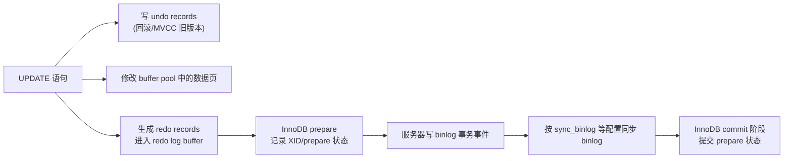
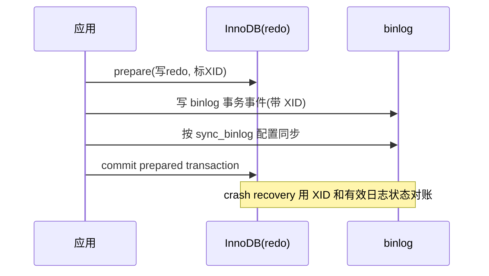
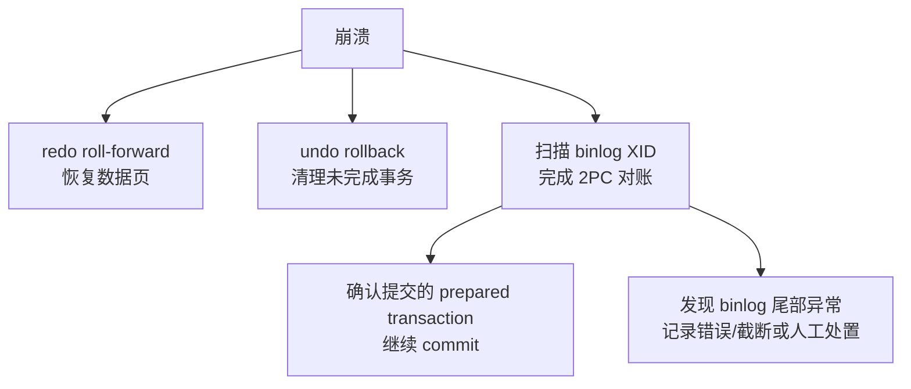

**TL;DR：** MySQL 一个事务会让三种日志各自承担不同责任：**redo** 让 InnoDB 能在崩溃后重做尚未写入数据页的修改，**undo** 支撑运行中的回滚和一致性读，**binlog** 为复制与时间点恢复记录服务器层的事务事件。它们不共享一种格式，也不是“同一条数据写三遍”；InnoDB 与 binlog 通过带 XID 的两阶段提交协调提交判断。真正的“提交即耐久”还取决于 `innodb_flush_log_at_trx_commit`、`sync_binlog`、操作系统和存储设备，本文不把示意时序写成某个 MySQL 实例的 crash raw。

## 一、三本账为什么不能合并成一记

很多人在这一点上入门即乱：为什么库要写三条日志，不能一记通用的？答案：**三个读者不同**。

| 账本 | 读者 | 内容粒度 | 解决的重复/恢复问题 |
| :--- | :--- | :--- | :--- |
| redo log | InnoDB 崩溃恢复 | 由数据修改产生的 redo records，按 LSN 组织并用于 roll-forward | 由恢复算法按日志状态处理；不要把它简化成业务层“重复执行 SQL” |
| undo log | 事务回滚、MVCC 一致性读 | 与事务和记录关联的 undo records，用来回到旧版本或撤销修改 | 不是复制事件，也不是给跨进程消费者重放的消息 |

binlog 与两者最大的不同：它不是存储引擎的账，是**服务器层**的事务事件账。它服务复制与时间点恢复，格式可以是 statement、row 或 mixed；它不替代 InnoDB 的页恢复，也不包含“如何把某个 buffer pool 页刷回磁盘”的全部信息。所以第一个直觉仍然成立：**redo 是引擎为恢复记录的，binlog 是服务器为复制/恢复记录的**。

## 二、一条 UPDATE 的三本账顺序

一条 `UPDATE t SET c=200 WHERE id=1`，可以先按“运行期修改”和“提交协调”两层理解，而不要把三条日志画成同一个瞬间落盘：



- **写 undo**：保存事务回滚和一致性读需要的历史信息；它的生命周期与事务、purge 和长读有关。
- **改内存 + 生成 redo**：数据页先在 buffer pool 中变脏，redo 记录让崩溃恢复可以重做的变化；redo 的 LSN 与数据页刷盘顺序由 InnoDB 管理。
- **提交协调**：InnoDB 先进入 prepare，服务器写 binlog 并按 `sync_binlog` 等配置同步，然后让 InnoDB 完成 commit。日志写入、刷盘和数据页落盘不是同一个动作。

这里的关键时间窗是 2PC 与耐久性配置的交集。MySQL 8.0 的官方建议是事务场景使用 `sync_binlog=1` 与 `innodb_flush_log_at_trx_commit=1`；如果调低其中任何一个，吞吐和 fsync 压力可能改善，但崩溃或断电时最近提交的日志可能尚未稳定写入。即使配置正确，操作系统、文件系统和存储设备是否真正执行 flush 仍是独立边界。

## 三、为什么是"两阶段"而不是各写各的

redo 归 InnoDB，binlog 归服务层；如果没有正确的 2PC 协调或刷盘配置，两个组件各自可见的落盘状态就可能出现窗口：

- 若 redo 先落、binlog 尚未完成，崩溃在中间 → InnoDB 可能重做这笔修改，但复制侧没有对应事件；2PC 恢复需要识别它是 prepared、已提交还是应回滚。
- 若 binlog 已写入而引擎状态尚未完成，崩溃在中间 → 不能只凭 binlog 一行就宣称主库事务成功，恢复必须结合 XID、redo 状态和有效 binlog 尾部。

**两阶段提交**协议的妙处：把 InnoDB 的事务状态拆成 prepare + commit 两段，让服务器可以用 binlog 中的 `XID` 与 InnoDB 的 prepared transaction 对账。一个教学化的状态序列是：

1. InnoDB 为事务写 redo 并进入 prepare 状态。
2. 服务器把事务写入 binlog；在要求强耐久时，还要按配置同步 binlog 与 InnoDB 日志。
3. InnoDB 完成 commit；崩溃恢复时，服务器根据 binlog 中的有效 XID 帮助 InnoDB 完成应提交的 prepared transaction，并处理无对应提交记录的状态。

这不是“两个文件只要各出现 XID 就等于业务成功”的通用判定器：binlog 是否完整、redo 是否已同步、配置值、崩溃点和具体 MySQL 版本都会影响恢复路径。文章可以用 XID 解释协调关系，但不能用简图代替启动恢复的真实 error log、binlog 尾部和 InnoDB 状态。



这套“先 prepare 再 commit 的两步写”解决的是引擎层与服务器层日志的提交协调，不等于每个数据页都在 commit 前写回。对学习者来说，记住两个动作即可：**prepare 让状态可对账，XID 让恢复知道是否完成 commit**。

## 四、崩溃恢复：把账重放

崩溃恢复不是“把三本账按同一顺序重放”，而是至少包含三个相互配合的动作：

1. **redo roll-forward**：把数据页尚未落盘、但 redo 已记录的修改重新应用到数据文件，使页状态追到日志允许的 LSN。
2. **undo rollback**：对崩溃时未完成的事务执行回滚；undo 也服务运行期间的一致性读，不是 redo 的另一份复制日志。
3. **binlog/XID 对账**：在启用 InnoDB 2PC、并按要求同步日志的配置下，服务器扫描有效 binlog XID，通知 InnoDB 完成应提交的 prepared transaction，并处理二进制日志尾部与引擎状态不一致的异常。



## 五、可复现的最小推演

如果要做 crash lab，应在可丢弃的 MySQL 实例中固定版本、`innodb_flush_log_at_trx_commit`、`sync_binlog`、binlog 格式和存储卷；记录事务 XID、error log、binlog 尾部和恢复前后数据。`kill -9` 只能模拟 mysqld 进程突然退出，不等价于断电或文件系统崩溃；`FLUSH LOGS` 也只是日志轮换/关闭重开相关操作，不是“把所有数据页刷盘”的故障注入。

```sql
-- 观察三个日志的存在与大小
SHOW VARIABLES LIKE 'innodb_log%';
SHOW VARIABLES LIKE 'innodb_flush_log_at_trx_commit';
SHOW VARIABLES LIKE 'sync_binlog';
SHOW BINARY LOGS;

-- 在 disposable 实例中执行一笔带可追踪业务键的事务后再做进程级退出；
-- 恢复后查看 error log、mysqlbinlog 输出和数据校验，不要只看一条 LSN。
```

**诚实注明**：本文把两阶段提交简化为“prepare → binlog → commit + XID 对账”。真实 InnoDB + binlog 还有 group commit、日志刷盘配置、doublewrite、文件系统和设备缓存等层次；本文当前没有 MySQL 实例、版本锁定、crash raw 或恢复耗时，因此不把这套时序写成“本机已经验证”。见本系列[数据库为什么宁可慢，也要等你 fsync](/writing/fsync-group-commit)。

## 六、结论：三种日志分工不同，耐久性取决于配置与设备

三本账为什么要分开，因为**读者不同**：redo 给 InnoDB 崩溃恢复，undo 给运行期回滚与一致性读，binlog 给复制和时间点恢复。引擎层与服务器层各自落盘，靠 **2PC + XID** 协调“这笔事务是否完成提交”；但“提交返回后断电也不丢”还要同时满足日志刷盘配置、文件系统和存储设备的合同。总结不是“写三份就安全”，而是：**redo 记恢复所需的修改，undo 记如何回到旧版本，binlog 记服务器层事务事件**。

下一步：在 disposable MySQL 实例中先记录 `innodb_flush_log_at_trx_commit`、`sync_binlog` 和存储类型，再做进程级 crash；把 error log、redo/LSN、binlog XID、恢复后的数据校验放进同一份 evidence。没有这些 raw，就只使用本文的协议模型，不宣称“已经完成 crash recovery 验证”。

## 参考资料

1. MySQL 官方：InnoDB Redo Log—— https://dev.mysql.com/doc/refman/8.0/en/innodb-redo-log.html
2. MySQL 官方：Binlog 与复制—— https://dev.mysql.com/doc/refman/8.0/en/binary-log.html
3. MySQL 官方：XA / 两阶段提交—— https://dev.mysql.com/doc/refman/8.0/en/xa.html
4. MySQL 官方：InnoDB Undo Logs—— https://dev.mysql.com/doc/refman/8.0/en/innodb-undo-logs.html
5. MySQL 官方：mysqlbinlog（检查 binlog 事件的工具）—— https://dev.mysql.com/doc/refman/8.0/en/mysqlbinlog.html
6. MySQL 官方：二进制日志选项、`sync_binlog` 与耐久性建议—— https://dev.mysql.com/doc/refman/8.0/en/replication-options-binary-log.html

> 延伸阅读：redo 的 fsync 究竟是怎样的账，见[数据库为什么宁可慢，也要等你 fsync](/writing/fsync-group-commit)；redo 之外，binlog 交给复制读路径的一致性，见[主从复制延迟 300ms 的账单](/writing/replication-lag-read-paths)；undo 就是 MVCC 的行历史源，见[事务隔离不是靠锁：MVCC 的版本链与快照账本](/writing/mvcc-isolation-snapshot)。
