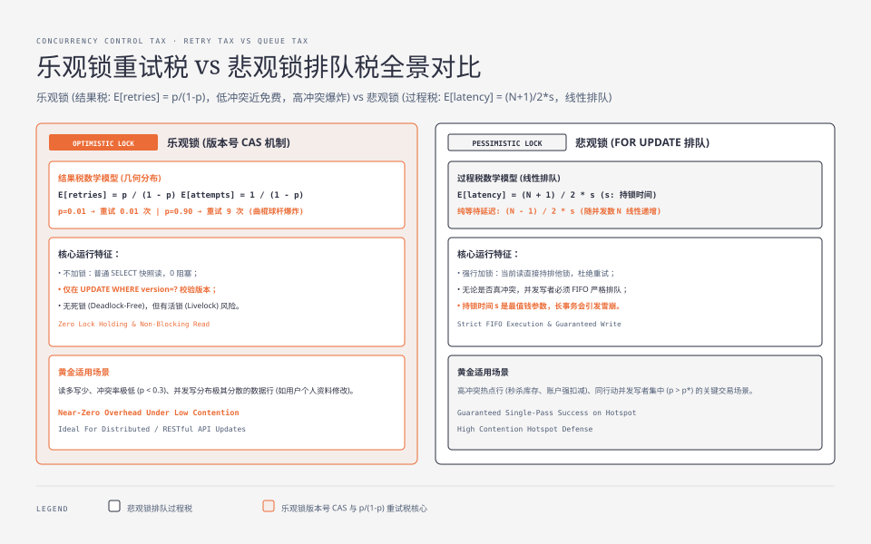
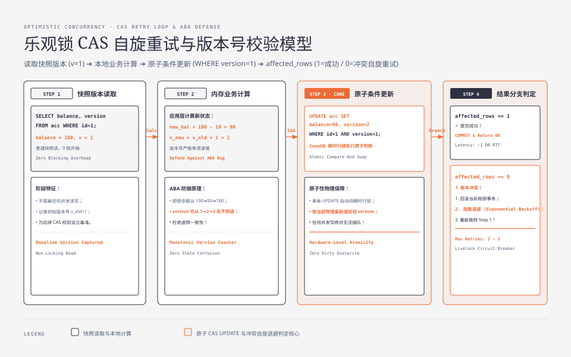
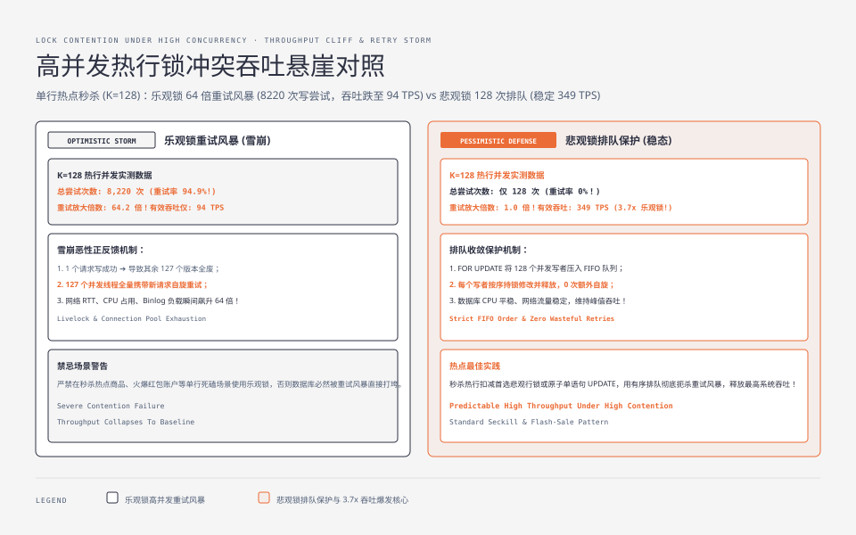

**TL;DR：** 「读多写少用乐观锁，读少写多用悲观锁」是句没量化的废话——它把一个**两笔税里挑一笔**的决策压成了"读写比"一个变量。乐观锁交**重试税**（每次尝试以冲突率 p 失败，期望重试 `p/(1-p)` 次），悲观锁交**排队税**（N 个并发写者同争一行时，FIFO 纯等待 `(N-1)/2 × 持锁时间`，含自身持锁的总延迟为 `(N+1)/2 × 持锁时间`）。真正决定胜负的是冲突率 p、同一行的并发写者数 N、以及单次尝试成本 a 与持锁时间 s 的比：交叉点 `p* = 1 - 2a/(s(N+1))`。p 低时乐观锁近乎免费（p=0.01 时重试税约 1%），p 高时重试税按 `p/(1-p)` 爆炸；热行（秒杀）上还有固定 p 模型算不出的**重试风暴**（本实验模拟：K=128 并发时乐观锁总尝试约 8200 次，是悲观锁的 64 倍）。换锁不是看读写比，是量 p、N、持锁时间。


---



## 一、两种锁卖同一种东西：并发下的一致性

先放下实现，两种锁的**语义承诺**是同一个：并发读写时，"读-改-写"这件事要么串行发生、要么在提交前被指出"你基于的版本已经过时"，反正**不许丢更新**。区别只在收税方式：

| | 乐观锁 | 悲观锁 |
| :--- | :--- | :--- |
| 卖的东西 | 不加锁也保证一致 | 不重试、写必成功 |
| 付的代价 | **重试**：冲突了重跑一遍 | **排队**：等着别人释放锁 |
| 触发条件 | 只有真冲突才收税 | 只要并发写就排队（可能排队等一个根本不冲突的事务） |
| 失效模式 | 活锁（重试不收敛，需上限） | 死锁（等待成环，靠检测器回滚） |

一句话：乐观锁用"重试"换"不加锁"，悲观锁用"排队"换"不重试"。

为什么两种税的性质不一样：乐观锁是**结果税**——只在提交那一刻发现版本冲突才收，平时分文不取；悲观锁是**过程税**——拿到锁的那一刻就开始占位，别人无论是不是真跟你撞，都得排在你后面。所以"读多写少用乐观锁"这句话错在把"读写比"当自变量：读多写少通常意味着冲突少，但那是**冲突率低**的结果，不是读多的功劳。读很多却集中在同一行、又频繁写，冲突率照样高，乐观锁照样亏。决策变量从来不是读写比，是下面三章的能量化参数。




## 二、乐观锁：用重试换不加锁，重试税 = p/(1-p)

实现只有三行，核心是**版本号 CAS**：

```sql
-- 事务内
SELECT balance, version FROM acc WHERE id = 1;        -- 读版本（可走快照读，见 MVCC 篇）
-- ... 业务计算 new_balance = balance - 10 ...
UPDATE acc SET balance = new_balance, version = version + 1
WHERE id = 1 AND version = 旧版本;
-- 若影响行数 = 0 → 版本已变，冲突，重来
```

**原子性在哪**：`UPDATE ... WHERE version=?` 是单条语句，InnoDB 会对匹配的行加锁，然后按**当前行**（不是事务快照）求值 WHERE——读版本、判版本、写回三步在这一次行锁内完成，中间插不进别的写。`version` 必须真的变化（`version+1`），否则 MySQL 默认的"影响行数"按"新值是否不同"计，可能出现"条件命中但 affected=0"的假冲突。于是 `affected = 0` 的语义非常干净：**这一行在我读之后被别人写过，我的读-改-写不是原子的，重试**。这正是"条件更新命中 0 行 = 版本冲突"的机制基础。

**重试税模型**：设单次尝试的冲突率为 p（"我读到版本 v 到写回之间，别人把版本改成 v' 的概率"）。每次尝试以 `1-p` 成功，所以尝试次数是几何分布：

```
E[attempts] = 1/(1-p)        E[retries] = p/(1-p)
```

| 冲突率 p | 0.01 | 0.1 | 0.5 | 0.9 | 0.99 |
| :--- | :--- | :--- | :--- | :--- | :--- |
| 期望重试次数 | 0.01 | 0.11 | 1 | 9 | 99 |
| 期望尝试次数 | 1.01 | 1.11 | 2 | 10 | 100 |

这条税是一根**曲棍球杆**：p<0.3 时重试税几乎可忽略（p=0.1 才 0.11 次），p>0.8 后开始爆炸（p=0.9 是 9 次，p=0.99 是 99 次）。所以"冲突率低时乐观锁划算、冲突率高时重试放大"不是一个二分，是一条从免费到失控的连续曲线——这就是为什么必须给 p 一个数，而不是给"读多写少"一个标签。

## 三、悲观锁：用排队换不重试，排队税 = (N-1)/2 × 持锁时间

悲观锁的标准写法：

```sql
SELECT balance FROM acc WHERE id = 1 FOR UPDATE;   -- 当前读：对行加排他锁，见 MVCC 篇
-- ... 业务计算 ...
UPDATE acc SET balance = balance - 10 WHERE id = 1;
COMMIT;                                            -- 释放锁
```

`FOR UPDATE` 是**当前读**：直接读最新版本并加排他锁。第二个事务再对这个 `FOR UPDATE`，就阻塞在**行锁 + 等待队列**上，直到第一个提交。等不到就撞上 `innodb_lock_wait_timeout`（默认 50s）或死锁检测——阻塞是它存在感的来源。

**排队税模型**：N 个写者同时到达同一行，FIFO 依次执行，第 i 个等 `(i-1)` 个持锁时间。平均总延迟：

```
E[latency] = (N+1)/2 × s，其中 s = 持锁时间（读+更新+提交）。口径说明：这里的 `(N+1)/2×s` 是**总延迟**（纯排队等待 `(N-1)/2×s` 加上自身持锁 `s`）；TL;DR 的 `(N-1)/2×s` 是纯等待口径。交叉点 `p* = 1 - 2a/(s(N+1))` 在总延迟口径下成立，与乐观侧 `a/(1-p)`（同样是总延迟）对齐。
```

排队税随 **N 和 s 线性涨**。两个工程推论：一是**持锁时间是最值钱的参数**——长事务、慢提交、把 fsync 排进持锁区间，会让每个排在后面的人都多付一份 s，这是悲观锁最大的坑；二是排队税是"只要是并发写就收"——两个写者哪怕写的是不同字段、根本不冲突，第二个也得排完队才能确认自己安全，乐观锁则只在真撞车时收。低冲突场景下这份"无条件排队"就是纯浪费。




## 四、交叉点：给冲突率一个数，而不是一个标签

两笔税都是能量化的，所以直接解出交叉点：

```
乐观平均延迟 = a/(1-p)          （a：单次尝试成本，读版本+条件更新一次往返）
悲观平均延迟 = (N+1)/2 × s      （s：悲观持锁时间）
交叉点  a/(1-p) = (N+1)/2 × s  ⇒  p* = 1 - 2a/(s(N+1))
```

用实验里的一组成本（`a=100µs`、`s=200µs`，模拟成本单位，非本机 DB 实测）：

| 并发度 N | 2 | 5 | 20 | 100 |
| :--- | :--- | :--- | :--- | :--- |
| 交叉点 p* | 0.667 | 0.833 | 0.952 | 0.990 |
| 含义 | p>0.67 悲观胜 | p>0.83 悲观胜 | p>0.95 悲观胜 | 几乎恒乐观胜 |

这个表推翻了"读少写多用悲观锁"的直觉：**并发度越高，悲观排队税越贵，交叉点越往右移，乐观锁的赢面反而越宽**。真正决定方向的不是读写比，是 `p × N × s/a` 四个量。比如"读少写多"如果指 100 个写者散在 10000 行上（每行 p≈0.01），乐观锁完胜；"读多写少"如果是 10 个写者死磕同一行（每行 p≈0.9），悲观锁完胜——同一个读写比，两种答案，因为 p 不同。

固定 p 的模型有个前提：尝试之间独立、重试不抬高别人的 p、单行代价固定。下一节的模型证明热行上这三条全破，所以本节只能回答"稳态低冲突"的问题。

## 五、风险差异与热行：固定 p 模型管不到的地方

**死锁与活锁**。悲观锁有阻塞就有成环的条件——两个事务互持对方要的锁，等待图出环，InnoDB 检测器立刻回滚一个（详见[死锁不是靠重试：wait-for graph 与间隙锁](/writing/database-deadlock-wait-graph)）。单行版本号 CAS 不持有跨行锁，**没有锁等待死锁**（多行乐观更新仍可能因行锁获取顺序反转而死锁），代价换成了**活锁**：冲突率居高不下时重试永不收敛。工程上要给它设重试上限 + 指数退避 + 抖动，让重试者在时间上散开，否则全是空转。乐观锁的"无死锁"是优点，但"可能活锁"是它的对价，面试官常在这里追问。

**与 MVCC 的关系**。普通 `SELECT` 是快照读、不加锁；`SELECT ... FOR UPDATE` 是当前读、必加锁（详见[事务隔离不是靠锁：MVCC 的版本链与快照账本](/writing/mvcc-isolation-snapshot)）。乐观锁恰好把两者都用上：初始读用快照读（不加锁），条件更新天然是当前读（按最新版本判版本），于是"不加锁"和"版本校验"各取所长。悲观锁则整段都是当前读。

**热行秒杀：重试风暴（乐观锁雪崩）**。固定 p 模型假设每次尝试的 p 恒定，热行上这个假设直接崩掉：K 个写者同一时间冲同一行，**一次成功提交会让所有"在途读者"手上的版本号全部失效**，全员重试；重试者又各自带着新版本回来，彼此再撞；p 不降反升，形成正反馈。用 `experiments/lock-math` 的事件交错模拟（真实 goroutine + 原子 CAS，模拟成本单位，本机一次结果，证据见 `evidence/lock-math/2026-08-16-local/raw/storm.txt`）：

| 并发 K | 2 | 16 | 64 | 128 |
| :--- | :--- | :--- | :--- | :--- |
| 乐观锁总尝试次数 | 3 | 136 | 2075 | 8220 |
| 重试放大倍数 | 1.5× | 8.5× | 32× | 64× |
| 悲观锁总尝试次数 | 2 | 16 | 64 | 128 |

K=128 时乐观锁要付出 **64 倍于成功事务数的写尝试**——每次尝试都是一次网络往返 + 一次条件更新，64 倍意味着库上写负载放大 64 倍，连接、binlog、日志全跟着涨。进程内模拟里两者 wall 时间接近（因为 CAS 便宜），真实 DB 里这 64 倍尝试就是 64 倍的延迟和负载。**这就是秒杀必须用悲观锁/原子扣减的原因**：不是"读少写多"，是"同一行的 p 高到固定 p 模型失效"。秒杀库存的正确姿势是单条条件 UPDATE 或行锁（见[秒杀不是削峰：库存扣减的原子账与三层闸门](/writing/seckill-inventory-atomic-gates)），而不是"SELECT 版本号再 CAS 重试"。微观上，CAS 重试的每次代价可以参考原子指令与互斥锁的量级对比（[atomic 与 Mutex：7ns 到 128ns 的成本曲线，与自旋锁的陷阱](/writing/go-atomic-vs-mutex)），但那是 ns 级指令，与这里一次 DB 往返的代价不在一个量级——DB 上的重试税比指令级的贵几个数量级。

## 六、结论：什么时候换锁

换锁不是换"读写比"，是换这四个可量化的输入：

1. **冲突率 p**：单行单次写的失败概率。从重试率、`affected=0` 的日志、死锁/锁等待事件里埋点量，不要猜。
2. **并发度 N**：同一行的并发写者峰值。秒杀、热点账户、扣减型库存都高。
3. **持锁时间 s**：悲观锁的命门。长事务、慢提交把它放大，直接拉高排队税。
4. **单次尝试成本 a**：乐观锁的命门。一次读+一次条件更新的一次往返；分布式场景（etcd revision、对象存储 If-Match）a 更高，交叉点更偏悲观。

判断流：`p` 埋点量出来后，套 `p* = 1 - 2a/(s(N+1))`——`p < p*` 用乐观锁（重试税低于排队税，还免了持锁时间）；`p > p*` 或 **热行/高 N**（固定 p 模型失效）用悲观锁或原子扣减；`s` 大（长事务）时躲着悲观锁，哪怕 p 高也要先拆事务。没有"读多写少"这种一次性的答案，只有"这一行、这个 p、这个并发度下，哪笔税更便宜"。

**实验入口**：`experiments/lock-math/`（Go，无第三方依赖）。

```bash
cd experiments/lock-math
go run .                  # mode=sweep：公式验证 + 并发胜者网格 + crossover_N20/100.svg（交叉点曲线）
go run . -mode storm      # mode=storm：热行重试风暴对照 + storm.svg
go run . -a 100 -s 200 -mode storm -gap 200us -k 128
```

`sweep` 用 200,000 次独立抽样验证了 `E[attempts]=1/(1-p)`（测得均值与理论差 <0.01），并输出固定 N 下的交叉点曲线（`crossover_N20.svg`：`p*=0.952`；`crossover_N100.svg`：`p*=0.990`）；`storm` 复现热行重试放大。**真实 DB 压测已补齐**（2026-08-18，MySQL 8.0.46 docker 容器、单行热行、Go 驱动 `github.com/go-sql-driver/mysql`，原始输出见 `evidence/mysql-lock-bench/2026-08-18-local/`）：w=4 时乐观锁重试率 72.9%、每提交 5.36ms，悲观锁 0% 重试、每提交 3.17ms；w=32 时乐观锁重试率升到 94.9%、吞吐跌到 94 提交/s，悲观锁 349 提交/s（3.7 倍）。同场景、同 SQL、同一数据库，输赢完全由重试税 vs 排队税决定——热行上悲观锁赢是真实 MySQL 的行为，不只是模拟形状。注意这是"单行热行"极端场景与容器内 fsync 延迟（各档同设置），均匀分布的多行场景未在此验证。

## 参考资料

1. MySQL 官方文档：一致性读取（一致性快照读，不加锁）—— https://dev.mysql.com/doc/refman/8.0/en/innodb-consistent-read.html
2. MySQL 官方文档：InnoDB 锁与锁定读（SELECT ... FOR UPDATE / LOCK IN SHARE MODE）—— https://dev.mysql.com/doc/refman/8.0/en/innodb-locking.html
3. MySQL 官方文档：死锁检测与回滚受害者—— https://dev.mysql.com/doc/refman/8.0/en/innodb-deadlocks.html
4. MySQL 官方文档：innodb_lock_wait_timeout—— https://dev.mysql.com/doc/refman/8.0/en/innodb-parameters.html#sysvar_innodb_lock_wait_timeout
5. 实验与证据：`experiments/lock-math/`、`evidence/lock-math/2026-08-16-local/`

> 延伸阅读：悲观锁的排队在等待图上就是"别人持锁、我在等"，成环即死锁，见[死锁不是靠重试：wait-for graph 与间隙锁](/writing/database-deadlock-wait-graph)；`FOR UPDATE` 是当前读，而普通 SELECT 是快照读不加锁，两者分账见[事务隔离不是靠锁：MVCC 的版本链与快照账本](/writing/mvcc-isolation-snapshot)；热行上的正确姿势是原子扣减而非版本号重试，见[秒杀不是削峰：库存扣减的原子账与三层闸门](/writing/seckill-inventory-atomic-gates)。
