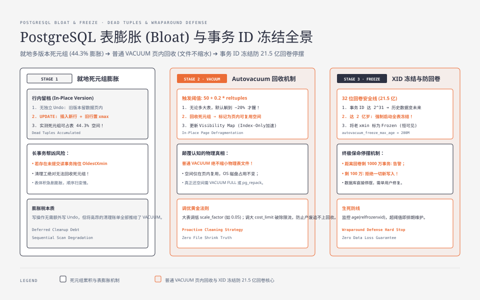
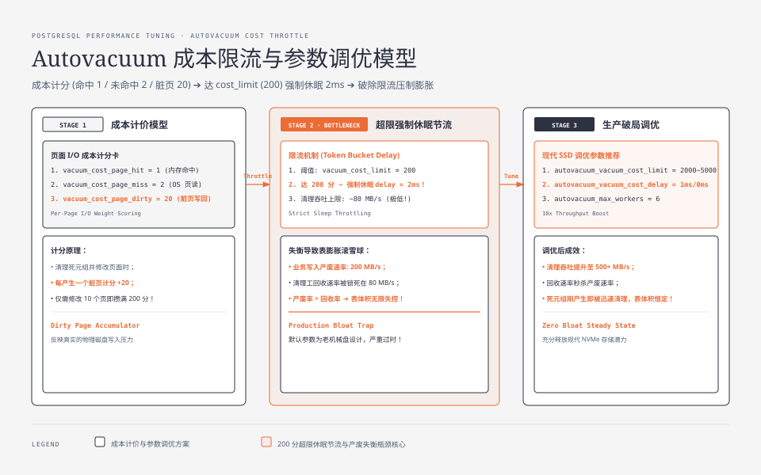

**TL;DR：** Postgres 靠 MVCC 做多版本，代价是**删掉的行不会真的消失**——旧版本作为死元组留在表页面里，只有 VACUUM 能回收。autovacuum 的触发阈值默认是 `50 + 0.2 × reltuples`，意味着**大表要先攒出约 20% 的死元组才会被清理**；持续高 UPDATE/DELETE 下，清理工（autovacuum worker）被成本限流拖住、回收速度追不上产废速度，表就膨胀（bloat）——磁盘占用上涨、顺序扫描变慢。更隐蔽的雷是 xid 冻结年龄：32 位事务号以 2^31（约 21.5 亿次事务）为回卷线，`autovacuum_freeze_max_age`（默认 2 亿）会先强制全表冻结，逼近回卷线时数据库直接拒绝新命令。膨胀税是 Postgres 运维的第一课：**MVCC 的写近乎免费，税单交给了 vacuum。**


---



## 一、先立反直觉：DELETE 之后，行其实还在

「`DELETE FROM t WHERE id = 1` 返回了 1，行应该没了。」这是最常见的认知落差。物理上那行还在，只是被打上了标记：

- 每个元组（tuple）带 `xmin`（插入它的事务号）和 `xmax`（删除/更新它的事务号，无则 0）。
- `DELETE` 不移动行，只把该行的 `xmax` 置为当前事务号。
- `UPDATE` 是「插入新版本 + 给旧版本打 `xmax`」两步，不是原地覆盖。

那「删掉的旧版本」什么时候才算真死？当 `xmax` 对应的事务已提交、且该版本比所有仍在飞事务的快照都老——即**对任何活事务都不可见**时，它成为死元组。但腾不腾位置，不由 DELETE 决定，由 VACUUM 决定。VACUUM 不来，死元组就永远占着页面。

这就是膨胀的第一性来源：**Postgres 把「旧版本留档」做进了表自己的页面里**，而不是像 InnoDB 那样写进独立的 undo 日志（对比放第六节）。同系列的 [事务隔离不是靠锁：MVCC 的版本链与快照账本](/writing/mvcc-isolation-snapshot) 讲的是快照怎么决定「看哪个版本」，本文讲的是这些被跳过、不再可见的版本怎么处置。

## 二、VACUUM 在干什么：回收、可见性、冻结

手动 `VACUUM t`（不带 FULL）做三件事：

1. **回收死元组**：以「当前最老的活动快照」为界（OldestXmin），把 `xmax` 比它更老的死元组标记为页面内可复用空间，并合并碎片。注意一个边界：只要有一个长期挂着的读事务或 `idle in transaction` 把最老快照拖住，死元组就**回收不了**——这是 bloat 最常见的帮凶，后面第三节还会遇到。
2. **更新 visibility map**：把整页所有元组都对当前及未来快照可见的页面，在 visibility map 置 all-visible 位。它让索引-only scan 可以不回表读堆；代价是「可见性」需要维护，正是清理工的工作量之一。
3. **推进冻结**：把足够老的 `xmin` 标成 Frozen（防回卷，见第五节），并把表的 `relfrozenxid` 前移。

`VACUUM FULL` 是另一回事：它重建整个表文件，能把磁盘空间真正还给 OS，但要拿 ACCESS EXCLUSIVE 锁、长时间阻塞读写，不是日常手段（见第六节止血）。

## 三、autovacuum 的账：默认阈值为什么让大表躺 20% 才醒

autovacuum 是常驻清理工：默认开启，最多 `autovacuum_max_workers = 3` 个 worker，每 `autovacuum_naptime = 60s` 醒来扫一遍统计决定干不干活（官方文档 runtime-config-autovacuum 给出的默认值）。某个表是否触发清理，看这个公式：

```
n_dead_tup > autovacuum_vacuum_threshold + autovacuum_vacuum_scale_factor × reltuples
```

默认 `threshold = 50`、`scale_factor = 0.2`。逐表带进去：

| reltuples | 触发需要的死元组数 | 相当于表自身的 |
| :--- | :--- | :--- |
| 1000 | 50 + 200 = 250 | 25% |
| 100 万 | 50 + 200000 = 200050 | 20% |
| 1 亿 | 50 + 20000000 | 20% |

关键就在这：阈值随表体量按比例放大，所以**无论表多大，autovacuum 默认要等死元组攒到约 20% 才开工**。这不是 autovacuum 没用，而是它被设计成按比例容忍膨胀、把 CPU 让给业务——但代价是那 20% 到来之前，表已经胖了一圈。公式里的 `reltuples` 是 `pg_class` 里上一次 ANALYZE/VACUUM 留下的估计值，不是实时行数；bulk load 后忘了 ANALYZE，`reltuples` 严重失真，触发时机也会漂。

如果业务是持续高吞吐 UPDATE/DELETE（产废快），清理工自己还被成本限流钳着：autovacuum worker 默认按 `autovacuum_vacuum_cost_delay = 2ms` 和上限 200（`autovacuum_vacuum_cost_limit = -1` 时取 `vacuum_cost_limit = 200`）节流，每秒能扫的页面有限。于是**产废率 > 回收率**，膨胀开始滚雪球：表越胖，顺序扫描要读的页越多，磁盘越吃紧。

还有一个常被忽略的门槛：worker 就算醒了，也只能回收「最老活动快照（OldestXmin）之前的死元组」。`pg_stat_user_tables.n_dead_tup` 只是统计采样出来的**估计值**，不是实时计数；而哪怕死元组量过了阈值，只要有一个长期事务把快照拖住，worker 就动不了这些元组——最老快照不前进，回收就无从谈起，日志里 `n_dead_tup` 只增不减正是这个信号。所以 bloat 的完整公式是：**产废率 > 回收率，且最老快照没被拖住时，回收才真的发生。**

顺带两个相关事实：其一，UPDATE 只改非索引列时走 HOT（heap-only tuple），新版本尽量塞进旧版本所在页、不写索引——堆膨胀照旧、但索引不膨胀，所以生产里「表 40GB、索引却很小」往往就是全列 UPDATE 加 HOT 的结果。其二，PG 13 起补了 insert-only 表的坑：`autovacuum_vacuum_insert_threshold = 1000`、`autovacuum_vacuum_insert_scale_factor = 0.2`，让只插不更新的表也会被清理（12 及以前这类表几乎永远轮不到真空，反回卷真空常常是唯一的清理者）。




## 四、先量再治：pg_stat_user_tables 与 pgstattuple

膨胀靠感觉没用，先量化。两把尺子：

**1. pg_stat_user_tables**（统计视图，随时可查）：

```sql
SELECT n_live_tup, n_dead_tup, last_autovacuum, autovacuum_count, vacuum_count
FROM pg_stat_user_tables
WHERE relname = 'orders';
```

`n_dead_tup` 是最近一次统计采样到的死元组数，粗略膨胀率 = `n_dead_tup / (n_live_tup + n_dead_tup)`。它同时告诉你上次 autovacuum 什么时候跑的、跑过几次——如果 `n_dead_tup` 常年居高而 `last_autovacuum` 停滞，说明回收没跟上。

**2. pgstattuple**（需要先建扩展，逐页读表，精确）：

```sql
CREATE EXTENSION IF NOT EXISTS pgstattuple;
SELECT table_len, tuple_count, dead_tuple_count,
       round(dead_tuple_percent, 1) AS dead_tuple_percent
FROM pgstattuple('orders');
```

`dead_tuple_percent` 是死元组占表字节的精确比例，是「膨胀税」的账单。配套 Docker 实验（`experiments/postgres-bloat/`，PostgreSQL 16，原始输出见 `evidence/postgres-bloat/2026-08-18-local/run.log`）实测：10 万行表一次全表 UPDATE，在 REPEATABLE READ 快照事务拖住旧版本时，`dead_tuple_percent` 从 0 涨到 **44.3%**（`dead_tuple_count=100000`，页面 free 只剩 0.8%）；`VACUUM` 后归零、但表文件仍 19MB 不变；关掉表级 autovacuum 再制造 30 万死元组，65 秒内 `last_autovacuum` 自动更新、死元组清空。实验还揭示一个反直觉点：**autocommit 单条 UPDATE 反而测不出 bloat**——旧版本对新快照立即可见性消失，插入路径会顺手 prune 掉它们（实测 `dead_tuple_count` 归零、只剩 `free_percent` 上涨），死元组积累必须有一个更老的活快照钉住回收时机。注意 pgstattuple 会扫全表，生产大表挑低峰期跑。

## 五、冻结年龄：xid 回卷线与强制全表冻结

比 bloat 更怕的是回卷。事务号 xid 是 32 位，完整周期 2^32 ≈ 43 亿次；但 Postgres 只在模 2^32 空间的前一半（**2^31 ≈ 21.5 亿**）里判断「谁新谁旧」，比这更老的 xid 一律视为已冻结。官方文档《Routine Vacuuming》的「Preventing Transaction ID Wraparound Failures」一节讲得很直白：如果最老未冻结事务的年龄越过 2^31，回卷后新事务号会「掉回过去」，旧数据将全部不可见——这是数据损坏级的故障。

防御分两档：

- **常规档**：`autovacuum_freeze_max_age = 200000000`（2 亿，官方默认）。任何表的 `age(relfrozenxid)` 超过它，autovacuum 会**无视该表 `autovacuum_enabled = off` 的设置**，强制做一次全表冻结（官方文档原话：invoked … even if autovacuum is disabled）。冻结 = 把足够老的 `xmin` 标成 Frozen，等价于「无条件可见」，从而前移 `relfrozenxid`、把年龄归零。
- **保命档**：官方文档给出，距离回卷线还剩约 1000 万事务时开始打 `WARNING: database … must be vacuumed within N transactions`；剩不到约 100 万事务时，数据库**直接拒绝新命令**（`database is not accepting commands to avoid wraparound data loss`），只能停库进单用户模式 VACUUM。停摆不是「可能」，是设计好的最后防线。

监控命令：

```sql
SELECT datname, age(datfrozenxid) FROM pg_database;
SELECT relname, age(relfrozenxid) FROM pg_class WHERE relkind = 'r' ORDER BY 2 DESC LIMIT 10;
```

两个衍生参数一并说清（官方文档给出）：`vacuum_freeze_table_age` 决定普通 VACUUM 何时从「只扫可见位不全的页」升级为 aggressive 全表冻结，默认被钳在 `0.95 × autovacuum_freeze_max_age`；把 `autovacuum_freeze_max_age` 调大，可以降低强制冻结的频率，但会推迟 `relfrozenxid` 前移——取舍是拿更久的历史事务号空间，换更少的全表冻结 I/O，逼近 2^31 的风险线也因此前移，不是免费的。

实操里最常见的两种坑：**insert-only 大表**（12 及以前，靠第三节的 insert 阈值解决）和**平时不清理、某夜被迫全表冻结**——几百 GB 的表扫全表，I/O 打满一整晚。所以反回卷真空和 bloat 是同一笔税的两面：平时不想缴，最后强制缴一次更贵的。

## 六、结论：监控与止血，以及和 InnoDB undo 的差别

膨胀税的完整治理顺序：

1. **日常监控**：`n_dead_tup / (n_live_tup + n_dead_tup)` 超过 20% 且 `last_autovacuum` 长期不更新就报警；`age(relfrozenxid)` 超过 1 亿（`autovacuum_freeze_max_age` 的一半）就该排冻结计划。
2. **调参数**：热点表用存储参数覆盖阈值——`ALTER TABLE t SET (autovacuum_vacuum_scale_factor = 0.05, autovacuum_vacuum_threshold = 500)`；清理工追不上时调大 `autovacuum_max_workers` 或 `autovacuum_vacuum_cost_limit`。取舍：清理越勤表越瘦，但 vacuum 本身吃 CPU/I/O，和业务抢资源。
3. **堵源头**：排查长期挂着的读事务——一个 `idle in transaction` 会把 OldestXmin 拖住，真空回收不动任何死元组。`pg_stat_activity` 里 `xact_start` 很老的行就是嫌疑人。
4. **止血**：`VACUUM t` 不阻塞读写，但**只回收死元组、不缩表文件**；要真正把磁盘还给 OS，得上 `VACUUM FULL`（拿 ACCESS EXCLUSIVE 锁，读写全停）或 `pg_repack`（影子表 + 触发器在线迁移，但要约 1.5 倍临时磁盘、迁移期间有触发器开销）。取舍：在线但贵，离线但简单。**普通 VACUUM 不缩文件这一点，90% 首次踩坑的人会看错。**

最后说清和 MySQL 的差别。两者的语义承诺完全不同：

| 维度 | Postgres bloat | InnoDB undo log |
| :--- | :--- | :--- |
| 旧版本放哪 | 表自己的页面里（就地多版本） | 独立 undo 日志，页面只存当前值 |
| 用途 | 只占空间、拖慢扫描，**不提供回滚** | 既管回滚，也管 MVCC 读旧版本 |
| 回滚成本 | 几乎为零——新版本直接判死即可 | 写时就要付 undo 的账 |
| 清理者 | autovacuum / VACUUM，回收=腾表空间 | purge 线程按最老快照清理，空间还给 undo |

为什么 Postgres 这么设计：旧版本就地留档，写路径就**不需要额外写 undo**，UPDATE 变成纯指针操作、写放大低于 InnoDB；但代价是清理责任从「写路径顺便记账」转交给了外部 vacuum，而且你不能一直欠着不还——欠着是 bloat，欠到 2^31 是停摆。这就是膨胀税的本质：**MVCC 的免费写不是真的免费，只是把税单从写路径挪到了清理路径。** MySQL 是镜像的另一面：写时要付 undo 的账，表与清理解耦——所以 MySQL 的课后题是 undo 膨胀，Postgres 的课后题是 bloat，同一道题的两个方向。

实验入口：`experiments/postgres-bloat/` 的 docker 脚本（01 建表造数 → 02 两会话制造死元组 → 03 测量 → 04 VACUUM 重测 → 05 看 autovacuum 自醒），按 README 顺序跑一遍，就能亲眼看到「44.3% 死元组 → VACUUM 后归零但表不缩」和「autovacuum 自动醒来」两个画面；再把 `age(relfrozenxid)` 的监控 SQL 接进你的巡检脚本。

## 参考资料

1. PostgreSQL 官方文档：Runtime Configuration — Autovacuum（默认参数）—— https://www.postgresql.org/docs/current/runtime-config-autovacuum.html
2. PostgreSQL 官方文档：Routine Vacuuming（含 Preventing Transaction ID Wraparound Failures 的告警与停摆阈值）—— https://www.postgresql.org/docs/current/routine-vacuuming.html
3. PostgreSQL 官方文档：pgstattuple 扩展（dead_tuple_percent）—— https://www.postgresql.org/docs/current/pgstattuple.html
4. PostgreSQL 官方文档：The Statistics Collector（pg_stat_user_tables 视图）—— https://www.postgresql.org/docs/current/monitoring-stats.html
5. PostgreSQL 13 发布说明：autovacuum_vacuum_insert_threshold 等新参数 —— https://www.postgresql.org/docs/13/release-13.html

> 延伸阅读：MVCC 快照怎么决定版本可见性，见同系列[事务隔离不是靠锁：MVCC 的版本链与快照账本](/writing/mvcc-isolation-snapshot)；InnoDB 的 undo 日志三本账，见[MySQL 的三条日志：redo、undo、binlog 各记一本账](/writing/mysql-redo-undo-binlog)；索引侧的另一半膨胀（页分裂导致填充率塌陷、写放大），见[B+Tree 的写放大来自分裂：16KB 页与随机主键的代价](/writing/btree-page-split-write-amplification)。
