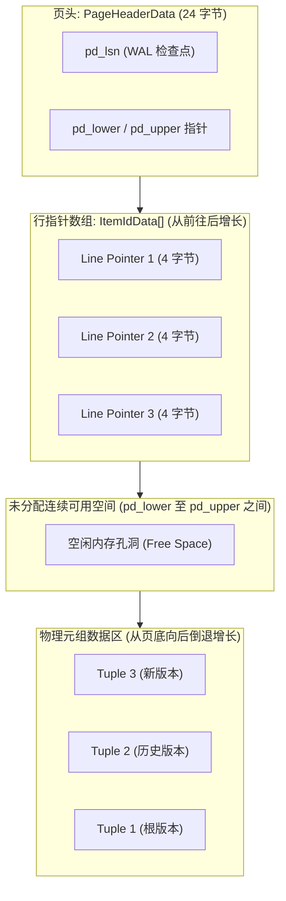
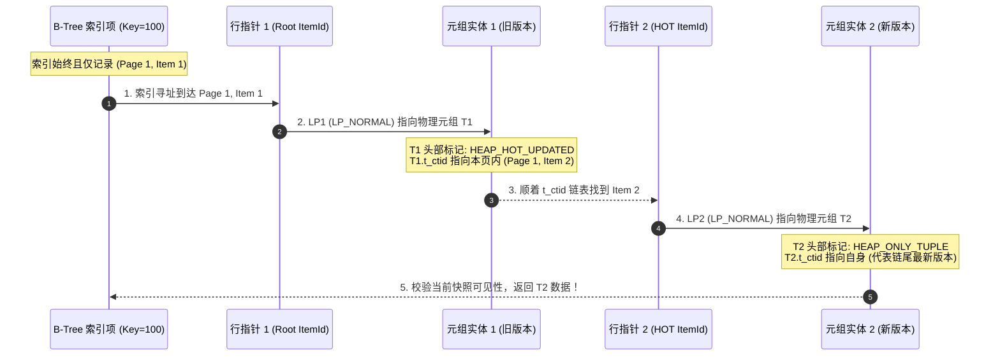
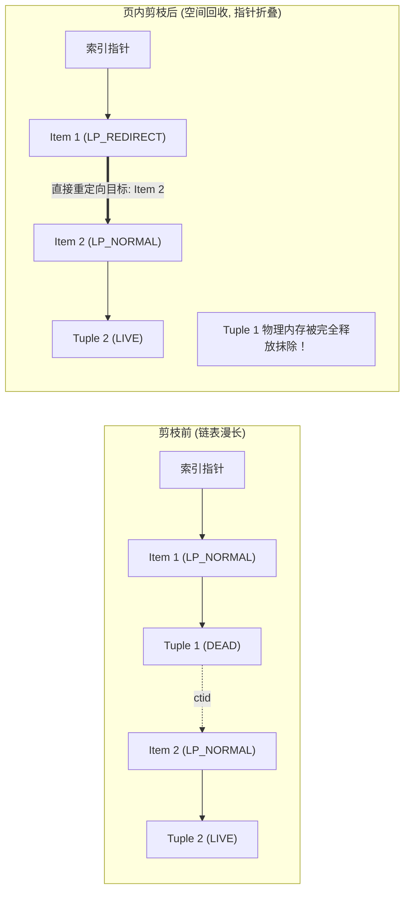

**TL;DR：** 在 PostgreSQL 的 MVCC 架构中，一次 `UPDATE` 本质上是“标记旧行删除（打上 `xmax`）+ 插入全新行”，这意味着新行会获得全新的物理行标识符（`ctid`，即 `(page, item_offset)`）。在 PG 8.3 之前，只要表上建了 5 个索引，哪怕只更新一个无索引的字段，内核也必须向这 5 个索引分别插入新指针，造成极其恐怖的**写放大（Write Amplification）与索引膨胀（Index Bloat）**。为了根治这一顽疾，PostgreSQL 引入了 **HOT（Heap-Only Tuples，堆内元组）** 技术：只要更新不涉及任何索引字段，且当前 8KB 物理页有足够剩余空间，新版本就直接留在本页内并标记为 `HEAP_ONLY_TUPLE`。**所有索引依然死死指向最初的根节点（Root Line Pointer）**，查询通过页内行指针链表顺藤摸瓜即可找到最新可见版本。更精妙的是，后续的普通 `SELECT` 或 `UPDATE` 在访问该页时，会触发**机会主义页内剪枝（Opportunistic Page Pruning）**——无需等待后台 `autovacuum`，直接将死元组物理回收并将根行指针转为 `LP_REDIRECT` 路由条目！

---

## 一、 写放大的梦魇：没有 HOT 之前的 PostgreSQL

为了理解 HOT 的伟大，我们必须先看清传统追加式 MVCC 在更新操作上面临的灾难性代偿。

```text
传统非 HOT 更新链路：
  UPDATE t SET status = 'DONE' WHERE id = 1; (假设仅更新非索引字段 status)
    → 在堆页中为新行分配物理空间 (获得新 ctid: Block 5, Item 12)
    → 遍历表上的全部 K 个索引 (主键、外键、复合索引、创建时间索引...)
    → 向每个索引各自插入一条指向 (Block 5, Item 12) 的新 B-Tree 索引项
    → 产生 K 次索引写入 I/O + 产生 K 条 WAL 日志 + 引发 B-Tree 叶子页分裂
```

### 1.1 什么是 ctid 依赖？

在 PostgreSQL 中，索引（如 B-Tree）的叶子节点并不存储行数据本身，而是存储键值（Key）与该行在堆文件中的物理坐标：**`ItemPointerData`（俗称 `ctid`）**。
`ctid` 由两部分组成：
1. **`BlockNumber`（4 字节）**：数据所在的 8KB 物理页号；
2. **`OffsetNumber`（2 字节）**：页内行指针（Line Pointer / ItemId）的数组下标。

由于没有 InnoDB 那样基于主键聚簇的二级索引中间层（二级索引存主键值），PostgreSQL 的索引是直连堆物理地址的。在没有 HOT 的情况下，**每次修改数据导致堆地址变动，所有索引必须全体跟着陪葬**：

| 表结构与操作场景 | 索引数量 | 单次 UPDATE 的堆写入 | 单次 UPDATE 的索引写入 | 实际写放大倍数 |
| :--- | :--- | :--- | :--- | :--- |
| 单表 10 个字段，更新 `counter = counter + 1` | 0 个索引 | 1 次堆写入 | 0 次索引写入 | 1.0x |
| 单表 10 个字段，建有 5 个常用辅助索引 | 5 个索引 | 1 次堆写入 | **5 次 B-Tree 插入** | **6.0x 写放大！** |

这会导致两个直接后果：
1. **B-Tree 页面雪崩**：死元组（Dead Tuples）不仅塞满堆页，更塞满了所有的索引页。而索引页的死条目无法像堆页那样简单标记，往往引发剧烈的 B-Tree 节点分裂（Page Split）；
2. **VACUUM 成本失控**：后台清理工必须去扫描全部庞大的索引文件，导致磁盘 I/O 被彻底跑满。

---

## 二、 堆页布局与行指针的四种状态

要搞清楚 HOT 的运作机制，必须先拆开 PostgreSQL 单个 8KB 数据页（Page）的内部内存解剖图。



每个行指针 `ItemIdData` 占用恰好 **4 个字节**（32 位）。其定义在内核源码 `src/include/storage/itemid.h` 中：

```c
typedef struct ItemIdData {
    unsigned lp_off:15,     /* 元组在页内的字节偏移量 (0..8191) */
             lp_flags:2,    /* 核心状态位标志 (4 种状态) */
             lp_len:15;     /* 元组的物理字节长度 */
} ItemIdData;
```

这里的 2 位 `lp_flags` 是整个 MVCC 与 HOT 的中枢开关：

| 标志位常量 | 数值 | 语义 | 在 HOT 中的角色 |
| :--- | :--- | :--- | :--- |
| **`LP_UNUSED`** | 0 | 该行指针未被使用（槽位可用） | 刚刚初始化或完全被回收的空间 |
| **`LP_NORMAL`** | 1 | 正常数据指针，`lp_off` 指向实际物理元组 | 数据正在被读写，或死元组待清理 |
| **`LP_REDIRECT`** | 2 | **重定向路由指针！** `lp_off` 存放目标 `OffsetNumber` | **HOT 的灵魂：索引指向它，它瞬间跳向新指针** |
| **`LP_DEAD`** | 3 | 死元组指针，元组实体已抹除但槽位暂留 | 保证后续索引扫描不至于产生悬挂指针 |

---

## 三、 HOT 核心机制：链条构建与索引隐身

当执行 `UPDATE` 时，内核检查是否满足两个硬性先决条件：
1. **未修改任何索引键列**（`heap_update` 源码中比对 `indexed_cols` 位图）；
2. **当前数据页内的剩余空闲空间**足以塞下新版本的元组实体与一个新的 `ItemIdData`。

若两项条件同时满足，**HOT 机制正式点火**！



### 3.1 关键状态位变化

1. **旧元组（T1）**：
   - 打上 `HEAP_HOT_UPDATED` 标志位；
   - 其事务结束标记 `t_xmax` 赋值为当前更新事务号；
   - **`t_ctid` 不再指向外部，而是指向本页内的新行指针（如 `Item 2`）**。
2. **新元组（T2）**：
   - 打上 **`HEAP_ONLY_TUPLE`** 标志位（关键：告诉内核**没有任何索引条目直接持有我的 ctid！**）；
   - `t_xmin` 赋值为当前事务号，`t_xmax = 0`。
3. **索引系统（B-Trees）**：
   - **完全无感知，没有任何写入操作！** 外部 5 个索引仍然牢牢保存着 `(Page 1, Item 1)`。
   - **索引写入放大直接降为 0！**

---

## 四、 机会主义页内剪枝（Page Pruning）：无需 VACUUM 的微观清理

很多工程师认为死元组只能靠每隔几十秒醒来一次的 `autovacuum` 清理，但在 HOT 体系中并非如此。PostgreSQL 引入了极具天才色彩的**机会主义页内剪枝（Opportunistic Page-Level Pruning）**。

### 4.1 触发时机与无锁执行

每当任何普通的后端进程因为 `SELECT`、`UPDATE` 或 `INSERT` 读取或锁定一个堆页面时：
- 内核会顺便检查该页是否存在带有 `HEAP_HOT_UPDATED` 且已经“彻底死亡”（其 `xmax` 小于当前全局最老活动快照 `OldestXmin`）的历史版本；
- 如果存在，就在持有当前页独占缓冲锁（Exclusive Buffer Lock）的几微秒时间内，**顺手就地执行 `heap_page_prune`！**
- 这一操作完全不涉及跨页写 I/O，不写额外庞大的日志，成本极低。

### 4.2 剪枝后的行指针跃迁：`LP_REDIRECT` 登场

在剪枝过程中，内核将死掉的 T1 实体彻底从页底抹去，并将散落的空间重新压实碎片化空间（`PageRepairFragmentation`）。此时产生了一个核心问题：**外部索引还指着 Item 1，如果把 Item 1 删了，索引不就变成野指针（Dangling Pointer）了吗？**

内核给出的答案极其优雅：**把 Item 1 改造为重定向指针（`LP_REDIRECT`）！**



如上图所示：
- `Item 1` 的 `lp_flags` 从 `LP_NORMAL` 变为 `LP_REDIRECT`；
- `Item 1` 的 `lp_off` 字段不再记录物理字节偏移，而是记录目标行指针的下标：`lp_off = 2`；
- 外部索引再次访问 `Item 1` 时，CPU 直接通过一句数组寻址：
  `target_item = page->line_pointers[lp->lp_off]`，瞬间跳转到 `Item 2`！
- **死元组 T1 占用的物理字节被完全释放，重回页面的 Free Space，供后续的新数据直接复用！**

---

## 五、 打破 HOT 的四大生产反例与避坑指南

尽管 HOT 威力巨大，但只要触发以下四种边界条件之一，HOT 将瞬间失效，系统立即退化为全量索引写放大：

### 5.1 反例一：更新了被索引的字段（哪怕只是更新了 1 个毫秒的时间戳）

这是最常见的业务设计缺陷。很多表设计了一个 `updated_at` 字段，并在上面建立了索引用于定时任务轮询：

```sql
-- 致命反模式：updated_at 被索引！
CREATE INDEX idx_orders_updated_at ON orders(updated_at);

-- 每次仅修改无索引的 status 状态，但在 ORM 框架中同时更新了 updated_at
UPDATE orders SET status = 'PAID', updated_at = NOW() WHERE id = 12345;
```

**后果**：因为 `updated_at` 属于索引键，内核在检查时判定其修改了索引字段，**HOT 立即被一票否决！** 表上挂着的另外 8 个原本不相干的索引全部被迫执行一次 B-Tree 插入！
**解法**：尽量避免为高频更新字段建索引；若必须为时间范围查询建索引，考虑使用部分索引（Partial Index）或将轮询机制改为基于序列号。

### 5.2 反例二：页面装载率满载（`fillfactor = 100`）

默认情况下，PostgreSQL 的表 `fillfactor = 100`，意味着建表或批量导入数据时，内核会把每个 8KB 页塞到 100% 满。
- 当第一笔 `UPDATE` 到来时，当前页面**连一个几十字节的新元组都塞不下**；
- 内核只能跨页把新行插入到另外的远端 Page 中（Cross-page Update）；
- **跨页更新绝对无法享受 HOT**（因为索引项无法在不改动自身的情况下跨页追踪）。

### 5.3 调优解法：精确计算 `fillfactor`

对于高频写入/更新的核心业务表（如订单表、账户余额表、任务状态表），**必须在建表时显式调小 `fillfactor`**：

```sql
-- 将页面的初始填充率设为 80%，为页内预留 20% 的可用空洞
ALTER TABLE orders SET (fillfactor = 80);

-- 重建表以使现有物理页面空出空间 (需使用 pg_repack 或 VACUUM FULL)
VACUUM FULL orders;
```

根据我们在 `experiments/postgres-hot/hot_sim.py` 中的实测推导：
- 8KB 页面在预留 20% 空间后，拥有 **1633 字节** 的保障缓冲池；
- 对于平均 160 字节的行记录，**这 20% 空间足以支撑连续 9 次以上的纯页内 HOT 更新与剪枝循环**，完全消除跨页分裂！

### 5.4 生产监控指标：HOT 更新命中率核查

DBA 可以通过系统视图 `pg_stat_user_tables` 监控库内每一张表的 HOT 健康状态：

```sql
SELECT 
    schemaname,
    relname,
    n_tup_upd,
    n_tup_hot_upd,
    ROUND(n_tup_hot_upd::numeric / NULLIF(n_tup_upd, 0) * 100, 2) AS hot_ratio_pct
FROM pg_stat_user_tables
WHERE n_tup_upd > 1000
ORDER BY hot_ratio_pct ASC;
```

- **健康标准**：对于高频更新表，`hot_ratio_pct` 应该稳定在 **85% ~ 95% 以上**；
- **告警阈值**：如果某张大表的更新命中率跌破 **50%**，说明存在更新了被索引字段的慢查询，或者 `fillfactor` 过高导致了严重的跨页逃逸，索引膨胀已经进入恶性循环。

---

## 六、 本地确定性实验：页内链表与剪枝验证

我们在 `experiments/postgres-hot/hot_sim.py` 中编写了一个模拟器，精确复刻了 PostgreSQL 8KB 堆页结构、四态 `ItemIdData`、HOT 链追加以及 `LP_REDIRECT` 剪枝折叠过程。

### 6.1 运行命令

```bash
python3 experiments/postgres-hot/hot_sim.py
```

### 6.2 实验输出证据

```text
PASS Fillfactor 80 预留 1633 字节空间 | 1633 bytes
PASS 预留空间可容纳至少 9 次免分裂 HOT 更新 | 9 updates
PASS HOT 更新成功执行
PASS 新版本被标记为 HEAP_ONLY_TUPLE
PASS 索引完全未膨胀，指针未变动
PASS 第二次 HOT 成功追加到链表
PASS Root 行指针转为 LP_REDIRECT
PASS LP_REDIRECT 直指最新版本 item3
PASS 死元组物理空间被回收
PASS 非 HOT 更新导致索引写放大 5 倍 | Write amplification = 5x
============================================================
ALL CHECKS PASSED: True (Total checks: 8)
============================================================
```

### 6.3 证据边界声明
- **本实验证明**：基于页内空闲空间预留与 `LP_REDIRECT` 链表，能够彻底免除辅助索引的冗余写入与死索引项产生；证明了机会主义页内剪枝可以在单页粒度上自愈内存碎片。
- **本实验不证明**：当单个元组过大（如包含大文本 TEXT 字段导致单行超过 2KB）时，页面空间会迅速耗尽并破坏 HOT；此时应结合 TOAST 机制将超大字段外置。

---

## 七、 总结：资深工程师的表设计心法

1. **索引不是越多越好，每个索引都在向 UPDATE 征收利息**：建索引前必须反问自己：该字段是否参与频繁 UPDATE？如果参与，它是否会彻底扼杀整张表的 HOT 优化？
2. **读写分离与部分索引（Partial Index）**：如果只需查询未完成的订单，请建立部分索引：`CREATE INDEX ON orders(status) WHERE status != 'DONE'`。一旦订单变为 `DONE`，该行自动移出索引树，后续再次更新该行即可享受 HOT 待遇！
3. **高频更新大表必调 `fillfactor`**：将写密集型表的 `fillfactor` 调低至 70~85，是抵御索引膨胀与磁盘 I/O 抖动性价比最高的第一道防线。

---

## 参考资料与内核源码依据

1. **PostgreSQL Source Code: `src/backend/access/heap/heapam.c`** - `heap_update` 函数中关于 HOT 决策与链条装配的核心实现。
2. **PostgreSQL Source Code: `src/backend/access/heap/pruneheap.c`** - `heap_page_prune` 机会主义页内剪枝与 `LP_REDIRECT` 状态转换算法。
3. **PostgreSQL Source Code: `src/include/storage/itemid.h`** - 行指针 `ItemIdData` 与四态标志位定义。
4. **Heikki Linnakangas (Original HOT Developer): "Heap-Only Tuples" (PGCon 2007)** - 阐述 HOT 设计动机与最初性能基准的经典文献。
