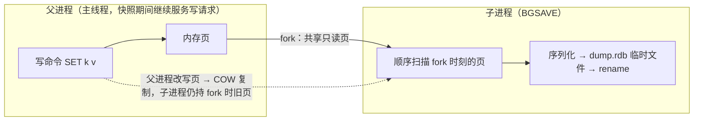

**TL;DR：** Redis 号称内存数据库，但“断电丢多少”从不是单一答案，而是配置、操作系统、设备和复制共同决定的边界。RDB 是**某时刻的状态快照**，AOF 是**按顺序重放的写入记录**；`appendfsync=always/everysec/no` 分别把同步频率、写入等待和故障风险分给不同责任方。`everysec` 可以作为“秒级风险窗口”的配置起点，但不是脱离版本、宿主机和设备的硬 SLA；`no` 更不能直接翻译成固定 30 秒。现代 Redis 的混合持久化用 RDB 前导加增量 AOF，改善加载路径，但仍要单独验证丢失窗口、恢复时间和副本切换。

## 一、先立反直觉：内存数据库的"断电丢多少"是分档的

"内存数据库"这个名号容易让人以为它天然快、天然不留证据。反直觉的是：Redis 默认就带持久化，只是这套持久化是**分档**的——它不会回答"断电丢多少"这个单数问题，而是给你一组档位，每个档位承诺完全不同的丢失窗口。

很多发行版/示例配置默认启用 RDB、关闭 AOF，但“默认”必须以目标 Redis 版本和实际 `redis.conf` 为准。RDB 的丢失窗口取决于最后一次成功快照距今多远以及 save 条件是否被触发；低写入时可以远大于分钟，高写入时也可能因为 fork、磁盘或上一次 BGSAVE 未完成而推迟。这就是第一档价签：**RDB 的丢失窗口 = 两次成功快照之间的全部状态变化，再加上快照失败/延迟的故障边界**。

| 配置 | 断电最多丢 | 一句话 |
| :--- | :--- | :--- |
| `appendonly no`（若目标配置仅启用 RDB） | 最后一次成功快照之后的一切；窗口由 save/故障状态决定 | 点备份，两次成功快照之间的全丢 |
| AOF `always` | 每次写入都请求同步；不应简化成绝对 0 丢失 | 同步等待最多，仍受文件系统/设备/复制影响 |
| AOF `everysec` | 通常按秒级调度同步；不是跨平台硬 SLA | 以较低同步频率换写入等待，需故障演练验证 |
| AOF `no` | 由操作系统/文件系统写回策略决定 | 应用不主动同步，窗口不可直接写成固定秒数 |

把四种档位并排看，问题就清楚了一半：Redis 的持久化本质是“在不同故障模型下选择可接受的丢失边界”。接下来的两节分别拆开两种记录方式：RDB 记录的是**结果**（某时刻的整份状态），AOF 记录的是**过程**（每一条写命令）。这个区别决定了后面所有恢复判断：结果可以“装载”，过程需要“重放”。

## 二、RDB：fork + COW，为什么快照能"边写边抄"

RDB 的机制一句话：主进程 `fork()` 一个子进程，子进程把整个内存数据集序列化写进 `dump.rdb` 临时文件，写完 `rename` 原子替换旧文件。难点在于 Redis 在快照期间**不能停写**——谁来保证快照的"一致性"？答案是内核的 copy-on-write（写时复制）。



fork 是拿"一刻的一致视图"的唯一办法：fork 之后子进程读到的每个内存页都是 fork 那一刻的内容；父进程继续改写某个页时，内核先把原页复制一份给子进程，再让父进程在副本上改。于是子进程手里的视图永远是 fork 时刻的——哪怕快照写到一半父进程已经把数据改了几万次，快照依然是严格一致的时间点。**这就是"RDB 点备份"的语义基础：它是一个时刻的快照，不是一个区间。**

为什么低负载时 RDB 便宜，这里有了答案：子进程只做"顺序读页 + 顺序写文件"，父进程照常服务请求，双方共享绝大多数只读页（零复制）。写负载低时 COW 几乎不触发，fork 的固定成本（页表设置）摊在整份快照上，所以低写入实例的 BGSAVE 通常无感。代价都藏在三个地方：

1. **COW 写放大**：写负载越高，父进程改页越多，被复制的页越多。RDB 期间的磁盘写入和内存峰值都会上升，具体量级取决于写密集度，可用 INFO 的 persistence 段 `rdb_last_cow_size` 观察（Redis 7.0 前是 stats 段的 `rdb_cow_bytes`）；本文目前没有保存 Redis 版本、负载和原始观测值。
2. **全量重写**：每次 BGSAVE 都把整个数据集重写一遍。数据 10GB、一天快照 10 次，就是 100GB 磁盘写入——**快照越勤，写放大越重**，这是它和 AOF 逐命令追加在 IO 形状上的本质差别。
3. **阻塞点**：`fork()` 本身是同步的，数据集越大耗时越长（页表复制），官方文档把 fork 列为可观测的延迟来源之一。另外，上一次 BGSAVE 没结束时不会开新快照，持续高负载下快照会被推迟，实际丢失窗口比名义的更大。

恢复端是 RDB 唯一全胜的维度：`dump.rdb` 是紧凑二进制，装载就是反序列化整份状态，不需要重放命令。官方文档明确记载：大数据集下 RDB 重启比 AOF 快。这一快一慢、一丢多一丢少的组合，就是四节对照表的骨架。

## 三、AOF：重放日志，三档 appendfsync 的价签与"1 秒窗口"的物理含义

AOF 把每一条写命令按 RESP 协议追加到 `appendonly.aof`（概念模型；Redis 7 起 AOF 改为 manifest + base + incr 的多文件布局，增量命令仍按 RESP 追加），重启时把文件里的命令按顺序全部执行一遍，重建数据集。它和 RDB 的语义差异很直接：**RDB 备份"结果"，AOF 记录"操作"**——所以 AOF 恢复必须重放，命令数量通常远大于最终状态里的键数量，恢复慢的根源就在这里。

控制丢失窗口的旋钮只有一个：`appendfsync`，三档的语义官方文档给出如下：

| 档位 | 语义 | 断电风险边界 | IO 成本 |
| :--- | :--- | :--- | :--- |
| `always` | 每条写命令后都请求 fsync | 请求级同步；仍不替设备掉电保护、复制和备份负责 | 每写一次等待磁盘确认，吞吐受同步延迟影响 |
| `everysec`（目标版本常见默认） | 按秒级调度 fsync | 通常是秒级窗口，但调度、阻塞、故障类型和设备决定实际结果 | fsync 摊到调度周期，通常比 always 少等待 |
| `no` | 不主动 fsync，交给 OS | 由 OS、文件系统和设备写回决定，不是固定 30 秒 | 应用侧最省同步调用，但风险窗口最大且不可直接上界 |

三档的丢失窗口必须和上一行"IO 成本"一起读，这正是三选一的由来：

- **`always` 用吞吐换持久性**：每次写都要请求 `fsync()`，提交吞吐会受到同步延迟影响；Redis 可能把并发写合并到一次同步，缓解但没有消除设备和文件系统的等待，模型细节见[fsync 那篇](/writing/fsync-group-commit)。
- **`everysec` 的秒级窗口来自同步调度**：两次 fsync 之间，AOF 缓冲区可能已经 `write()` 到内核页缓存但尚未完成同步。断电会让这段缓存面临丢失；进程崩溃而操作系统仍存活时，表现又可能不同。这里的“约一秒”是正常调度语义的量级，不是可以替代故障演练的硬上限。
- **`no` 把间隔交给内核写回**：Redis 不主动 fsync，脏页由 OS/文件系统/设备决定何时写回；Linux 的某个写回参数或历史默认值不能被直接写成 Redis 的跨平台保证。

本文不填写三档吞吐与丢失窗口的本机数值：`bench.sh` 可在隔离容器中压三档 SET 吞吐，`crash-loss.sh` 可观察进程崩溃后的恢复状态，但当前工作区没有对应 Redis 运行快照。配置文档给出的同步策略是语义起点，不是本机吞吐或真正断电实验结果。

AOF 还有两个绕不开的机制。一是**膨胀与 rewrite**：日志无限追加必然膨胀——一个 key 被 SET 十万次，AOF 里就有十万条命令，而最终状态只有一条。`BGREWRITEAOF`（也会自动触发）用当前内存数据重新生成"重建数据集的最少命令集"，本质也是 fork 子进程；rewrite 期间新命令写进增量文件，结束后合并。二是 **Redis 4.0 引入、5.0 起默认开启的混合持久化**（`aof-use-rdb-preamble`，当前默认 `yes`）：AOF 文件 = 一段 RDB 前导（rewrite 时刻的整份快照）+ 之后的增量命令，加载时先读 RDB 前导（快）、再重放增量。官方配置文档的说法是 RDB 格式装载"总是更快更省"，关闭只为了向后兼容。等于在重放表里装了半张备份表——把 RDB 恢复快与 AOF 丢得少拼进同一个文件。

## 四、对照表：备份与重放，在三个维度上的取舍

| 维度 | RDB（备份表） | AOF（重放表） |
| :--- | :--- | :--- |
| 记录什么 | 某时刻的整份状态 | 每一条写命令 |
| 恢复速度 | 快，装载二进制状态即可 | 慢，要重放全部命令；混合模式 = RDB 前导 + 增量重放 |
| 断电丢失窗口 | 最后一次成功 save 之后的一切；由配置和快照状态决定 | `always` 请求级同步；`everysec` 秒级调度窗口；`no` 由 OS/设备写回决定 |
| 磁盘写入形状 | 每次全量重写，写放大与快照频率成正比 | 逐命令追加，周期 rewrite 压缩一次 |
| 文件可读性 | 二进制 | 明文命令流，可 `tail` 直接看 |
| 典型角色 | 备份、灾备、可容忍一个快照间隔丢失 | 需要把风险窗口压到同步策略允许的范围 |
| 启动负载 | 一次性装载 | 重放可能吃满 CPU 一段时间 |

于是选型的问题从"RDB 和 AOF 哪个稳"——这个问法本身错了——变成三个变量的三选一：

1. **能接受什么故障窗口**：能丢一段快照间隔 → 只开 RDB 可能足够；需要秒级同步策略 → 评估 `everysec`；要求每次写都请求同步 → 评估 `always`，但仍不能跳过设备/复制/备份验证。
2. **启动恢复多慢**：数据集大、重启要快 → RDB 或混合模式（AOF 全量重放在大数据集上通常更慢，但具体秒数必须绑定数据集、Redis 版本和磁盘，本文不假设一个通用值）。
3. **fsync 吃多少 IO**：`always` 把写吞吐钉在磁盘 fsync 延迟上，`everysec` 基本无感。

一句话为什么：RDB 的"备份"承诺的是"**我存了某个时间点的全量**"，AOF 的"日志"承诺的是"**我把最近每一笔记到了什么程度**"。你要的是"一个时刻"还是"一段最近"，决定了哪张表该进生产。

## 五、结论：缓存与存储的边界，以及下一步实验

Redis 官方定位是"缓存或数据存储"双角色，但两个角色对持久化的依赖完全不同，这正是[Redis 当消息队列那篇](/writing/redis-as-mq-consume-groups)结尾"该不该当存储"要接的题。

- **当缓存**：数据源头在别处，丢了能重建。持久化只是省启动时间的优化，甚至可以全关（`appendonly no` + `save ""`）换最大吞吐——此时谈 RDB/AOF 哪个稳没有意义。
- **当存储**：Redis 成了唯一事实源，丢失窗口直接等于你选的档位和故障模型。`everysec` 可以作为秒级风险的候选配置，但只有目标版本、设备、主从切换和恢复演练都支持时，才能写进 SLO；想更强，`always` 增加每次写的同步等待，但仍不替代副本、备份和故障恢复。

边界判据一句话：**丢了这个键，谁能重建它？** 有源头 → 当缓存，持久化随意；没有源头（Redis 是唯一事实源）→ 当存储，选档位就是选“故障窗口 × 恢复时间 × 写入等待”。这个三选一里没有免费选项：`everysec` 常作为折中起点，但它的风险窗口、恢复时间和复制行为仍需在目标环境中测量。

下一步可执行的事：把上面的数字在本机跑出来。

### 实验入口

`experiments/redis-persistence/` 下两个脚本，用 docker 起 `redis:7` 容器：

```bash
# 1) 三档 appendfsync 的 SET 吞吐对比（每次一个干净容器，只改 appendfsync 一个变量）
bash experiments/redis-persistence/bench.sh

# 2) kill -9 模拟崩溃，看各档位恢复后剩多少（并演示"断电窗口 vs 进程窗口"的区别）
bash experiments/redis-persistence/crash-loss.sh
```

注意脚本 README 里写的读法：`kill -9` 只杀进程，宿主内核页缓存还活着，所以 AOF `everysec`/`no` 的表现不能等同于断电；这正是"进程窗口"和"主机/设备断电窗口"必须分开的原因。要验证真正的耐久性边界，需要可控的虚拟机/设备故障模型，而不是把 `kill -9` 的结果外推成秒数。

本机实测（2026-08-18，redis:7-alpine docker，原始输出见 `evidence/redis-persistence/2026-08-18-local/`）：`bench.sh` 三档 SET 吞吐为 `no` ≈ 202k rps、`everysec` ≈ 196k rps、`always` ≈ 16-18k rps——两档无 fsync 一档每写 fsync，`always` 慢约 11 倍，与"1/fsync"模型吻合（单次本机结果，绝对值随磁盘变化）。`crash-loss.sh` 四种配置写满 100 key 后 kill -9 重启：仅 RDB 剩 0 条（上一次快照之后写入的全部丢失）、AOF `always` 剩 100、`everysec` 剩 99、`no` 剩 100——进程级窗口约等于零，正说明"断电窗口"量级（≤1s / ≤30s）只发生在页缓存整体蒸发时，本机复现的是机制，不是断电数字。

## 参考资料

1. Redis 官方文档：Redis persistence（RDB point-in-time snapshot、AOF 重放、appendfsync 三档与丢失窗口、BGREWRITEAOF、aof-use-rdb-preamble）—— https://redis.io/docs/latest/operate/oss_and_stack/management/persistence/
2. Redis 官方 redis.conf（默认 save 点 `save 3600 1 300 100 60 10000`、appendfsync、aof-use-rdb-preamble）—— https://raw.githubusercontent.com/redis/redis/7.2/redis.conf
3. Redis 官方文档：Latency problems troubleshooting（fork 列为延迟来源）—— https://redis.io/docs/latest/operate/oss_and_stack/management/optimization/latency/

> 延伸阅读：`write()` 只到页缓存、fsync 才到设备，以及 group commit 怎么把 fsync 从"每事务一次"摊成"每批一次"，见[数据库为什么宁可慢，也要等你 fsync](/writing/fsync-group-commit)；日志先行、崩溃恢复与 checkpoint 的完整链路，见[WAL 是数据库的命根子](/writing/wal-crash-recovery)；Redis 当消息队列时，"丢多少"的上界由哪一档持久化决定，见[Redis 当消息队列的账](/writing/redis-as-mq-consume-groups)。
