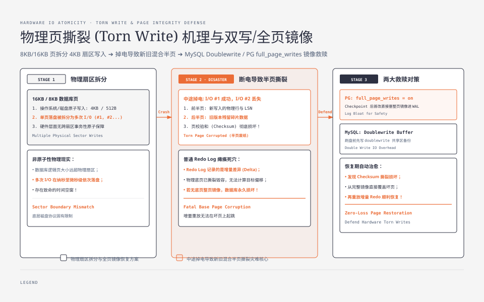
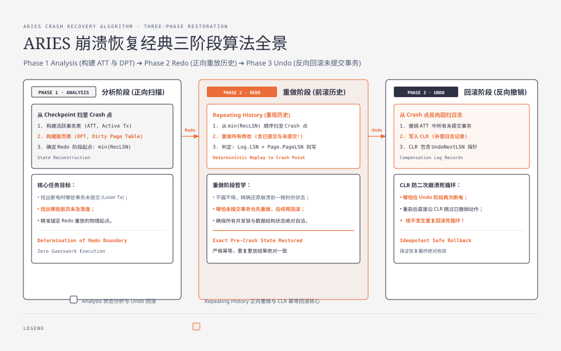
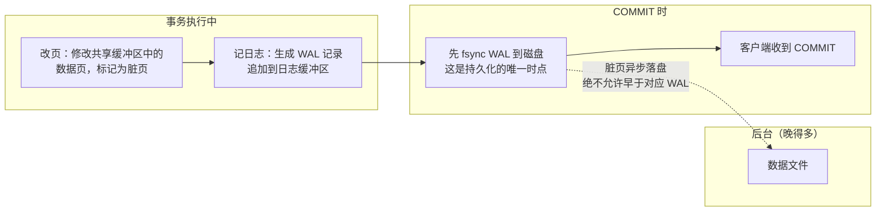
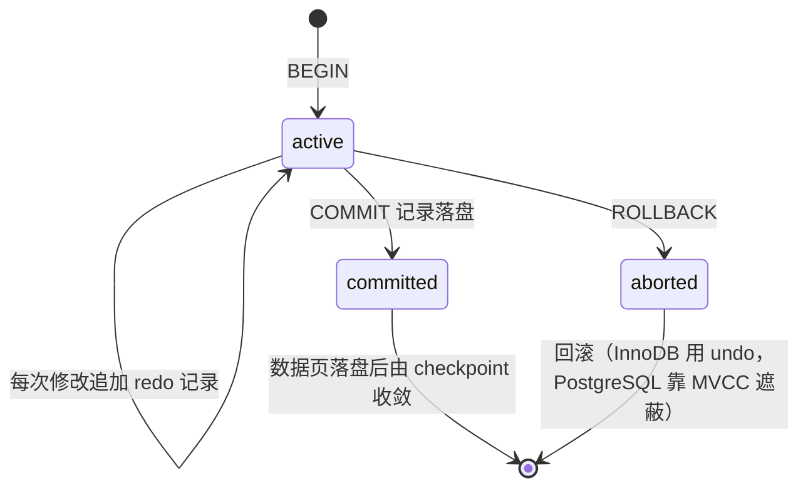
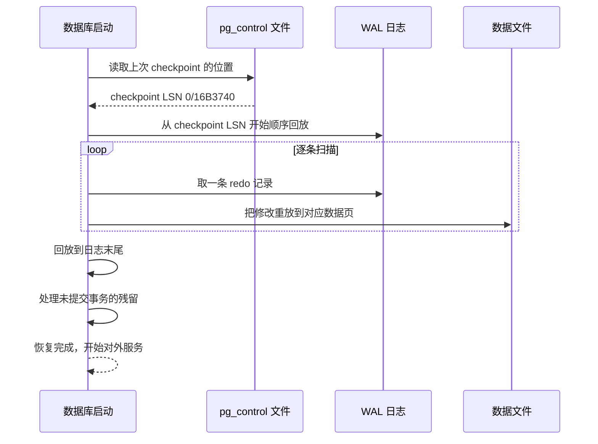
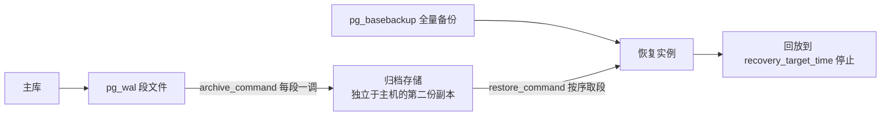
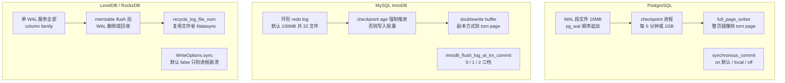
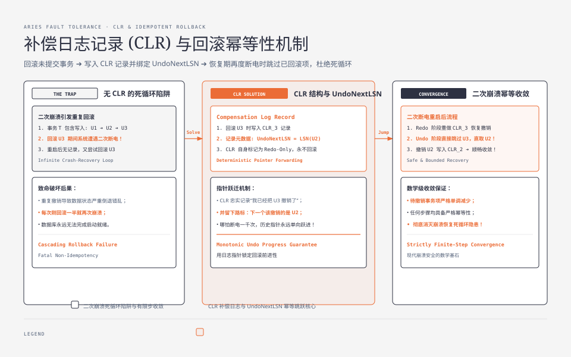
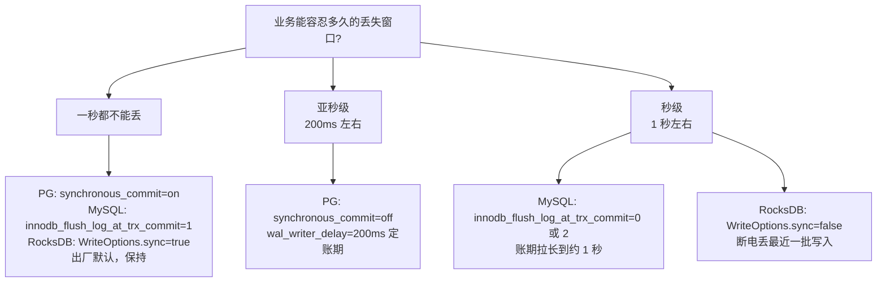

**TL;DR：** WAL 的纪律只有一条：先写日志，后改数据。崩溃恢复只有一件事：从上次 checkpoint 的位置把日志逐条重放到末尾。PostgreSQL、MySQL、LevelDB/RocksDB 对这条纪律的实现差异，全在 fsync 的时机与频率上，也就是持久性与吞吐的交换方式。默认档位是出厂安全承诺，压测没有证明 fsync 是瓶颈、业务没有确认能丢多久之前，不要动。

## 一、 断电那一刻，数据库在赌什么

想象一个朴素的问题：往一个文件里写 8KB 的数据，写到一半断电了，文件会变成什么样？

答案是：没人知道，因为磁盘的最小原子写入单元通常远小于一个数据库页，一次写页操作在物理上会被拆成多次 IO。崩溃之后，你读到的可能是新旧数据混合的"半页"——旧的行号配新的行内容，页头的校验和指向一半旧一半新的偏移量。这种损坏叫 **torn write**，它无法靠"重写一遍"修复，因为没人知道哪一半是可靠的。



*图注：一次 8KB 页写入被拆成两次物理 IO，断电恰好发生在中间——页读回来是新旧混合的半页，无法重写修复。*

更麻烦的是，数据库永远不知道崩溃什么时候来。它只知道一件事：**内存随时可能消失，磁盘上的页随时可能不完整**。如果把"每次提交都把数据文件全刷一遍"当作保命方案，性能会直接崩溃：页在磁盘上的位置是随机的，随机小写在机械盘上的吞吐比顺序写低约两个数量级，这个代价没有任何业务能承受。

于是所有严肃的存储引擎都承认同一个前提，并把赌注压在同一个机制上：**WAL（Write-Ahead Logging，预写日志）**。事务的一切修改，先以追加的方式写进日志，日志落盘了才向客户端说"成功"；数据页的落盘被无限期推迟，由后台进程慢慢刷。没有 WAL 的数据库，断电后的结果只能看环境：页缓存有没有被刷出去、磁盘写到了第几块、掉电保护有没有兜住，全都不受数据库控制。RocksDB 里有一个 `WriteOptions::disableWAL` 选项，开启后每次写不再记日志，代价是机器一崩溃，最近一次 flush 之后的所有写入直接蒸发，数据回到上次落盘的时点。




## 二、 WAL 的四个零件：纪律、方向、刻度、回收

### 2.1 日志先行：一条纪律和一个缓冲

WAL 的全部内容可以压缩成一句话：**日志记录必须先于数据页落盘**。

注意措辞。这里的"先"不是时间上的先，而是次序上的先：修改内存页和生成日志记录其实发生在同一个临界区里，几乎是同一瞬间；真正有先后关系的是落盘：数据页的落盘永远不许早于它对应的日志记录。只要这条次序成立，崩溃后数据库就永远能把丢失的修改从日志里找回来。

一条事务的完整写路径是这样的：



这条路径里有三个关键设计：

1. **日志缓冲区**。日志不是一条一条直接写盘的，先攒在内存里，攒够一批或提交时再刷。缓冲让"记日志"这件事本身几乎零成本，成本全部集中到 fsync 那一下。
2. **fsync 是持久化的唯一时点**。`write()` 只把数据交给操作系统页缓存，断电一样丢；只有 `fsync`[^fsync] 把脏页送到稳定存储并等设备确认。数据库的全部崩溃安全承诺，最终都要换算成"这些 fsync 没有骗我"。
3. **脏页是欠账，可以慢慢还**。数据页落盘没有截止日期，由 checkpoint 和后台刷盘进程决定。WAL 的本质就是把随机小写变成顺序追加，把"必须立刻落盘"的硬约束变成"可以排队"的软约束。

日志记录长什么样？以概念化的结构看，每条记录的核心字段是这样的：

```c
/* 概念示意：所有日志记录共享的骨架（真实格式各引擎不同） */
typedef struct XLogRecord {
    uint64  lsn;            /* 本记录的日志序列号，全局单调递增 */
    uint64  prev_lsn;       /* 上一条记录的位置，回放时校验连续性 */
    uint16  type;           /* 记录类型：CHECKPOINT / COMMIT / PAGE_DELTA / PAGE_IMAGE */
    uint16  payload_len;    /* 负载长度 */
    uint32  page_id;        /* 修改的是哪个页 */
    char    payload[];      /* 页的增量修改，或整页镜像（full_page_writes） */
} XLogRecord;
```

`prev_lsn` 的存在让回放变成一条不会断的链：恢复时如果发现某条记录的 `prev_lsn` 对不上，说明日志在磁盘上断了，只能回放到这里为止。日志截断点的判定实际靠记录头的 CRC 校验与物理连续性，`prev_lsn` 链只是回放时的辅助自检；完整性最终由这套机制兜底，恢复时不依赖任何猜测。

### 2.2 redo 与 undo：WAL 只管前滚

很多人把 WAL 和 redo log 混为一谈，其实它们的关系是：**WAL 是原则，redo log 是体现**。redo 负责"前滚"，把日志记录重新应用一遍，已提交的修改据此重建；undo 负责"回滚"，把未提交事务的修改撤销掉。恢复路径在这里出现分叉：PostgreSQL 走 **redo-only 恢复**，把日志重放到头、不做任何撤销，未提交事务靠 MVCC 遮蔽；InnoDB 走 **redo + undo 恢复**，重放之后再基于 undo 回滚未提交事务。所以"崩溃恢复不需要 undo"只对 redo-only 体系成立，不是普适结论。

| 维度 | redo（前滚） | undo（回滚） |
| :--- | :--- | :--- |
| **方向** | 重放修改，向"前"恢复（前滚） | 撤销修改，向"后"恢复（回滚） |
| **作用对象** | 日志中的全部记录（提交与否由 COMMIT 记录判定） | 崩溃时未提交的进行中事务 |
| **恢复中的作用** | 保证不丢已确认的数据 | 保证不残留半截事务 |
| **典型实现** | WAL / redo log / journal | InnoDB undo log、事务 ID 可见性 |
| **无 undo 的替代方案** | — | PostgreSQL 靠 MVCC 遮蔽 + 提交状态清理 |

这里藏着数据库设计的一个分水岭：**要不要 undo？**

MySQL InnoDB 要。8.0 起它把 undo log 放在独立的 undo tablespace 中（`innodb_undo_tablespaces` 默认 2 个；该参数 8.0.14 起弃用，undo 表空间改为自动管理；5.7 及更早版本默认放在系统表空间），崩溃恢复时扫描日志，遇到没有对应提交记录的事务就回滚。undo 还有一个副业：MVCC 的快照读依赖它重建旧版本的行。

PostgreSQL 不要。它没有独立的 undo log：崩溃恢复只重放日志，不撤销任何东西；未提交事务留下的页修改，靠多版本机制让它们对所有读者不可见，再由后续的清理进程回收。代价是数据页可能残留垃圾版本、需要 vacuum 清扫，收益是恢复路径极简：只有前滚，没有回滚。

两种方案都能兑现"崩溃后数据库完好"，但哲学不同。InnoDB 选择"把账记得清清楚楚，错了就退回去"；PostgreSQL 选择"只前进，错误由可见性机制掩盖"。

事务在日志世界里的生命周期，用状态机表达最清楚：



注意 `active --> committed` 的迁移条件是"COMMIT 记录落盘"，不是"COMMIT 记录写入缓冲区"。"落盘"和"写入缓冲区"之差，就是崩溃安全与数据丢失的分界线。

后文会反复提到三种故障形态，先把名字立在这里，每个配一句定义和一句对策：

- **torn write（半页）**：写页被拆成多次物理 IO，断电后页上新旧数据混合，页内容不可信。对策是整页镜像或 doublewrite，第 3 节两种打法都会展开。
- **日志断链（恢复截断点）**：磁盘上的日志在某处断了（物理缺失或记录 CRC 校验失败），恢复只能回放到截断点为止，截断点之后的已确认事务一并蒸发。对策是 CRC 与物理连续性自检——断链无法修复，只能尽早发现，`prev_lsn` 链只是辅助自检。
- **账期违约（丢失已确认事务）**：账期拉长后，已经告诉客户端"成功"、但还没 fsync 的事务在断电时丢失，是对客户端的违约。对策是只在自己算得清的窗口内降档，第 4 节的决策表就是这套算账方法。

### 2.3 LSN：给日志的每一滴墨编号

日志记录需要全序。恢复时要从断点接着放，复制时要让备库按序追，页面上要能判断"这条修改我是不是已经应用过了"。于是每个引擎都给日志上了刻度：PostgreSQL 叫 **LSN（Log Sequence Number）**，64 位单调递增，显示成 `0/16B3740` 这种两段十六进制；MySQL 叫 `log sequence number`；RocksDB 用单调递增的序列号 `seqno` 承担类似职责。

LSN 是单机上的全序时钟，也是分布式数据库里 clock 的穷亲戚——墙钟会回拨，LSN 不会，见[时间戳会骗人：时钟回拨与分布式系统的顺序幻觉](/writing/clock-skew-distributed-systems)。主从复制时，备库只需要记住"我已经重放到哪个 LSN 了"，这个数字就是复制的光标，追日志、断线重连、校验延迟全靠它。

在 PostgreSQL 里观察 WAL 状态是最直观的：

```bash
$ pg_controldata $PGDATA | grep -E "Latest checkpoint"
Latest checkpoint location:           0/16B3740
Latest checkpoint's REDO location:    0/16B3740
Latest checkpoint's REDO WAL file:    000000010000000000000016
Time of latest checkpoint:            Fri 31 Jul 2026 02:00:00 AM CST
```

`pg_control` 文件记录着恢复的起点，崩溃后数据库从这里开始重放。相关的可调参数：

```sql
SHOW checkpoint_timeout;    -- 5min：两次 checkpoint 的最大间隔，决定恢复窗口的长度
SHOW max_wal_size;          -- 1GB：触发 checkpoint 的日志软上限，日志长到它就结账
SHOW wal_segment_size;      -- 16MB：单个 WAL 段文件大小，切段与回收的物理单位
SHOW full_page_writes;      -- on：整页镜像，防 torn page 的保险费，用日志膨胀换页安全
SHOW wal_level;             -- replica：日志内容级别，流复制靠它才有足够素材
```

### 2.4 崩溃恢复：从 checkpoint 开始重放

重启之后，数据库做的事情比想象中简单：



恢复的流程就是上面这张图：从 checkpoint 位置开始，逐条取出 redo 记录，把修改应用到对应数据页，一直重放到日志末尾，再处理未提交事务的残留。但有个问题：日志会无限增长，重放窗口不能无限长。于是有了 **checkpoint**，它是数据库的垃圾回收器，做三件事：把当前所有脏页刷到数据文件；往日志里写一条 CHECKPOINT 记录并落盘；把新的恢复起点更新到 `pg_control`。此后这条 checkpoint 之前的日志记录就成了死账：恢复不再需要它们，WAL 段文件可以回收复用。

```mermaid
gantt
    dateFormat HH:mm
    axisFormat %H:%M
    section 周期一（T0）
    脏页异步刷盘，摊平在 90% 周期内 :active, f1, 00:00, 4m
    CHECKPOINT 记录写入并 fsync :milestone, m1, 04:00, 0d
    section 周期二（T0+5min 或日志达到 1GB）
    再次触发 checkpoint 并刷脏页 :f2, 05:00, 4m
    pg_control 前移，旧 WAL 段回收 :milestone, m2, 09:00, 0d
```



checkpoint 是一枚旋钮，拧向两边各有代价：**checkpoint 越频繁，崩溃恢复越快，但刷盘和 full_page_writes 的开销越大**；越稀，恢复时重放的日志越长，启动越慢。PostgreSQL 默认每 5 分钟或日志超过 1GB 触发一次，并且用 `checkpoint_completion_target`（默认 0.9）把刷盘动作摊平在周期内，避免 IO 尖峰。把 checkpoint 理解成"结账日"是最贴切的：账不能永远不结，结得太勤又费笔墨。

崩溃后重启，日志里发生的事就是上面那张图，一行一行看得见：

```bash
LOG:  database system was interrupted; last known up at 2026-07-31 02:00:05 CST
LOG:  database system was not properly shut down; automatic recovery in progress
LOG:  redo starts at 0/16B3740
LOG:  invalid record length at 0/16B3B28: wanted 24, got 0
LOG:  redo done at 0/16B3B00
LOG:  last completed transaction was at log time 2026-07-31 01:59:58.123456+08
LOG:  checkpoint starting: end-of-recovery immediate
LOG:  checkpoint complete: wrote 423 buffers (11.8%)
LOG:  database system is ready to accept connections
```

- `redo starts at 0/16B3740` 就是 `pg_control` 里存的恢复起点，和 2.3 的 `pg_controldata` 输出是同一个数；
- `invalid record length ... wanted 24, got 0` 不是错误，是日志的正常结尾——WAL 段尾部是未写完整（或全零）的区域，读到它就停，恢复不做任何猜测；
- `redo done` 之后立刻做一次 `end-of-recovery immediate` checkpoint，把重放结果收账落盘；
- `database system is ready to accept connections` 之前，所有连接请求都会收到 `FATAL: the database system is starting up`——恢复期间数据库不对外服务，也就不存在"看到一半"的状态。

恢复完成后的可见性只有两种：已提交事务全部可见，未提交事务全部不可见——PostgreSQL 靠 redo-only 重放加上 MVCC 遮蔽做到这一点（2.2 的哲学），用户看到的数据库和崩溃前没有任何中间态。

### 2.5 归档与 PITR：WAL 的第二个消费者

崩溃恢复不是 WAL 的唯一消费者。数据库的正常运行中，WAL 还有第二个作用：被"搬运"到别处，成为备份和复制的素材。这一节讲归档，它把 WAL 的纪律从"单机重启安全"扩展到"机房级灾难"。

归档的配置链是三个参数：`wal_level` 决定日志内容够不够用——`replica`（默认）已包含归档所需的信息，`minimal` 明确不够（某些操作在 minimal 下根本不记日志，官方文档直言 minimal 不支持 PITR）；`archive_mode=on` 打开归档；`archive_command` 是每写满一个 WAL 段文件就执行一次的 shell 命令：

```ini
wal_level = replica
archive_mode = on
archive_command = 'test ! -f /mnt/wal_archive/%f && cp %p /mnt/wal_archive/%f'
```

`%f` 是文件名，`%p` 是完整路径；命令的退出码必须严格表达"成功与否"——返回 0 才认为归档成功，否则 PostgreSQL 会周期性重试。归档只发生在段文件写满（或 `archive_timeout` 到点强制切段）之后，所以低流量库要设 `archive_timeout`（文档建议一分钟左右是合理值），否则最近几个事务在归档里可能滞后很久——这是 RPO 的第一道账。

时间点恢复（PITR）是"全量备份 + WAL 归档"的组合拳：`pg_basebackup` 做一次全量备份，归档持续积累；要恢复时，把全量备份展开到新实例，用 `restore_command` 从归档里按顺序取 WAL 段回放，`recovery_target_time` 指定停在哪一秒：



三个细节值得单独说：

- **恢复的停止点**：`recovery_target_time`（还有 `recovery_target_xid`、`recovery_target_lsn` 可选），`recovery_target_action` 决定到点后是暂停（默认，可只读检查）、提升（promote，开始服务）还是关闭。PG 12 起用 `recovery.signal` 文件进入目标恢复模式，不再写 `recovery.conf`。
- **增量备份**：PG 17 起 `summarize_wal` 开启后，WAL 汇总让增量备份成为可能——增量备份只取上次备份之后的变更，粒度依然是 WAL。
- **归档失败的形状**：归档积压时 `pg_wal` 会膨胀（`max_wal_size` 只是软上限，文档明确写着失败的归档会让它超限），`pg_stat_archiver` 里的 `failed_count` 和 `last_failed_time` 是第一个要盯的指标——归档断链比主库宕机更隐蔽，等发现时可能已经回放不了了。

归档为什么也是"WAL 纪律"的应用？因为备份的一致性归根结底靠的还是那条次序：日志先于数据。全量备份的"一致时点"由 WAL 上的 checkpoint 和备份起点定义，之后的每一个变更都在归档里有日志——没有这份日志，备份就只是某个未知时点的一组文件。先写日志后改数据的纪律，在这里换了个身份：先有日志副本，后有可恢复的备份。

## 三、 三个真实系统怎么兑现这条纪律

### 3.1 PostgreSQL：16MB 段文件与 full_page_writes

PostgreSQL 的 WAL 在 `pg_wal` 目录下，切成 16MB 的段文件，物理上是纯顺序追加，写完一段切下一段。两个特点值得注意：

- **full_page_writes（默认开）**：checkpoint 之后，一个页第一次被修改时，WAL 记录的不是增量而是整页镜像。这直接回应了本文开头那个问题：torn write。如果页在 checkpoint 后从未成功落盘，恢复时就能从镜像重建出完整的页，而不是把增量应用到半页废纸上。PostgreSQL 的选择是"把整页塞进日志，日志膨胀换取安全"。
- **LSN 一物两用**：同一个 LSN 既是恢复的刻度，也是流复制备库的同步位置。备库汇报"我追到了 `0/16B3740`"，主库就知道差距有多大。

### 3.2 MySQL InnoDB：环形 redo log 与 doublewrite

InnoDB 的 redo log 是一个**环形缓冲区**：默认容量 100MB（MySQL 8.0.30 起由 `innodb_redo_log_capacity` 控制，拆成 32 个文件放在 `#innodb_redo` 目录；8.0.30 之前是 `innodb_log_file_size` 48MB 乘以 2 个文件）。写指针在前推进，checkpointer 在后面追赶、决定可覆盖水位；写指针绕回起点时若 checkpointer 尚未清账，写会阻塞。

环形结构带来一个 PostgreSQL 没有的约束：**checkpoint 不是可选项，是强制项**。日志空间用尽时，写指针被迫停下，等待 checkpoint 把脏页刷掉、推进"可覆盖水位"（checkpoint age），否则整个数据库的写入就阻塞了。这也是 MySQL 中一种可复现的故障形状：日志环太小、账期太短，checkpointer 追不上写指针，刷脏页压力可能在高峰时段造成 IO 尖峰和 QPS 下探。是否发生、幅度多大必须由目标 MySQL 版本、存储设备和原始监控验证，不能把它写成当前环境已经发生过的生产事故。

torn page 的对策，InnoDB 选择了与 PostgreSQL 相反的方向：**默认不写整页镜像，而是用 doublewrite buffer**。页要落盘时，先顺序写进一块专门的 doublewrite 区域，再写回实际位置；如果实际位置写撕裂了，恢复时从 doublewrite 副本重建整页。同样是防 torn page：PostgreSQL 把副本存在日志里，InnoDB 把副本存在单独的区域，前者日志膨胀，后者每次刷页多一次写。

提交的持久性由 `innodb_flush_log_at_trx_commit` 控制，默认值 1：每次提交都 fsync redo log，最慢也最安全。这个参数的档位会在后面 fsync 一节展开。

### 3.3 LevelDB / RocksDB：WAL 与 memtable 的共生关系

LevelDB 和 RocksDB 把 WAL 用到了另一个极端。它们的写入路径是：**写操作先同时进 memtable（内存表）和 WAL，memtable 满了再 flush 成 SST 文件**。这意味着崩溃恢复的本质是"把 WAL 重放回 memtable"：日志是内存表的影子，两者同生共死：

- **一个 WAL 服务全部 column family**。RocksDB 里一个数据库实例只有一个活跃 WAL，所有列族的写共享它。
- **WAL 的生命周期由 flush 决定**。任何一个列族触发 flush，就切一个新 WAL；旧 WAL 要等所有列族的数据都落盘到 SST 才能删除或归档（归档的 WAL 通过 Transaction Log Iterator 供复制消费）。
- **WAL 可以回收复用**。`recycle_log_file_num` 开启后，新 WAL 复用旧文件已分配的空间：块已存在，`fdatasync` 就不用每次更新 inode，省掉文件元数据刷新的开销。
- **持久性按档位出售**。默认 `WriteOptions.sync=false`：WAL 每次写入后 flush 到操作系统，但**不 fsync**。于是进程崩溃不丢数据（页缓存还在），机器断电可能丢最近一批写入。这与"先写日志再确认"的原则不矛盾：RocksDB 只是把"日志落盘"这个动作的确认时点交给了用户。

RocksDB 的做法是嵌入式引擎的典型姿态：不替你决定账期，把档位开关全部交出来。`WriteOptions.sync`、`manual_wal_flush`、`disableWAL`，从每次 fsync 到完全不记日志，中间隔着一串明码标价的选项。

### 3.4 横截面：同一张牌，三种打法



| 维度 | PostgreSQL | MySQL InnoDB | LevelDB / RocksDB |
| :--- | :--- | :--- | :--- |
| **日志形态** | 16MB 段文件，顺序追加 | 环形 redo log，默认 100MB / 32 个文件 | 单 WAL 文件，按需切换与回收 |
| **checkpoint 语义** | 周期性可选，5min 或 1GB 触发 | 强制：日志环不推进则写入阻塞 | flush 即切 WAL，日志随 memtable 清账 |
| **torn page 对策** | full_page_writes 整页镜像入日志 | doublewrite buffer 单独副本 | 页内校验和发现撕裂 + 恢复时按 WAL 恢复模式处理 |
| **提交确认条件** | synchronous_commit（默认每次 fsync） | innodb_flush_log_at_trx_commit=1（每次 fsync） | WriteOptions.sync=false（默认不 fsync） |
| **恢复动作** | 重放 WAL，无 undo，靠 MVCC 遮蔽 | 重放 redo + undo 回滚未提交事务 | 重放 WAL 重建 memtable |
| **设计取向** | 服务端数据库，安全优先 | 服务端数据库，安全与性能并重 | 嵌入式引擎，持久性按档位出售 |




## 四、 fsync 与性能：持久性是一笔可以欠的账

这一节的结论先行：**所有现代数据库的持久性权衡，本质都是同一个问题：多久结一次账**。结账动作是 fsync，一次 fsync 的延迟取决于设备与负载；不要把某个 NVMe、机械盘或虚拟磁盘上的量级当作通用常数。把账期从“每次提交”放宽到“每秒一次”，可能提高吞吐，但收益必须用目标设备压测。放宽账期不是免费的：省下的 fsync 开销，兑换成档位表里写明的丢失窗口，每一档能丢多久都标了价。

第一个优化是 **group commit（组提交）**：把一批事务的 fsync 合并成一次。原理不复杂：多个事务同时提交时，它们的日志记录在缓冲区里本来就挨在一起，只需一个人执行 fsync，其余人等这一下完成就好：

```go
// group commit 概念示意（非任何数据库的真实源码）
func commit(w *WALWriter, buf *WALBuffer) error {
    lsn := buf.Append(commitRecord) // 1. 追加自己的 COMMIT 记录，拿到 LSN

    w.group.Lock()
    if w.flushedLSN < lsn {         // 2. 自己是否落后于最新 flush 位置
        w.flushedLSN = lsn
        w.fsync()                   // 3. 只有 group leader 执行真正的 fsync
    }
    w.group.Unlock()                // 4. 其余线程醒来发现自己的 LSN 已落盘
    return nil                      // 5. 向客户端返回 COMMIT
}
```

PostgreSQL 在提交路径上就是这种 leader-follower 结构：多个后端同时提交时，排在后面的等待者不重复 fsync，看到自己的 LSN 已经被刷过就直接返回。MySQL 5.6 起重做了 redo 与 binlog 的组提交（三阶段：flush、sync、commit），目的完全相同：把 fsync 次数从"事务数"压缩到"批次"。

这笔交易也有代价：组提交把 fsync 集中起来，也把等待集中起来，批内最慢的成员决定整批的提交延迟，所以它优化的是吞吐，不是单次延迟。

### 源码解剖：一次事务提交，在 WAL 里发生什么

PostgreSQL 17 官方文档把"提交 = 日志落盘"拆成两个内部函数，恰好对应第 2.1 节那张写路径图：

> "There are two commonly used internal WAL functions: XLogInsertRecord and XLogFlush. XLogInsertRecord is used to place a new record into the WAL buffers in shared memory... Normally, WAL buffers should be written and flushed by an XLogFlush request, which is made, for the most part, at transaction commit time to ensure that transaction records are flushed to permanent storage."
>
> —— PostgreSQL 17 官方文档：https://www.postgresql.org/docs/17/wal-configuration.html

职责分工很清楚：**Insert 只进内存 buffer，Flush 才落盘，且 Flush 主要在事务提交时触发**。所以"改页、记日志"全部发生在共享内存里，commit 那一下的 fsync 才是持久化的唯一时点；文档用 "for the most part" 留了余地，因为 walwriter 会在后台周期刷，`synchronous_commit=off` 只是把 Flush 的时点从提交时推迟给后台进程。

至于 group commit，WAL 总论里有一句官方表述：

> "Furthermore, when the server is processing many small concurrent transactions, one fsync of the WAL file may suffice to commit many transactions."
>
> —— PostgreSQL 17 官方文档：https://www.postgresql.org/docs/17/wal-intro.html

"一次 fsync 足以提交很多事务"，这就是组提交的官方定义：WAL 是顺序追加的，一批事务的记录在缓冲区里天然相邻，leader 的一次 fsync 覆盖整批。上文 Go 示意里的 leader-follower 结构，在 PostgreSQL 里由 `commit_delay` 参数直接控制：

> "The commit_delay parameter defines for how many microseconds a group commit leader process will sleep after acquiring a lock within XLogFlush, while group commit followers queue up behind the leader."

`commit_delay` 让 leader 在 XLogFlush 里睡一小会儿，给 follower 把 COMMIT 记录追加进缓冲区的机会，随后 leader 的一次 sync 把整批刷走——follower 排队等 leader 的 flush。默认 0 时组提交依然发生（同一窗口内的提交共享上一次 flush），只是批次更小。

checkpoint 的官方定义同样精确，呼应 2.4 节的"结账日"：

> "At checkpoint time, all dirty data pages are flushed to disk and a special checkpoint record is written to the WAL file... In the event of a crash, the crash recovery procedure looks at the latest checkpoint record to determine the point in the WAL (known as the redo record) from which it should start the REDO operation."
>
> —— PostgreSQL 17 官方文档：https://www.postgresql.org/docs/17/wal-configuration.html

"从最新 checkpoint 记录确定 redo record"，就是恢复起点的官方算法。而把刷盘摊平的旋钮，文档的描述是：

> "checkpoint_completion_target... given as a fraction of the checkpoint interval... With the default value of 0.9, PostgreSQL can be expected to complete each checkpoint a bit before the next scheduled checkpoint. This spreads out the I/O as much as possible... The disadvantage of this is that prolonging checkpoints affects recovery time, because more WAL segments will need to be kept around."

0.9 意味着把刷脏页摊进周期的前 90%，IO 尽量平滑；代价是恢复时要重放更多 WAL 段——这正是 2.4 节那个权衡的官方出处：结账摊得越平，结账日拖得越晚，恢复时欠的账越多。

### 一个常见的误解：每个事务都 fsync 一次

"WAL 保证持久性 = 每个事务提交都 fsync 一次"，是数据库性能讨论里最常见的误读。commit 时 flush 的不是单个事务，而是 WAL 缓冲区——里面通常攒着多个事务的记录；WAL 是纯顺序追加，一次 fsync 就能覆盖缓冲区里全部未落盘记录，官方称之为 "one fsync of the WAL file may suffice to commit many transactions"。所以 fsync 的次数约等于"批次"数，不是事务数。真正的"每事务一次 fsync"只在 `commit_delay=0` 且并发为 1 时近似成立——档位表里"每次提交 fsync"说的是"提交路径保证 fsync 发生"，而不是"每个事务单独调用一次 fsync"。

第二个优化是**主动放宽账期**，即把"每次提交都结账"降级为"定期结账"。三个引擎给了三组档位：

| 档位 | 语义 | 崩溃后果 |
| :--- | :--- | :--- |
| PG `synchronous_commit=on` | 提交时等待 WAL fsync 完成 | 不丢已确认事务 |
| PG `synchronous_commit=remote_write` | 备库收到但不落盘即确认 | 主备同时断电可能丢 |
| PG `synchronous_commit=off` | 提交不等 fsync，由 walwriter 周期性刷（`wal_writer_delay` 默认 200ms） | 断电可能丢最近约 200ms 内的已确认事务 |
| MySQL `innodb_flush_log_at_trx_commit=1` | 每次提交 fsync redo | 不丢 |
| MySQL `=0` | 每秒刷一次，提交不等待 | 断电最多丢最近 1 秒 |
| MySQL `=2` | 每次提交写 OS 缓存，每秒 fsync | 进程崩溃不丢，断电丢最近 1 秒 |
| RocksDB `WriteOptions.sync=true` | 每次写 fsync WAL | 不丢 |
| RocksDB `sync=false`（默认） | WAL 写入 OS 缓存，不 fsync | 进程崩溃不丢，断电丢最近写入 |
| RocksDB `disableWAL=true` | 完全跳过日志 | 崩溃即丢失全部未落盘数据 |

档位表回答"每种档位丢什么"，旋钮决策表回答"什么时候该动、动了代价多大"：

| 旋钮 | 何时动它 | 动了代价是什么 | 默认建议 |
| :--- | :--- | :--- | :--- |
| PG `synchronous_commit` | 压测证明瓶颈在提交路径的 fsync 上，且业务接受丢失窗口 | 确认时点后移，断电丢最近约 200ms 的已确认事务（off 档） | 出厂默认 on，不要动；只有上面两条同时成立才降 off |
| PG `checkpoint_timeout` | 崩溃恢复的启动时间不可接受时调小；IO 尖峰刺眼时调大摊平 | 调小：刷盘与 full_page_writes 更频繁；调大：恢复时重放更长 | 默认 5min（配合 max_wal_size 1GB）先不要动，等恢复时间真的不可接受再说 |
| PG `full_page_writes` | 几乎没有值得动的场景 | 关掉后，checkpoint 之后尚未落盘的页遇 torn write 无法重建 | 保持 on，这是防 torn page 的保险费，不是性能旋钮 |
| MySQL `innodb_flush_log_at_trx_commit` | 与 synchronous_commit 同理：fsync 瓶颈 + 可接受 1 秒窗口 | 断电丢最近 1 秒的已确认事务（0 或 2 档） | 保持 1；降档前先确认业务算得清这 1 秒 |
| RocksDB `WriteOptions.sync` | 调用方要求"断电也不能丢"时升 true | 每次写都 fsync，吞吐显著下降 | 保持默认 false；升 true 等于拿吞吐买保险，先压测再决定 |

注意一个容易被误读的点：**`synchronous_commit=off` 不是关掉 WAL**。日志照样写，只是"写进页缓存"与"fsync 到稳定存储"之间的账期变长了，WAL 依然完好，崩溃恢复依然工作——只是会丢失最近一小段时间内"已经告诉客户端成功"的事务。这是在和客户端撒谎，必须清楚这个谎言的最长有效期。同理，`innodb_flush_log_at_trx_commit=0` 每次提交都不 fsync，但日志本身还在，最坏丢 1 秒。

工程上的判断是：**默认档位（每次 fsync）是数据库的出厂安全承诺，不要轻易降级**。

降级只该发生在两类场景：性能压测明确证明瓶颈在 fsync 且业务能接受丢失窗口；或者该数据本来就有上游重放能力（消息队列、幂等接口，见[重试会放大一切错误：幂等性工程的完整账本](/writing/idempotency-engineering)），丢了可以从源头补。

我见过降档的代价：为了压提交延迟把 `innodb_flush_log_at_trx_commit` 从 1 调到 2，一次机房断电真的丢掉了那 1 秒窗口内的已确认事务，业务侧的第一反应是"你不是说提交成功了吗"。从那以后，每次动档位之前，我都会先让业务方写清楚一句话：能丢多久。为了百分之几的吞吐提升去换一条丢失窗口，除非压测数字摆在那里，否则这笔账不合算。

把上面的判断画成决策树，根问题只有一个：



读这棵树的顺序只有一条：先回答"丢了行不行、能丢多久"，再谈档位。丢失窗口的容忍度来自业务约束，压测数据只能证明 fsync 是不是瓶颈，回答不了这个问题。

### fsync 失败：数据库唯一该立刻停下的地方

档位表讨论的是"故意放宽 fsync"，还有一种更坏的情况：fsync 本身失败了。PostgreSQL 对关键路径（WAL 段、checkpoint）上的 fsync 失败采取 PANIC 策略——整个实例停下来进入崩溃恢复，日志长这样：

```text
PANIC:  could not fsync file "base/12367/16386": Input/output error
LOG:    checkpointer process (PID 10799) was terminated by signal 6
```

这不是反应过度，是被操作系统教育过的教训。Linux 上 fsync 返回 EIO 时，内核可能同时"清掉"这个错误标记：紧接着的第二次 fsync 对同一批数据会返回成功，仿佛什么都没发生——但那些写入早已被丢弃。早年 PostgreSQL 对数据文件的 fsync 失败是"报错并重试 checkpoint"，于是出现过这种事故：第一次 fsync 报 EIO，重试的 fsync 返回成功，checkpoint 完成，损坏被当成正常写入了。现在关键路径上 EIO 一律 PANIC，让崩溃恢复从上次 checkpoint 重放，把失败的写重新做一遍。

"fsync 撒谎"还有几种硬件形态：带电池的 RAID 控制器写缓存，如果驱动不把 FLUSH CACHE 命令传给磁盘，fsync 返回成功但数据还在控制器缓存里，控制器一坏全丢；虚拟机管理程序如果不把写透传到底层存储，客户机里的 fsync 等于没调；消费级 SSD 的 DRAM 写缓存没有掉电保护时同理。PostgreSQL 官方文档的 Reliability 章节专门警告过：高质量硬件本身不构成关闭 fsync 的理由。

检测手段是有的：`pg_test_fsync` 是 PostgreSQL 自带的小工具，逐一测试五种 `wal_sync_method` 的平均同步延迟（微秒级），文档里的用途写得很直白——"determine fastest wal_sync_method for PostgreSQL"，以及为已识别的 IO 问题提供诊断信息。它测不出设备撒谎，但能把"fsync 是不是性能瓶颈"这个前提问题先回答掉。

### 硬件层：SSD 掉电保护与写缓存

数据库对 fsync 的全部信任，最终落在存储设备上：fsync 返回成功 = 数据已经在"不会因为断电丢失"的地方。存储层为此有三道常见防线，每一道都能让 fsync 语义成立，也都能让它失效：

- **SSD 的 DRAM 写缓存与 PLP**：SSD 用 DRAM 缓冲写入以提高吞吐，掉电时 DRAM 里的数据会蒸发。带掉电保护（Power Loss Protection）的盘会在掉电瞬间用电容余电把 DRAM 内容紧急刷进 NAND；没有 PLP 的消费盘只能祈祷操作系统没来得及刷的数据不重要。企业盘标称掉电安全，消费盘通常不承诺。
- **RAID 控制器的写回缓存与 BBU**：控制器把写入缓存在自己的内存里再批量落盘，性能好，但缓存断电即失。所以写回模式必须配电池（BBU）或 UPS——电池没电的"写回缓存"是拿整个数组的持久性开玩笑。PostgreSQL 文档还提到一个反直觉的组合：某些文件系统（ZFS、ext4）与 BBU 控制器配合时行为不佳——fsync 的 flush 命令会把控制器缓存里的数据全部刷到磁盘，BBU 的缓冲收益被清零。
- **UPS**：给整台机器兜底，解决的是"断电"这个事件本身，但它不改变单块盘的掉电行为——UPS 用完电之后，问题依然存在。

这三道防线的共同点：**fsync 语义依赖硬件不撒谎**。数据库能做的只有两件事：把 fsync 当成必须兑现的契约（见上一节 PANIC 的处理），以及用 `pg_test_fsync` 这类工具在采购和上线前验证设备行为。硬件撒谎的代价最终是账期违约——只是违约方换成了存储设备。

### 同步方式：fsync / fdatasync / O_SYNC / O_DIRECT

把日志送出页缓存的姿势不止 fsync 一种。PostgreSQL 的 `wal_sync_method` 列了五个值，前两个是调用函数，后两个是打开文件的方式：

| 取值 | 语义 |
| :--- | :--- |
| `fsync` | 每次提交调用 `fsync()`：刷数据 + 刷文件元数据 |
| `fdatasync` | 每次提交调用 `fdatasync()`：只刷数据，不刷文件元数据 |
| `open_sync` | 用 `O_SYNC` 打开 WAL 文件，每次 `write()` 自带同步语义 |
| `open_datasync` | 用 `O_DSYNC` 打开，`write()` 只同步数据部分 |
| `fsync_writethrough` | 调用 `fsync()` 并强制"写穿透"磁盘写缓存（macOS 的 `F_FULLFSYNC` 一类） |

默认值不是"最好的那个"而是"平台支持的第一个"：Linux 与 FreeBSD 默认 `fdatasync`。

`fdatasync` 与 `fsync` 的差别正好呼应本文开头的脚注：fsync 除了刷数据还会刷 inode 之类的文件元数据，fdatasync 只管数据。对 WAL 来说元数据基本无所谓——段文件预先分配、大小固定，RocksDB 的 `recycle_log_file_num` 省掉的正是元数据刷新。`open_sync`/`open_datasync` 把同步搬进了 `open()` 标志：文件一打开，每次 `write()` 就带同步语义，不需要事后调用；旧版文档（PG 15 及更早）还注明 `open_*` 选项在平台支持时同时使用 `O_DIRECT`——绕开操作系统页缓存，写入直接下发设备，代价是缓冲区必须按设备对齐。`fsync_writethrough` 则直接面向"设备撒谎"问题：强制写穿透，写缓存形同虚设。

这五个值不是性能竞速，是同一份契约的不同签署方式。`pg_test_fsync` 能告诉你哪个值在你这台机器上最快，但它测不出哪个值更诚实——诚实与否取决于设备和文件系统，文档把它归到 Reliability 章节讨论，不是性能章节。

## 五、结论：WAL 把断电损失圈在恢复边界内

开头那个 8KB 写到一半断电的问题，现在答案确定：在 WAL 正常工作的数据库里，断电损失被 WAL 圈定在一条边界内，checkpoint 决定这条边界有多宽，fsync 档位决定最多欠多久的账。已确认的事务按日志重放补齐，未提交的由恢复流程回滚或遮蔽，torn write 会被校验和发现、页从镜像重建，这个文件绝不会以半页状态对外服务。

先查清楚自己的库现在欠多久的账，再谈要不要动档位：

```bash
$ SHOW checkpoint_timeout;             -- 结账间隔，默认 5min
$ SHOW wal_level;                      -- 日志内容级别，默认 replica
$ pg_controldata $PGDATA | grep "Latest checkpoint"   -- 恢复起点
```

这三条命令的输出就是你的账期现状。然后回答一个问题：如果断电发生在 checkpoint 之后、下一次 checkpoint 之前，最近 5 分钟内的已确认事务，你能接受丢多少？答不上来的，留在默认档位；答得上的，也先让压测数据证明 fsync 是瓶颈，再动手。

## 参考资料

1. PostgreSQL 官方文档：Write-Ahead Logging (WAL) 章节 —— https://www.postgresql.org/docs/current/wal-intro.html
2. PostgreSQL 官方文档：WAL 配置（checkpoint_timeout / max_wal_size 默认值、full_page_writes）—— https://www.postgresql.org/docs/current/wal-configuration.html
3. PostgreSQL 官方文档：WAL 运行时参数（synchronous_commit、wal_writer_delay、wal_sync_method）—— https://www.postgresql.org/docs/current/runtime-config-wal.html
4. PostgreSQL 官方文档：pg_controldata —— https://www.postgresql.org/docs/current/app-pgcontroldata.html
5. PostgreSQL 官方文档：CHECKPOINT 命令 —— https://www.postgresql.org/docs/current/sql-checkpoint.html
6. MySQL 官方文档：InnoDB Redo Log —— https://dev.mysql.com/doc/refman/8.4/en/innodb-redo-log.html
7. MySQL 官方文档：Doublewrite Buffer —— https://dev.mysql.com/doc/refman/8.4/en/innodb-doublewrite.html
8. MySQL 官方文档：InnoDB 崩溃恢复 —— https://dev.mysql.com/doc/refman/8.4/en/innodb-recovery.html
9. MySQL 官方文档：innodb_flush_log_at_trx_commit 参数 —— https://dev.mysql.com/doc/refman/8.4/en/innodb-parameters.html#sysvar_innodb_flush_log_at_trx_commit
10. RocksDB Wiki：Write Ahead Log (WAL)（WAL 生命周期、memtable 关系、手动 flush 选项）—— https://github.com/facebook/rocksdb/wiki/Write-Ahead-Log-(WAL)
11. RocksDB Wiki：WAL Recovery Modes —— https://github.com/facebook/rocksdb/wiki/WAL-Recovery-Modes
12. RocksDB 源码：options.h（WriteOptions.sync、recycle_log_file_num、disableWAL 的注释与默认值）—— https://github.com/facebook/rocksdb/blob/main/include/rocksdb/options.h
13. LevelDB 实现文档：doc/impl.md（日志文件与 memtable 的关系）—— https://github.com/google/leveldb/blob/main/doc/impl.md
14. PostgreSQL 17 官方文档（本文源码语义固定参考版本）：Write-Ahead Logging (WAL)（WAL 核心概念与 group commit 原文）—— https://www.postgresql.org/docs/17/wal-intro.html
15. PostgreSQL 17 官方文档（本文源码语义固定参考版本）：WAL Configuration（XLogInsertRecord/XLogFlush、checkpoint 与 redo record、checkpoint_completion_target、commit_delay 原文）—— https://www.postgresql.org/docs/17/wal-configuration.html
16. PostgreSQL 官方文档：Continuous Archiving and Point-in-Time Recovery (PITR) —— https://www.postgresql.org/docs/current/continuous-archiving.html
17. PostgreSQL 官方文档：pg_basebackup —— https://www.postgresql.org/docs/current/app-pgbasebackup.html
18. PostgreSQL 官方文档：pg_test_fsync —— https://www.postgresql.org/docs/current/pgtestfsync.html
19. PostgreSQL 官方文档：Reliability（硬件缓存、BBU 与 fsync 语义）—— https://www.postgresql.org/docs/current/wal-reliability.html
20. LWN：Postgres, fsync, and OSs（fsync 错误语义与 PANIC 处理的完整讨论）—— https://lwn.net/Articles/753184/

> 延伸阅读：墙钟会回拨、LSN 不会——时间戳与分布式系统的顺序幻觉，见[时间戳会骗人：时钟回拨与分布式系统的顺序幻觉](/writing/clock-skew-distributed-systems)；丢了可以重放不等于可以乱放，重试与幂等的完整账本，见[重试会放大一切错误：幂等性工程的完整账本](/writing/idempotency-engineering)。

[^fsync]: 严格说还有 `fdatasync`——只刷数据不刷文件元数据，RocksDB 的 WAL 回收复用省掉的正是元数据刷新的开销。本文统称 fsync，指"把数据送到稳定存储并等待确认"这组语义。
