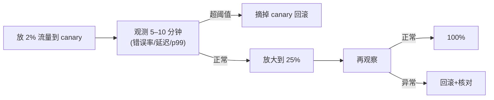

**TL;DR：** 蓝绿 / 金丝雀 / 灰度 / 滚动四类发布，本质是**失败暴露的时机与流量受击面积的取舍**：滚动发布最先出问题也最省资源；金丝雀用 1–5% 流量试错、把"全部下架"推迟到确认之后；蓝绿要两套环境、切换瞬间全量切换；灰度则把用户分成多批。**没有"更安全的发布"，只有"你付得起多贵的错误实验"**。本文把四种策略在"错误成本、回滚延迟、资源成本、一次发布时长"四个维度上的账拉成一张表，并给你决定选型的四问清单。

## 一、四种发布，各自的代价与保护

| 策略 | 错误回流到用户的路径 | 回滚速度 | 资源占用 | 典型失败报警窗口 |
| :--- | :--- | :--- | :--- | :--- |
| 滚动（rolling） | 一批批旧的被新的替换 | 再滚一批回来，批次多 | 一个环境 | 分钟~半小时 |
| 金丝雀（canary） | 先 1–5% 探路，看监控 | 秒级（把金丝雀摘掉） | 需要独立环境/路由 | 立即（低流量） |
| 蓝绿（blue-green） | 绿切换的一瞬间全量过去 | 反向切换秒级 | 双倍资源 | 检查延迟在切换前 |
| 灰度/分批（ramp） | 按用户/地区逐批放大 | 从当前批次回滚 | 产线共用 | 慢速放大期间难察觉 |

核心不同不在"命令"，在**"回滚那一步你付不付得起"**：

- 滚动把旧版本逐个替换掉，回滚要让"补丁号反打一次"，等于再来一轮发布 → 回滚成本 = 一次新发布。
- 金丝雀的回滚成本=**把路由切回正常桶**几秒钟即可（因为旧版本还活着、流量一直在）。
- 蓝绿回滚=切 DNS/路由，但"蓝还没完成校验"期间就没法探测，100% 互相秒切。

## 二、金丝雀怎么"算"出来

金丝雀不是一个"发一个 Pod"的动作，而是一个**判定循环**：



金丝雀的关键是**指标要跟基线对照，而不仅是绝对值**：canary 的错误率 0.3% 看起来很低，可它旁边基线率是 0.05%——6 倍恶化。观测窗口要覆盖"新连接+慢路径+ 定时任务"的一个完整周期，单看 p99 会漏掉 GC 冻结型问题。

把"要不要放大 / 回滚"变成一条具体规则：

```yaml
# 金丝雀判定配置示例
autopilot:
  initial: 1%
  observing:
    duration: 10m
    metrics:
      - name: http_error_rate, threshold: 2x base
      - name: p99_latency,      threshold: 100ms over base
      - name: queue_depth,      threshold: 200
  fail_action: remove_canary
```

**守则**：canary 的观测指标必须已经有基线版数据可以对比；没有基线的 canary 是没有对照实验的胡看。

## 三、蓝绿与它的切换

蓝绿核心：**随时有两套可用环境在持续部署，当前只对绿这套引流**。切换瞬间，路由把 100% 从绿切到蓝——**没有 ramp 过程**。所以蓝绿不流，它靠**先在其上做全量验证**再切。

**蓝绿的账**
- 优势：切换是"改路由"而不是"等新 Pod 就绪"，几秒几百毫秒即可；回滚反向切回即可。
- 劣势：要养两套全部资源 → 成本 x2。很多团队"低成本蓝绿"其实是**滚动+保留旧版本在旁**，这不是蓝绿。

## 四、灰度按用户的坑：身份要"粘"

灰度（ramped）按用户/地域分批放大。它的坑比金丝雀多一个——**分桶必须保证同一用户稳定落在同一批次**，否则两次请求分处新旧版，用户行为既不一致又形成 bug（比如购物车状态在两端），这就是 "会话一致性/粘性"问题，工程难点不在"比例"，在"身份哈希的稳定性"与"状态迁移"。

## 五、选型四问

1. **故障到大流量的最快路径要多快？** 秒级（金丝雀/蓝绿）还是够（滚动）？
2. **换环境成本多少？** 有独立 golden 环境吗 → 金丝雀可做。
3. **用户会话要钉住状态吗？** 用户旅行中间的 session 必须落在新版本 —— 必须粘性灰度，不能蓝绿/滚动换 session。
4. **回滚成本谁最低？** 能吃得起双倍资源吗？不吃就放弃蓝绿。

落地顺序**永远先小后大**（1%→5%→25%→100%），且每次"放大"都是独立观察周期；**不等新周期就跳到全量**，等于把金丝雀做成了摆设。

## 结论
发布策略的账是"这次事故暴露给多少用户 × 回滚要花多少时间"的乘法。滚动付"回滚一轮"买便宜资源；金丝雀把风险压到 1% 流量，在低流量阶段把问题暴露出来；蓝绿用双倍资源换"几秒切回"；灰度用身份粘性换"平滑放量"。**没有银弹，关键是先把错误成本阈值量化出来，再选你支付得起的那个。**

下一步：把每种策略的"可回滚时间 + 资源成本 + 会话约束"填入一张 2×2（或 3×3）表，你会发现最适合你团队的往往不是最新模式，而是**先用金丝雀把频繁小改验证，再用蓝绿兜底大版本**的组合。

## 参考资料
1. "Deployment strategies" —— https://martinfowler.com/bliki/BlueGreenDeployment.html
2. Argo CD / Flagger 的金丝雀设计—— https://flagger.app/
3. Kubernetes Deployment 滚动与 maxSurge/maxUnavailable 参数—— https://kubernetes.io/docs/concepts/workloads/controllers/deployment/
4. Google SRE：基于基线的监控与告警—— https://sre.google/sre-book/monitoring-distributed-systems/

> 延伸阅读：发布是旧的停止与新的开始，老实例的优雅停机时序见[SIGTERM 之后：把优雅停机做成确定性的事](/writing/graceful-shutdown-in-go)；节点被驱逐的场景见[Kubernetes 里优雅下线为什么特别难](/writing/kubernetes-graceful-termination)；回滚瞬间流量翻倍会打穿服务，限流设计见[限流、熔断与降级：高可用三件套的权衡](/writing/rate-limiting-circuit-breaker)。