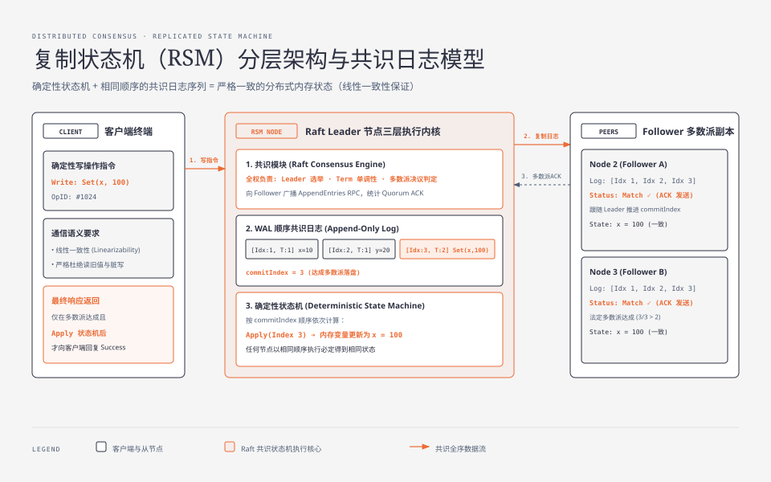
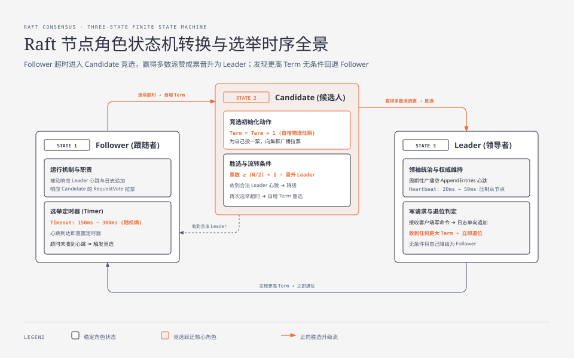
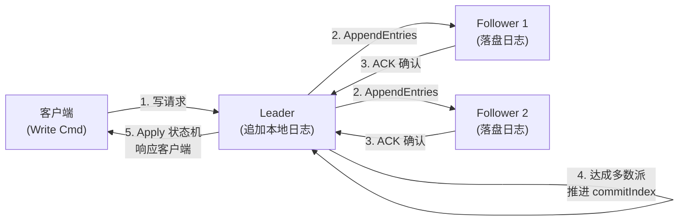

**TL;DR：** Raft 算法的核心工程突破在于**通过强 Leader 模型消除了 Paxos 的多点并发决议冲突**，将状态机复制（SMR）正交拆解为 Leader 选举、日志单向追加与安全性约束三个独立子问题。共识安全性的物理底线是**任期单调递增（Term Monotonicity）与多数派仲裁（Quorum Intersection）**。然而在非对称网络分区下，孤立节点收不到心跳会导致其本地 Term 盲目递增，分区愈合后会以畸高任期打崩正常 Leader；工业级生产实现（如 etcd、TiKV、Sofa-JRaft）必须引入 **Pre-Vote 预投票试探机制**，将投票权判定前置，从物理根源上彻底根绝无谓的选举震荡与脑裂停顿。

---

## 一、 为什么分布式系统需要强共识状态机？

在单机系统中，状态更新的权威性依赖 CPU 时钟中断与内核互斥锁；但在跨物理机、跨机架的分布式网络中，三个不可逆的物理常态使得传统的“主备异步同步”无法保证强一致性：
1. **网络不可靠**：消息可能延迟、乱序、重复或永久丢失（异步不可靠网络模型）；
2. **节点不可靠**：物理机随时可能发生硬件掉电、内核崩溃、长达数秒的 JVM GC 停顿或进程挂起；
3. **时钟不可靠**：各机器晶振频率漂移与 NTP 步进调整，导致无法依赖绝对物理时间戳对并发事件进行因果全序判定。

为了在拜占庭容错之外的崩溃容错模型（Crash Fault Tolerance, CFT）下对外提供**线性一致性（Linearizability）**，学术界提出了复制状态机模型（Replicated State Machine, RSM）：



只要所有分布式节点以**完全相同的顺序执行完全相同的确定性操作日志序列**，各节点状态机计算出的最终内存状态就必定严格一致。而 Raft 的核心职责，就是确保这条由 Leader 驱动的分布式追加日志（Append-only Log）绝对不发生分叉与覆盖。

---

## 二、 Raft 节点三态流转与选举时序

Raft 集群中的每个节点在任意时刻必定处于以下三种角色之一：
- **Follower（跟随者）**：被动接受 Leader 的心跳与日志追加，或接受 Candidate 的拉票请求；若在选举超时时间内未收到心跳，则自动转为 Candidate；
- **Candidate（候选人）**：递增当前任期（Term），为自己投一票，并向集群其他所有节点并行广播 `RequestVote` RPC 请求拉票；
- **Leader（领导者）**：赢得集群严格多数派选票（$\ge \lfloor N/2 \rfloor + 1$）后成为权威领袖，全权负责接收客户端写请求、写入本地日志并单向推送到所有 Follower。



### 2.1 选举分裂（Split Vote）与随机化超时物理熵

如果所有 Follower 在同一时刻超时并同时发起选举，选票将被各个 Candidate 均分，导致没有任何节点能凑齐法定多数派，集群将陷入反复选举的死锁循环。

Raft 巧妙地引入了**随机化选举超时（Randomized Election Timeout）**机制：
- 每个节点的选举超时时间在 $[T_{min}, T_{max}]$ 之间随机抽取（工业生产典型值为 $150\text{ms} \sim 300\text{ms}$）；
- 某个节点会最先超时（例如 160ms 超时，而其他节点为 280ms），从而率先发起拉票并在其他节点超时前收集满多数派选票，成为合法 Leader 并立即广播心跳压制其余节点；
- 物理时间窗口约束公式：

$$\text{broadcastTime} \ll \text{electionTimeout} \ll \text{MTBF (平均故障间隔时间)}$$

其中，心跳广播周期（通常 $10\text{ms} \sim 50\text{ms}$）必须远小于选举超时，以确保 Leader 能在 Follower 触发选举前平稳维持租约心跳。

---

## 三、 日志复制、提交点推进与冲突解决

Raft 的写请求处理严格遵循单向数据流管道：



### 3.1 日志匹配不变式（Log Matching Property）

Raft 依靠两条铁律保证日志的一致性：
1. 如果不同节点的日志条目拥有**相同的索引（Log Index）和相同的任期（Term）**，则它们必定存储了相同的操作命令；
2. 如果不同节点的日志在某个位置拥有相同的 Index 和 Term，则它们**在此位置之前的所有日志条目必定完全一致**。

Leader 在发送 `AppendEntries` RPC 时，会携带当前新日志条目前一个条目的 `(prevLogIndex, prevLogTerm)`：
- Follower 收到请求后，先检查本地是否存在 `(prevLogIndex, prevLogTerm)`；
- 若不存在或任期不匹配，Follower **断然拒绝本次追加**；
- Leader 收到拒绝后，递减该 Follower 的 `nextIndex` 并重新发送，直到找到双方一致的最大历史位点，然后从该位点起强制用 Leader 的日志覆盖 Follower 的冲突日志。

---

## 四、 非对称网络分区脑裂与 Pre-Vote 预投票防御

### 4.1 脑裂与任期盲目膨胀的灾难时序

考虑一个 5 节点的 Raft 集群（Node 1 为 Leader，Term=1）。假设发生**非对称网络分区（Asymmetric Network Partition）**：
- Node 5 由于交换机单向丢包，收不到 Node 1 的心跳，但 Node 5 向外发出的网络包正常；
- Node 5 触发选举超时，本地 `currentTerm` 递增至 2 并发起选举；由于其他节点正常与 Node 1 通信，拒绝给 Node 5 投票；
- Node 5 选举超时再次触发，Term 递增至 3, 4, 5... 在孤立期间，Node 5 的 Term 可能膨胀至 100；
- 当网络分区自愈后，Node 5 带着 `Term=100` 向集群广播 `RequestVote` 请求：


按照经典 Raft 规范：**任何节点一旦收到严格大于自身当前任期的 RPC，必须无条件将自身降级为 Follower 并更新本地 Term**。
此时，正常的 Leader（Term=1）被迫退位，集群陷入无主震荡，所有正在处理的在途读写请求全部阻塞报错！

### 4.2 工业标准解法：Pre-Vote（预投票机制）

为了解决这一痛点，Raft 作者在其博士论文中补充了 **Pre-Vote** 算法：
1. 当节点选举超时时，**不立即递增自身的物理 `currentTerm`**，也不真正转变为 Candidate；
2. 节点进入 **PreCandidate** 阶段，向集群其他节点发送 `PreVote(lastLogIndex, lastLogTerm, nextTerm=currentTerm+1)` 试探包；
3. 其余节点在收到 PreVote 请求时进行严格判定：
   - 如果本节点在最近一个最小选举租约期内**依然持续收到当前合法 Leader 的租约心跳**，则判定当前 Leader 存活，**直接拒绝 PreVote**！
   - 只有当集群多数派节点都认为当前 Leader 已经失联时，才同意 PreVote；
4. 只有当 PreCandidate 收集到了多数派的 PreVote 赞成票，节点才正式递增本地物理 `currentTerm`，正式发起带有任期变更的 `RequestVote`！

<div class="interactive-sandbox" data-sandbox="raft-simulator"></div>

#### Pre-Vote 核心状态机实现（Go 伪代码示例）

```go
package raft

import (
	"sync"
	"time"
)

type Role int

const (
	Follower Role = iota
	PreCandidate
	Candidate
	Leader
)

type RaftNode struct {
	mu           sync.Mutex
	peers        []string
	id           string
	currentTerm  uint64
	votedFor     string
	role         Role
	lastHeartbeat time.Time
	electionTimeout time.Duration
	log          []LogEntry
}

// 选举定时器触发
func (r *RaftNode) handleElectionTimeout() {
	r.mu.Lock()
	if r.role == Leader {
		r.mu.Unlock()
		return
	}

	// 工业解法：先进入 PreCandidate 试探阶段，绝不递增物理 currentTerm
	r.role = PreCandidate
	targetTerm := r.currentTerm + 1
	r.mu.Unlock()

	go r.startPreVote(targetTerm)
}

func (r *RaftNode) startPreVote(targetTerm uint64) {
	var mu sync.Mutex
	votesGranted := 1 // 为自己试探性投一票

	for _, peer := range r.peers {
		if peer == r.id {
			continue
		}
		go func(p string) {
			r.mu.Lock()
			req := PreVoteArgs{
				CandidateID:  r.id,
				NextTerm:     targetTerm,
				LastLogIndex: r.getLastLogIndex(),
				LastLogTerm:  r.getLastLogTerm(),
			}
			r.mu.Unlock()

			var resp PreVoteReply
			if ok := r.sendPreVoteRPC(p, &req, &resp); ok && resp.VoteGranted {
				mu.Lock()
				votesGranted++
				hasMajority := votesGranted > len(r.peers)/2
				mu.Unlock()

				if hasMajority {
					r.mu.Lock()
					if r.role == PreCandidate && r.currentTerm < targetTerm {
						r.role = Candidate
						r.currentTerm = targetTerm // 只有获得多数派许可，才物理递增 Term
						r.votedFor = r.id
						go r.startRealElection()
					}
					r.mu.Unlock()
				}
			}
		}(peer)
	}
}

// 接收方判定 PreVote
func (r *RaftNode) HandlePreVote(req *PreVoteArgs, resp *PreVoteReply) {
	r.mu.Lock()
	defer r.mu.Unlock()

	// 核心安全红线：若仍在正常租约内接收合法 Leader 心跳，坚决拒绝预投票（Leader Stickiness）！
	if time.Since(r.lastHeartbeat) < r.electionTimeout {
		resp.VoteGranted = false
		return
	}

	// 比较日志完整度：Candidate 日志必须至少和接收方一样新（Term 更大，或 Term 相同且 Index 更大）
	lastTerm := r.getLastLogTerm()
	lastIdx := r.getLastLogIndex()
	logOk := req.LastLogTerm > lastTerm || (req.LastLogTerm == lastTerm && req.LastLogIndex >= lastIdx)

	if req.NextTerm > r.currentTerm && logOk {
		resp.VoteGranted = true
	} else {
		resp.VoteGranted = false
	}
}
```

---

## 五、 生产架构总结与核心决策法则

| 维度 | 经典 Raft 规范 | 生产级优化（etcd / TiKV 标准） |
| :--- | :--- | :--- |
| **选举触发** | 超时直接递增 Term 发起投票 | **Pre-Vote 机制**：试探性选举，彻底杜绝网络抖动节点任期通胀 |
| **读性能** | 读请求必须走完整的 Raft 日志复制落盘 | **ReadIndex / LeaseRead**：确认当前 Leader 租约未过期，直接内存读，零磁盘 I/O |
| **成员变更** | 单步变更可能导致旧/新多数派重叠失效 | **Joint Consensus（联合共识）**：过渡期要求新旧配置均满足多数派仲裁 |
| **日志爆炸** | 日志无限追加耗尽磁盘与内存 | **Log Compaction 与 Snapshot 机制**：定期快照截断历史，Follower 落后过大直接全量发送快照 |

共识算法从来不是教科书里死板的几条规则，而是在不可靠的物理硬件与异步网络中，通过**严谨的数学鸽巢重叠与防御性状态机编排**，构筑出绝对坚固的数据一致性壁垒。在下一篇中，我们将深入推导 **Quorum 读写多数派重叠数学原理与 CAP/PACELC 理论的物理边界**。
