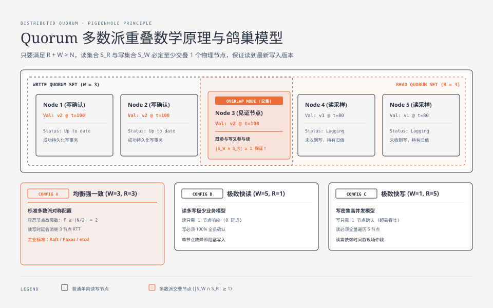
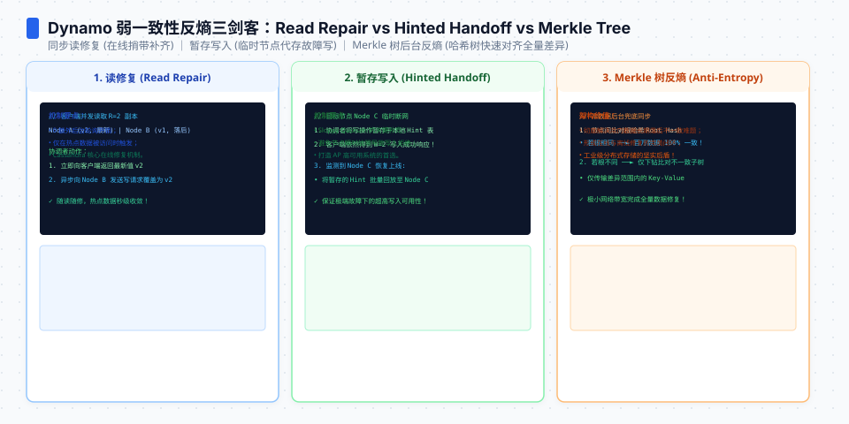
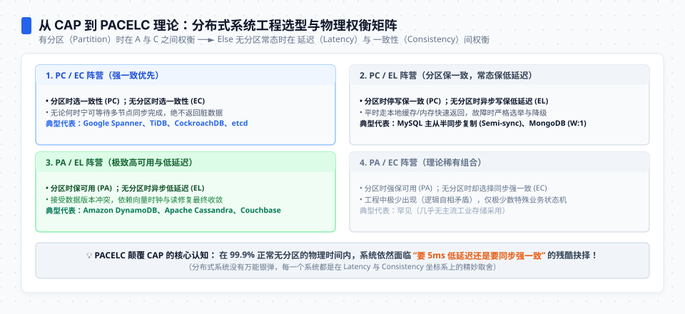

**TL;DR：** Quorum 机制的核心物理本质是**利用鸽巢原理（Pigeonhole Principle）在无中心节点网络中构建确定性的读写交集**：只要满足 $R + W > N$，任何一次合法的读操作所覆盖的节点集合，必定至少包含一个拥有最新写确认的物理节点。当网络遭遇分区或节点宕机导致严格 Quorum 无法凑齐时，系统面临两种抉择：**选择强一致性而拒绝服务（CAP 中的 CP）**，或者**采用宽松多数派（Sloppy Quorum）与暂存写入（Hinted Handoff）将数据落到临时旁路节点以保障极致可用性（AP）**。更具工业指导意义的 **PACELC 理论**进一步点透了现实：在 99.9% 正常无分区的物理时间内，架构师依然必须在**低延迟（Latency）与强一致（Consistency）**之间进行不可回避的工程取舍。

---

## 一、 Quorum 多数派重叠的数学证明与鸽巢原理

在去中心化的无主复制（Leaderless Replication）或去中心化存储系统（如 Amazon DynamoDB、Apache Cassandra）中，没有唯一的 Leader 作为写操作的单点序列化中枢。数据如何确保“读己之所写”？

答案是 **Quorum（法定人数）机制**。



### 1.1 鸽巢原理数学推导

假设分布式集群中存储某个数据分片（Key-Range）的总副本数为 $N$：
- 每次写操作必须等待至少 $W$ 个副本节点确认写入成功，方可向客户端返回成功；
- 每次读操作必须向至少 $R$ 个副本节点发起采样查询，收集多节点版本后比对返回；
- 设写节点集合为 $\mathcal{S}_W \subseteq \mathcal{U}$（其中 $|\mathcal{S}_W| = W$），读节点集合为 $\mathcal{S}_R \subseteq \mathcal{U}$（其中 $|\mathcal{S}_R| = R$），全集大小 $|\mathcal{U}| = N$。

根据集合论容斥原理：

$$|\mathcal{S}_W \cap \mathcal{S}_R| = |\mathcal{S}_W| + |\mathcal{S}_R| - |\mathcal{S}_W \cup \mathcal{S}_R|$$

由于任何子集的并集大小不可能超过全集大小，即 $|\mathcal{S}_W \cup \mathcal{S}_R| \le N$：

$$|\mathcal{S}_W \cap \mathcal{S}_R| \ge W + R - N$$

**只要满足不等式约束：**

$$R + W > N \iff W + R - N \ge 1$$

则必然有：

$$|\mathcal{S}_W \cap \mathcal{S}_R| \ge 1$$

即**写节点集合与读节点集合必定至少存在 1 个交集节点（Overlap Node）**。该交集节点必定见证了前序写操作的成功落盘，因此只要读操作比对版本戳（Timestamp / Version Token），就能准确提取出最新数据！

### 1.2 经典参数配置与性能权衡

| 配置方案 ($N=5$) | 读开销 ($R$) | 写开销 ($W$) | 物理特性与适用场景 |
| :--- | :--- | :--- | :--- |
| **均衡强一致 (W=3, R=3)** | 3 节点 RTT | 3 节点 RTT | **最标准对称配置**。容忍任意 $\le 2$ 个节点宕机，读写开销均衡（如 Raft/Paxos 多数派）。 |
| **极致快读 (W=5, R=1)** | 1 节点 RTT | 5 节点 RTT | **读多写极少**。读只需问任意 1 个节点（极快），但写必须等待全员确认（任何单点故障都会阻塞写）。 |
| **极致快写 (W=1, R=5)** | 5 节点 RTT | 1 节点 RTT | **写密集高吞吐**。写只要 1 个节点响应即成功，但读必须全量遍历 5 个节点并现场仲裁。 |

---




## 二、 读修复（Read Repair）与后台反熵（Anti-Entropy）

即使满足 $R + W > N$，那些在写操作时未收到数据的 $N - W$ 个落后节点（Lagging Replicas）依然持有陈旧数据。分布式系统如何收敛落后节点？

### 2.1 客户端/服务端主动读修复（Read Repair）

当客户端发起 Quorum 读（$R=3$）时：
1. 客户端向 Node 1、Node 2、Node 3 请求数据；
2. 收到返回：Node 1 与 Node 2 返回 `value="v2", timestamp=100`；Node 3 返回 `value="v1", timestamp=80`；
3. 客户端选取时间戳最大的 `v2` 返回给上层应用；
4. **异步触发读修复**：客户端（或负责协调的 Coordinator 节点）向 Node 3 发送异步写入，强制将 Node 3 的陈旧数据修补为 `v2`。

```
Client ──► Coordinator ──┬──► Node 1 (v2 @ t=100) ──┐
                         ├──► Node 2 (v2 @ t=100) ──┼──► 选取 v2 响应客户端
                         └──► Node 3 (v1 @ t=80)  ──┘
                                   │
                           [ 异步发起 Read Repair ]
                                   ▼
                             Node 3 更新为 v2
```

### 2.2 基于 Merkle 树的后台反熵（Anti-Entropy with Merkle Trees）

对于冷数据（长期没有读操作触发读修复），系统在后台通过**默克尔树（Merkle Tree）**进行分片哈希比对：
- 每个节点为自身负责的 Key-Range 构建自底向上的 Merkle 树；
- 节点间定期交换 Merkle 树的根哈希（Root Hash）；
- 若根哈希一致，说明区间内上百万条数据 100% 完全一致，耗时仅需一个哈希比对；
- 若根哈希不一致，则沿二叉树分支向下递归定位，只精准同步发生分叉的叶子节点数据，极大节省跨网卡带宽。

---

## 三、 弱网络容错：Sloppy Quorum 与暂存写入（Hinted Handoff）

在严格 Quorum 体系中，如果数据的主副本节点由于机架交换机故障导致无法连通，即使剩余节点总数依然庞大，只要该 Key 归属的特定 $W$ 个节点凑不齐，写操作就必须报错拒绝。

为了在残酷的公网与跨机房通信中追求 **100% 写入可用性**，Dynamo 提出了 **Sloppy Quorum（宽松多数派）**：

### 3.1 暂存写入执行时序

假设 Key $K$ 的法定主副本为 Node 1、2、3（$N=3, W=2$）：
1. 突发网络分区，Node 1、Node 2 暂时脱网；
2. Coordinator 发现无法连接主节点，**并不向客户端报错**，而是从环上的健康节点中寻找旁路替补节点（如 Node 4、Node 5）；
3. Coordinator 将写请求写入 Node 4 和 Node 5，并在数据头中附加元数据标签（Hint）：
   ```json
   {
     "target_node": "Node 1",
     "payload": "key=order_100, val=paid",
     "timestamp": 1724982300000
   }
   ```
4. 数据在 Node 4、5 上临时持久化，写请求成功返回客户端（保障了写可用性）；
5. **Hinted Handoff 移交**：Node 4、5 在后台持续探测 Node 1 的连通性，一旦 Node 1 分区自愈重新上线，替补节点立即将暂存的数据打包移交还给 Node 1，并从本地删除临时副本。

> **架构权衡警告：** Sloppy Quorum 本质上破坏了 $R + W > N$ 的数学严格重叠。在 Hinted Handoff 完成之前，向 Node 1、2、3 发起的读操作可能根本读不到这笔暂存写入！**它是一种典型的 AP（可用性优先）工程妥协**。

---

## 四、 从 CAP 定理到 PACELC 理论：工程选型全景

经典的 **CAP 定理（Consistency, Availability, Partition Tolerance）**指出：在物理网络必然存在分区（$P$）的前提下，系统只能在一致性（$C$）与可用性（$A$）之间二选一。

然而在工业级系统设计中，CAP 定理显得过于粗糙：
- 分区（$P$）并不是常态，在 99.9% 的时间里，内网光纤网络是健康连通的；
- **CAP 完全没有考虑“无分区常态下”系统的延迟开销（Latency）！**

2012 年，计算机科学家 Daniel Abadi 提出了超越 CAP 的 **PACELC 理论**：



### 4.1 PACELC 决策模型定义

$$\mathbf{If\ Partition\ (P) \implies Choose\ [A\ vs\ C];\quad Else\ (E) \implies Choose\ [L\ vs\ C]}$$

- **P / A**：若发生网络分区，优先保证系统可用性（返回陈旧数据）；
- **P / C**：若发生网络分区，优先保证数据一致性（宁可阻塞或报错拒绝服务）；
- **E / L**：若无网络分区（常态），优先保证**极低时延（Latency）**，采用异步复制；
- **E / C**：若无网络分区（常态），优先保证**强一致性（Consistency）**，采用同步复制等待多节点确认。

### 4.2 工业级存储系统 PACELC 分类矩阵

```
                ┌──────────────────────────────────────────────┐
                │             PACELC 工业系统分类矩阵            │
                ├──────────────────────┬───────────────────────┤
                │   PC / EC (强一致优先) │   PC / EL (延迟优化型) │
                │                      │                       │
                │ • Google Spanner     │ • MySQL Semi-sync     │
                │ • TiDB / CockroachDB │ • MongoDB (w:1 复制)  │
                │ • etcd / ZooKeeper   │ • PostgreSQL 异步流复制│
                ├──────────────────────┼───────────────────────┤
                │   PA / EL (极致高可用) │   PA / EC (极罕见组合) │
                │                      │                       │
                │ • Amazon DynamoDB    │ • 理论稀有             │
                │ • Apache Cassandra   │ • (逻辑矛盾，工业极少)  │
                │ • Couchbase          │                       │
                └──────────────────────┴───────────────────────┘
```

1. **PC / EC（终极强一致）**：Spanner、TiDB、etcd
   - 分区时停写保一致（PC）；常态下走 Raft/Paxos 同步落盘保一致（EC），哪怕多付出 10ms 网络 RTT。
2. **PA / EL（极致吞吐与可用）**：Cassandra、DynamoDB
   - 分区时开启 Sloppy Quorum 保可用（PA）；常态下异步写本地内存即返回，靠后台反熵最终收敛（EL），单次读写 $< 2\text{ms}$。
3. **PC / EL（折中务实派）**：MySQL 半同步复制、MongoDB
   - 分区时停止写入以防主从分叉（PC）；但常态下只要 1 个从库收到 Relay Log 即刻返回，兼顾低延迟（EL）。

---

## 五、 架构师决策检查清单

在设计分布式存储或微服务数据分片时，请回答以下四个物理级问题：

1. **业务是否能容忍“读己之所写”在几百毫秒内不成立？**
   - 若不能（如金融余额、库存防超卖）：必须选择 **PC/EC** 体系，使用严格 Quorum 或 Raft；
   - 若能（如社交点赞、视频播放量、用户评论）：果断选择 **PA/EL**，释放数万倍单机 QPS。
2. **写操作的延迟预算（SLA）是多少？**
   - 若要求 $P99 < 5\text{ms}$：物理上无法跨多个可用区（AZ）执行同步 2PC 往返，必须降级为本地写 + 异步 Outbox 复制。
3. **节点宕机时，你是希望返回 500 报错，还是返回 1 秒前的数据？**
   - 前者为 CP，后者为 AP。在现代 Web 架构中，绝大部分用户体验偏好“降级看到微量旧数据”，胜过直接看到“红色 500 报错页”。

在下一篇中，我们将从单数据分片的 Quorum 跃升至跨数据库的复杂交互，深度解构 **分布式事务的演进：2PC/3PC 阻塞困境、SAGA 编排与本地消息表实战**。
