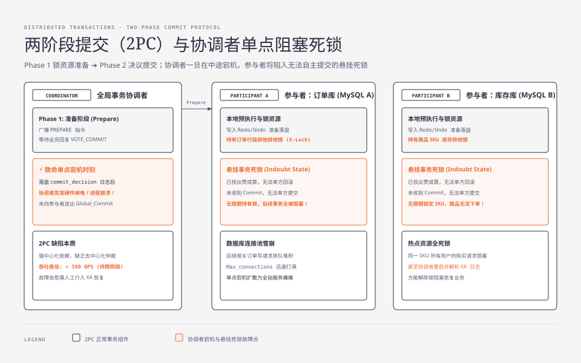
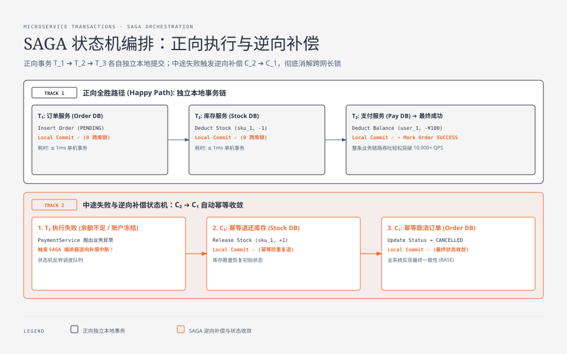
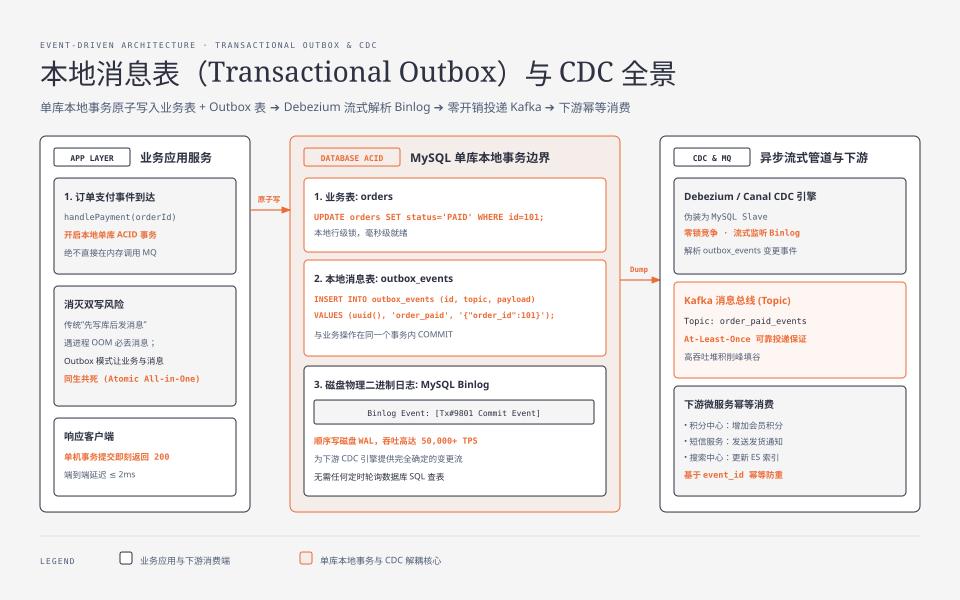

**TL;DR：** 分布式事务的本质是**在不可靠的物理网络与独立自治的数据库之间，模拟单机 ACID 幻觉的工程妥协**。传统的**两阶段提交（2PC）**因持有跨网络锁而导致严重的同步阻塞；一旦协调者在 Commit 阶段前夕崩溃，参与者将陷入无法单方面提交也无法回滚的**悬挂死锁（Indoubt State）**；3PC 试图引入超时机制解决阻塞，却在网络分区时引入了致命的数据脑裂。现代微服务架构已全面转向**BASE 最终一致性**：跨部门复杂长链路采用 **SAGA 状态机编排模式（正向执行 $T_i$ + 幂等逆向补偿 $C_i$）**；单服务跨系统异步解耦则一律采用**本地消息表（Transactional Outbox）+ CDC 引擎（Debezium/Canal）**，用单库本地 ACID 事务将双写风险彻底消解。

---

## 一、 为什么单机 ACID 无法简单扩展到分布式系统？

在单机单库环境中，InnoDB 或 Postgres 依赖内核锁、内存 Buffer Pool 与本地物理 WAL（Write-Ahead Logging）提供完美的 ACID 保证：
- **原子性（A）与持久性（D）**：通过 Redo Log 推进与 Undo Log 回滚实现；
- **隔离性（I）**：通过内存行锁与 MVCC ReadView 实现；
- **物理前提**：所有操作共享同一个 CPU 内存总线与同一个单机 OS 时钟。

而在微服务与分布式数据库中，订单服务（MySQL 库 A）、库存服务（MySQL 库 B）、支付服务（Oracle 库 C）位于完全隔离的物理服务器上：
1. **网络往返（RTT）取代了内存总线**：单机锁开销是纳秒级，跨网络 RPC 锁开销是毫秒级（时延放大 $10^5$ 倍）；
2. **时钟与崩溃域完全解耦**：库 A 成功提交后，库 B 随时可能遭遇硬件掉电或网络单向丢包。

---

## 二、 传统两阶段提交（2PC）与协调者单点阻塞困境

两阶段提交（Two-Phase Commit, 2PC / XA 规范）是试图在分布式环境下实现强一致性 ACID 的经典协议：



### 2.1 2PC 协议执行阶段

1. **准备阶段（Prepare Phase）**：
   - 协调者（Coordinator）向所有参与者（Participants）发送 `Prepare` 请求；
   - 各参与者在本地执行 SQL，写 Redo/Undo Log，**锁定本地数据库行级资源**，但**暂不提交事务**；
   - 参与者向协调者回复 `VOTE_COMMIT`（准备就绪）或 `VOTE_ABORT`。
2. **提交阶段（Commit Phase）**：
   - 若所有参与者均回复 `VOTE_COMMIT`，协调者写本地 Commit 决策日志，并向全员发送 `Global_Commit` 指令；
   - 参与者执行本地提交，释放锁，回复 `ACK`；
   - 若任一参与者回复 ABORT 或超时未响应，协调者向全员发送 `Global_Rollback` 指令回滚。

### 2.2 协调者宕机引发的“悬挂事务死锁”（The Indoubt State）

2PC 的致命弱点在于**强依赖中心化协调者，且参与者缺乏自主决议权**：当协调者在 Commit 阶段前夕崩溃时，参与者将陷入无法单方面提交也无法回滚的**悬挂死锁（Indoubt State）**，长周期霸占数据库行级排他锁导致连接池耗尽。

### 2.3 3PC 为什么没有成为工业救星？

三阶段提交（3PC）将 Commit 阶段拆分为 `CanCommit` $\to$ `PreCommit` $\to$ `DoCommit`，并给参与者引入了超时机制（超时未收到指令则默认提交）。
然而在现实的网络分区中：
- 协调者发出了 Rollback 指令，但由于网络分区，某个孤立参与者超时未收到，**超时后盲目执行了 Commit**；
- 结果导致不同分区节点执行了相反的操作，**引发严重的数据脑裂**。因此主流工业界（如金融、电商）极少使用裸 3PC。

---

## 三、 SAGA 模式：长事务编排与逆向补偿状态机

为了彻底抛弃 2PC 跨网络大事务锁，1987 年由 Hector Garcia-Molina 提出的 **SAGA 模式**成为现代微服务长事务的黄金标准。



### 3.1 SAGA 核心数学模型

一个分布式业务长事务由一系列本地独立事务序列组成：

$$\mathcal{T} = [T_1, T_2, T_3, \dots, T_n]$$

每个正向事务 $T_i$ 都有一个与之严格对应的**逆向补偿事务（Compensating Transaction）$C_i$**：
- **正向全胜（Happy Path）**：依次执行 $T_1 \to T_2 \to \dots \to T_n$，每个服务本地独立提交，**零跨库长锁持有**；
- **中途故障回滚（Rollback Path）**：若在执行 $T_k$ 时发生业务失败（如余额不足），编排器必须以相反顺序依次触发补偿事务：

$$C_{k-1} \to C_{k-2} \to \dots \to C_1$$

### 3.2 SAGA 实现方式：协同式（Choreography）vs 编排式（Orchestration）

1. **协同式（事件驱动）**：无中心大脑，Service A 完成后发 Kafka 消息触发 Service B。缺点是事件拓扑极易演化为“网状混沌调用”，死锁排查极其困难；
2. **编排式（状态机集中编排，工业推荐）**：使用专门的 Saga 协调器（如 Temporal、Cadence、Seata Saga）统一驱动状态机流转。

#### 编排式 SAGA 状态机定义（TypeScript 伪代码示例）

```typescript
// SAGA 事务编排器定义
interface SagaStep<TContext> {
  name: string;
  action: (ctx: TContext) => Promise<void>;      // 正向执行 Ti
  compensate: (ctx: TContext) => Promise<void>;  // 逆向补偿 Ci
}

class CreateOrderSagaOrchestrator {
  private steps: SagaStep<OrderContext>[] = [
    {
      name: "CreateOrder",
      action: async (ctx) => await orderService.createPendingOrder(ctx.orderId),
      compensate: async (ctx) => await orderService.cancelOrder(ctx.orderId), // 幂等取消
    },
    {
      name: "DeductInventory",
      action: async (ctx) => await inventoryService.deductStock(ctx.items),
      compensate: async (ctx) => await inventoryService.releaseStock(ctx.items), // 幂等还库存
    },
    {
      name: "DeductBalance",
      action: async (ctx) => await paymentService.chargeAccount(ctx.userId, ctx.amount),
      compensate: async (ctx) => await paymentService.refundAccount(ctx.userId, ctx.amount), // 幂等退款
    },
  ];

  async execute(ctx: OrderContext): Promise<boolean> {
    const executedSteps: SagaStep<OrderContext>[] = [];

    for (const step of this.steps) {
      try {
        console.log(`Executing Step: ${step.name}`);
        await step.action(ctx);
        executedSteps.push(step); // 记录已成功的步骤
      } catch (err) {
        console.error(`Step ${step.name} failed! Starting compensation...`, err);
        await this.rollback(executedSteps, ctx);
        return false;
      }
    }

    await orderService.markOrderSuccess(ctx.orderId);
    return true;
  }

  private async rollback(executedSteps: SagaStep<OrderContext>[], ctx: OrderContext) {
    // 逆序执行补偿: Cn -> ... -> C1
    for (const step of executedSteps.reverse()) {
      let retries = 3;
      while (retries > 0) {
        try {
          console.log(`Compensating: ${step.name}`);
          await step.compensate(ctx);
          break;
        } catch (compensateErr) {
          retries--;
          if (retries === 0) {
            // 补偿死循环报警，进入人工干预工单池
            console.error(`CRITICAL: Compensation failed for ${step.name}`, compensateErr);
          }
        }
      }
    }
  }
}
```

### 3.3 SAGA 补偿设计的物理红线

1. **补偿不能失败（Compensate Must Succeed）**：补偿逻辑必须设计为幂等且无条件收敛；如果网络超时，编排器会无限重试直到成功，因此补偿逻辑严禁再次校验非必要业务前置条件；
2. **缺乏隔离性（ACID 中的 I 缺失）**：在 $T_1$ 提交到 $T_3$ 失败回滚的物理时间窗口内，其他并发查询可能会读到中间状态（如已扣减的库存又被加了回来，即语义脏读）。必须通过“冻结状态”（`PENDING`）或版本隔离来规避业务混乱。

---

## 四、 本地消息表 + CDC：高并发单向解耦的终极范式

在 90% 的企业级场景中，业务并不需要复杂的双向 SAGA 逆向回滚，而是**“A 系统本地执行成功后，必须 100% 可靠地通知 B 系统执行后续动作”**（例如：订单支付成功 $\to$ 发送扣款短信、更新积分、清空购物车、失效缓存）。

### 4.1 传统应用层双写的致命缺陷

```typescript
// ❌ 错误示范：应用层先后双写
async function handlePaymentSuccess(orderId: string) {
  await db.updateOrderPaid(orderId); // 1. 提交数据库
  await kafka.send("order_paid_topic", { orderId }); // 2. 发送消息
}
```
- 如果第 1 步成功后，应用进程瞬间遭遇 `OOM` 或硬件掉电，第 2 步永远不会执行 ──► **消息丢失**！
- 如果颠倒顺序（先发消息再写库），写库失败时下游已收到消息 ──► **幽灵发货/虚假通知**！

### 4.2 本地消息表（Transactional Outbox）+ CDC 物理链路



利用**单机数据库本身的本地 ACID 事务**，将业务变更与待发消息打包在同一个本地事务内提交：

### 4.3 为什么 CDC 优于轮询（Polling）？

1. **零性能开销**：传统定时器 `SELECT * FROM outbox WHERE status='PENDING' FOR UPDATE` 会持续对数据库造成高频扫描与行锁争用；
2. **高吞吐流水线**：CDC 引擎以异步只读方式伪装成从库（Slave Dump Thread）顺序流式读取磁盘 Binlog，不消耗业务数据库任何 SQL 解析与查询算力，可轻松支撑 10 万级 QPS 的高吞吐投递！

---

## 五、 方案决策对比矩阵

| 维度 | 两阶段提交 (2PC / XA) | SAGA 状态机编排 | 本地消息表 + CDC (Outbox) |
| :--- | :--- | :--- | :--- |
| **一致性强度** | 强一致（ACID） | 最终一致（BASE） | 最终一致（BASE） |
| **锁持有周期** | **极长**（跨网络 RTT 全程持排他锁） | **极短**（各服务仅持有本地事务锁） | **极短**（单库原子提交，无外部锁） |
| **吞吐能力** | 低（$< 500\text{ QPS}$，易雪崩） | 高（数万级 QPS） | **极高**（受限于本地 DB & Kafka） |
| **故障恢复** | 协调者宕机易死锁悬挂 | 状态机自动触发逆向补偿 $C_i$ | CDC 自动位点重试，下游幂等消费 |
| **适用场景** | 遗留系统、单机房跨同构数据库 | 跨部门、多阶段、必须支持逆向回滚的业务流程 | 单向事件广播、通知、缓存/索引同步、异步解耦 |

在下一篇中，我们将深入物理时序的终极难题：**分布式时间与因果一致性：Lamport 逻辑时钟、向量时钟到 Google Spanner TrueTime 的物理不确定性破局**。
