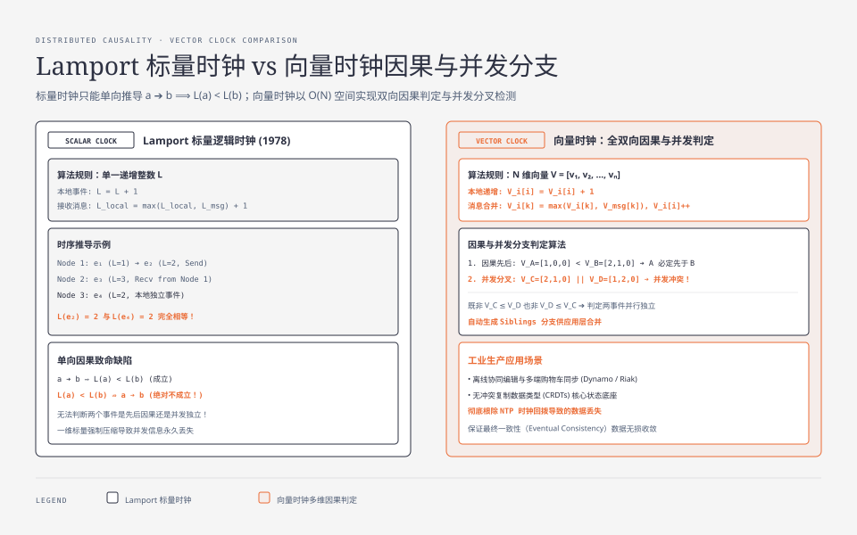
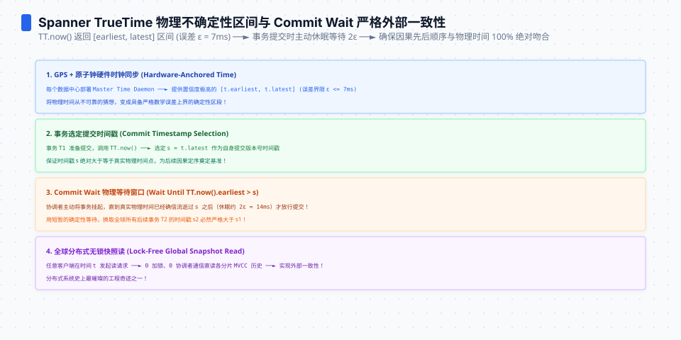
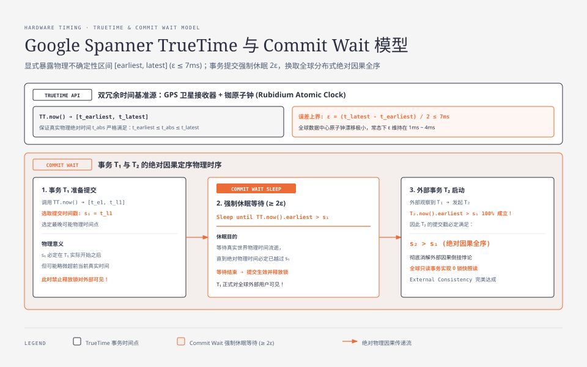

**TL;DR：** 在狭义相对论与经典物理世界中，**分布式系统不存在绝对统一的全局物理时钟**。晶振物理温漂、NTP 步进跳变与不对称网络时延，使得“用机器物理时间戳排序并发事件”成为灾难性的反模式。Leslie Lamport 创立的**逻辑时钟**将时钟从物理测量中解放出来，定义了基于消息因果通信的偏序关系（$a \to b \implies L(a) < L(b)$）；**向量时钟（Vector Clock）**进一步以 $O(N)$ 空间开销实现了双向因果与并发分支检测（$V_A \parallel V_B$）。而 **Google Spanner TrueTime** 则在工程巅峰处给出了第三种答案：通过机房部署硬件原子钟与 GPS 接收器将物理误差严格限定在 $\epsilon \le 7\text{ms}$，在事务提交时强制休眠 $2\epsilon$（Commit Wait），以极其微小的等待代价换来了全球分布式系统的外部一致性（External Consistency / Linearizability）与全球无锁快照读。

---

## 一、 物理时钟在分布式网络中的破产

在单机架构中，CPU 内部的单调递增计数器（如 TSC - Time Stamp Counter）能够提供全局一致的纳秒级指令时间戳。

但在多物理机集群中，由于两大约束，物理时钟彻底破产：
1. **硬件石英晶振的固有漂移（Clock Drift）**：不同服务器主板上的晶振会随温度变化和硬件老化发生漂移，每天可产生数毫秒至数百毫秒的物理误差；
2. **NTP（网络时间协议）同步的不可确定性**：
   - NTP 依赖跨以太网的 UDP 请求往返测算时钟差，但如果去程时延为 5ms、回程时延因网络拥塞变为 45ms（不对称网络），NTP 计算出的偏移量本身就带有数十毫秒的物理误差；
   - **时钟回拨（Step Adjustment）灾难**：当 NTP 检测到本地时钟过快时，可能直接将墙上时钟向后拨慢。如果在 $t=100\text{ms}$ 写入了数据，时钟被拨回 $t=80\text{ms}$，后续写入的数据将获得更小的时间戳，直接导致数据库最后写入胜出（LWW - Last Write Wins）策略**永久丢弃更新（Lost Update）**！

---

## 二、 Lamport 标量逻辑时钟（Happens-Before 偏序）

1978 年，图灵奖得主 Leslie Lamport 发表了里程碑式论文 *《Time, Clocks, and the Ordering of Events in a Distributed System》*，提出：**在分布式系统中，事件的先后顺序不必依赖物理时间，只需关注因果逻辑顺序（Causal Ordering）。**



### 2.1 Happens-Before 偏序关系定义（$\to$）

1. **进程内部**：如果事件 $a$ 和 $b$ 发生在同一个进程内，且 $a$ 发生在 $b$ 之前，则 $a \to b$；
2. **消息收发**：如果事件 $a$ 是某个进程发送消息，事件 $b$ 是另一个进程接收该消息，则 $a \to b$；
3. **传递性**：如果 $a \to b$ 且 $b \to c$，则 $a \to c$；
4. **并发（Concurrent）**：如果既没有 $a \to b$ 也没有 $b \to a$，则记为 $a \parallel b$（两个事件因果独立，无先后之分）。

### 2.2 Lamport 逻辑时钟算法规则

每个节点维护一个单调递增的整数计数器 $L$：
- **规则 1（本地事件）**：节点在执行本地事件前，递增本地计数器：$L = L + 1$；
- **规则 2（发送消息）**：发送消息时，将当前的逻辑时钟值 $L$ 附带在消息包体中；
- **规则 3（接收消息）**：节点收到携带时钟 $L_{msg}$ 的消息时，执行更新：

$$L_{local} = \max(L_{local}, L_{msg}) + 1$$

### 2.3 Lamport 标量时钟的单向缺陷

Lamport 标量时钟满足单向因果蕴含定理：

$$a \to b \implies L(a) < L(b)$$

**但是反向推导绝对不成立！**

$$L(a) < L(b) \;\not\Longrightarrow\; a \to b$$

如果 $L(a) = 2$ 且 $L(b) = 5$，我们**完全无法判断** $a$ 是否发生在 $b$ 之前，因为它们可能完全并发无关（$a \parallel b$）。标量时钟将多维的并发关系强制投影到一个一维数字轴上，丢失了因果独立性信息。

---

## 三、 向量时钟（Vector Clock）：并发冲突精准检测

为了实现反向因果判定，学术界将标量时钟扩展为**向量时钟（Vector Clock）**。

### 3.1 向量时钟算法规则

假设集群有 $N$ 个节点，每个节点维护一个长度为 $N$ 的时钟向量 $V = [v_1, v_2, \dots, v_n]$：
- **本地事件**：节点 $i$ 发生事件时，仅递增自身的分量：$V_i[i] = V_i[i] + 1$；
- **发送消息**：将自身的整个向量 $V_i$ 附加在消息中发送；
- **接收消息**：节点 $i$ 收到携带 $V_{msg}$ 的消息时，对每一个维度取最大值，并递增自身分量：

$$V_i[k] = \max(V_i[k], V_{msg}[k]), \quad \forall k \in [1, N]$$
$$V_i[i] = V_i[i] + 1$$

### 3.2 向量偏序比较与冲突分支判定

对于两个向量时钟 $V_A$ 和 $V_B$：
1. **$V_A \le V_B$**：当且仅当 $\forall k,\; V_A[k] \le V_B[k]$（$V_A$ 的每一个维度都不大于 $V_B$）；
2. **因果严格先后（$V_A < V_B$）**：若 $V_A \le V_B$ 且 $\exists k,\; V_A[k] < V_B[k]$ ──► **确定 $A$ 因果发生在 $B$ 之前**；
3. **并发冲突分支（$V_A \parallel V_B$）**：若既不是 $V_A \le V_B$，也不是 $V_B \le V_A$ ──► **系统发生分叉冲突！**

#### 工业实战案例：分布式购物车并发添加

- 客户端在手机端离线添加商品 A，生成向量 $[1, 0]$；
- 客户端在平板端离线添加商品 B，生成向量 $[0, 1]$；
- 两台设备连网同步到数据库时，检测到 $[1, 0] \parallel [0, 1]$；
- 数据库不执行粗暴的最后写入覆盖，而是保留两个分支版本（Siblings），交由应用层自动合并为一个包含商品 A+B 的向量 $[1, 1]$（Amazon Dynamo / Riak 经典实现）。

<div class="interactive-sandbox" data-sandbox="vector-clock"></div>

---




## 四、 物理不确定性的终极工程破局：Google Spanner TrueTime

无论是 Lamport 还是向量时钟，都只能捕捉“通过消息显式传递的因果”。如果在系统外部，用户先在纽约机房写入了数据，然后打电话通知东京的同事去读取，这种**“外部因果（External Causality）”**无法被网络消息捕获。

为了在全球范围内实现无锁强一致性读写，Google 在 Spanner 论文中提出了颠覆性的 **TrueTime API**。



### 4.1 TrueTime 硬件底盘与 API 定义

Google 在全球每一个 Spanner 数据中心同时部署了两种完全独立、互为冗余的时间基准源：
1. **GPS 卫星接收器**（天线独立布线）；
2. **原子钟（Rubidium Atomic Clocks）**（防止卫星信号漂移或被干扰）。

TrueTime 不返回一个虚假的“绝对时间”，而是显式返回一个**时间不确定性区间（Time Uncertainty Interval）**：

```cpp
// Google TrueTime API
struct TimeInterval {
  Time earliest; // 物理最早可能时间
  Time latest;   // 物理最晚可能时间
};

TimeInterval TT.now(); // 保证真实物理时间 t_absolute 严格位于 [earliest, latest] 之间
```

设当前物理误差上界为 $\epsilon = \frac{\text{latest} - \text{earliest}}{2}$。由于硬件原子钟的高精度校准，Google 将全球机房的 $\epsilon$ 严格压制在 $\epsilon \le 7\text{ms}$ 以内（通常在 $1\text{ms} \sim 4\text{ms}$）。

### 4.2 提交等待（Commit Wait）与外部一致性保证

Spanner 如何用一个带有误差的时间区间，保证“事务 $T_2$ 在物理时间上晚于 $T_1$ 提交，则 $T_2$ 的时间戳必定严格大于 $T_1$”（$s_2 > s_1$）？

Spanner 制定了严格的 **Commit Wait 规则**：

```
[ 事务 T1 准备提交 ]
  │
  ├─ 1. 调用 TT.now()，获取区间 [t_early, t_late]
  ├─ 2. 选取提交时间戳 s1 = t_late (即可能的最大绝对物理时间)
  ├─ 3. [ 强制休眠等待 (Commit Wait) ]：休眠直到 TT.now().earliest > s1 (等待时长至少 2ε)
  │
[ 事务 T1 释放锁并正式对外部可见 ]
  │
  ▼
[ 外部用户观察到 T1 完成，发起事务 T2 ]
  │
  ├─ 4. T2 调用 TT.now()，获取其起始时间区间
  ├─ 5. 由于物理时间已推移，必定有 T2 的起始时间 > s1！
  │
[ 达成物理绝对因果全序：s2 > s1 100% 成立！]
```

### 4.3 为什么 Spanner 能够实现“全球无锁读”？

在传统数据库中，为了保证读一致性，只读事务必须持有读锁（S 锁）以防止与写事务并发冲突；
在 Spanner 中，读请求只需指定一个历史时间戳 $t_{read}$：
- 由于每个写事务都通过 Commit Wait 严格绑定了单调递增的物理时间戳；
- 存储节点通过 MVCC 多版本只读读取数据，**只读事务全程零加锁、零网络协调、零阻塞**，直接以极速本地内存读跑满吞吐！

---

## 五、 分布式时序技术选型对比

| 时序机制 | 核心原理 | 空间与时延开销 | 因果保证能力 | 典型工业代表 |
| :--- | :--- | :--- | :--- | :--- |
| **传统 NTP + LWW** | 本地墙钟时间戳，最后写入胜出 | 零额外开销 | **极差**（时钟回拨直接导致数据永久丢失） | 早期的 Cassandra / MongoDB |
| **Lamport 标量时钟** | 单一递增整数，消息驱动最大值合并 | 极小（单整数 8 字节） | 单向因果偏序（无法识别并发） | 分布式死锁检测、分布式互斥锁 |
| **向量时钟 (Vector Clock)** | 节点数组维护多维分量 | 随节点数线性增长 $O(N)$ | **强**（精准检测因果先后与并发分叉） | DynamoDB、Riak、CRDT 协同编辑 |
| **混合逻辑时钟 (HLC)** | 物理墙钟高位 + 逻辑计数器低位 | 极小（定长 64/128 位） | 贴近物理时间的单调因果偏序 | CockroachDB、MongoDB 4.0+ 事务 |
| **TrueTime (Spanner)** | 硬件原子钟/GPS + 误差区间休眠等待 | 每次提交需休眠 $2\epsilon$ ($\approx 10\text{ms}$) | **全球最强**（线性一致性与外部因果全序） | Google Cloud Spanner |

在下一篇中，我们将进入分布式系统的终极检验场：**混沌工程与一致性检验：Jepsen 故障注入架构与 Knossos 线性一致性黑盒判定**。
