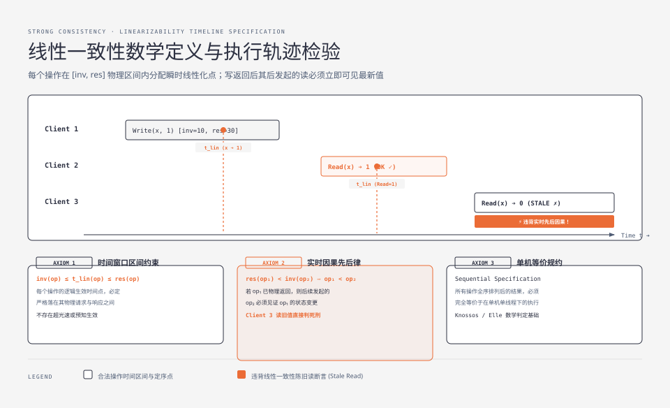
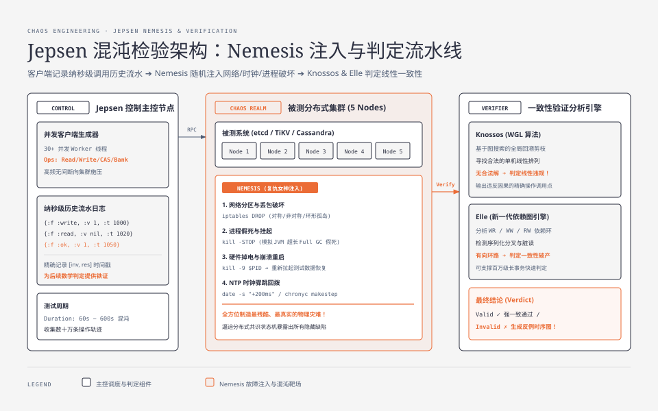

**TL;DR：** 任何分布式存储系统在没有经受真实物理故障的严苛拷打之前，宣称的“强一致性”往往只是实验室幻觉。由 Kyle Kingsbury（Aphyr）创造的 **Jepsen** 框架已成为全球分布式共识检验的事实黄金标准。其核心测试哲学是：**并发客户端持续发起操作并记录纳秒级物理起止历史流水（History Log）**，在测试中由 **Nemesis（复仇女神）** 随机注入残酷的物理破坏（网络对称/非对称分区、节点 SIGSTOP 假死、硬件掉电 kill -9、NTP 时钟骤跳）；测试结束后，通过 **Knossos（WGL 算法）或 Elle 依赖图算法**，在数学上搜索是否存在一种合法的全局线性生效点。只要找到一条因果倒置或写丢失反例，就能以铁证揭穿分布式系统的隐藏缺陷。

---

## 一、 线性一致性（Linearizability）的严格数学定义

在分布式系统规范（Herlihy & Wing 1990）中，**线性一致性（Linearizability / Strong Consistency / Atomic Consistency）** 是最高等级的一致性模型。



### 1.1 物理时间窗口与线性化点（Linearization Point）

每个分布式操作 $op$ 在物理时间轴上都不是瞬时完成的，而是一个包含起始与结束的**时间区间（Time Interval）**：
- **调用时刻（Invocation Time, $\text{inv}(op)$）**：客户端发出 RPC 请求的物理时刻；
- **响应时刻（Response Time, $\text{res}(op)$）**：客户端收到服务端成功或失败回包的物理时刻。

**线性一致性要求：**
1. 系统必须为每一个成功的操作分配一个瞬时的**线性化点（Linearization Point, $t_{lin}(op)$）**，且该点必须严格落在操作的物理调用区间内：

$$\text{inv}(op) \le t_{lin}(op) \le \text{res}(op)$$

2. 所有操作根据其线性化点的物理先后顺序排列出的全序序列 $S$，在语义上**必须完全符合单机单线程顺序规约（Sequential Specification）**；
3. **实时因果性（Real-time Precedence）**：如果操作 $op_1$ 的响应时刻严格早于操作 $op_2$ 的调用时刻（即 $\text{res}(op_1) < \text{inv}(op_2)$），则在全序序列中 $op_1$ 必定排列在 $op_2$ 之前！

```
Client 1: ───[ Invoke Write(x=1) ────── ★ (Linearization Point) ────── Ok ]───►
                                              │
Client 2: ────────────────────────────[ Invoke Read(x) ────── Return 1 ]──────► (合法：在生效点后读到 1)
                                              │
Client 3: ─────────────────────────────────────────────────────────[ Invoke Read(x) ── Return 0 (❌ 违规！)]
```

> **致命违规：** 如上图 Client 3 所示，当写操作已经在物理时间上完全返回之后，任何其后发起的读操作如果读到了旧值 `0`，则**直接判定线性一致性被破坏**（发生了 Stale Read 陈旧读）！

---

## 二、 Jepsen 混沌测试架构模型

Jepsen 是一个用 Clojure 构建的专业分布式黑盒检验框架，其架构分为三个相互协作的独立组件：



### 2.1 架构三要素

1. **Control Node（控制主控节点）**：
   - 调度测试生命周期，配置集群，收集所有客户端的并发执行历史；
2. **DB Cluster Nodes（被测分布式集群）**：
   - 部署在真实物理机、虚拟机或 Docker 容器中的被测存储系统（如 5 节点的 etcd、TiKV、Cassandra）；
3. **Client Worker Threads（并发测试客户端）**：
   - 几十个并发线程对被测集群高频执行生成器（Generator）定义的原子操作：如 `Register`（读写单寄存器）、`Set`（无序集合追加）、`Bank`（跨账户转账余额守恒）；
   - **严格记录完整的历史流水（History Log）**：
     ```clojure
     {:process 1, :type :invoke, :f :write, :value 1, :time 10234000}
     {:process 2, :type :invoke, :f :read,  :value nil, :time 10235000}
     {:process 1, :type :ok,     :f :write, :value 1, :time 10250000}
     {:process 2, :type :ok,     :f :read,  :value 1, :time 10255000}
     ```

---

## 三、 Nemesis（复仇女神）：工业级故障注入矩阵

在客户端高频读写的同时，Jepsen 的核心利刃 **Nemesis** 会在后台按随机策略注入各种恶魔般的物理破坏：

### 3.1 核心故障注入方式

| 故障注入手段 | 物理底层实现命令 | 模拟的真实生产事故 |
| :--- | :--- | :--- |
| **全对称双向分区** | `iptables -A INPUT -s $IP -j DROP` | 机房光纤被挖断，集群被均分为两个对等孤岛 |
| **非对称单向丢包** | `iptables -A INPUT -p tcp -m statistic --mode random --probability 0.5 -j DROP` | 交换机端口单向拥塞、半双工硬件劣化 |
| **环形单向分区 (Bridge)** | 节点 1 只能连 2，2 只能连 3，3 只能连 1 | 复杂路由表错误导致的非传递性分区 |
| **进程假死与挂起** | `kill -STOP $PID`（几秒后 `kill -CONT $PID`） | JVM 超长垃圾回收（Full GC Pause）、OS 内存交换（Swap）挂起 |
| **掉电与硬杀死** | `kill -9 $PID` ──► 重启服务 | 物理服务器电源短路、内核 Kernel Panic 崩溃重启 |
| **时钟骤跳 (Clock Strobe)** | `date -s "+200ms"` 或 `chronyc makestep` | 虚拟机时钟漂移、NTP 异常同步回拨 |

---

## 四、 历史轨迹验证算法：Knossos (WGL) 与 Elle

故障注入结束后，集群可能已经经历了数次 Leader 选举、分区愈合与日志覆盖。如何证明系统在这段混沌时间内**始终保持了线性一致性**？

Jepsen 提供了两大核心判定引擎：

### 4.1 Knossos：WGL (Wing & Gong Linearizability) 算法

Knossos 采用图搜索回溯剪枝算法，穷举验证历史日志：
1. **构建并发区间重叠图**：根据每个操作的 `[inv, res]` 时间区间，确定哪些操作在物理时间上重叠并可能存在因果交错；
2. **深度优先搜索（DFS）线性化序列**：尝试寻找一个线性的全序操作排列，使得每一个操作在单机模型下的执行结果都与历史记录一致；
3. **剪枝与反例输出**：如果搜索树遍历穷尽依然无法找到任何一条满足线性化约束的路径，Knossos 立即报错并生成**违规调用时序图**（直观展示哪一个读操作读到了不可能出现的幽灵数据）。

### 4.2 Elle：基于依赖图环路检测的高性能判定引擎

对于高并发、长历史的复杂事务测试，WGL 算法的搜索树可能面临指数级状态爆炸。Jepsen 新一代判定引擎 **Elle** 采用了**依赖图环路分析（Dependency Graph Cycles）**：
- **WR（写-读依赖）**：事务 $T_1$ 写入 $x$，事务 $T_2$ 读取到该值 ──► $T_1 \xrightarrow{wr} T_2$；
- **WW（写-写依赖）**：事务 $T_1$ 覆盖了事务 $T_2$ 写入的版本 ──► $T_2 \xrightarrow{ww} T_1$；
- **RW（反依赖 / 读-写依赖）**：事务 $T_1$ 读取了旧版本，随后事务 $T_2$ 覆盖了该版本 ──► $T_1 \xrightarrow{rw} T_2$；
- **判定法则：** 如果这三种依赖关系构成的有向图中**出现了有向环路（Cycle）**，则数学上严格证明违背了一致性（例如出现了不可重复读、脏读或序列化分叉）！

---

## 五、 Jepsen 揭露的真实历史 Bug 档案

在 Jepsen 的严格检验下，过去十年中众多知名开源分布式系统被测出了极其隐蔽的数据丢失或脑裂缺陷：

```
                ┌──────────────────────────────────────────────────┐
                │          Jepsen 经典历史缺陷检验证明档案           │
                ├─────────────────┬────────────────────────────────┤
                │ MongoDB (早期)   │ • 网络分区时 w:majority 依然发生丢失写 │
                │                 │ • 原因是副本集主从故障转移位点判定缺陷  │
                ├─────────────────┼────────────────────────────────┤
                │ etcd 0.4 / 2.0  │ • 发现非对称网络分区下的任期通胀脑裂    │
                │                 │ • 直接催生了 Raft Pre-Vote 工业落地    │
                ├─────────────────┼────────────────────────────────┤
                │ Apache Kafka    │ • 脏选举（unclean.leader.election）    │
                │                 │   导致 HW 位点截断，消息丢失           │
                ├─────────────────┼────────────────────────────────┤
                │ Elasticsearch   │ • Zen Discovery 脑裂双主写冲突          │
                │                 │ • 催生 7.x 彻底重写为类似 Raft 的协调器 │
                └─────────────────┴────────────────────────────────┘
```

---

## 六、 专栏大结局与工程全景总结

通过本专栏五篇硬核深度剖析，我们完整打通了分布式共识与高可用容错的底层物理全景：

1. **共识内核（Raft）**：强 Leader 简化模型、任期单调性与 Pre-Vote 防御；
2. **多数派边界（Quorum & PACELC）**：$R+W>N$ 鸽巢原理、Sloppy Quorum 暂存与延时-一致性权衡；
3. **分布式事务（2PC / SAGA / Outbox）**：打破跨网络大事务锁，拥抱 SAGA 逆向补偿与 Outbox+CDC 本地原子双写；
4. **分布式时序（Logical Clocks & TrueTime）**：从 Lamport 偏序、向量时钟并发分支到 Spanner 硬件原子钟 Commit Wait 破局；
5. **终极检验（Jepsen & Linearizability）**：用混沌工程与数学检验器刺破宣传假象，以严谨的数据轨迹验证工程正确性。

分布式系统从没有点石成金的魔法，有的只是在冰冷残酷的硬件故障与不可靠网络之间，**用严密的数学逻辑、清晰的物理边界与防御性架构设计，为人类软件构筑起最值得信赖的数据方舟**。
