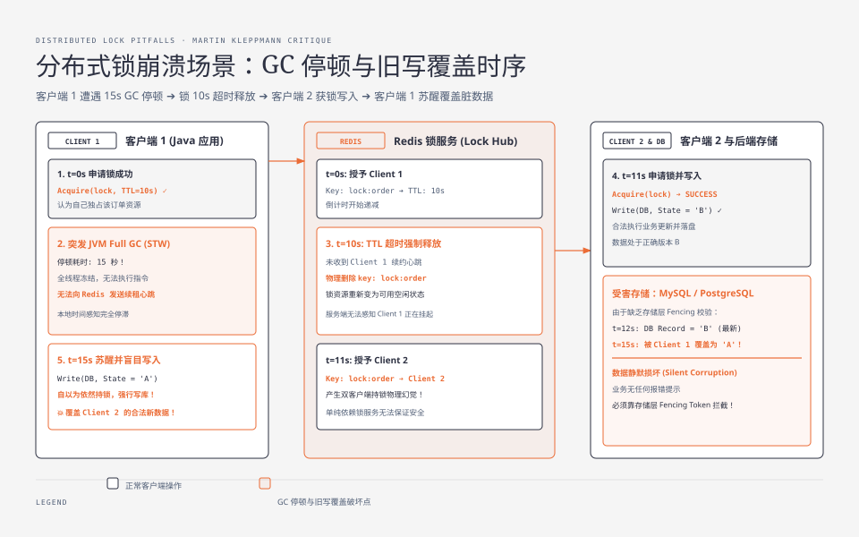
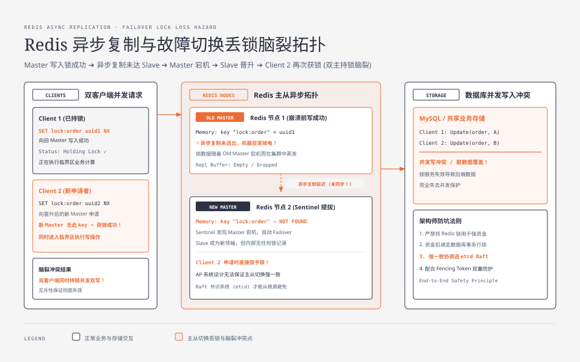
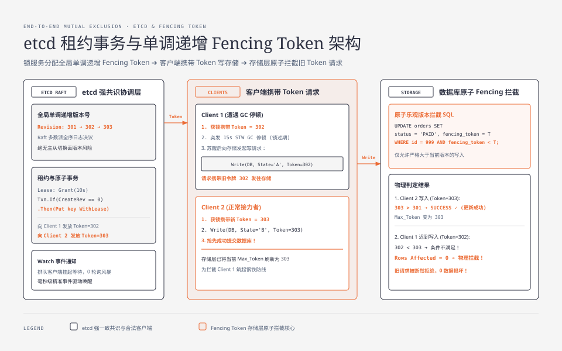

**TL;DR：** 许多工程师误以为给 Redis 加上 `SET lock_key uuid NX EX 10` 或引入 Redlock 算法就能高枕无忧地实现分布式互斥。然而在不可靠异步网络与抢占式操作系统中，**纯粹依赖锁服务本身的“互斥性承诺”在物理上是不可能的**：
1. **三大物理破产诱因**：
   - **STW GC 暂停 / 进程休眠**：客户端拿到锁后发生 15 秒 Stop-the-world GC，期间无法续期，锁在服务端超时释放被他人抢走；苏醒后的客户端不知情地执行并发写入，引发数据静默损坏；
   - **系统物理时钟漂移（Clock Jump）**：NTP 同步突变导致 TTL 瞬间提前到期；
   - **主从异步复制丢失**：Redis Master 写入锁成功后在同步给 Slave 前宕机，Slave 晋升导致双客户端同时持锁（脑裂）；
2. **etcd CP 模型保证**：基于 Raft 强一致共识与全局单调递增版本号（`Revision`），通过租约（Lease）与原子事务（Txn）彻底消除主从脑裂；
3. **终极物理底线（Fencing Token）**：**分布式锁不能单独保证数据安全**，必须由后端存储层（数据库/S3）配合单调递增的 **防护令牌（Fencing Token / 乐观版本号）**，在执行物理写操作时拦截过期旧令牌，才能实现数学级的严格互斥。

---



---

## 一、 世纪大辩论：Martin Kleppmann 对决 Antirez

2016 年，分布式系统权威学者 Martin Kleppmann 发表了著名文章《How to do distributed locking》，对 Redis 作者 Salvatore Sanfilippo（Antirez）提出的 Redlock 算法进行了无情的物理第一性原理批判：

### 1.1 异步系统模型的物理残酷性
在真实的分布式系统中，进程运行于不可靠的物理机器与网络之上：
- **网络不可靠**：数据包可能延迟、重排、重复或无限期丢失；
- **进程调度不可靠**：JVM 的 Stop-the-world（STW）垃圾回收、Linux 缺页中断（Page Fault Swap）、操作系统 CPU 抢占式调度切换，随时可能让应用线程暂停数秒至数十秒；
- **物理时钟不可靠**：物理石英晶体受温度影响漂移，NTP 阶跃修正可能导致本地时间瞬间向前或向后跳跃。

### 1.2 致命时序：GC 停顿引发的双写灾难
如上图所示：
1. **Client 1** 向 Redis 成功申请了租约周期为 10 秒的分布式锁 `lock:order`；
2. **Client 1 瞬间陷入长时间 STW GC 停顿**（耗时 15 秒），在这 15 秒内，Client 1 无法执行任何 CPU 指令，更无法向 Redis 发送心跳续期包；
3. **10 秒后**，Redis 服务端检测到 TTL 超时，**物理删除了该锁记录**；
4. **Client 2** 发起申请，成功获取到了这把已超时的锁，并开始向数据库写入业务状态 `State = B`；
5. **第 15 秒**，Client 1 的 GC 停顿结束苏醒。**在 Client 1 的内存视角里，自己刚刚成功拿到锁，因此它毫无防备地将过期的旧数据 `State = A` 写入数据库，直接覆盖了 Client 2 的新数据！**

这一经典场景证明：**只要客户端与锁服务之间存在时间差与未受控的本地停顿，任何基于 TTL 单调超时的分布式锁都无法保证临界区内的绝对互斥！**

---

## 二、 Redis 主从复制与 Redlock 的现实局限

许多团队试图通过 Redis 哨兵或集群来提升锁的可用性，但这引入了新的致命隐患：

### 2.1 异步复制与故障切换丢锁
Redis 主从同步是**异步（Asynchronous Replication）**的：

此时，Client 1 和 Client 2 同时认为自己持有同一把锁，锁的互斥性被瞬间击穿。

### 2.2 Redlock 算法与时钟漂移陷阱
为了解决单点主从丢锁，Antirez 提出了基于 5 个独立 Redis 节点的 **Redlock 算法**（要求客户端在多数派 $N/2+1$ 节点上成功获取锁）。

但 Martin Kleppmann 指出：**Redlock 极度依赖所有 5 台机器的物理时钟单调性**。如果其中一台机器发生 NTP 时钟跳跃（Clock Jump），导致其上的 key 提前过期被释放，网络分区下的多数派判定就会彻底失效。同时，Redlock 依然无法抵御上述客户端本地 GC STW 停顿导致的旧请求覆盖问题。

---



---

## 三、 CP 模型的确定性解法：etcd 租约与原子事务

相比 AP 属性的 Redis，基于 **Raft 强一致共识算法的 etcd** 提供了真正的 CP 级分布式协调保证：

### 3.1 全局单调递增版本（Revision）
etcd 维护了一个全局递增的 64 位整数 `Revision`。集群内每一次写操作（无论针对哪个 Key）都会使全局 `Revision` 绝对加 1。

### 3.2 租约（Lease）与原子事务（Txn）
在 etcd 中实现分布式锁的标准协议范式：
```go
// 1. 创建一个 10 秒 TTL 的租约
leaseResp, _ := client.Grant(ctx, 10)

// 2. 发起原子事务：仅当 key 的 CreateRevision == 0 (不存在) 时才写入
txn := client.Txn(ctx).
    If(clientv3.Compare(clientv3.CreateRevision("lock/order_999"), "=", 0)).
    Then(clientv3.OpPut("lock/order_999", "client_uuid", clientv3.WithLease(leaseResp.ID))).
    Else(clientv3.OpGet("lock/order_999"))

txnResp, _ := txn.Commit()
if !txnResp.Succeeded {
    // 抢锁失败，监听该 key 的 Delete 事件进行排队等待
}

// 3. 开启后台协程持续 KeepAlive 自动续租
keepAliveChan, _ := client.KeepAlive(ctx, leaseResp.ID)
```

#### etcd 的工程优势：
- **Raft 多数派强一致**：Leader 宕机后新选出的 Leader 必然包含最新的日志条目，绝不会发生主从切换丢锁；
- **Watch 机制消除轮询开销**：未抢到锁的客户端通过 `Watch` 监听事件挂起等待，释放时由服务端精准唤醒，消除 CPU 空转与 Redis 轮询风暴。

---

## 四、 终极防御：存储层 Fencing Token（防护令牌）

即便使用了 etcd，由于客户端 STW GC 暂停依然不可避免，**如何彻底防止苏醒后的旧客户端写入脏数据？**

答案是：**必须引入存储层的单调递增防护令牌（Fencing Token）！**

### 4.1 Fencing Token 的数学原理
1. 客户端在获取分布式锁的同时，锁服务（如 etcd）必须返回当前锁对应的**全局单调递增序列号**（如 etcd 的 `CreateRevision` 或自增序号 $T$）；
2. 客户端向后端存储（MySQL、PostgreSQL、HBase、S3）发起物理写请求时，**必须将 Token $T$ 作为请求参数一同携带**；
3. **存储层（数据库）维护已观察到的最高版本号 $\text{Max\_Token}$**。在执行写入时原子校验：

$$\text{Write Status} = \begin{cases} \text{ALLOW and Update } \text{Max\_Token} \leftarrow T, & \text{if } T > \text{Max\_Token} \\ \text{REJECT (拒绝旧请求并报错)}, & \text{if } T \le \text{Max\_Token} \end{cases}$$

### 4.2 数据库 SQL 落地示例
在 MySQL / PostgreSQL 中，利用单条原子 SQL 即可完成 Fencing 拦截：

```sql
-- 表结构中包含 fencing_token 字段
UPDATE orders 
SET status = 'PAID', fencing_token = 302, updated_at = NOW()
WHERE order_id = 999 AND fencing_token < 302;
```

如果受影响行数（`Rows Affected`）为 0，说明此前已经有更高版本（如 Token 303）的请求执行完毕，当前苏醒的陈旧请求被数据库底层物理拦截，成功捍卫了数据一致性！

---

## 五、 工业级分布式锁选型决策指南

根据业务对**吞吐性能 vs 数据一致性**的不同严苛程度，工程选型应当遵循以下决策树：

| 业务场景 | 一致性要求 | 推荐方案 | 核心权衡与落地要点 |
| :--- | :--- | :--- | :--- |
| **低成本防重 / 幂等拦截** | 允许极低概率重复（非致命） | **Redis + Lua + Redisson 看门狗** | • 吞吐极高（10w+ QPS），微秒级响应<br/>• 适用于定时任务防重触发、短信防刷、缓存击穿重建 |
| **核心业务资产 / 状态机变更** | 绝对不允许并发双写损坏 | **etcd / ZooKeeper + Fencing Token** | • CP 强一致共识，毫秒级响应<br/>• 适用于分布式任务调度选主、元数据配置变更 |
| **强资金 / 账户余额扣减** | 零容忍并发冲突 | **数据库行级排他锁 (`SELECT FOR UPDATE`)** | • 放弃跨系统分布式锁，直接下沉至单数据库引擎行锁/乐观锁<br/>• 事务隔离性最强，开发与维护心智负担最低 |

---

## 六、 总结

分布式锁的本质不是为了追求所谓“完美的锁服务”，而是**在不可靠的物理网络与进程调度约束下，构建端到端的防错体系**：
- 认清单纯依赖 TTL 超时的局限性，警惕 STW GC 与主从切换丢锁风险；
- 在需要强一致协调时选择 etcd 等 CP 系统；
- 在涉及持久化数据修改的最后一道防线上，**必须由存储层通过 Fencing Token 乐观版本号守住底线**。
