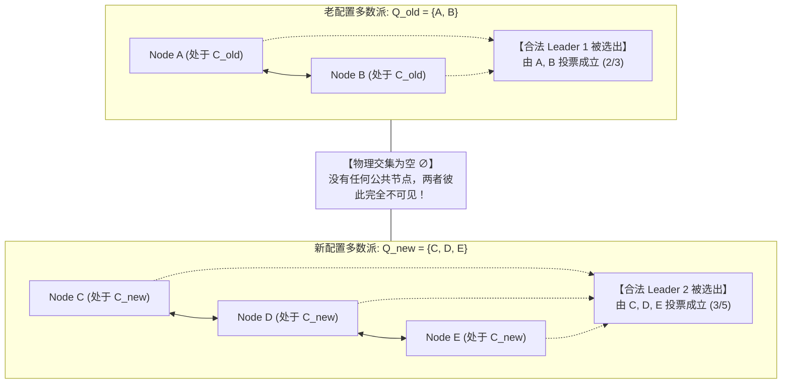
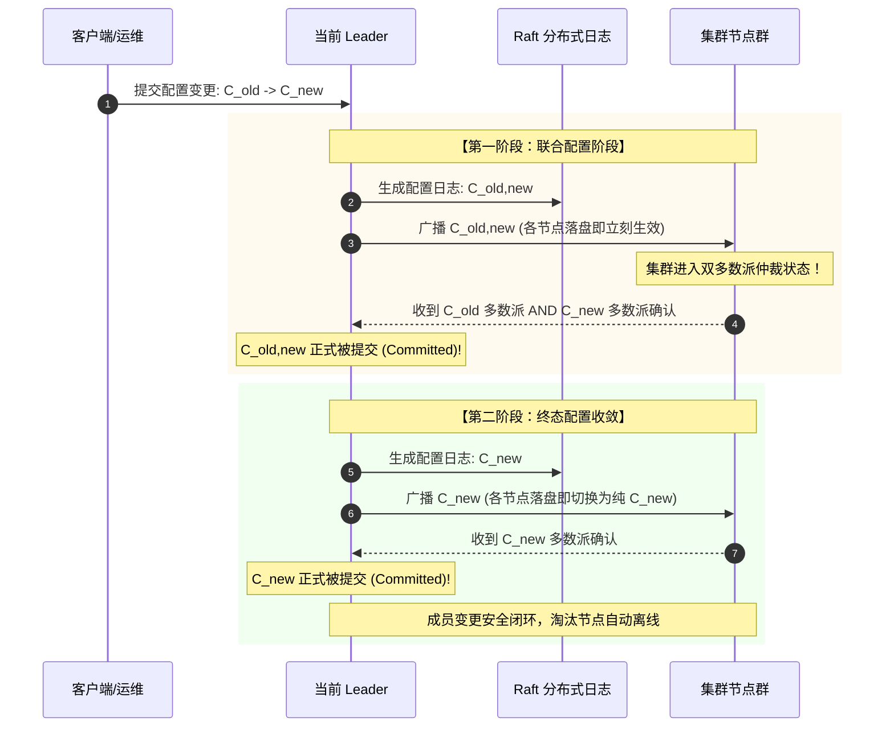

**TL;DR：** 在分布式共识系统的全生命周期中，最容易诱发全网灾难的操作不是节点崩溃，而是**在线动态扩缩容（Membership Change）**。很多初学者误以为 Leader 只要发一条“配置从 3 节点变更为 5 节点”的日志并让大家各自应用即可。然而，由于网络异步性与日志推进时间差，这种直接切换（Direct Switch）会导致一个致命的数学断层：**系统在某一时刻会同时存在两个完全无交集的独立多数派（Disjoint Majorities）！** 例如老集群 $\{A, B, C\}$ 的多数派为 $\{A, B\}$，而新集群 $\{A, B, C, D, E\}$ 的多数派为 $\{C, D, E\}$。在切换窗口内，$\{A, B\}$ 可以独立选出一个合法的 Leader 1，$\{C, D, E\}$ 可以同时选出另一个合法的 Leader 2，**双主脑裂发生，数据被彻底撕裂分叉！** 为了保证变更期间的共识不变量，Diego Ongaro 提出了两套解法：Raft 论文 §6 的**联合一致性（Joint Consensus，要求决策必须同时通过老多数派 AND 新多数派的双重盖章）**；以及工业界更常用的**单节点单步变更（Single-Server Changes）**。本文基于鸽巢原理严密推导多数派交集性，揭示单节点变更中的“流水线发射（Pipelining Hazard）”死穴，以及 Leader 移除自身时的下台退位协议。

---

## 一、 致命的直觉：直接切换为何必然导致双主脑裂？

假设我们有一个运行平稳的 3 节点 Raft 集群，配置为 $C_{\text{old}} = \{A, B, C\}$。为了提升容灾能力，运维发起指令扩容为 5 节点：$C_{\text{new}} = \{A, B, C, D, E\}$。

如果采用没有阶段过渡的朴素直接切换：
1. Leader 广播包含 $C_{\text{new}}$ 的配置变更日志；
2. 节点在将配置写入本地日志后**立刻使新配置生效**（Raft 的硬性规则：配置日志无需等待 Commit，一落盘必须立即应用）；
3. **网络发生微小分区或延迟**：节点 A 与 B 因为网络拥塞，尚未收到该条日志，其本地生效的配置依然是 $C_{\text{old}}$；
4. 节点 C、D、E 较快收到日志，其本地生效的配置已经更新为 $C_{\text{new}}$。

```text
灾难时刻的法定多数派集合：
  在 C_old (3 节点) 视角下：法定多数派为 2 节点
    → 节点 A 和 B 构成一个合法多数派: Q_old = {A, B}
    
  在 C_new (5 节点) 视角下：法定多数派为 3 节点
    → 节点 C、D 和 E 构成一个合法多数派: Q_new = {C, D, E}
    
  核心物理断层：
    Q_old ∩ Q_new = {A, B} ∩ {C, D, E} = ∅ (交集为空！)
```



此时：
- 节点 A 和 B 可以完全合法地在 Term 1 选出 Leader 1，并独立向其追加日志；
- 节点 C、D、E 可以完全合法地在 Term 2 选出 Leader 2，并独立向其追加不同业务的日志；
- **系统发生了最高级别的灾难：双主脑裂（Split-Brain）！** 数据的线性一致性瞬间灰飞烟灭。

该反例已经在 `experiments/raft-membership/sim.py` 中经过代码严格复现证明。

---

## 二、 方案一：联合一致性（Joint Consensus）的两阶段状态机

为了允许任意数量的节点一次性平滑增删，Raft 论文 §6 提出了**联合一致性（Joint Consensus）**。它的设计灵魂是引入一个中间过渡配置：**$C_{\text{old,new}}$**。

### 2.1 联合一致性的仲裁合同（Quorum Rule）

当集群处于 $C_{\text{old,new}}$ 状态时，**任何决策（无论是 Leader 选举还是日志提交 Commit）必须同时满足两个独立条件**：
1. 必须获得 $C_{\text{old}}$ 的严格多数派同意；
2. **AND** 必须同时获得 $C_{\text{new}}$ 的严格多数派同意！

根据鸽巢原理（Pigeonhole Principle）：
- 任意两个获得 $C_{\text{old}}$ 多数派同意的子集，在 $C_{\text{old}}$ 内部必有交集；
- 任意两个获得 $C_{\text{new}}$ 多数派同意的子集，在 $C_{\text{new}}$ 内部必有交集；
- **因此，任意两个联合多数派决议，其交集绝对不为空（$Q_1 \cap Q_2 \ne \emptyset$）！** 彻底消灭了双主选举的物理空间。

### 2.2 两阶段状态机流转时序



### 2.3 崩溃故障分析：如果在中间挂了怎么办？

1. **在 $C_{\text{old,new}}$ 提交前 Leader 崩溃**：
   新 Leader 可能基于 $C_{\text{old}}$ 选出，也可能基于 $C_{\text{old,new}}$ 选出。无论谁当选，都不会有 $C_{\text{new}}$ 独立做主，系统是安全的；未被提交的 $C_{\text{old,new}}$ 可以被后续覆盖回退。
2. **在 $C_{\text{old,new}}$ 提交后 Leader 崩溃**：
   此时只有拥有 $C_{\text{old,new}}$ 日志的节点才可能赢得选举（因为它拥有最新的已提交条目）。新 Leader 当选后会继续完成第二阶段，推进发出并提交 $C_{\text{new}}$。

---

## 三、 方案二：工业界的主流——单节点变更（Single-Server Changes）

虽然联合一致性非常强大，但其两阶段逻辑非常复杂，在生产工程中调试困难。Diego Ongaro 在其博士论文中进一步提出了简化版：**单节点增删（Single-Server Changes）**。这也是 etcd、HashiCorp Raft、TiKV 底层所广泛采用的标准实现。

### 3.1 为什么一次只改 1 个节点是绝对安全的？

数学定理证明：**如果两个配置集合的大小差值恰好为 1（$|C_1 \Delta C_2| \le 1$），则 $C_1$ 的任意多数派与 $C_2$ 的任意多数派必定存在非空交集！**

#### 证明验证：
- 设老集群为奇数节点 $2N+1$（如 3 节点，多数派为 2）；
- 增加 1 个新节点后变为偶数节点 $2N+2$（如 4 节点，多数派为 3）；
- 假设存在互斥的两个多数派 $Q_1 \in C_1$ 和 $Q_2 \in C_2$ 使得 $Q_1 \cap Q_2 = \emptyset$；
- 则节点总数至少需要：
  $$|Q_1| + |Q_2| \ge (N+1) + (N+2) = 2N+3$$
  然而此时系统在 $C_2$ 下的总节点数仅仅只有 $2N+2$！**鸽巢放不下，产生不可调和的矛盾**！
- 因此，只要每次严格只增删 1 个节点，直接切换也不会出现无交集多数派。

### 3.2 致命陷阱：流水线发射（Pipelining Hazard）

虽然单节点变更形式简单，但它包含一条绝对不能触碰的高压线：**在前一个成员变更日志被真正 Commit 之前，严禁发射下一个成员变更！**

```text
致命错误操作：
  运维想要从 3 节点扩容到 5 节点 (加入 D 和 E)
  Leader 接收请求，在同一个批次内连续生成两条日志：
    Entry 100: Add Node D
    Entry 101: Add Node E  <-- 致命！Entry 100 尚未 Commit 就发出了 101！
```

**后果**：
此时集群相当于直接跨过了单节点约束，在物理上直接变成了从 3 节点到 5 节点的跃迁，**上一节推导的无交集多数派断层瞬间死灰复燃**！
因此，生产引擎中必须在状态机中维护一个原子标志：`is_membership_changing`。只要本地存在未提交的配置变更条目，一切新的变更提议必须被强行阻塞排队。

---

## 四、 边缘极端工况：当 Leader 把自己踢出集群时

成员变更中最具哲学色彩的问题是：**缩容时，Leader 恰好属于被移除的那个节点，它该怎么退位？**

这是一个极其凶险的边界时序：
1. **不能立刻关机**：如果 Leader 在接收到“剔除自己”的指令后立刻自杀，包含“剔除配置”的这条日志还没有被复制到其他节点，谁来推动这条日志的 Commit？
2. **正确退位协议**：
   - Leader 正常生成剔除自己的配置日志（如从 5 节点变为 4 节点），并将其同步给 Follower；
   - 在这条配置日志被真正提交（Committed）之前，**Leader 必须强忍着继续工作，负责协调这最后一次提交**（尽管在它的逻辑配置里，它已经不属于未来的集群）；
   - 一旦该日志被多数派确认并 Commit，Leader **主动执行退位（Step Down），将自己降级为普通的无状态进程并安全关机**；
   - 剩余的 4 个节点随后自然发起新一轮选举，产生真正属于新配置的新 Leader。

---

## 五、 本地确定性实验：断层复现与联合鸽巢验证

本工程在 `experiments/raft-membership/sim.py` 中编写了一套形式化验证脚本，复现了直接切换下的无交集多数派、证明了联合一致性的全量非空交集，以及单节点变更与流水线失效的临界边界。

### 5.1 执行复现命令

```bash
python3 experiments/raft-membership/sim.py
```

### 5.2 核心输出证据

```text
PASS 直接切换时存在互相隔离的无交集多数派 | Q_old={'A', 'B'}, Q_new={'E', 'C', 'D'}, 交集=set()
PASS 系统在无交集多数派下必然发生双主脑裂
PASS 联合多数派数量非零 | 共 13 组
PASS 任意两个联合一致性多数派必定存在非空交集 (零脑裂保证)
PASS 单节点变更保证任意相邻配置多数派必有交集
PASS 未提交即流水线发起下一次变更将重新引发无交集断层
============================================================
ALL CHECKS PASSED: True (Total checks: 6)
============================================================
```

### 5.3 证据边界声明
- **本实验证明**：从离散集合论与多数派相交定理出发，证明了直接切换在物理上存在产生双主脑裂的必然漏洞；证明了 Joint Consensus 与非流水线单节点变更在数学上的完备安全性。
- **本实验不证明**：在拜占庭将军模型（节点存在伪造消息或恶意篡改）下的共识正确性；Raft 仅在非拜占庭故障容错（CFT）模型下成立。

---

## 六、 总结：资深工程师的集群变更军规

1. **绝对禁止在线批量增删节点**：一次性给集群添加 2 个以上的节点，必须强制拆解为多次单节点操作（或者采用完备的 Joint Consensus 引擎）；
2. **每次变更后必须等待健康指标对齐**：使用 `etcdctl member add` 后，必须等待新节点加入成功、数据追平并且该配置条目完全 Commit 后，才能执行下一次变更；
3. **空节点预热机制（Learner / Non-voting Member）**：新加入的节点不要立刻赋予投票权！先以只拉取日志、不参与多数派仲裁的 **Learner** 角色运行。待其追平了几个 GB 的历史快照日志后，再通过单步变更晋升为 Voting Member，防止因新节点追数据拉垮集群的法定人数。

---

## 参考资料与论文依据

1. **Diego Ongaro & John Ousterhout: "In Search of an Understandable Consensus Algorithm" (USENIX ATC '14)** - Raft 原始论文 §6 联合一致性形式化推导。
2. **Diego Ongaro: "Consensus: Bridging Theory to Practice" (Stanford PhD Dissertation)** - 详细阐述单节点变更（Single-Server Changes）的正确性证明与流水线陷阱。
3. **etcd Raft Implementation (`go.etcd.io/raft`)** - 深入查看 `ConfChange` 与 `Joint` 模式在工业级生产代码中的状态机落地。
