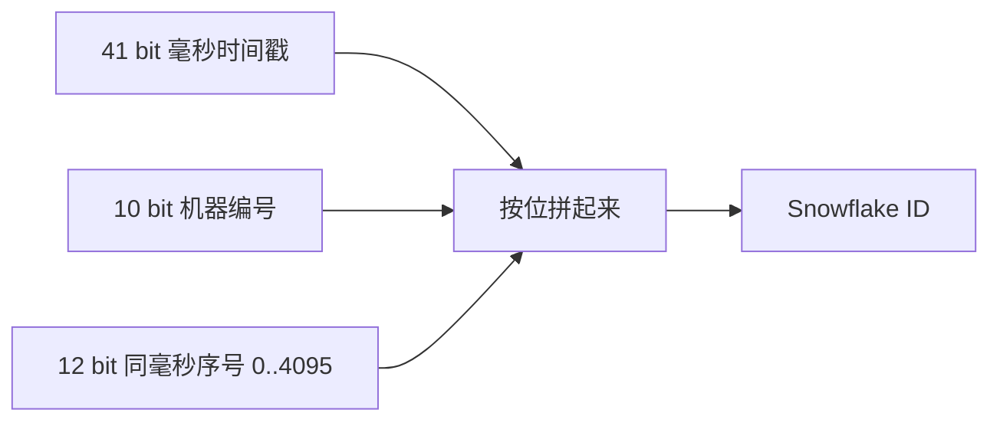
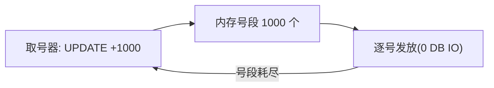

**TL;DR：** 分布式 ID 的三类主流方案各有各的舍弃：**雪花（Snowflake）**不依赖外部服务、天然按时间有序、并发吞吐高——代价是**时钟回拨可能撞号**，且 ID 空间被机器位限死；**号段（Database Segment）**靠一次数据库预算一批号、客户端在内存里消耗——代价是引入**取号单点（DB）**和**号段空洞**；**UUIDv4** 无中心、纯随机——代价是**完全无序**，随机键把索引的追加写变成页分裂。选型本质是"有序性 / 中心化 / 时钟容错"三选一。

## 一、先想清楚账本的三条边

设计 ID 前先回答三个问题：有没有中心节点可用？ID 需要随创建时间有序吗？容忍 ID 空洞吗？

| 方案 | 能否排序 | 需中心节点 | 撞号风险 | 写放大 / IO | 典型场景 |
| :--- | :--- | :--- | :--- | :--- | :--- |
| 自增 ID（单库） | 严格有序 | 数据库本身 | 无 | 每次一行 | 单库、小数据量 |
| 雪花 ID | 按时间大致有序 | 无（每节点自治） | 时钟回拨会撞 | 无中心写，只有 CPU | 无中心、要全局序 |
| 号段（Segment） | 按批有序（批内连续） | DB 一个取号器 | 无 | 每批一次取号写 | 高并发写 |
| UUIDv4 | 无序 | 无 | 无 | 随机写放大明显 | 无单点需求 |

**每个方案都要丢一样东西**，你只能选择丢得最少的一个。

## 二、雪花：把"时间+机器+序号"编成一串二进制

经典 Snowflake 的 64 位 ID = 1 bit 符号 + 41 bit 毫秒时间戳（约 69 年）+ 10 bit 机器 + 12 bit 序号：



**吞吐账**：单机每毫秒最多 4096 个 ID（12 bit 序号），即约每秒 400 万个——绝大多数业务远够用。ID 随时间单调变大，正好是 B+Tree 喜欢的"尾部追加写"，这就是[LSM 与 B+Tree 的 IO 战争](/writing/lsm-vs-btree-io-amplification)里讲的顺序写最优。

**代价账**：

- **时钟回拨**：机器校时往前跳会重复发号。工业上的应对只有两类：请求时"等回拨窗口过去"，或"给时间戳预留补偿位"。**既无延迟又从不断号的方案不存在**。
- **位数受限**：机器位用完后扩机器要改位数，等于改协议。
- **依赖时钟同步**：多机时间戳有偏差时，ID 序与真实发生顺序会有轻微错位。

## 三、号段：把 IO 换成内存

号段法把"取一个号写一次 DB"改成"取号一次拿一千个"：

```sql
-- 一次取一段：先把指针往后挪 1000,返回旧区间
UPDATE id_slots SET next_value = next_value + 1000 WHERE name='orders';
-- 拿到旧 next_value .. next_value+999 这 1000 个号
```

客户端拿这 1000 个号在内存里逐个发（本地发一个 = 0 次 DB IO），用尽再取下一段。



**关键数字**（一次发 100 万 ID）：

- 每次取一个号（自增）：约 100 万次对 DB 的行锁更新；
- 每段取 1000（号段法）：约 1000 次对 DB 的更新——**DB 压力差 1000 倍**。

**代价**：取出未用完就重启会产生号段空洞；多实例并发取号要以"段键"隔离各自区间，DB 这一端仍是唯一写热点。

## 四、分库分表场景的实际选择

订单表要分 8 库 × 4 表。三种方案各看一遍：

1. **自增 ID**：跨库没有全局唯一，等于被迫上号段/雪花。
2. **雪花**：每个库用自己的机器位段，**全局唯一且近似有序**，不需要外部取号服务；单机约 400 万/秒，够用。
3. **UUIDv4**：完全随机，插入命中随机叶子页 → **B+Tree 页分裂频繁**，从"尾部追加"退化成"写到哪算哪"——对 B+Tree 是最不友好的键。

**结论倾向**：80% 的场景"雪花 + 时间有序"就够了；只有当你还要"按 ID 分片并保证分片均衡"时，才用哈希分片去放弃有序性。

## 五、时钟回拨的"剩余解"

没有任何方法能保证时钟永不回拨。诚实答案是把它当故障处理：

- **回拨很小**：等一小段时间（sleep 到本地时间追过旧时间戳）再发号——把"有序"换成"延迟"；
- **回拨超阈值**：断开取号（对外报错，绝不发出疑似撞号的 ID）；
- 成熟方案（美团 Leaf）实际是"号段为主 + 雪花兜底"的混合，用两套机理互相兜底。

## 六、结论

雪花一次给齐"有序 + 无中心 + 高吞吐"，只要时钟别乱跳；号段把 DB IO 降低几个数量级，代价是一个取号单点和号段空洞；UUID 最自由，却把索引做成随机写。**ID 选型永远是三选一：有序性 / 中心化 / 时钟容错。**

下一步：先把"每秒写并发"和"是否容忍空洞"两个量级定下来，再看一眼 `INSERT` 后主键是不是尾部追加写，选型答案就出来了。

## 参考资料
1. Twitter Engineering：Announcing Snowflake—— https://blog.twitter.com/engineering/en_us/a/2010/announcing-snowflake
2. 美团技术：分布式 ID 生成方案总结（Leaf）—— https://tech.meituan.com/2017/04/21/mt-leaf.html
3. MySQL 官方：InnoDB 索引结构—— https://dev.mysql.com/doc/refman/8.0/en/innodb-index-types.html
4. MySQL 官方：UUID 函数与索引随机性—— https://dev.mysql.com/doc/refman/8.0/en/miscellaneous-functions.html

> 延伸阅读：随机键让 B+Tree 页分裂的账见[LSM 与 B+Tree 的 IO 战争](/writing/lsm-vs-btree-io-amplification)；雪花对时钟的依赖正是[时钟回拨与分布式顺序幻觉](/writing/clock-skew-distributed-systems)切入的那根细线；ID 有序追加后读路径的权衡见[主从复制延迟的三种读路径](/writing/replication-lag-read-paths)。