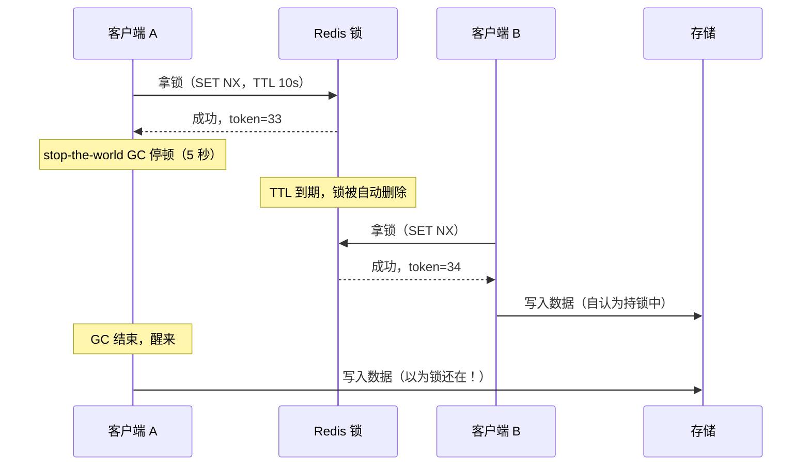
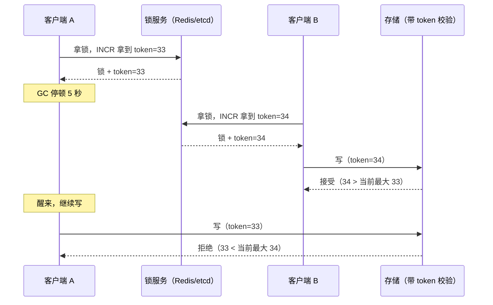

**TL;DR：** 分布式锁最常见的坑是拿"我拿到了锁"当"我可以安全写数据"。实际上**锁只给你一段租约（lease），唯一能挡住越界的是单调递增的 fencing token + 目标存储层的校验**。单节点 `SET NX` + 过期是最实用的效率锁；Redlock 用多数派节点试图抗单点故障，但 Kleppmann 在 2016 年用 GC 停顿反例证明它**既不安全（for correctness）也不简单（for efficiency）**，antirez 同年反驳，争议至今；业界收敛的共识是"正确性来自存储层校验，而不是锁的拓扑"。本文用语义承诺表 + 决策表把账算清：需求是**效率型**（防重复）还是**正确性型**（防竞态写坏数据）——前者 Redis 足够，后者请用共识系统并全程携带 token。

## 一、先拆掉一个幻觉：拿到锁不等于互斥

大多数人对分布式锁的直觉来自单机 `mutex`：我拿到了，别人就没有。但在分布式系统里，"拿到"是一个**不可靠的信号**——因为线程可能突然停住，然后在锁过期之后才醒过来。

Kleppmann 在 2016 年的博客里给了那个经典反例，场景是这样：

GC 停顿可以发生在任何时刻，包括最不能发生的时刻——停顿与持锁之间没有任何原子性。**TTL 只能保护持锁方自己，保护不了持锁方睡过头**：A 醒来时锁早就没了，但它不知道，于是 A 和 B 同时在"持锁状态"写同一份数据。

这个反例带出本文的核心命题：**分布式锁不是一把互斥锁，而是一张租约（lease）**。租约 = "在 TTL 到期前，只有我写"；但持有方自己不守时。要真正把住互斥，需要租约之外的另一道护栏——fencing token，第五节讲。

## 二、四张牌各自卖什么：语义承诺对比

| 方案 | 锁存在哪 | 抗单点故障 | 语义承诺 | 代价 |
| :--- | :--- | :--- | :--- | :--- |
| Redis `SET NX` + TTL | 单节点 | 无 | 效率型：防重复执行 | 主节点挂 = 锁丢 = 等于没锁 |
| Redlock | N=5 个独立 Redis | 有（多数派） | 声称容错，实际靠时钟假设 | 复杂，且安全上不成立 |
| etcd / ZooKeeper | 共识集群 | 有 | 租约 + 单调 token（天然 fencing） | 需要 3–5 节点集群 |
| PostgreSQL advisory lock | 单一数据库 | 无（单库） | 事务级，语义简单 | 单写者瓶颈，扩不了 |

关键差异不在"谁能拿到锁"，而在**锁丢了之后后果由谁兜底**：Redis 锁丢了，租约直接归零，谁都能写；共识系统丢失锁时（租约到期）至少能给出单调递增的 revision/序号，让 fencing 成为可能。

一句话：**拿 Redis 当"全站互斥"用，是把租约当成了排他资格。**

## 三、Redlock：多数派真的能救你吗——Kleppmann 与 antirez 之争

Redlock 由 antirez 在 2015 年提出，为解决 Redis 单点故障：不用 1 个 Redis，而用 **N（通常 5）个互相独立的 Redis 实例**。客户端必须在**多数派（≥N/2+1）上同时取得锁**，并且**总耗时不超过 TTL**，才算成功拿到。流程是官方文档的简化版：

1. 记下当前墙钟时间 t0。
2. 对 N 个实例依次 `SET key random NX PX ttl`，每个单点请求设置极短的超时。
3. 若多数派（5 中 ≥3）成功，且总耗时 < ttl，才算拿到。
4. 释放：对全部节点发 DEL，只删带自己 random 值的 key。

2016 年 2 月，Martin Kleppmann 发表《How to do distributed locking》，两个核心攻击点：

- **进程停顿（GC）**：客户端可以在"锁已过期"之后仍自我感觉持锁——这在任何时钟技巧下都无解，因为停顿发生在"最后一次检查时间"和"真正开始写"之间。
- **时钟假设**：Redlock 假定多数节点的过期判定是对的、网络延迟很小、停顿短于未过期时间。这些是**时序假设（timing assumptions）**，不是一致性（consensus）承诺——没有共识协议，只有对概率的祈祷。

他的结论原文很直白：**"如果你要的是正确性，用共识系统（ZooKeeper / etcd / 事务性数据库），并在所有对资源的写操作上强制 fencing token。"**

三天后 antirez 发文《Is RedLock safe?》反击：

- 停顿与时钟问题在真实环境是边界情形，Kleppmann 攻击的是"无上限停顿"（STW 无限长），太苛刻；
- 多数派模式的合理目标是**可用性模型**（availability），不是严格安全（safety）；
- 锁应该只用于**效率目的**（避免重复的支付取消、缓存重建），正确性场景另取共识系统。

两方互不认输。此后十年，学界与业界的建模讨论（如 Pedro 的 Redlock 反例、Hochstein 的投票）总体**偏向 Kleppmann**：安全的来源应该是存储层的顺序校验，而不是锁的拓扑。这句话值得记住：**"锁拓扑决定不了安全，存储校验才决定。"**

## 四、fencing token：唯一真正挡住越权的一堵墙

先说结论：**把"安全"从锁里拿出来，交给一份单调递增的令牌（fencing token），由目标资源自己校验。**

回到第一节的时序，给锁加上 token：

关键点：**存储不认"谁在持有锁"，只认 token 大小**——凡是小于当前已接受最大值的写，一律拒绝。A 醒来后的迟写直接被挡在门口，甚至不需要锁还存在。这是用排序保证秩序，而不是祈祷"没有第二个持有者"。

顺带澄清一个常见误解：UUID 不能当 fence。存储无法判断一个从没见过的 UUID 到底属于"过期旧主"还是"合法新主"；只有单调递增的序列号才能比较大小。等价的机制包括数据库自增主键、etcd revision、ZooKeeper 顺序节点。

## 五、账本：什么场景该用哪张牌

| 你的诉求 | 用这个 | 别用 | 为什么 |
| :--- | :--- | :--- | :--- |
| 防重复执行定时任务、缓存重建 | Redis `SET NX` + 短 TTL | Redlock | 丢了也没关系，最坏是重复执行一次 |
| 多个进程写同一文件/记录，写坏不可接受 | fencing token + 存储校验 | Redlock | 正确性来自存储校验，不在锁拓扑 |
| 需要正确性 + 单写者 | etcd/ZooKeeper 锁 + token | 单节点 Redis | 共识系统在租约到期时给出单调序号 |
| 需要公平锁（先到先得） | ZooKeeper 临时顺序节点 | Redis | 顺序节点天然 FIFO |
| 事务内的行级互斥 | 数据库行锁 / advisory lock | 分布式锁 | 单库场景，锁与事务同生共死 |

把"能否安全写"从"谁在锁内"移开，改成"**你的 token 比当前最新的大吗**"。锁真正的工作只是控制谁能做一次长效租约，出账的是 fencing。

## 结论：租约只有 fencing token 能挡住旧持有者

- 分布式锁的本质不是互斥，而是**"租约期限内的软承诺 + token 校验的最后兜底"**。
- 第一问永远是"正确性还是效率"：效率用 Redis，正确性上共识系统并全程带 token。
- 最值钱的一句话：让"能不能写"由**最新 token 的大小**决定，而不是"我印象里锁还在"。做到这一点，GC 停顿、时钟漂移都被关在门外。

下一步可做的事：用 15 分钟在本地起一个 Redis，写几十行脚本复现第一节的时序——TTL 设 2 秒，进程 sleep 3 秒制造停顿，观察两个客户端都"以为持锁"；再加 token 校验，看 33 号写如何被 34 号之后的存储层拒绝。然后读一遍两篇原文（下面参考资料 1、2），加起来不到一小时。

## 参考资料

1. Martin Kleppmann, *How to do distributed locking*（2016-02-08）—— https://martin.kleppmann.com/2016/02/08/how-to-do-distributed-locking.html
2. Salvatore Sanfilippo (antirez), *Is Redlock safe?*（2016-02）—— http://antirez.com/news/101
3. Redis 官方文档, *Distributed locks with Redis*（Redlock 算法描述）—— https://redis.io/docs/latest/develop/use/patterns/distributed-locks/
4. Cary Gray & David Cheriton, *Leases: An Efficient Fault-Tolerant Mechanism for Distributed File Cache Consistency*（SOSP 1989）
5. Mike Burrows, *The Chubby lock service for loosely-coupled distributed systems*（OSDI 2006）
6. Apache Curator Recipes（ZooKeeper 分布式锁的参考实现）—— https://curator.apache.org/curator-recipes/index.html

> 延伸阅读：租约之外，分布式系统还有一笔关于"顺序"的账——[时间戳会骗人：时钟回拨与分布式系统的顺序幻觉](/writing/clock-skew-distributed-systems)；共识系统凭什么给租约排序——[Raft：任期、日志与复制是怎么凑成共识的](/writing/raft-consensus-term-log-replication)；"恰好一次"为什么总在承诺与违约之间，见[恰好一次是营销话术：一条消息的一生](/writing/exactly-once-message-delivery)；重试与幂等如何补"停了又醒"的坑——[重试会放大一切错误：幂等性工程的完整账本](/writing/idempotency-engineering)；分布式事务锁不住、只能商量着来——[两阶段提交与 Saga/Outbox 的选择](/writing/distributed-transactions-2pc-saga)。
