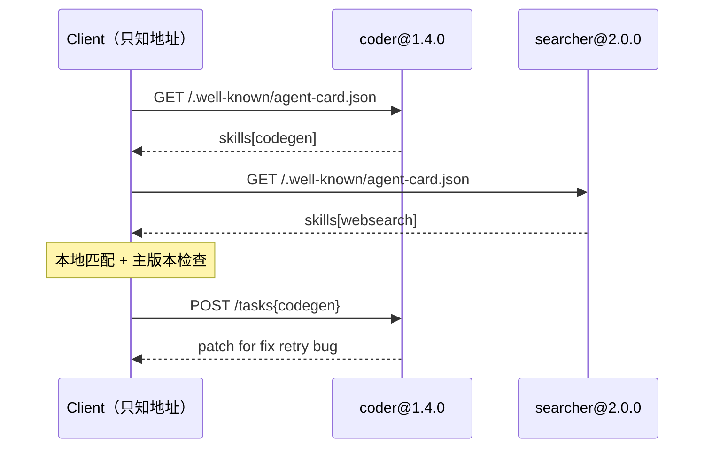

**TL;DR：** A2A 是 agent 之间的横向协议（MCP 是 agent 到工具的纵向协议）：客户端事先不认识任何对等体，只凭 base 地址拉 `/.well-known/agent-card.json`，按 `skills` 路由、按主版本拦截不兼容、未知 skill 在本地就拒绝、零请求浪费。5 个本地断言全部通过。但卡本身不解决信任——谁签发卡、调用者是谁、跨 agent 授权如何委派，仍需 MCP roadmap 里的 agent identity（DPoP、Workload Identity Federation、token exchange）回答。本文卡字段是教学形状，A2A 一手文档见参考资料。

本文是 [AI Agent 七条接缝](/writing/ai-agent-protocol-stack) 的续篇。前文把 A2A 定位在第 4 条接缝（协作层：peer，不是 tool）；本文只回答一个新问题：**发现、版本、能力匹配这三件事，协议分别交给谁？**

## 一、完整路径：一次跨 agent 委派走完什么

```text
只知道 base 地址
  → GET /.well-known/agent-card.json（能力、版本、任务入口）
  → 按 skill 选对等体（未知 skill 直接本地拒绝）
  → 主版本对不上？拦截，不发请求
  → POST /tasks（对等体再按卡校验一次）
  → 结果回传；长任务走扩展的轮询/订阅
```

和 MCP 的对照：MCP 里是 client 持有 tools 清单、向固定 server 调工具；A2A 里是 client 先向**不认识的对等体**要卡，再决定调谁。发现是协议内建的，不是部署文档里写的。

## 二、合同：卡保证什么、不保证什么

| 维度 | 保证 | 不保证 | 调用者仍负责 |
| --- | --- | --- | --- |
| 发现 | 卡声明名字、版本、skills、任务入口 | 卡是真的（自签自说） | 卡的签发与校验链 |
| 路由 | 按 skills 精确匹配，miss 时零请求 | 能力语义一致（同名 skill 实现可能不同） | 同名 skill 的验收测试 |
| 版本 | 主版本不同即不兼容，可机械拦截 | 次版本差异无害 | 版本策略与灰度 |
| 执行 | 对等体按卡做防御性校验 | 对等体不作恶、不泄密 | 身份、授权、审计（见下） |
| 长任务 | 扩展提供轮询/订阅形状 | 任务状态不丢 | 状态存储与超时 |

一句话：**卡解决“找得到、调得对”，不解决“信得过”。** 这正是 2026-08-22 MCP roadmap 把 agent identity 列为下阶段重点的原因——单跳 OAuth 覆盖不了多跳委派。

## 三、实测：发现、路由、拦截

原型是两个对等体（`coder@1.4.0[codegen]`、`searcher@2.0.0[websearch]`）加一个零预配置客户端。源码 `experiments/a2a-card-discovery/demo.mjs`，`node experiments/a2a-card-discovery/demo.mjs` 可重跑，原始输出 `evidence/a2a-card-discovery/2026-09-13-local/run.out`。

```text
PASS D1 卡即全部配置 | coder@1.4.0[codegen] searcher@2.0.0[websearch]
PASS D2 按卡路由一次命中
PASS D3 未知 skill 零请求拒绝 | no peer offers videorender, no request sent
PASS D4 服务端按卡校验
PASS D5 主版本不兼容被拦截 | coder@1.4.0 vs wanted ^2.0.0
```

D3 值得单独说：未知能力在客户端本地就被拒绝，**没有产生任何网络请求**。对比硬编码地址+试错调用的写法，发现机制省掉的不是代码行数，是线上 4xx 与重试预算。D4 是纵深：即使恶意客户端绕过发现直调，对等体仍按自己的卡拒绝——信任假设只放在服务端自己身上。



## 四、和 MCP 无状态化的呼应

上一篇 [MCP 无状态核心](/writing/llm-09-mcp-stateless-core) 证明了纵向（agent→工具）可以不要传输会话；本篇证明横向（agent→agent）可以不要预配置。一个可直接复用的判断：**凡是“调用前必须先认识对方”的设计，先问能不能换成“调用时发现”**——MCP 用 `server/discover`，A2A 用 Agent Card，答案都是把配置变成协议消息。

## 五、证据卡与边界

| 字段 | 内容 |
| --- | --- |
| 问题 | 对等体发现、版本拦截、能力匹配能否不依赖预配置成立？ |
| 环境 | Darwin arm64，Node v24.19.0，零依赖 |
| 输入 | 双对等体 + 零预配置客户端，5 个断言，确定性运行 |
| 原始输出 | `evidence/a2a-card-discovery/2026-09-13-local/run.out`（5 PASS） |
| 支持结论 | 发现即配置、未知 skill 零请求、主版本机械拦截、服务端防御校验 |
| 不支持结论 | 真实 A2A SDK 行为、卡签发/校验链、多跳授权、生产服务发现规模 |

卡字段是教学形状（name/version/skills/endpoint），A2A v1.0（2026-03-12）与 AAIF 归属（2026-08-27，2026-09-13 核对）的事实以官方文档为准，字段级对接实现前请按目标 SDK 版本重核。

## 六、结论：发现进协议，信任另起炉灶

回到开头：发现交给卡，版本交给主版本拦截，能力匹配客户端服务端各做一次。但“卡说自己是谁”这件事本身不在卡里——上线前必须另起 identity 炉灶（签发、DPoP、token exchange），否则第一个伪造卡就是一次完美的中间人。下一步可执行：把你家 agent 的能力清单导出成一张静态卡，先让调用方从“读文档”变成“拉卡”，再谈签发。

## 参考资料

- A2A 官方文档：Agent Discovery、Agent Skills & Agent Card、Specification（v1.0），<https://a2a-protocol.org/>（2026-09-13 核对有这些章节）
- A2A 加入 Agentic AI Foundation 公告，<https://a2a-protocol.org/dev/blog/2026/08/27/a-new-chapter-for-a2a-joining-the-agentic-ai-foundation/>（2026-08-27）
- MCP roadmap（agent identity 与 Tasks 方向），<https://blog.modelcontextprotocol.io/posts/mcp-roadmap>（2026-08-22）
- 前篇：不是协议之战：AI Agent 的七条接缝，`/writing/ai-agent-protocol-stack`
- 纵向对照：MCP 2026-07-28 无状态核心，`/writing/llm-09-mcp-stateless-core`
