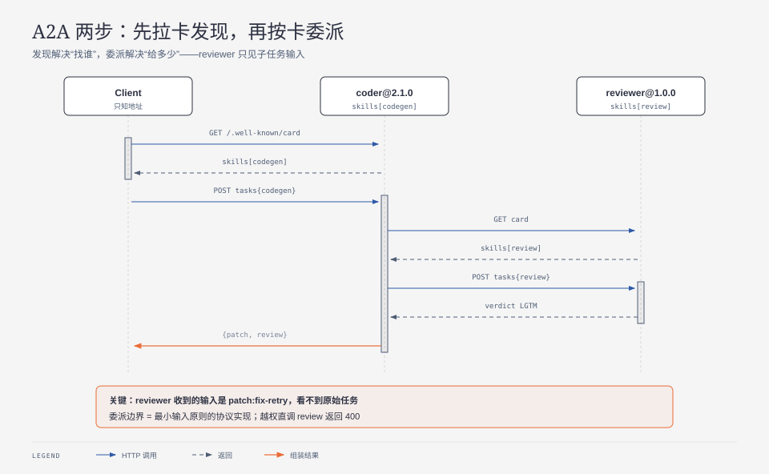

**TL;DR：** agent 协作两步走：发现——只凭 base 地址拉卡，`skills` 路由、主版本拦截、未知 skill 本地零请求拒绝；委派——coder 自打补丁，按卡把 `review` 转包给 reviewer 再组装，下游只看到子任务输入（`seen=patch:fix-retry`），越权直调 400。两组断言全过（5+3）。未覆盖的坑：循环转包（A→B→A）需深度预算，见 dsh 子智能体篇。

## 一、发现：卡即全部配置

`coder@1.4.0[codegen]`、`searcher@2.0.0[websearch]`——一次命中路由、未知零请求、服务端按卡防御校验、主版本不兼容拦截（`experiments/a2a-card-discovery/demo.mjs`）。

## 二、委派：最小输入原则的协议实现

整链 `patch:fix-retry` → `LGTM:patch:fix-retry`，reviewer 不见原始任务（`experiments/a2a-delegate-chain/chain.mjs`）。

## 三、证据卡与边界

原始输出：`evidence/a2a-card-discovery/`、`evidence/a2a-delegate-chain/`（2026-09-14/13-local）。不支持：真实 A2A SDK、卡签发链、多跳授权、循环转包防护。

## 参考资料

- A2A 官方文档，<https://a2a-protocol.org/>；MCP roadmap（agent identity）（2026-09-14 核对）
- 纵向对照：MCP 无状态核心，`/writing/llm-09-mcp-stateless-core`
