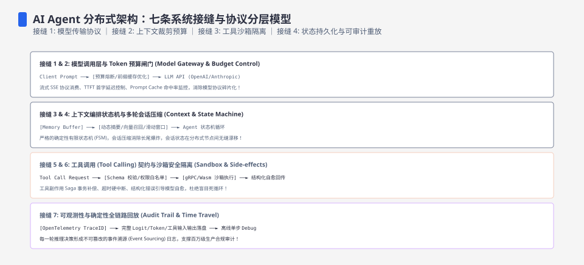
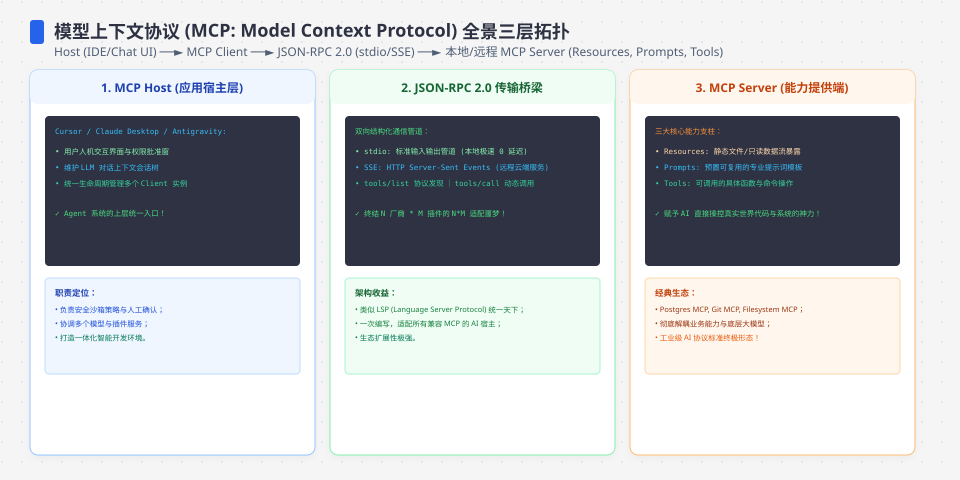
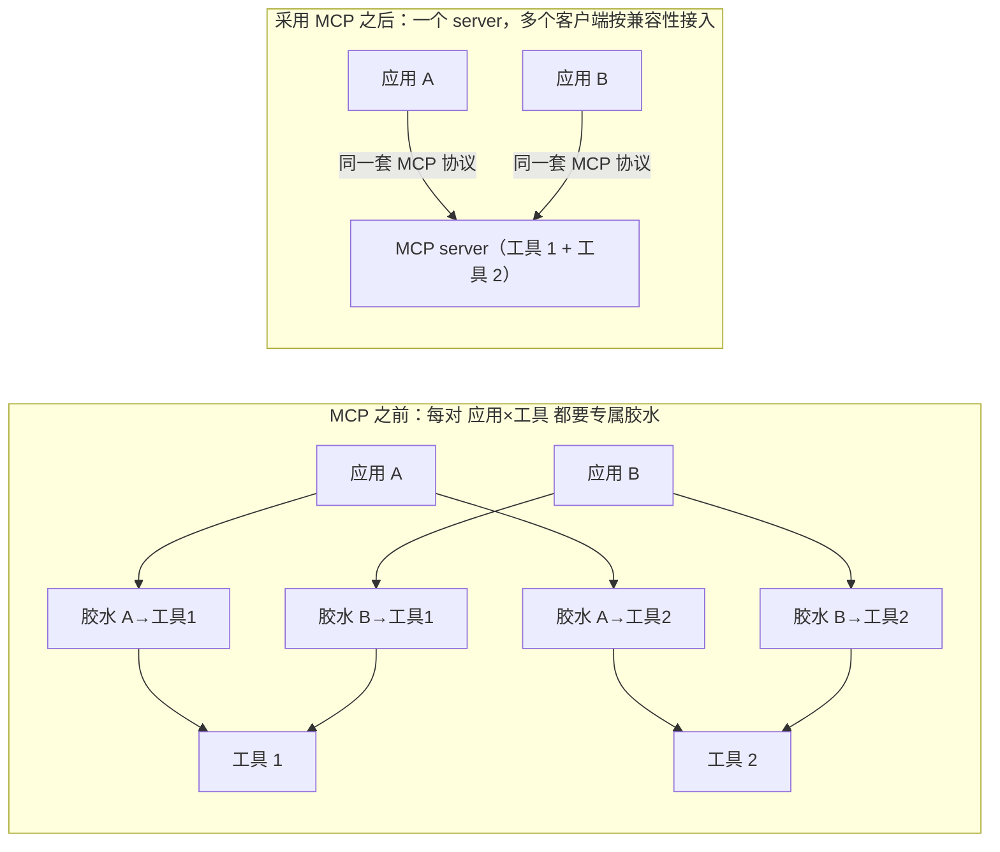
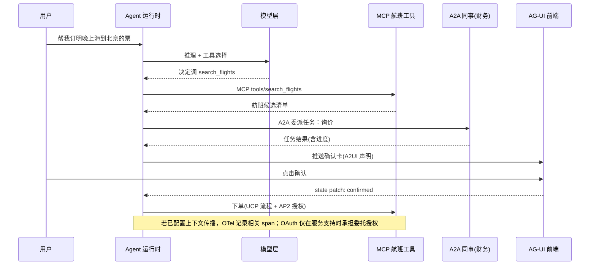
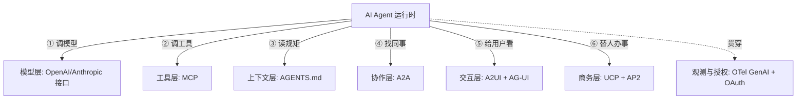
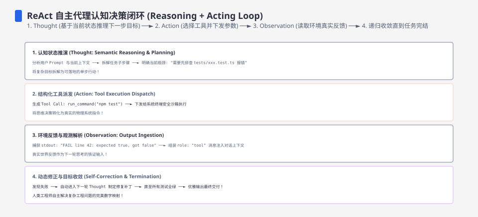
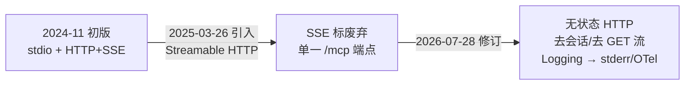

**TL;DR：** “协议栈”是本文的分析模型，不是一个由七层组成的官方标准。模型 API、MCP、A2A、`AGENTS.md`、UI 事件协议、商务/支付规范、OpenTelemetry 和 OAuth 解决的是不同边界，但成熟度、治理方和版本状态各不相同，也不保证可以直接拼接。最稳的判断顺序是：先写清 agent 要调用什么、委派什么、代表谁授权，再核对目标协议的版本、权限、取消、重试、幂等和审计语义；MCP 与 A2A 的区别可以保留为一个起点，但“先 MCP”不是所有项目的通用上线建议。

---

## 一、先纠正一个误读：从来没有"唯一的 Agent 协议"

很多项目把“AI Agent 用 MCP”当成完整答案。这个结论只覆盖了一半——MCP 主要解决 LLM 应用与外部工具、资源和提示之间的连接，任务编排、跨 agent 委派、用户授权和业务幂等仍需另外定义。

一个 agent 反复执行"观察 → 决策 → 行动"，每向外迈一步，就触碰一条不同的**接缝**：调模型、用工具、读项目规矩、跟别的 agent 协作、把输出渲染给用户看、替用户下单付钱、被观测审计。**几乎每条接缝都长出了自己的协议或约定。** 因此真正该问的不是"MCP 好还是 A2A 好"，而是：**这些协议各锁住哪条缝、我需不需要、从哪一层开始。**

一个一手证据先收下：**你正在读的这篇文章，本身就是这句话的实例**——它由一个读 AGENTS.md 的 agent 编写，靠 MCP 与 Skills 调用工具，写完后再按 AGENTS.md 里的写作守则自查。第五节末尾再回来细看它。

## 二、先把协议认到层：一张总表

| 层 | 协议 | agent 的对面是谁 | 锁住的缝 | 归属与状态 |
| :--- | :--- | :--- | :--- | :--- |
| 模型 | OpenAI Responses / Chat Completions；Anthropic Messages | 推理模型 | agent↔模型 | 厂商 API；请求/工具/流式语义按版本核对 |
| 工具/数据 | MCP | 工具服务、资源和外部 API | agent↔工具 | 开放规范；版本、传输和扩展需要协商 |
| 上下文 | `AGENTS.md` | 仓库、协作规则 | agent↔项目 | 文件约定，不是远程调用协议；工具是否读取要现场确认 |
| 协作 | A2A | 别的 agent | agent↔agent | 开放协议；任务、Agent Card、认证和绑定随版本演进 |
| 交互 | A2UI / AG-UI 等 | 用户前端 | agent↔界面 | 生态协议/实现并存，不能假设互操作 |
| 商务 | UCP / AP2 等 | 购物流程、商家和支付方 | agent↔商家/支付 | 提案与实现需分别核对授权、签名、退款和争议语义 |
| 观测/授权 | OpenTelemetry GenAI、OAuth | 追踪与鉴权 | agent↔观测/权限 | 语义约定与授权框架，不能替代业务审计和最小权限 |

这张表按"连接的对面"分层，而不是按产品菜单分层：模型和工具是外部调用，上下文是本地约定，A2A 是跨 agent 任务，交互和商务分别面向用户与交易方；观测、授权则贯穿这些边界。

## 三、自下而上：七条接缝分别解决什么问题

### 1. 模型层：接口也算协议——只是"事实标准"而非"标准化协议"

大部分人从 MCP 讲起，但最基层其实是**各家的模型 API**：

- **OpenAI Chat Completions（`/v1/chat/completions`）**：生态中有大量兼容实现，但“兼容”通常只覆盖一部分消息、工具、流式和错误语义，不能把它当跨供应商的完整合同。
- **OpenAI Responses API**：提供工具和多轮响应能力；是否迁移、如何处理状态和工具事件，应按目标模型、SDK 版本和官方迁移文档核对。Assistants API 的弃用/下线日期属于时效事实，本文不在没有当前官方确认的情况下填写未来日期。
- **Anthropic Messages API**：另一套厂商接口，工具调用和内容块语义有自己的版本合同。

所以“模型 API 算不算协议”：它们是可调用的厂商接口合同，但不应自动升级为跨厂商标准。MCP、A2A 有独立规范和治理路径；模型 API 的兼容层仍可能遗漏 token、工具、结构化输出、流式事件、错误和安全语义。换模型是否只改一行，必须由适配层、回归测试和账单/限额实验来证明。

### 2. 工具层：MCP 把 N×M 的接线压成 N+M

MCP（Model Context Protocol）被反复称作"AI 的 USB-C"，但它只是一层：**agent 与工具/数据之间**的接缝。

- 对话格式：JSON-RPC 2.0。
- 传输：**stdio（本机进程）或 Streamable HTTP（远端）**。传输、会话和扩展是版本化语义；本文第五节只记录修订时所核对的规范版本，不替实现方决定永远使用哪个版本。
- 三个原语：**tools**（可调用的动作）、**resources**（可读取的数据）、**prompts**（可复用的模板）。

它解决什么问题：在没有共同接口时，每个 AI 应用与数据源之间都要维护专属适配；MCP 试图把 host/client/server 的连接语义标准化，从 N×M 胶水中抽出可复用的 server 接口。但 N+M 只是接口数量的解释模型，不代表认证、权限、版本、工具描述、错误、限流和部署成本也降成 N+M。是否被某个宿主支持、是否适合生产，必须逐项核对版本和安全实现；本文不使用未经固定来源和日期的 server 数量、SDK 下载量或“全线采纳”作为证据。

上面左半是 N×M 条成对适配，右半是共享协议接口。MCP 的价值在于收敛接口形状；认证、权限、部署、版本兼容和错误恢复仍然要由系统自己承担。

### 3. 上下文层：AGENTS.md——"不是接口，是一条规矩"

如果 MCP 是 agent 的"手"，AGENTS.md 就是 agent 的"纪律"：仓库中的普通 Markdown 可以记录构建命令、测试命令、风格公约和禁改目录。它是文件约定，不是远程调用协议；只有某个工具明确读取、继承范围和冲突优先级都被验证后，它才会影响该工具的行为。

因此不能把"有一份 AGENTS.md"写成"所有 agent 都会遵守"。不同工具的支持范围、根目录发现规则、子目录覆盖和与自身配置文件的优先级都可能不同；例如 `CLAUDE.md` 与 `AGENTS.md` 不是同一个合同。把它纳入工程约束时，应在目标工具和版本上做一个最小验证任务，并把结果记录下来。

### 4. 协作层：A2A——"peer，不是 tool"

MCP 接 agent↔工具；**agent 与 agent 之间**的缝可由 A2A（Agent2Agent）接住。本文按当前规范中的 Agent Card、任务和事件语义来解释，不把版本发布时间或公开采用量当成协议能力。核心是一个"不透明对等体"模型：

- 每个 agent 可以发布一张 **Agent Card**（常见发现路径是 `/.well-known/agent-card.json`），声明能力和认证要求，**不暴露内部实现**；发现路径和字段应按目标版本核对。
- 双方以**任务**为单位协作，任务具有显式生命周期；长任务可以通过流式或异步事件回传进度与结果。具体状态、事件和取消语义必须与实现绑定，不能只凭一张流程图推断。
- HTTP、认证、流式传输和任务存储是协议与部署的组合问题。标准 HTTP 网关可以承接请求，不等于它已经实现了任务恢复、重试、取消、幂等和授权边界。

**为什么 MCP 与 A2A 无法互替**：MCP 的语义是"我的工具，听我调"；A2A 的语义是"我们各自自治，互相委派有生命周期的任务"。同一个系统里，子 agent 之间用 A2A、子 agent 对专属工具用 MCP，是常见组合，不是二选一。

### 5. 交互层：A2UI 与 AG-UI——"渲染什么"和"怎么送"

用户界面的缝被拆成两半，两个协议：

- **A2UI（Agent-to-User Interface，Google 生态中的方案）**：声明式 UI 约定。它试图让 agent 声明组件与数据，而由宿主端按允许的组件集合渲染；具体组件集合、版本和安全边界必须以实现文档为准，不能把预览版本的数量写成稳定标准。
- **AG-UI（Agent-User Interaction）**：面向 agent 与前端的事件交互方案。它提供消息、工具调用、状态和生命周期等事件模型；是否使用 SSE、如何支持确认/取消、以及事件是否能双向回写，都要按目标实现核对。

分工一句话：**A2UI 更接近"屏幕上呈现什么"，AG-UI 更接近"agent 与前端如何交换事件"。** 两者可以组合，但不是天然的上下游合同。

### 6. 商务层：UCP 与 AP2——替人做事之前，先替钱立规则

agent 开始替人下订单时，真正的问题不是"模型会不会"，而是"**谁授权了这笔钱**"。这一层的两个协议：

- **UCP（Universal Commerce Protocol）**：试图把发现、购物车和结算等商务步骤表达成可互操作的流程；是否能跨商家复用，取决于商家、支付方和宿主的实际实现。
- **AP2（Agent Payments Protocol）**：围绕 agent 代付的授权、意图和支付凭证讨论可验证的约束；加密签名不自动等于扣款、退款、争议和拒付都已闭环，必须分别核对参与方和实现。

这是一个需要单独验证的 agent 商务信任边界，也是它不应被工具调用语义替代的原因。

### 7. 观测与授权层：贯穿七层的横线

最后不是一条新协议，而是可能贯穿多条接缝的两根"横杆"；覆盖范围要靠传播、采集和授权配置验证：

- **OpenTelemetry GenAI 语义约定**：为 LLM 调用、工具调用、token 用量等观测字段提供语义约定，让 agent 更容易接入 tracing；只有上下文传播、采集、存储和敏感数据策略都实现，跨 MCP/A2A 的链路才可能被关联，不能直接承诺"整条链路可回放"。
- **OAuth 等委托授权框架**：可以让用户把受限授权交给 agent，agent 再携带凭证调用服务；它不是所有 MCP/A2A 部署的默认安全配置，也不能替代资源级最小权限、业务审批和审计。

这层不常出现在"协议 PK"海报上，但没有它，每多一层接缝就多一份越权风险——企业上线 agent 的第一道坎，通常就在这里。

把七条接缝叠进一个概念任务：订票 agent 帮用户订一张票，各层各显身手——模型层做推理与工具选择、MCP 查航班、A2A 委托财务 agent 询价、交互层把确认卡推给用户并接受确认、商务层替付；如果上下文传播和采集策略配置完整，OTel 再记录相关 span：

把它当成一张"接缝速查图"：每一个箭头走的是哪一层协议，就是这张栈在这一条的答案。

## 四、把"卖什么"排成一张能作决定的表

| 层 | 协议 | 核心承诺 | 缺了它会发生什么 |
| :--- | :--- | :--- | :--- |
| 模型 | OpenAI 接口等 | 把替换成本收敛在适配层 | 各家各格式，迁移成本高 |
| 工具 | MCP | 让多个客户端围绕一个共享接口接入 | 每应用 × 每数据源写胶水（N×M） |
| 上下文 | AGENTS.md | 一份规矩，多 agent 生效 | 每工具各一份，换 agent 行为漂移 |
| 协作 | A2A | agent 可对等委派、可追踪 | 手写 agent↔agent 粘合，断了无责 |
| 交互 | A2UI + AG-UI | 界面可声明、事件可流式 | 每页手写聊天前端，无状态同步 |
| 商务 | UCP + AP2 | 行动有流程、付账有签名 | agent 乱下单，无人可追责 |
| 观测 | OTel + OAuth | 让关联观测和委托授权有共同起点 | 出事了查不出是哪一步、谁授权的 |

## 五、先修四个误读：缩写、治理、传输和协议边界

### 澄清一：MCP 是"agent↔工具"，不是"agent↔agent"

最普遍的一个错。MCP 的谈话双方是 host（agent/应用）与一个为它提供工具/数据的 server。要把任务交给另一个独立 agent，是 A2A 的地盘。**记忆**：MCP = "我的手"，A2A = "我的同事"。同一个 agent 可以同时用两者。

### 澄清二："ACP" 至少有三个同名者

| 名字 | 全称 | 谈话对象 | 现状 |
| :--- | :--- | :--- | :--- |
| ACP | Agent Client Protocol | agent↔编辑器 | 由 Zed 推动，IDE 生态 |
| ACP | Agent Communication Protocol | agent↔agent | 与 A2A 的关系取决于具体项目、版本和治理公告 |
| ACP | Agentic Commerce Protocol | agent↔结账 | 商务/支付语境中的另一套命名，不能仅凭缩写判断参与方 |

读任何"ACP"之前，先问它的对面是谁。

### 澄清三："统一" = 进了同一把伞，不是"只剩一个协议"

如果多个项目进入同一个基金会或治理组织，最多说明治理协作边界发生变化，并不自动表示协议合并或实现互操作。是否有捐赠、加入和治理变更，应以对应组织的正式公告为准。即使共享治理，MCP 仍可管工具、A2A 仍可管 agent 间任务、AGENTS.md 仍是文件约定；"统一"发生在治理层，不在协议层。

### 澄清四：MCP 的传输层这两年"切"了几回（时效事实）

本文修订时核对的 [MCP `latest` 规范](https://modelcontextprotocol.io/specification/latest) 指向 **2026-07-28** 版本；MCP 传输在此前版本间经历过从 HTTP+SSE 到 Streamable HTTP 的变化。实现方应固定自己支持的规范版本，而不是把 `latest` 当成永久兼容目标。

- 早期规范使用 **stdio** 和 **HTTP+SSE**。
- 后续规范引入 **Streamable HTTP**，并将旧的 HTTP+SSE 路径标记为弃用；是否仍兼容旧客户端是实现选择。
- 当前规范强调请求的自包含性和无状态部署模型，并对会话、GET 流和日志等语义作了版本化调整；具体字段和扩展以目标版本为准。

演化一目了然：

所以"MCP 又切回 HTTP"的说法不够准确：它不是退回老 SSE，而是远端传输逐步转向 Streamable HTTP。新实现应选择目标版本支持的 stdio 或 Streamable HTTP，并为旧客户端兼容、认证、会话恢复和错误重试写测试；不能只凭文章中的时间线决定部署方式。

## 六、从哪一层起步？（按需叠加，不是选一个）

1. **需要外部工具/数据时评估 MCP**：先列出工具发现、参数校验、用户确认、超时、取消、幂等和审计要求，再核对宿主、server 与传输版本；没有外部工具时，不要为了“协议完整”引入 MCP。
2. **真正跨边界委派时评估 A2A**：单 agent 或进程内函数调用能完成的场景，通常不需要额外的 Agent Card 和任务协议；当另一个团队或供应商控制 agent，且需要正式委派、进度、恢复和责任边界时，再比较 A2A 与自定义 API。
3. **交互层按目标客户端选择**：若前端需要流式消息、工具进度和用户确认，评估 AG-UI 或已有事件协议；若需要动态 UI，再单独核对 A2UI 的组件、安全和版本支持。
4. **商务层只在真实交易边界出现时引入**：UCP/AP2 的协议能力不替代商家接入、支付授权、退款、拒付、库存和订单幂等验证。
5. **观测与授权从边界设计开始**：选择能传播 trace/context 的实现，明确 token、提示词、工具参数和个人信息的采集策略，并把用户授权与业务审批分开记录。

## 七、结论：协议标准化不会替你承担权限与失败

**结论**：AI Agent 没有"一个协议"；本文的七条接缝只是帮助拆问题的分析模型。MCP、A2A、文件约定、UI 事件、商务规范和观测/授权框架解决的是不同边界，部分规范可以组合，但版本、权限、错误恢复和运营责任并不会因为出现了标准就自动消失。记住三句足够开始排查：MCP 面向工具，A2A 面向跨 agent 任务，AGENTS.md 只是项目约定。

**下一步（约一小时可复现）**：
1. 给自己的仓库加一页 AGENTS.md（构建命令、测试命令、风格公约各一行），用两个不同的 agent 跑同一任务，观察行为是否一致。
2. 用目标 SDK 写一个最小 MCP server（暴露一个 `get_time` 工具），只实现目标版本要求的 transport、认证、取消和错误语义；先在一个宿主上跑通，再验证第二个客户端，而不是直接推导“处处可用”。
3. 若做多 agent 系统，选一个得到授权的测试服务，读取它公开的 Agent Card，检查能力、认证、任务生命周期、超时、取消和幂等字段；没有测试服务就用本地 fixture，不要把占位 URL 当实验。
4. 写代码前，翻对应协议的官方 spec 与 changelog，固定版本并保存实现测试——本文的传输段已经说明：动态协议的时间线不能替代当前版本合同。

## 参考资料
1. [Model Context Protocol 当前规范（传输与 Streamable HTTP）](https://modelcontextprotocol.io/specification/latest)
2. [MCP 规范仓库与版本变更](https://github.com/modelcontextprotocol/modelcontextprotocol)
3. [A2A 规范与 Agent Card](https://a2a-protocol.org/latest/specification/)
4. [AGENTS.md 公约说明](https://agents.md/)
5. [A2UI 协议与版本说明](https://a2ui.org/)
6. [AG-UI 文档](https://docs.ag-ui.com/)
7. [OpenAI Responses API 迁移指南](https://developers.openai.com/api/docs/guides/migrate-to-responses)
8. [OpenTelemetry GenAI 语义约定](https://opentelemetry.io/docs/specs/semconv/gen-ai/)
9. [Google Developers：UCP 机制说明](https://developers.googleblog.com/under-the-hood-universal-commerce-protocol-ucp/)
10. [Google Codelabs：AP2 与 UCP 的支付示例](https://codelabs.developers.google.com/next26/adk-agent-commerce)

> 延伸阅读：一次请求从用户走到模型与工具的一生，见[AI 后端没有魔法](/writing/ai-backend-no-magic)；跨系统把一次调用变成一条可追踪链路，见[分布式追踪与 OpenTelemetry](/writing/distributed-tracing-otel)；协议栈思维在 HTTP 缓存上同样的一笔账，见[HTTP 缓存控制与 ETag](/writing/http-cache-control-etag)。
