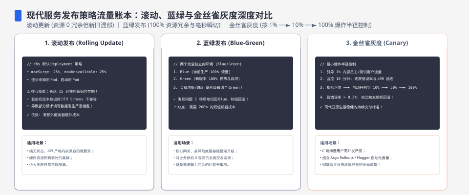
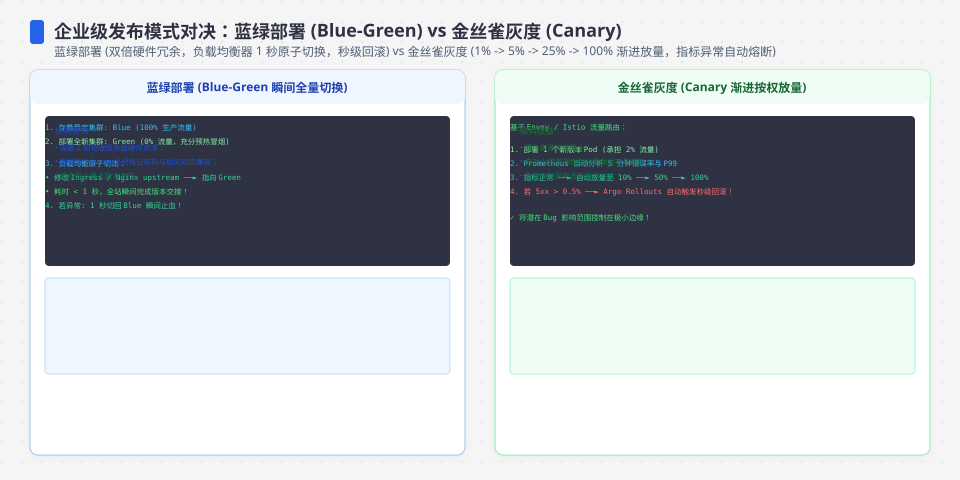
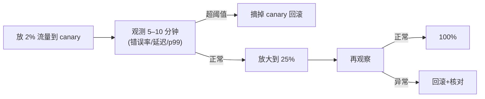
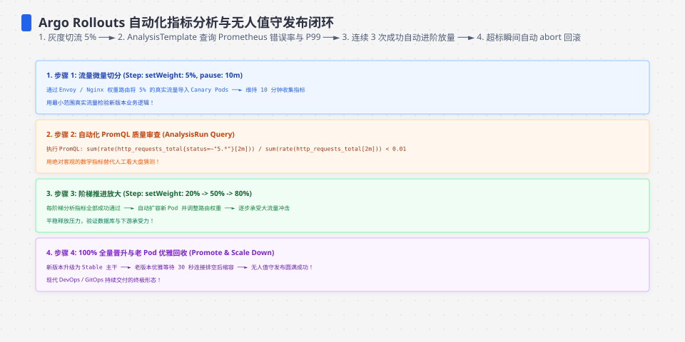

**TL;DR：** 蓝绿 / 金丝雀 / 灰度 / 滚动四类发布，本质是**失败暴露的时机与流量受击面积的取舍**：滚动发布资源效率高，但回滚通常要再走一次发布；金丝雀先给小流量并要求旧版本继续可用；蓝绿保留两套环境，切换时可以快速改路由；灰度按稳定身份逐批放大。`1–5%` 不是安全常数，回滚也不自动是“秒级”——真正的门槛是基线、最小样本、数据兼容和已演练的流量切换。本文把四种策略在错误暴露、回滚路径、资源成本和数据风险上的取舍拉成一张表。


---



## 一、四种发布，各自的代价与保护

| 策略 | 错误回流到用户的路径 | 回滚速度 | 资源占用 | 典型失败报警窗口 |
| :--- | :--- | :--- | :--- | :--- |
| 滚动（rolling） | 一批批旧的被新的替换 | 再滚一批回来，批次多；旧副本保留时可能更快 | 一个环境 | 取决于批次、探活和控制面 |
| 金丝雀（canary） | 先小流量探路，看监控 | 路由可摘除且旧版本健康时可快速缩小 | 需要独立环境/路由 | 取决于观察窗口与指标延迟 |
| 蓝绿（blue-green） | 切换时全量流量转到另一套环境 | 路由可逆时容易切回；数据状态仍需兼容 | 通常需要双份资源 | 切换前的全量验证 |
| 灰度/分批（ramp） | 按用户/地区逐批放大 | 从当前批次回滚 | 产线共用或按身份分桶 | 慢速放大期间需要持续对照 |

核心不同不在“命令”，在**“回滚那一步你付不付得起”**：

- 滚动把旧版本逐个替换掉，回滚通常要让“补丁号反打一次”，等于再来一轮发布；如果旧 ReplicaSet 仍保留且路由可切，回滚才可能更快。
- 金丝雀在旧版本仍健康、路由规则可切换且控制面反应足够快时，才可能快速摘掉 canary；“秒级”只能来自目标平台和演练记录，不能写成发布策略的通用合同。
- 蓝绿可以切回旧环境，但数据库 schema、消息格式和缓存格式必须向前/向后兼容；代码流量切回不等于数据已经回滚，也不等于已经撤销异步副作用。




## 二、金丝雀怎么"算"出来

金丝雀不是一个"发一个 Pod"的动作，而是一个**判定循环**：



金丝雀的关键是**指标要跟基线对照，而不仅是绝对值**：canary 的错误率 0.3% 看起来很低，可它旁边基线率是 0.05%——6 倍恶化。观测窗口要覆盖"新连接+慢路径+ 定时任务"的一个完整周期，单看 p99 会漏掉 GC 冻结型问题。

把"要不要放大 / 回滚"变成一条具体规则：

```yaml
# 金丝雀判定配置示例
autopilot:
  initial: 1%
  observing:
    duration: 10m
    minimum_requests: 1000
    metrics:
      - name: http_error_rate
        max_ratio_to_baseline: 2
      - name: p99_latency_ms
        max_delta_over_baseline: 100
      - name: queue_depth
        max_value: 200
      - name: business_success_rate
        min_delta_over_baseline: -0.005
    missing_metrics: hold
  fail_action: remove_canary
```

这段 YAML 是候选判定合同，不是某个云平台可直接粘贴的 schema。它至少补了两个常被漏掉的条件：样本不足时 `hold` 而不是自动放大；指标缺失时不能把“没有数据”当成“没有错误”。

把流量比例换成可计算的风险：在一个观察窗口内，预计新增坏请求数近似为

```text
extra_bad ≈ total_requests × canary_fraction × (canary_error_rate - baseline_error_rate)
```

例如窗口有 100000 次请求、canary 占 2%、canary 错误率 1%、基线 0.1%，额外坏请求约为 `100000 × 0.02 × (0.01 - 0.001) = 18`。这个数字只用于预算讨论；它仍要和 5xx、业务失败、p99、队列深度和回滚耗时分别核对，不能用一个平均错误率盖住某个租户或某条写路径。

**守则**：canary 的指标必须已经有基线版数据可以对比；没有基线、样本不足或业务指标缺失的 canary，不应自动放大。

## 三、蓝绿与它的切换

蓝绿核心：**随时有两套可用环境在持续部署，当前只对绿这套引流**。切换瞬间，路由把 100% 从绿切到蓝——**没有 ramp 过程**。所以蓝绿不流，它靠**先在其上做全量验证**再切。

**蓝绿的账**
- 优势：切换是"改路由"而不是"等新 Pod 就绪"，几秒几百毫秒即可；回滚反向切回即可。
- 劣势：要养两套全部资源 → 成本 x2。很多团队"低成本蓝绿"其实是**滚动+保留旧版本在旁**，这不是蓝绿。




## 四、灰度按用户的坑：身份要“稳定”，状态还要兼容

灰度（ramped）按用户/地域分批放大。分桶通常要让同一用户在观察窗口内稳定落在同一批次，否则两次请求分处新旧版，用户行为可能不一致。这里的“稳定”不等于把连接永久粘在某个实例：共享 session、缓存和数据库，并配合向前/向后兼容的 schema 合同，蓝绿或滚动也可以切换；如果状态只在进程内，粘性路由只能降低跨实例读取，不会替你解决重启、排空或版本切换时的数据丢失。工程难点不在“比例”，而在身份哈希、状态迁移和新旧版本同时读写同一数据的兼容性。

## 五、选型四问

1. **故障到大流量的最快路径要多快？** 秒级（金丝雀/蓝绿）还是够（滚动）？
2. **换环境成本多少？** 有独立 golden 环境吗 → 金丝雀可做。
3. **用户会话要钉住状态吗？** 用户旅行中间的 session 必须落在新版本 —— 必须粘性灰度，不能蓝绿/滚动换 session。
4. **回滚成本谁最低？** 能吃得起双倍资源吗？不吃就放弃蓝绿。

落地时通常先小后大（例如 1%→5%→25%→100%），且每次“放大”都是独立观察周期；具体比例应由流量、失败成本、指标延迟和最小样本决定。没有完成当前周期或指标缺失时直接跳到全量，等于把金丝雀做成了摆设。

## 六、结论：发布策略买的是可控失败，不是绝对安全

发布策略的账是“受影响流量 × 错误持续时间 × 单次错误代价”，还要加上数据兼容和回滚路径的固定成本。滚动省资源但可能需要再发布一次才能回滚；金丝雀用旧版本存活和观测门槛换小面积试错；蓝绿用双倍环境换路由切换速度，但不替你解决 schema 回滚；灰度用稳定分桶和多轮观察换平滑放量。**没有银弹，关键是先把错误成本、最小样本、缺失指标动作和回滚演练写成合同，再选你支付得起的那个。**

落地前至少逐项确认：①旧版本仍可接流量；② schema/消息/缓存向前兼容；③ canary 有基线、最小样本和业务指标；④路由摘除与旧 artifact 回滚已在 staging 演练；⑤放大与停止由单一控制面执行。任何一项答不上来，都应停在当前流量比例，而不是用“发布策略”替代证据。

## 参考资料
1. "Deployment strategies" —— https://martinfowler.com/bliki/BlueGreenDeployment.html
2. Argo CD / Flagger 的金丝雀设计—— https://flagger.app/
3. Kubernetes Deployment 滚动与 maxSurge/maxUnavailable 参数—— https://kubernetes.io/docs/concepts/workloads/controllers/deployment/
4. Google SRE：基于基线的监控与告警—— https://sre.google/sre-book/monitoring-distributed-systems/

> 延伸阅读：发布是旧的停止与新的开始，老实例的优雅停机时序见[SIGTERM 之后：把优雅停机做成确定性的事](/writing/graceful-shutdown-in-go)；节点被驱逐的场景见[Kubernetes 里优雅下线为什么特别难](/writing/kubernetes-graceful-termination)；回滚瞬间流量翻倍会打穿服务，限流设计见[限流、熔断与降级：高可用三件套的权衡](/writing/rate-limiting-circuit-breaker)。
