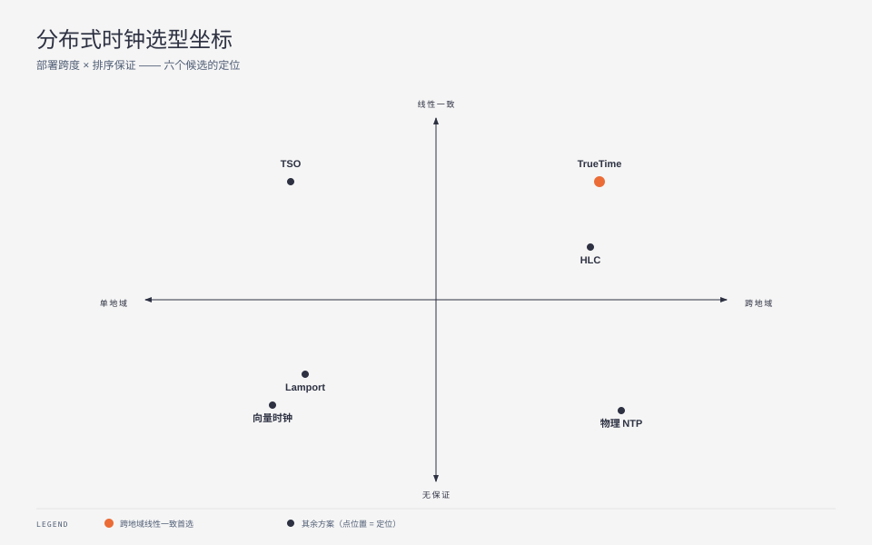
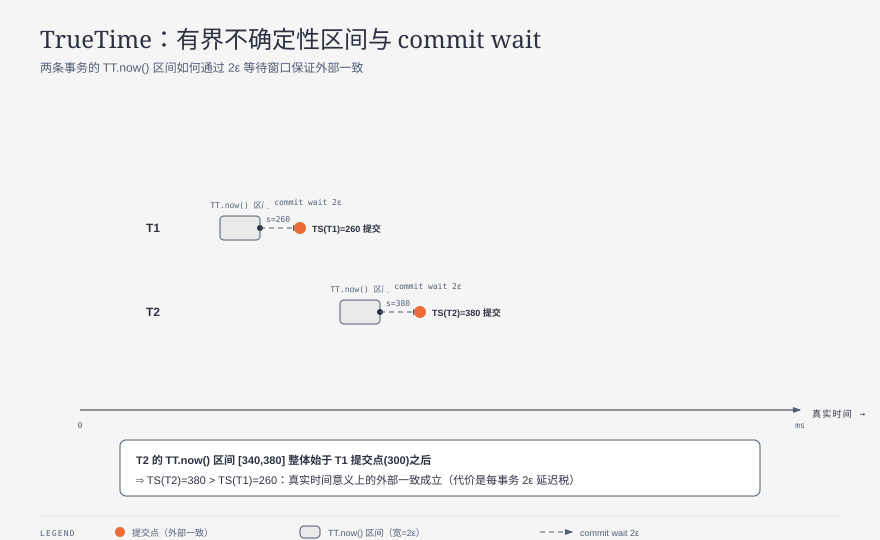
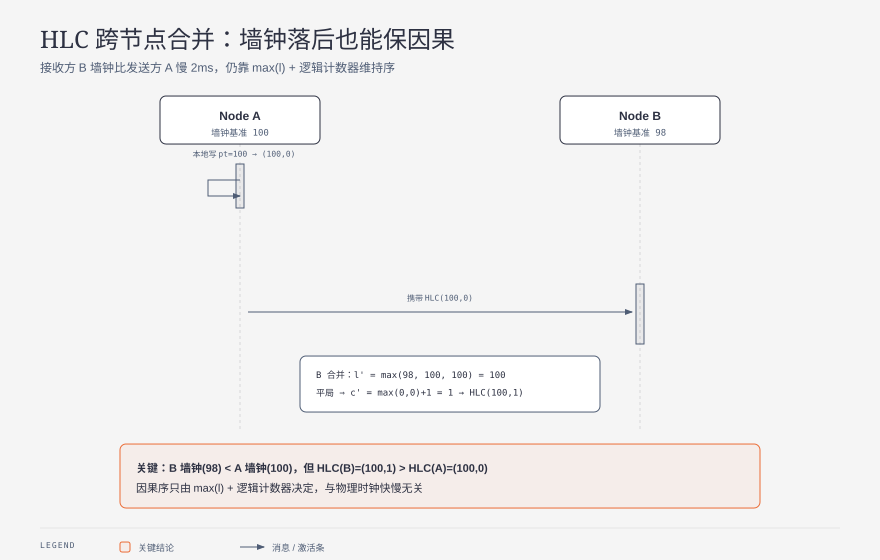
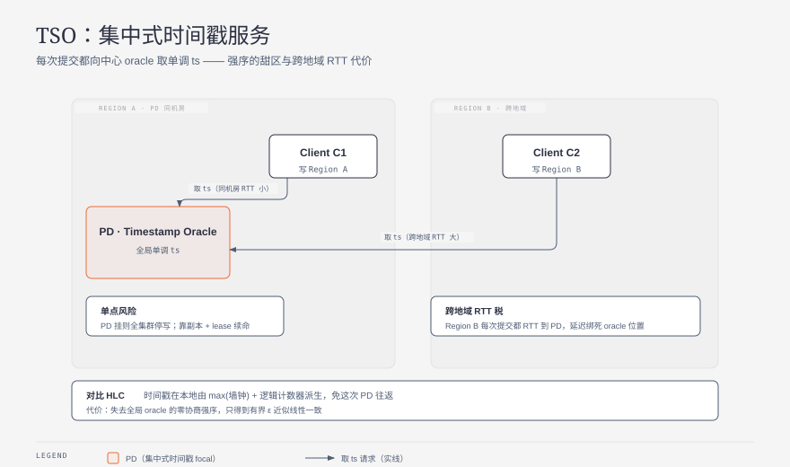

**TL;DR：** 没有共享时钟、NTP 又不可信时，给跨节点事件排序有四条互不相同的路线，选错会把巧合写进数据库。

- 物理时钟（NTP/PTP）最便宜，但误差**无界**，只能用于"大致"，不能用于严格排序；
- 逻辑时钟（Lamport / 向量）保因果但不回答"真实世界里谁先"（[上一篇已讲透](/writing/lamport-vector-clocks)）；
- TrueTime 用原子钟 + GPS 把不确定性绑进毫秒区间 $[t-\varepsilon, t+\varepsilon]$，用 commit wait 换跨地域线性一致，代价是硬件；
- HLC 把"物理部分 + 逻辑计数器"缝在一起，本地即可生成接近实时的可比较时间戳，免硬件、近似线性；
- TSO 用集中式时间戳服务换全局强序，简单但引入单点与跨地域 RTT。

选型只有一句话：**要因果 → 逻辑时钟；要跨地域线性一致且能付硬件 → TrueTime；单地域高吞吐强序 → TSO；免硬件又要近似线性 → HLC。**

---

## 一、当"谁先谁后"没有上帝视角

上一篇讲逻辑时钟时，我们默认了一个前提：节点之间已经不信任墙钟。但"不信任墙钟"这件事本身值得先说清——因为大多数系统在 99% 的时间里其实跑得好好的 NTP，问题出在那 1% 的边界：闰秒、时钟回拨、虚拟机迁移快照恢复、NTP 服务器本身漂移。这些事件会让"`ts(a) < ts(b)` 所以 a 先发生"变成一句谎话。

于是排序问题被劈成两条互不替补的需求：

1. **因果正确**——如果 a 真的导致了 b，系统必须承认 a 在 b 前；
2. **真实时间保真**——如果业务上想说"这笔订单比那笔早 3 毫秒"，系统得有个接近真实的尺子。

逻辑时钟只解决 (1)，而且明确不承诺 (2)。本文要补的是 (2) 这一极，以及介于两者之间的 HLC，再加一个工程上最常偷懒的 TSO。下图先把五个候选摆进一张决策坐标：要跨地域线性一致、还是只要因果保序，以及你愿意为"真实时间"付多少工程成本。

## 二、物理时钟：便宜，但误差无界

墙钟的诱惑在于它"人人都有、零额外协议"。NTP 把机器对齐到毫秒到几十毫秒量级，PTP（IEEE 1588）在受控网络里能到亚微秒。但墙钟的合同只有一句：**它给你一个接近真实的读数，且不保证误差上界。**

关键在"无界"二字。NTP 的 `stratum` 链每跳都叠加抖动，任何一跳的异常都会让两台机器无声地差出几百毫秒甚至几秒；闰秒会在某一刻让时钟**回退一秒**；虚拟机从快照恢复会把时钟瞬间拉回过去。这些都不是概率事件，而是运维日常。

所以物理时钟适合做"超时、重试退避、监控打点"这类对绝对顺序不敏感的事，绝不适合做"谁覆盖了谁"的裁决。一旦你拿 `wall(a) < wall(b)` 去判定写入新旧，上面任意一种事件都会让旧值覆盖新值。

> 反例：用墙钟做 last-write-wins 的 KV，在时钟回拨的那一秒里，刚发生的写入会被"更晚但时间戳更小"的写入覆盖，且无法事后察觉。

## 三、逻辑时钟的边界：它不回答"真实世界谁先"

逻辑时钟（Lamport / 向量）解决了因果，但付出的代价是**彻底丢弃真实时间**。Lamport 时间戳 `L(a) < L(b)` 只承诺"若 a→b 则 L(a)<L(b)"，反向不成立；向量时钟把并发变成可判定，但 `(L, 进程ID)` 这套序与墙钟毫无关系。

这意味着逻辑时钟无法支撑一类很常见的需求：**外部一致性（external consistency）**——即"如果事务 T1 在真实时间上提交早于 T2，那么 T1 的时间戳必须小于 T2"。这是 Spanner 论文定义、且很多跨地域强一致系统必须兑现的承诺。逻辑时钟因为不携带真实时间，天然给不出这个保证。

> 本篇不重述逻辑时钟机制，[上一篇用 1770 个事件对实测了它 63% 的"假先后"](/writing/lamport-vector-clocks)。下文直接进入计时族。

## 四、TrueTime：用硬件把不确定性绑进毫秒区间

TrueTime 的思路是承认"我无法知道精确时刻"，但**把不知道的范围量化出来**。它给每个节点配 GPS 接收机 + 原子钟，周期性校准，对外暴露的不是一个点，而是一个区间：

$$TT.now() \mapsto [t_{earliest}, t_{latest}], \quad \text{其中 } t_{latest} - t_{earliest} = 2\varepsilon$$

$\varepsilon$ 是校准误差的上界，Spanner 论文报告的量级约 7–10ms（具体数值随部署与硬件代际变化，核对日期 2026-08-31）。注意这里的合同变了：系统不再声称"现在是 t"，而是诚实地宣布"现在在 $[t-\varepsilon, t+\varepsilon]$ 里"。

线性一致怎么来的？靠 **commit wait**：一个事务选好候选时间戳 $s = TT.now().latest$ 后，不立即提交，而是等到 $TT.now().earliest > s$ 才放行。换句话说，它等一个 $2\varepsilon$ 的窗口，确保自己的提交时间**绝对晚于**所有可能在 $s$ 之前开始的事务。下图的两条不确定性带把这件事画了出来——T2 的区间整体落在 T1 之后，于是 $TS(T1) < TS(T2)$ 在真实时间意义上成立。

TrueTime 的合同、不保证与调用者责任：

- **保证**：在 commit wait 之后，跨地域事务获得外部一致的时间戳序；
- **不保证**：单点读取的"精确时刻"；$\varepsilon$ 会因硬件故障临时变大；
- **调用者负责**：必须真去等那个 $2\varepsilon$，跳过等待就退回"无界"；且每次提交都吃一个 $2\varepsilon$ 的延迟税。

成本是实打实的硬件（GPS + 原子钟冗余）和每事务 $2\varepsilon$ 的提交延迟。小团队付不起，所以是"能付硬件才选"的一极。

## 五、HLC：把物理和逻辑缝在一起

HLC（Hybrid Logical Clock）想拿逻辑时钟的便宜，又想蹭一点真实时间。它给每个事件存一对值 $(l, c)$：

- $l$：物理部分，取 $max(\text{本地墙钟}, \text{见过的最大 } l)$；
- $c$：逻辑计数器，仅在 $l$ 打平时递增，用来打破同毫秒内的并发。

合并规则（接收消息时）写成：

$$l' = \max(l_{local},\, l_{msg},\, pt_{now()})$$
$$c' = \begin{cases} \max(c_{local}, c_{msg}) + 1 & l' = l_{local} = l_{msg} \\ c_{local} + 1 & l' = l_{local} \ne l_{msg} \\ c_{msg} + 1 & l' = l_{msg} \ne l_{local} \\ 0 & \text{否则} \end{cases}$$

它的妙处在图上最清楚：哪怕接收方 B 的墙钟**比发送方 A 还慢**，只要 B 见过 A 带来的 $l$，就能把 $l$ 提上来并让计数器保证 $HLC(B) > HLC(A)$。因果被保留，而 $l$ 这个物理部分又让 HLC 大致可比真实时间——这正是"近似线性"的来源。

HLC 的合同边界要讲清：

- **保证**：因果序（继承逻辑时钟）＋ 物理部分单调贴近真实时间，可在 $\varepsilon$ 量级内近似比较；
- **不保证**：严格外部一致。两台机器墙钟差 $\Delta$ 时，HLC 的序也可能错 $\Delta$——它把"无界"压成了"有界但仍非零"；
- **调用者负责**：若业务真的需要零误差的跨地域线性一致，HLC 的 $\varepsilon$ 残余不允许你偷懒，得上 TrueTime 或 TSO。

代表系统：CockroachDB 的 MVCC 时间戳、MongoDB 的 cluster clock 都基于 HLC 变体。

## 六、TSO：集中式时间戳的另一种答案

TSO（Timestamp Oracle）走了一条干脆的路：不在每个节点算时间，而是养一个**集中式服务**，谁要时间戳就去找它要一个严格递增的数。TiDB 的 PD（Placement Driver）、Google Percolator 的 timestamp 服务都是这个角色。

它把"排序"这个难题收敛成一个单点问题：

- **保证**：全局强序、单调、实现极简，调用方拿到就能直接用；
- **不保证**：高可用与低延迟兼得。PD 挂了全集群停写；跨地域部署时，每次提交都要 RTT 到 PD，延迟直接绑死在 oracle 的物理位置上；
- **调用者负责**：要么接受单点风险（配副本 + lease 续命），要么接受跨地域 RTT 税。

下图标出这种结构的甜区与代价：单地域、PD 与写入同机房时，TSO 是又便宜又强的选择；一旦写入跨地域，那条回 PD 取号的箭头就成了延迟主因。

## 七、怎么选：决策边界与反例

把五个候选放回同一组维度，结论才站得住（维度冻结：因果保序 / 真实时间保真 / 空间开销 / 工程成本与风险 / 代表系统）：

| 方案 | 因果保序 | 真实时间保真 | 空间 | 成本与风险 | 代表 |
| --- | --- | --- | --- | --- | --- |
| 物理时钟 NTP | 否 | 名义有，实际无界 | O(1) | 几乎免费，但回拨/闰秒致命 | 监控打点 |
| Lamport | 是 | 否 | O(1) | 极廉，单向合同 | 复制日志、全序广播 |
| 向量时钟 | 是（含并发判定） | 否 | O(N) | 廉，副本多时爆炸 | Dynamo、CRDT |
| HLC | 是 | 近似（有界 $\varepsilon$） | O(1) | 免硬件，残差需容忍 | CockroachDB |
| TSO | 是（全局强序） | 否（序由 oracle 定） | O(1) | 单点 + 跨地域 RTT | TiDB PD |
| TrueTime | 是 + 外部一致 | 是（有界区间） | O(1) | GPS+原子钟硬件税 | Spanner |

决策边界（每条都附反例）：

1. **只求全体对顺序达成一致**（日志、广播）→ Lamport + 平局裁决。反例：拿它做因果推断会被 63% 的假先后骗（见上篇）。
2. **要判定两个写是否真有因果**（合并、覆盖、版本回滚）→ 向量时钟。反例：O(N) 在上千副本时不可承受。
3. **单地域、要高吞吐全局强序** → TSO。反例：跨地域写入把延迟绑死在 PD 的 RTT 上，这时该换 HLC/TrueTime。
4. **跨地域、且能付硬件、要真外部一致** → TrueTime。反例：小团队或纯软件部署付不起 GPS+原子钟。
5. **跨地域、免硬件、能容忍有界误差** → HLC。反例：业务要求零误差线性一致时，$\varepsilon$ 残余会让你在时钟差最大的两台机之间排错序。

留三个可直接执行的研究问题：

- **HLC 的有界误差实测**：固定种子模拟两台机墙钟漂移服从高斯 $\mathcal{N}(0, \sigma)$、$\sigma$ 取 1/5/20ms，各跑一千次，测量 HLC 序与真实序不一致的占比随 $\sigma$ 的曲线，done 标准是误差占比在 $\sigma$ 量级单调上升且收敛。
- **TSO 跨地域 RTT 税**：把 PD 放在区域 A，写入方在区域 B，固定 QPS 改变 B→A 的 RTT（10/50/150ms），测 p99 提交延迟与吞吐，观察拐点出现在哪条 RTT。
- **TrueTime 的 $\varepsilon$ 敏感性**：固定 $2\varepsilon$ 等待窗口，把 $\varepsilon$ 注入成报告值的 2×/5×，测提交延迟上界与"外部一致性仍成立"的边界，验证 commit wait 对 $\varepsilon$ 估计错误的鲁棒性。

结论回到开头那句话：排序问题先分清你要的是**因果**还是**真实时间**——逻辑时钟买因果、TrueTime 买真实时间、TSO 买简单强序、HLC 在两者间找近似。把"无界"压成"有界"的那一步，才是所有方案真正的分水岭。

## 参考资料

- Lamport, *Time, Clocks, and the Ordering of Events in a Distributed System*, CACM 1978（happens-before 与逻辑时钟原始定义）
- Kulkarni & Demers, *Logical Physical Clocks and Consistent Snapshots in Globally Distributed Databases*, 2014（HLC 原始定义）
- Corbett et al., *Spanner: Google's Globally-Distributed Database*, OSDI 2012（TrueTime 与 commit wait）
- 站内前篇：[Lamport 时钟说"先"，向量时钟说"不一定"](/writing/lamport-vector-clocks)
- 站内相关：[Raft 的线性一致读与租约](/writing/raft-linearizable-read-leases)
