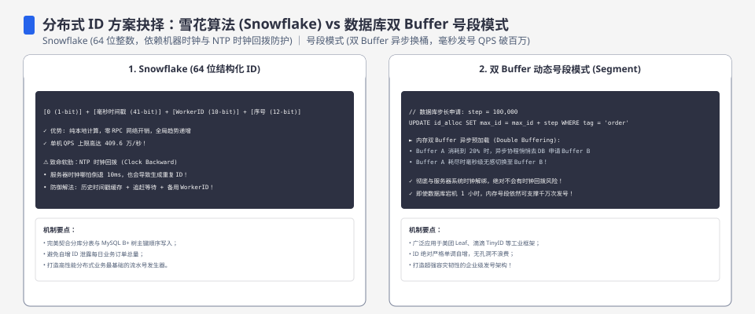
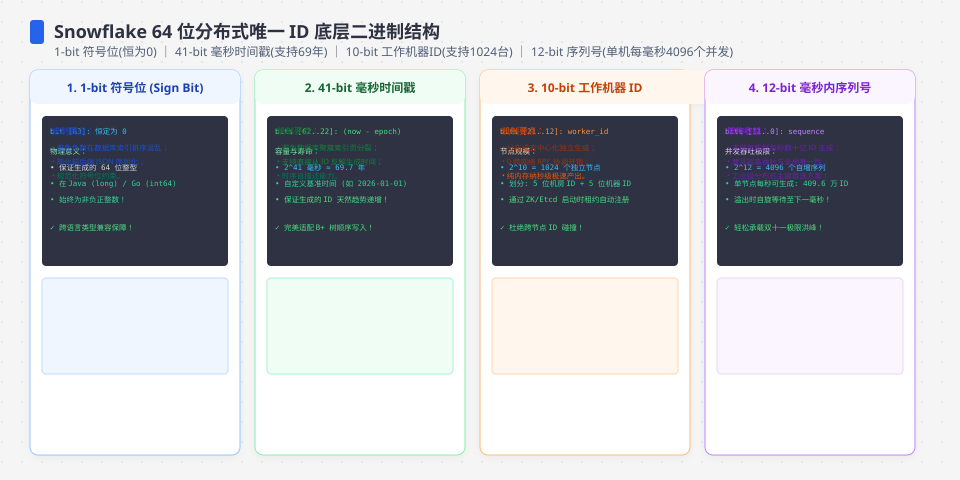
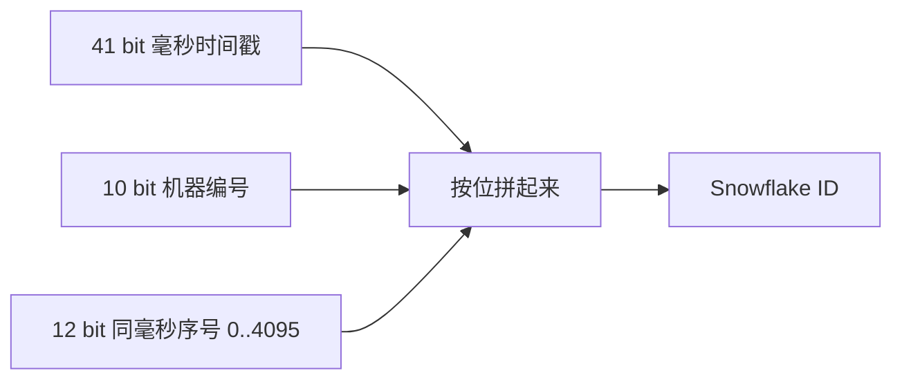
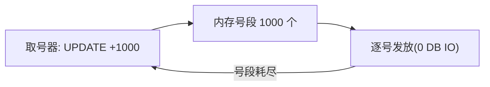
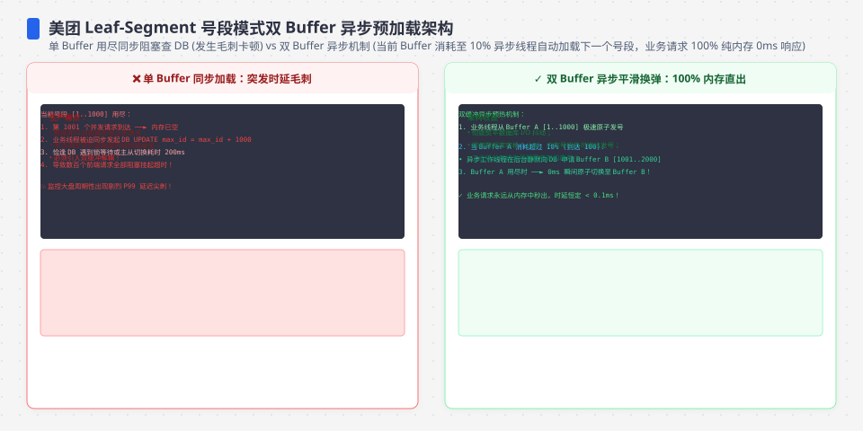

**TL;DR：** 分布式 ID 的底线是唯一，但生产选型还要同时回答排序、时钟回拨、取号可用性、空洞、隐私和索引写入。**Snowflake**用本地时间、节点位和序号换取近似有序与自治，必须处理回拨、worker 分配和序列耗尽；**号段**用一次数据库原子预留换取进程内发号，代价是取号依赖、故障时空洞和恢复合同；**UUIDv4**没有中心和时间顺序，**有序 UUID**则用部分时间信息改善索引局部性。不存在“唯一、严格全局有序、无中心、无时钟依赖、无空洞”同时成立的免费方案，应该按场景矩阵选取舍。


---



## 一、先想清楚账本的三条边

设计 ID 前先回答三个问题：有没有中心节点可用？ID 需要随创建时间有序吗？容忍 ID 空洞吗？

| 方案 | 能否排序 | 需中心节点 | 撞号风险 | 写放大 / IO | 典型场景 |
| :--- | :--- | :--- | :--- | :--- | :--- |
| 自增 ID（单库） | 严格有序 | 数据库本身 | 无 | 每次一行 | 单库、小数据量 |
| 雪花 ID | 单节点近似有序；跨节点受时钟偏差影响 | 无（每节点自治） | 回拨处理错误会逆序/撞号 | 无中心写，只有 CPU | 无中心、要近似时间序 |
| 号段（Segment） | 按批有序（批内连续） | DB 一个取号器 | 无 | 每批一次取号写 | 高并发写 |
| UUIDv4 | 无序 | 无 | 随机碰撞概率极低 | 随机键可能降低 B+Tree 局部性 | 无中心、无需时间序 |
| 有序 UUID | 近似按时间有序 | 通常无 | 依赖实现的时间/随机位合同 | 比 UUIDv4 更有局部性，但不是严格连续 | 需要跨系统可携带的有序标识 |

**每个方案都要丢一样东西**，你只能选择丢得最少的一个。




## 二、雪花：把"时间+机器+序号"编成一串二进制

经典 Snowflake 的 64 位 ID = 1 bit 符号 + 41 bit 毫秒时间戳（约 69 年）+ 10 bit 机器 + 12 bit 序号：



这套布局不是 Snowflake 的唯一协议，而是一个常见的位预算。按这组参数，单个发号器在同一毫秒最多有 `2^12 = 4096` 个序号；10 bit 节点位最多编码 1024 个节点；41 bit 时间位在自定义 epoch 下约覆盖 69 年。改任何一段都等于改协议：消费者必须知道 epoch、位宽和符号位是否保留。

**吞吐账**：单机序列预算的理论上限是每秒约 409.6 万个，但这不是服务吞吐 SLO，还没有扣除锁、系统调用、序列化、存储和下游压力。ID 只有在**同一个发号器的墙上时钟不倒退**时才可以近似单调；跨节点的时间偏差和节点位会让全局排序出现交错，不能把 Snowflake 当作全局事件顺序。这正是[LSM 与 B+Tree 的 IO 战争](/writing/lsm-vs-btree-io-amplification)里“顺序写”结论的适用边界。

**代价账**：

- **时钟回拨**：如果生成器继续使用回拨后的时间，可能产生逆序；若序列状态也被错误重置，还可能撞号。常见处理是等待追平、拒绝发号，或用逻辑时间/补偿位推进一个不会倒退的时间线；每种处理都把代价放在延迟、可用性或协议复杂度上。**既无延迟又从不断号的方案不存在**。
- **位数受限**：机器位用完后扩机器要改位数，等于改协议。
- **依赖时钟同步**：多机时间戳有偏差时，ID 序与真实发生顺序会有轻微错位。

还要处理**同毫秒序列耗尽**：实现可以阻塞到下一毫秒、返回过载错误，或切换备用发号器；不能静默溢出并复用旧序列。仓库里的教学实现选择“在小回拨内等待，超过预算拒绝”，但没有加入并发锁、worker 注册和序列耗尽恢复，这些都必须在生产实现里另写合同。

## 三、号段：把 IO 换成内存

号段法把"取一个号写一次 DB"改成"取号一次拿一千个"：

```sql
-- 必须在事务/原子 UPDATE 合同内完成，不能先 SELECT 再 UPDATE
UPDATE id_slots SET next_value = next_value + 1000 WHERE name='orders';
-- 拿到旧 next_value .. next_value+999 这 1000 个号
```

客户端拿这 1000 个号在内存里逐个发（本地发一个 = 0 次 DB IO），用尽再取下一段。真正的实现还要返回本次更新前的值，或者用数据库支持的 `RETURNING`/存储过程把“预留区间”作为一个原子结果交给调用方；否则两个实例可能拿到重叠区间。



**关键数字**（一次发 100 万 ID）：

- 每次取一个号（自增）：约 100 万次对 DB 的行锁更新；
- 每段取 1000（号段法）：约 1000 次对 DB 的更新——在只比较取号 UPDATE 次数的模型里是 **1000 倍**，不等于端到端吞吐或数据库 CPU 一定提升 1000 倍。

**代价**：取出未用完就重启会产生号段空洞；多实例并发取号要以"段键"隔离各自区间，DB 这一端仍是唯一写热点。取号成功后客户端崩溃，数据库通常不知道这段号有没有被业务写入，所以“没有空洞”与“没有重复”不是同一个合同；多数号段系统优先保证不重复，接受可观测的空洞。




## 四、分库分表场景的实际选择

订单表要分 8 库 × 4 表。三种方案各看一遍：

1. **自增 ID**：跨库没有全局唯一，等于被迫上号段/雪花。
2. **雪花**：每个库用自己的机器位段，**全局唯一且近似有序**，不需要外部取号服务；单机约 400 万/秒，够用。
3. **UUIDv4**：完全随机，插入命中随机叶子页 → **B+Tree 页分裂频繁**，从"尾部追加"退化成"写到哪算哪"——对 B+Tree 是最不友好的键。

**不要用“80% 的场景”做设计结论**：如果读路径依赖时间范围扫描，近似有序的雪花/有序 UUID 有价值；如果只要求不可枚举的外部标识，时间编码反而会泄漏创建时间和发号速率；如果写入必须跨区域自治，号段的中心数据库可能是不可接受的故障域。分片键是否均衡也应由业务 key 和查询路径决定，不能因为 ID 有序就默认哈希分片。

## 五、时钟回拨的"剩余解"

没有任何方法能保证时钟永不回拨。诚实答案是把它当故障处理：

- **回拨很小**：等一小段时间（sleep 到本地时间追过旧时间戳）再发号——把"有序"换成"延迟"；
- **回拨超阈值**：断开取号（对外报错，绝不发出疑似撞号的 ID）；
- 成熟方案（美团 Leaf）实际是"号段为主 + 雪花兜底"的混合，用两套机理互相兜底。

回拨策略还要进入运行合同：监控必须暴露回拨持续时间、拒绝次数、序列耗尽次数和当前逻辑时间；否则业务只看到“偶发创建失败”，无法区分时钟故障、节点位冲突和数据库取号不可用。生成的 ID 也不应自动当作权限令牌——Snowflake 的时间和节点位可能让外部调用者推测创建时间、速率甚至节点规模，访问控制仍要独立存在。

## 六、选型矩阵：先写失败合同，再选编码

| 约束 | 优先考虑 | 必须接受的代价 | 先写的测试/故障 |
| --- | --- | --- | --- |
| 单库事务内生成，严格连续更重要 | 数据库 sequence/identity | 写入依赖数据库，跨库需额外方案 | 回滚、重试、主从切换后的重复/空洞语义 |
| 多节点自治，读路径按时间范围扫描 | Snowflake 或有序 UUID | 时钟、worker 分配和近似排序 | 回拨、同毫秒耗尽、节点重启和跨节点排序 |
| 高并发创建，允许空洞但不能重复 | 号段 | 取号数据库或服务故障会影响新号 | 原子预留、客户端崩溃、段耗尽和恢复 |
| 外部 ID 需要难猜、跨系统携带 | UUIDv4 或随机 opaque ID | 无时间顺序，索引局部性可能更差 | 碰撞概率、索引写入、枚举攻击防护 |

这张表把“唯一”拆成了五个可验收合同：唯一性、排序性、连续性、可用性和不可猜测性。文章开头的“选三项”只能作为提醒，不能替代这张失败矩阵。

## 七、结论：ID 选型是在排序、故障与可见性间取舍

雪花把时间、节点和序号压进本地计算，适合近似有序但必须认真处理回拨、worker 分配和暴露信息；号段把数据库一次 UPDATE 换成一段本地发号，保证不重复比保证连续更现实；UUIDv4 的随机性降低中心依赖，却放弃时间顺序，有序 UUID 又重新引入时间和协议约束。**先定义唯一、排序、空洞、故障恢复和不可猜测的合同，再决定编码。**

下一步：为候选 ID 写一张故障表，至少覆盖时钟回拨、节点重复、序列耗尽、取号服务不可用、客户端崩溃和跨区域恢复；再把 ID 的排序/隐私属性放进实际索引与 API 评审。仓库教学实现和本机 raw 在 `evidence/distributed-id-snowflake-segment/2026-08-17-local/`，只证明小回拨等待与超阈值拒绝。

## 八、参考资料
1. Twitter Engineering：Announcing Snowflake—— https://blog.twitter.com/engineering/en_us/a/2010/announcing-snowflake
2. 美团技术：分布式 ID 生成方案总结（Leaf）—— https://tech.meituan.com/2017/04/21/mt-leaf.html
3. MySQL 官方：InnoDB 索引结构—— https://dev.mysql.com/doc/refman/8.0/en/innodb-index-types.html
4. MySQL 官方：UUID 函数与索引随机性—— https://dev.mysql.com/doc/refman/8.0/en/miscellaneous-functions.html
5. RFC 9562：UUID 格式与 UUIDv7—— https://www.rfc-editor.org/rfc/rfc9562

> 延伸阅读：随机键让 B+Tree 页分裂的账见[LSM 与 B+Tree 的 IO 战争](/writing/lsm-vs-btree-io-amplification)；雪花对时钟的依赖正是[时钟回拨与分布式顺序幻觉](/writing/clock-skew-distributed-systems)切入的那根细线；ID 有序追加后读路径的权衡见[主从复制延迟的三种读路径](/writing/replication-lag-read-paths)。
