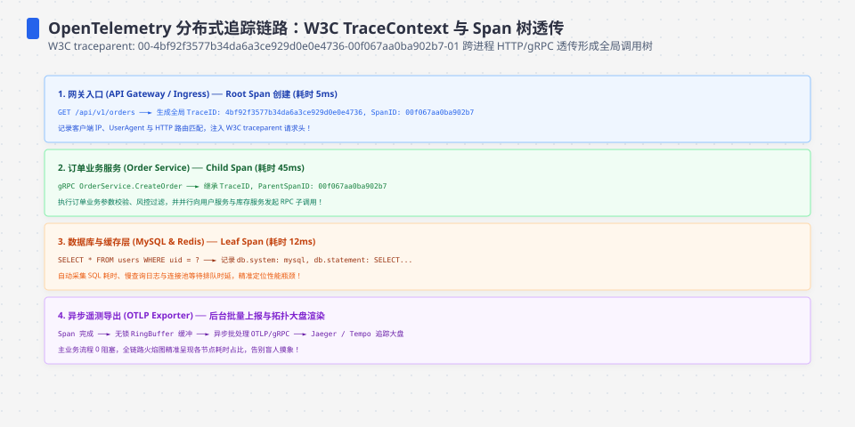
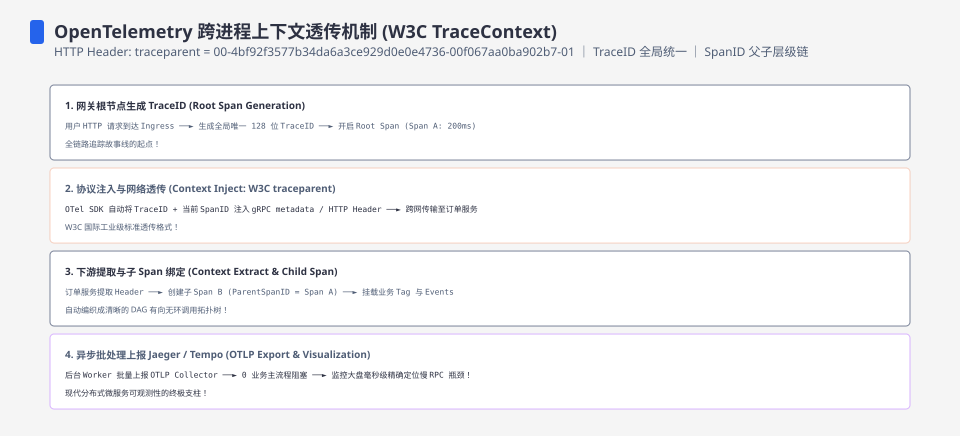
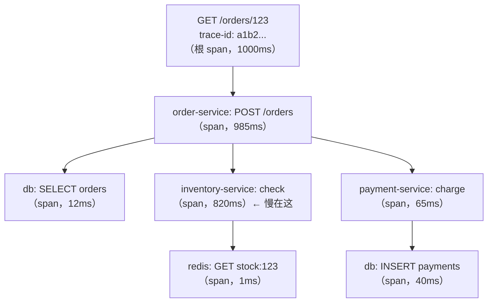
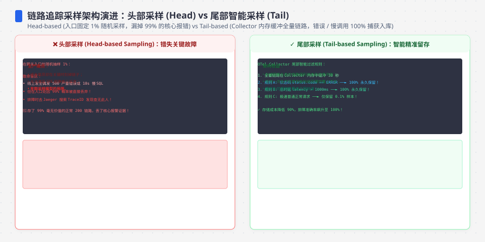

**TL;DR：** 分布式追踪把一次请求的父子调用组织成一棵 span 树，并用 trace context 跨进程传播。它补上了日志和指标之间的缺口：指标告诉你哪类请求变慢，trace 才能把某一次请求的等待拆到具体服务和操作。落地最大的坑不是“接入了 SDK”，而是采样和证据闭环：head sampling 可能在入口就丢掉慢请求，tail sampling 需要先承受整条 trace 的接收和聚合成本。理解 trace/span、`traceparent`、采样决策和日志关联，才算掌握追踪的骨架。


---



## 一、 单机监控的三个盲区

假设一个下单请求慢了三秒，日志和指标分别告诉你什么：

- **日志**：订单服务里 `order.created` 打了，库存服务里 `inventory.checked` 打了。每条日志都带时间戳，但**它们之间没有因果**——你不知道 order 在等 inventory，还是 inventory 在等 order。跨机器的日志排序（时钟同步）本身就是个坑。
- **指标**：`inventory.check` 的 P99 从 20ms 涨到 800ms。你知道"变慢了"，但不知道**是哪一次请求**、**是哪一个调用链**。指标是聚合，聚合天然丢掉了"单个请求的完整故事"。

两个盲区指向同一个需求：**把一次请求的完整旅程还原出来**。这就是 trace。日志回答"发生了什么"，指标回答"总体多慢"，trace 回答"这一次请求，时间都花在哪了"。




## 二、 trace 与 span：请求的因果树

分布式追踪的核心模型只有两个概念：

- **span（跨）**：一次操作的最小单位，记录"做什么、何时开始、持续多久、成功与否、附加属性"。例如 `POST /orders`、`db.query`、`http GET inventory/check` 各是一个 span。
- **trace（迹）**：一次请求的所有 span 组成的树。树上每个 span 有唯一的 span id，通过 parent span id 挂在树上；同一棵树的所有 span 共享同一个 trace id。

一次下单请求的 span 树长这样：



看树的第一眼就能定位：根 span 约 1000ms，其中 820ms 花在 `inventory.check` 上，`order-service` 还包含排队和其他调用的时间。子 span 可以重叠，也可以只覆盖父 span 的一部分，不能把所有 span 时长机械相加。单机 profiling（火焰图）主要回答"这个进程的 CPU 时间去哪了"，回答不了"跨了三个服务的等待时间去哪了"，两者互补。

span 上还能挂**属性与事件**：`http.method`、`db.statement`、`error.message`、关键节点埋点。排查时按属性过滤（"所有 inventory 失败的 trace"），比翻日志快一个数量级。

## 三、 传播：trace id 怎么穿过进程边界

树要跨服务长出来，trace id 必须跟着请求走。HTTP 场景的标准是 W3C 的 **`traceparent` 头**：

```text
traceparent: 00-4bf92f3577b34da6a3ce929d0e0e4736-00f067aa0ba902b7-01
              │ └─────── trace-id（16 字节）──────┘ └── span-id（8 字节）─┘ └flags
              └ 版本
```

下游服务收到请求时：解析 `traceparent` 中的父 span context，在这个 context 下创建自己的 server span，再把新 span 的 context 注入下一个出站请求。它不是“把同一个 span id 传到底”，而是每一跳创建自己的 span，并共享同一个 trace id。gRPC 通常把它放在 metadata，消息队列则需要把 context 放进消息头；异步消息还要决定生产 span、消费 span 和跨消息的 span link 如何表达。

传播链上最脆弱的环节是**异步和队列**：请求经过 Kafka 中转时，消费端需要从消息头取 context，并处理消息重试、批量消费和 fan-out 的关系。自动 instrumentation 可以减少 HTTP 或 gRPC 的遗漏，但不能替业务代码决定消息边界；新建 goroutine、线程或回调时，应把 context 显式传进去，不要靠全局变量。




## 四、 采样：追踪真正的成本账

全量追踪的账要算清楚。一个每秒 10 万请求的服务，按每次请求 20 个 span、每个 span 仅按 200 字节的有效载荷估算，每秒就是约 400 MB；按 30 天计算约 1,036.8 TB。这个只是未计入协议封装、索引、重试和副本的下界模型，不是任何后端的实际账单。它说明采样策略必须和保留期、查询目标、Collector 容量和预算一起定，而不是凭“1% 看起来够了”拍板。

**1. Head-based（头部采样）：请求进来时决定。**
入口处按概率决定"这个 trace 要不要收"。实现最简单、开销最低，但有一个致命盲区：**慢请求/错误请求是随机出现的**，固定 1% 采样率意味着 99% 的慢请求根本没被记录——而排查慢请求恰恰是追踪最重要的用途。

**2. Tail-based（尾部采样）：等 trace 结束后决定。**
所有 span 先流进采集端，等整棵树或超时窗口收齐后，按规则决定保留：错误 trace 可以优先保留，慢 trace 可以按阈值保留，其余按低比例抽样。它有机会避免 head sampling 过早丢掉慢请求，但只有在所有相关 span 到达、聚合容量足够、超时策略合理时才成立。代价是需要缓冲和按 trace 路由；如果在入口已经把 trace 标记为不采样，后端也未必能凭空恢复完整数据。

**3. 自适应采样（adaptive）：让采样率跟着流量走。**
预算驱动：设定"每秒最多 1000 条 trace"的预算，入口端用算法把采样率动态调到刚好花完预算。流量翻倍时采样率自动降，流量低谷时采样率自动升。适合"想无脑保证预算"的场景，但慢请求覆盖率不如 tail-based 有保障。

选择不能只按请求量分“小、中、大”。先列出失败、慢请求和普通请求各自的保留目标，再用容量模型验证：

| 目标 | 更适合的起点 | 代价与失败模式 |
| --- | --- | --- |
| 保留入口附近的代表性请求 | head sampling | 决策简单，但入口丢弃后无法恢复慢请求 |
| 按整条 trace 的错误或延迟筛选 | tail sampling | 需要聚合、超时和按 trace 路由，先承担接收成本 |
| 在预算内稳定保留样本 | 自适应或远端采样决策 | 规则更复杂，不能自动保证错误和慢请求覆盖 |

如果排查一次慢请求仍然经常找不到 trace，应先修采样规则、传播和 Collector 丢弃指标，再讨论压缩存储或换后端。

## 五、 三支柱：trace 不是孤岛

trace 单独用价值有限，与日志、指标联动才有意义：

- **trace × 日志**：把 trace id 和 span id 注入业务日志，同时避免把 token、完整请求体和个人数据无条件写入 span。排查路径变成：指标发现异常 → 找到代表性 trace → 打开 trace 看 span → 顺着 trace id 拉出该请求的日志。这要求日志系统支持按 trace id 检索，否则联动只是口号。
- **trace × 指标**：span 的耗时天然可以聚合成 histogram（`db.query` 的 P99），这就是"RED 指标"（Rate/Errors/Duration）的来源——追踪系统在采集的同时把关键 span 的延迟指标导给指标系统，两个系统共用一份埋点数据。
- **trace × profiling**：trace 告诉你"慢在哪个服务哪个接口"，火焰图告诉你"这个进程在该接口上算了什么"。两者能否用 trace id 直接关联，取决于 profiler 和 SDK 的集成；不能因为都叫 profiling 就假设已有共同主键。on-CPU 采样对等待区间是盲的，把 span 耗时和火焰图放在同一时间窗口看，才能同时观察“等在哪”和“算在哪”。

## 六、 落地实践：时钟、采样与排查闭环

**时钟和时间语义要分开。** span 的父子关系靠 trace context 建立，单个进程内的时长通常可以使用单调时钟计算；跨进程的绝对时间戳仍可能受时钟偏移影响，于是可视化时出现父子区间重叠或负的相对间隔。发现这类现象时，先确认 SDK、Collector 和后端的时间处理，再查 NTP/PTP、虚拟化时钟和容器环境，不能仅凭一张 trace 图断言业务真的倒退了。

**Collector 是可选的控制面，不是追踪成立的前提。** 常见部署是各服务 SDK → 本地或集中式 OpenTelemetry Collector → 后端（Jaeger、Tempo、Datadog 等），Collector 可以承担批处理、路由、过滤、采样和背压隔离。小型服务也可以由 SDK 直接导出到兼容的 OTLP 端点。真正需要验收的是队列上限、重试、丢弃计数和关闭时 flush，不是是否画出了“SDK 必须经过 Collector”的架构图。

**排查闭环的验收标准**应由团队自己定窗口，例如把“报警到找到第一条可用 trace”设为 2 分钟目标，然后用演练验证，而不是把 2 分钟写成追踪系统的普遍 SLA。检查至少包括：错误和慢请求是否按规则保留、trace id 是否进入日志、Collector 是否在丢数据、后端查询是否能按服务和时间筛选。

最后回到开头的问题：三秒慢请求，日志给了一堆碎片，指标说库存服务 P99 涨了。trace 可以把这一次请求的等待定位到 `inventory.check`，但它不能自动证明 780ms 都在等一把跨服务的锁。要回答锁、数据库、网络还是队列，仍需把 span 属性、服务指标、日志和 profile 对上。可观测性的验收不是“工具齐全”，而是演练中能在约定窗口内拿到足够证据，并知道哪些结论仍然未知[^1]。

[^1]: 延伸阅读：W3C Trace Context 规范（traceparent 头）一页能读完；OpenTelemetry 文档里 Concepts → Traces 章节是模型定义的标准答案；《分布式系统模式》里"跨进程追踪"一章把 span 树的拼装讲得很清楚。

## 七、参考资料：传播、采样与 SDK 语义

- [W3C Trace Context](https://www.w3.org/TR/trace-context/)：`traceparent` 与 `tracestate` 的跨进程传播规范。
- [OpenTelemetry：Traces](https://opentelemetry.io/docs/concepts/signals/traces/)：trace、span、上下文与链接的概念模型。
- [OpenTelemetry：Sampling](https://opentelemetry.io/docs/concepts/sampling/)：head sampling、tail sampling 与采样决策的边界。
- [OpenTelemetry Trace SDK Specification](https://opentelemetry.io/docs/specs/otel/trace/sdk/)：TracerProvider、SpanProcessor 与导出管线的职责。
