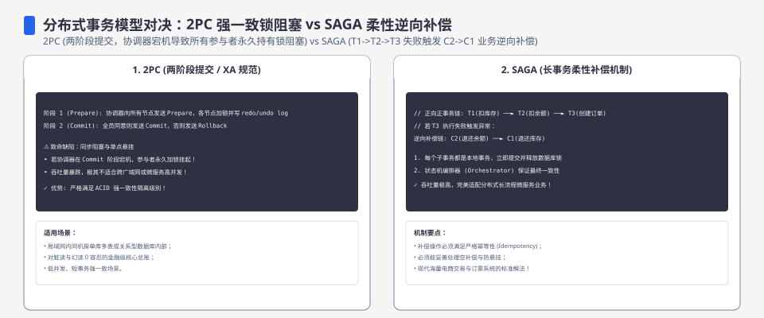
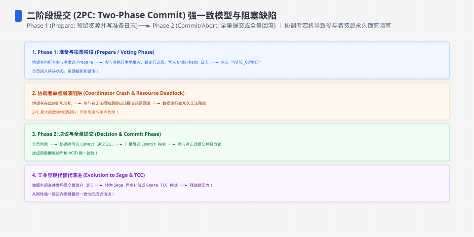
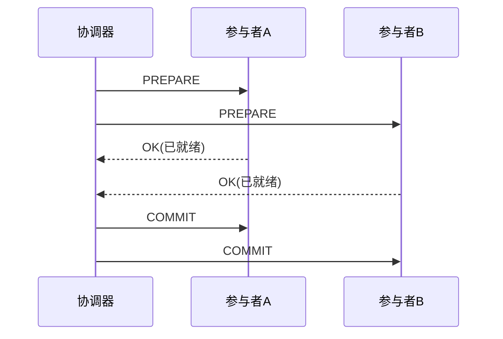
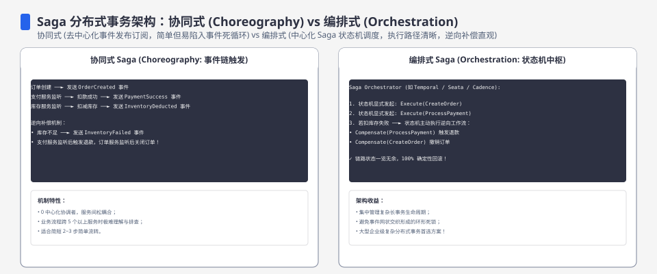

**TL;DR：** 分布式事务不是“选一个更强的协议”，而是选择一组故障后的语义。2PC 在参与者 prepare 之后、协调器尚未公布决定时，可能把资源留在不确定状态；是否长期悬挂取决于协调器日志、恢复和终止协议。SAGA 不做跨参与者原子提交，而是让每一步提交，再用可重试、幂等、可对账的补偿处理失败；补偿本身也可能失败。Transactional Outbox 把业务写入和待发送消息放进同一数据库事务，换来可重试的投递记录，但仍要处理重复投递、relay 故障和消息延迟。本文按故障点比较三种语义，不把本地消息表写成强一致替代品。


---



## 一、先定义问题：分布式事务到底在保什么

单机事务的 ACID 可以由一个数据库用**锁 + WAL**在本地裁决。分布式事务的难题是：有两台或更多台 MySQL/PostgreSQL/Redis，A 库扣了钱、B 库要加钱，两个独立的提交动作之间出现故障后，系统必须知道是重试、补偿、阻塞还是人工对账。看起来只要把“提交”做成同步两阶段就行，2PC 就是这个直觉的工程化。

但要先指出问题的形状：**分布式事务之所以难，不是协议难写，是“崩溃模型”难处理**。假如进程不崩溃、网络不失联，2PC 一次就能跑完。真实世界里执行到一半协调器断电、一个参与者失联，接下来的行为必须由故障模型决定。协调器复制、参与者超时、补偿和对账都能改变结果，但它们也会增加延迟、状态或运维成本；不能只用一句 CAP 定理替代具体故障分析。




## 二、2PC：协调者的单点悬挂

2PC 的流程教科书里都有，关键是记住它**两个阶段 + 一个假设**：



问题出在“OK（已就绪）”这个状态的内涵：**参与者说 OK 之前，通常已经锁定资源、写好了自己的日志（WAL），处于“可能提交可能回滚”的中间态**。此时协调器给两边发 COMMIT，只要决定已经持久化，重发通常可以收敛。**但协调器自己崩溃在公布决定之前呢？**

- 如果决定还没有持久化，参与者可能无法仅凭本地信息判断应该提交还是回滚，于是进入**不确定状态**；它们通常要等待协调器恢复、读取日志，或执行协议允许的终止/询问流程。
- 协调器日志已持久化但 COMMIT 消息尚未送达时，恢复后的协调器可以重发决定；这与“决策尚未产生”是两个不同故障点。
- 如果协调器永久不可恢复，且没有独立的高可用日志或终止协议，锁和 prepared 状态可能长期占用资源。**永久悬挂是故障模型和实现缺口的结果，不是所有 2PC 实现的无条件结论。**

所以 2PC 的工程代价是：它把参与者的资源锁定、协调器恢复和决定持久化都放进关键路径。XA 在一些数据库和中间件场景中仍然存在，但很多微服务团队不把它当默认方案，是因为长事务、协调器高可用、跨版本兼容和故障排查成本很高，而不是因为协议“没人敢用”。

## 三、SAGA：用补偿代替回滚

SAGA（Sagas，1987 年由 Garcia-Molina 与 Salem 提出）的模型很优雅：**把一个大事务拆成若干小事务 T1..Tn，每个 Tk 带一个补偿事务 Ck；按顺序执行 Tk，若 Tk 失败，则逆序执行之前定过的补偿**。它完全不依赖"所有参与者在同一时刻提交"——因为**压根没有"所有参与者同时在线的提交时刻"**。


SAGA 的弱点是原子性：它是“**最终一致**”，执行中间系统可能处于“钱扣了但没加”的中间态，对外可见。它的正确性不依赖“补偿必然成功”这句口号，而依赖一组必须被工程化的条件：补偿可重试、可幂等、可观测、可对账，并且业务允许中间态存在。这意味着：

- 每一笔补偿事务 Ck **本身必须可恢复**（能重试、能幂等，并留下失败状态）。
- 若 T1 成功、T2 失败、C1 补偿也失败，系统进入待修复状态；它可以继续重试、转人工或走替代动作，但不能假装已经回滚。
- 补偿是否等价于原操作的反向业务动作，由业务语义决定；框架最多负责保存状态和调度，不会自动证明补偿正确。

所以 SAGA 不是“解决了 2PC 的悬挂”，而是**换了一个错误模型**：不再追求“要么全有要么全无”，而是让中间状态可见，再通过补偿和修复流程收敛。这个交易对强一致业务可能太贵；对允许最终一致的长流程，它反而比持有跨库锁更容易运营。Transactional Outbox 是常被组合使用的投递手段，但它本身不是 SAGA，也不自动提供补偿。




## 四、工程折中：本地消息表把跨库原子性拆成可恢复投递

读到这里你应该已经明白，分布式事务没有一个可以覆盖所有场景的答案，只有**在故障模型里选一种**。工程中常见的折中是**本地消息表 / Transactional Outbox**：把“发消息的意图”和“改主库”放进**同一个本地事务**：

```sql
-- 与业务写同一事务
BEGIN;
UPDATE accounts SET balance = balance - 100 WHERE id=1;   -- 业务数据
INSERT INTO outbox(user_id, amount, status) VALUES (1, 100, 'PENDING');  -- 待发消息
COMMIT;                                                    -- 一起提交

-- 后台线程
-- 读 outbox 中 PENDING → 发给下游 → 标记 SENT
```

三个原则让它避开跨库 2PC 的一部分锁定成本，同时把 SAGA/消息流程的状态保存下来：

1. **没有两阶段提交**：本地边一笔事务写完业务 + 消息，原子性由单库保证。
2. **下游消费是幂等的**（见[exactly-once 是营销话术](/writing/exactly-once-message-delivery)与[重试会放大一切错误](/writing/idempotency-engineering)）——消息消费/重试是 at-least-once，业务靠幂等吸收重复。
3. **投递状态由 outbox**记录，relay 可以从 `PENDING` 继续重试；这减少了“业务已提交但消息无从查找”的窗口，但 relay 仍是需要监控和恢复的组件。

它的**代价是**：本地事务提交后，若 relay、网络、broker 或消费端故障，outbox 里的消息会延迟投递；relay 在“发送成功但标记 SENT 前崩溃”时还可能重复发送。持久化 outbox 让消息有可重试的来源，不等于消息绝不会丢，也不等于下游只执行一次。最终语义通常是“**可重试投递 + 消费幂等 + 可对账**”，是否最终一致取决于这些组件和修复流程。

## 五、Outbox 仍不是 exactly-once：重复投递要在消费端吸收

Outbox 解决的是“业务写入与待发送记录不能分离”，没有解决“消息已经发出但 relay 还没来得及标记”的未知结果。消费端需要在自己的权威数据库事务中记录消息身份，并把业务变更与 inbox 标记放在同一事务里。下面是 PostgreSQL 风格的关键节选，具体锁、隔离级别和 ack 时机要按目标消息系统验证：

```sql
BEGIN;

-- CTE 只有在本次 INSERT 真正插入时才产生行，因此副作用只执行一次
WITH claimed AS (
  INSERT INTO inbox(message_id, received_at)
  VALUES ('msg-123', now())
  ON CONFLICT (message_id) DO NOTHING
  RETURNING message_id
)
UPDATE accounts
SET balance = balance + 100
WHERE id = 2 AND EXISTS (SELECT 1 FROM claimed);
COMMIT;

-- 提交成功后再 ACK；若 ACK 前崩溃，重复消息会被 inbox 唯一约束吸收
```

这段逻辑仍有两个必须补全的分支：如果 `INSERT` 发现重复，消费端要确认原事务已经提交，再安全地 ACK 或重放结果；如果业务事务提交失败，消息必须保留为可重试状态。`ON CONFLICT` 只解决同一个 `message_id` 的重复，不解决错误地复用同一个 ID、不同消息乱序、外部 HTTP 副作用或下游没有幂等合同。

把故障点摊开，三种方案真正承诺的是不同的恢复动作：

| 故障点 | 2PC | SAGA | Outbox + 幂等消费 |
| :--- | :--- | :--- | :--- |
| 协调/编排进程在决定前崩溃 | 参与者可能处于不确定状态，等待日志恢复或终止协议 | 保存 saga 状态，恢复后继续步骤或进入补偿 | 本地事务已提交则 outbox 保留，relay 继续扫描 |
| 本地提交后网络断开 | 由协议决定重发 commit/rollback | 当前步骤结果未知，需要查询、重试或人工修复 | outbox 不变，消息可能延迟；发布成功但未标记时允许重复 |
| 消费端处理后 ACK 前崩溃 | 由参与者协议处理 | 补偿/步骤状态需要幂等 | 消息重投，inbox 唯一键阻止业务重复 |
| 业务反向动作失败 | 通常回滚由参与者协议承担 | 进入补偿重试、替代动作或人工对账 | 进入失败队列/对账流程，不能把消息重试写成业务补偿 |

这张表也解释了为什么“exactly-once”不能只看消息 broker 的投递模式：最终副作用发生在哪里，哪个系统拥有唯一约束，响应丢失后谁能查询状态，才决定用户是否会被扣两次钱。

## 六、选型摊牌：拿故障模型说话

| 方案 | 原子性 | 协调器 | 需要补偿 | 真实故障代价 | 常用场景 |
| :--- | :--- | :--- | :--- | :--- | :--- |
| 2PC | 强（在协议和参与者合同成立时） | 持久化且可恢复 | 无跨业务补偿，但要处理终止 | 决定前崩溃会留下不确定状态和锁 | XA/强一致跨资源场景 |
| SAGA | 最终一致 | 无 | 业务自编 | 补偿失败的中间态 | 长事务微服务 |
| Outbox | 最终一致 | relay 可恢复 | 消费端幂等/对账 | 延迟、重复投递、broker 可靠性 | 单库写入 + 异步下游 |

三个方案的排序，与其说是“哪个协议好”，不如说是“**哪个错误模型你背得起**”。2PC 要求协调器决定可恢复、参与者能释放或继续持有资源；SAGA 要求补偿状态可追踪且业务能接受中间态；Outbox 要求本地记录持久、relay 可恢复、消费者吸收重复，并且团队能接受投递延迟。

## 七、结论：分布式事务是在故障模型之间做选择

分布式事务没有银弹，只有**换一种故障模型**：2PC 把恢复复杂度放在协调器和参与者，SAGA 把中间态与补偿正确性放到业务，Outbox 把可恢复投递、重复消费和对账放到应用链路。选择标准不是“谁更严谨”，而是**业务能接受哪一种状态、团队能观测和修复哪一种失败**。Outbox 往往是可运维的折中，但它不是跨库强一致，也不是 exactly-once 副作用。

下一步：先列出每个参与者的权威存储、故障后可查询的状态和允许的中间态；如果采用 Outbox，补上 outbox relay、inbox 唯一键、重复投递测试和对账指标；如果确实需要 2PC，先演练协调器在 prepare 后、决定持久化前和消息发出后的三种崩溃点，再决定是否承担锁定与恢复成本。

## 参考资料

1. X/Open Distributed Transaction Processing (XA) 规范（2PC 的工业定义）—— https://pubs.opengroup.org/onlinepubs/009680699/toc.pdf
2. SAGA 原始论文：Sagas（1987, Garcia-Molina & Salem）—— https://www.cs.cornell.edu/andru/cs711/2002fa/reading/sagas.pdf
3. Transactional Outbox 经典方案（Microservices.io）—— https://microservices.io/patterns/data/transactional-outbox.html
4. 分布式事务综合讨论（Martin Kleppmann：设计数据密集型应用第 9 章）—— https://dataintensive.net/

> 延伸阅读：分布式事务的"幂等消化重复"是所有方案共同的前置，见[重试会放大一切错误：幂等性工程的完整账本](/writing/idempotency-engineering)；Outbox 里的消息发送支持，见[exactly-once 是营销话术](/writing/exactly-once-message-delivery)；事务落库后还要跨节点读到的时序，见[主从复制延迟 300ms 的账单](/writing/replication-lag-read-paths)。
