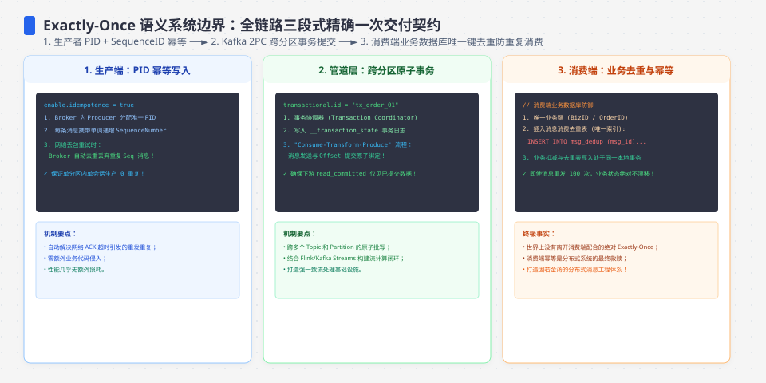
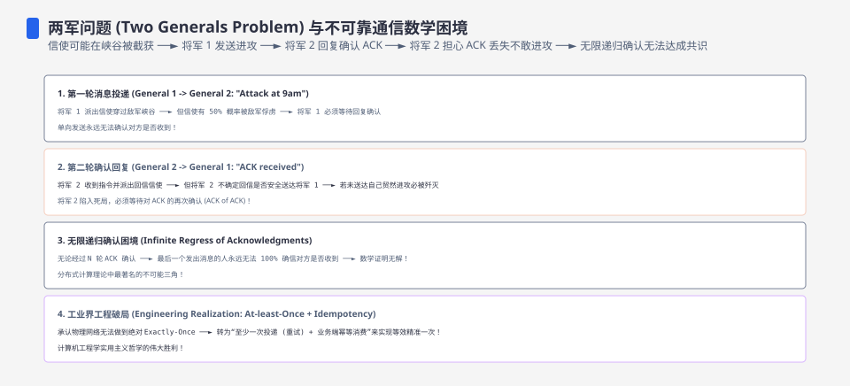
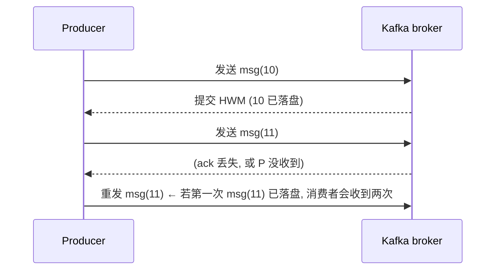
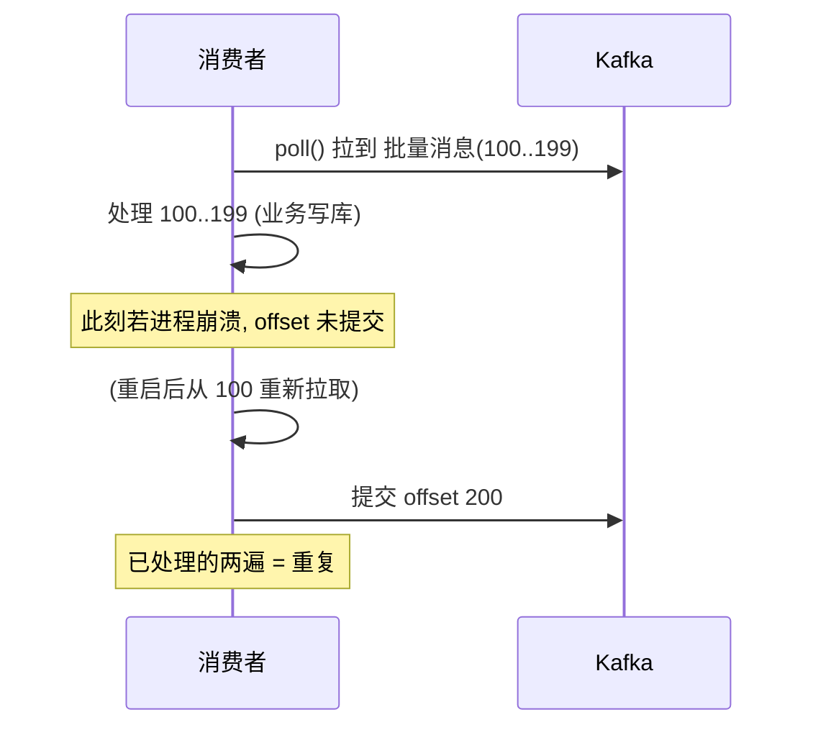
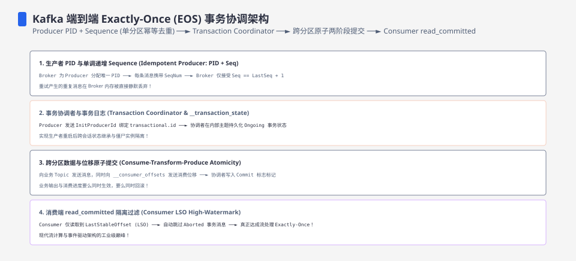
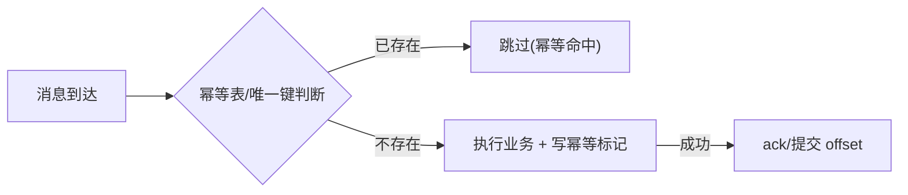

**TL;DR：** “exactly-once”必须先说清边界：**消息投递、Kafka 内部的读-处理-写、外部数据库副作用**不是同一个命题。at-least-once 加幂等能让重复业务效果无害；Kafka 事务可以在 Kafka 自身的读写边界内提交 offset 和输出，但不能自动把一个任意 HTTP 调用或数据库事务纳入同一原子提交。生产者 ack 丢失、消费者处理成功后 offset 未提交，仍会产生重放窗口。本文沿一条消息的一生，分别标出“重复交付”“重复处理”和“重复副作用”，再给出幂等键、inbox/outbox 与重试边界。


---



## 一、三分法为什么是半真半假

教科书把投递语义切成三种：at-most-once（最多一次）、at-least-once（至少一次）、exactly-once（恰好一次）。听起来三选一，但真相是：

- **at-most-once**：发送方发了就忘、失败就丢——可用，但会丢数据。
- **at-least-once**：发送方发了之后一直重试到确认——**不丢，但可能重复**。
- **exactly-once**：必须限定观察边界。协议可以在某个系统内部提供更强的事务语义，但“消费者的外部业务效果只发生一次”需要额外的原子性或幂等设计。

先记住这个判定：**有没有办法从“至少一次交付”变成“业务效果恰好一次”？** 常见答案是在消费侧做幂等，或者把 offset 与业务写入放入同一个可验证的事务边界。工程上最常见的套餐仍是 **at-least-once 传输 + 幂等业务效果**，但 Kafka 内部事务、同库事务和跨外部服务的合同必须分别说明。




## 二、Producer：ack 确认窗口里藏着第一道重复

消息从生产者出发。Kafka 的生产者在"已发送"和"确认已落盘"之间有一个窗口。举例：



- 生产者把 ack 丢失当成失败，于是重发同一条消息。
- **重复窗口在此已经打开**：Kafka 的幂等生产者（`enable.idempotence=true`）可以抑制同一生产者会话内的重发重复；事务生产者再配合稳定的 `transactional.id`、事务提交和 fencing，可以把 Kafka 内部的输出与事务状态纳入更强的 EOS 合同。若只启用会话级幂等，重启、身份配置和事务边界仍需单独验证，不能把它外推成外部业务只执行一次。

但行业对“exactly-once”的日常理解通常是“消费者的业务效果只发生一次”，而 producer 的去重只覆盖消息写入边界，无法独自闭合这个命题。

## 三、Consumer：offset 提交窗口才是最大的重复源

消费者侧的定义窗口：**处理完一条消息之后、提交 offset 之前**。



**处理与提交之间的任意崩溃 = 重新消费 = 重复处理**。这是 at-least-once 的固有形态，任何消息系统（Kafka/RabbitMQ/Pulsar）都躲不开。区别只在窗口大小：

| 提交策略 | 窗口 | 后果 |
| :--- | :--- | :--- |
| 每处理一条就提交 | 极小（毫秒） | 性能差，但重复窗口小 |
| 批量处理完再提交 | 大（秒级） | 吞吐高，重复窗口大 |
| 先提交 offset 再处理 | 最大 | 处理前崩溃会丢消息，重启后不会从这条重新消费 |

`auto.offset.reset=earliest` 只定义“没有可用已提交 offset 时从哪里开始”，不是提交时机，也不是 exactly-once 开关。提交策略必须和丢失/重复的取舍一起写进消费合同。

**工程结论：把 offset 提交窗口当作"设计好的重复窗口"对待**——窗口多大，系统就要能吞多大。




## 四、幂等消费：把重复变得无害

既然重复无法根除，正确的写法是**接受重复并把重复变无害**。两个核心套路：

**① 业务幂等键（协商性幂等）**

```sql
-- 用唯一键 + INSERT ... ON DUPLICATE（或 INSERT IGNORE）
INSERT INTO orders(id, amount, status) VALUES ('order-123', 10, 'PAID')
ON DUPLICATE KEY UPDATE id=id;

-- 或用独立幂等表: 消费前先插幂等表, 已存在则跳过
INSERT INTO idempotency_keys(message_id) VALUES ('mq-msg-uuid-001');
-- 冲突则说明这条处理过, 直接消费成功语义
```

**② 数据本身幂等（如带版本条件的扣款，同一条重复请求无法再次满足条件）**

```sql
UPDATE accounts
SET balance = balance - 10, version = version + 1
WHERE user_id = 1 AND version = 5 AND balance >= 10;
-- 若这条已处理过，版本条件不再满足；必须检查 0 行是幂等命中、余额不足还是并发冲突
```

把这两招放进图片里，一条消息的生命走到"处理"之后，重复到达就只是"无害的分身"：



**幂等的两个元原则**：(a) 幂等键要能天然来自业务（order_id、user_id+amount），不要用"随机生成的 message_id"，因为重放环境里 message_id 可能一致但业务影响要判断；(b) 幂等写必须与业务写在**同一个事务**里（否则幂等表写了但业务没写，或反之）。

## 五、Kafka EOS 与外部副作用不是同一个合同

Kafka 官方文档里的 **EOS（Exactly-Once Semantics）** 主要描述 Kafka 事务生产者、消费者 offset 和 Kafka 输出之间的事务边界。它不是“Kafka broker 自动和任意业务库/HTTP 服务组成跨系统事务”。把它拆成三层更不容易误读：

- **Kafka 写入边界**：幂等 producer 抑制符合协议的重试重复；事务 producer 通过 `transactional.id`、producer epoch/fencing 和 commit/abort 管理 Kafka 内部事务。
- **Kafka read-process-write 边界**：消费者把输出 records 与消费 offset 放在 Kafka 事务中提交，Kafka 侧可以观察到原子提交/隔离语义；仍要配置 `isolation.level`、事务超时和错误恢复。
- **外部副作用边界**：消费消息后调用业务库、支付 API 或邮件服务，不会因为 Kafka 事务自动回滚。需要同库 inbox/业务事务、outbox、可查询的幂等键或补偿流程，并处理“外部调用成功但 offset 未提交”的未知结果。

所以更准确的说法是：Kafka EOS 能把一部分“读取 offset + 写 Kafka 输出”的重复窗口纳入 Kafka 内部事务；一旦边界跨出 broker，业务通常仍要用“可重放输入 + 自管幂等/事务/补偿”闭合效果。不要用“Kafka exactly-once”代替外部系统的成功定义。

| 副作用位置 | 可用机制 | 仍需证明的失败点 |
| :--- | :--- | :--- |
| 只写 Kafka | Kafka transaction + committed offset | fencing、事务超时、abort 后重放、下游 `read_committed` |
| Kafka + 同一个数据库 | inbox/业务写/offset 记录在同一 DB transaction（或 CDC/outbox） | DB 提交成功后进程崩溃、重试读到已处理键、清理策略 |
| Kafka + 外部 HTTP/支付 | 幂等请求键、供应商幂等合同、状态查询与补偿 | 请求超时但对方已成功、重复扣款、不可逆副作用 |

## 六、落地清单

| 层 | 做法 | 兜底 |
| :--- | :--- | :--- |
| 生产者 | `enable.idempotence=true`；设计"发再重发"策略与超时 | 请求级幂等键 |
| 消费者 | 批量提交 offset；把重复窗口设计进容量 | 批量内重读可容忍 |
| 业务 | 幂等表或唯一键 + 同事务写 | 把重复从"错误"变成"无害" |
| 观测 | 幂等命中率、消费端延迟 | 幂等表就是一个数据库 |
| 外部副作用 | 请求幂等键、状态查询、补偿队列 | 超时不等于失败；保留未知结果并可人工处置 |

## 七、结论：exactly-once 必须落到边界、幂等与提交时序

“恰好一次”不是一个脱离边界的总开关。Kafka 可以在自己的事务边界内协调 output 与 offset；业务效果是否只发生一次，要看幂等键、数据库事务、outbox/inbox、供应商合同和补偿流程。窗口仍然存在：producer 的 ack/重试窗口、consumer 的处理/offset 窗口、外部调用的未知结果窗口。工程答案是**先写清观察边界，再设计可重放输入、幂等效果和恢复动作**。

下一步：为一条核心消息画出“Kafka input → 业务写 → offset → 外部副作用”的时序，逐个注入进程崩溃、ack 丢失、事务 abort、DB 提交后断开和 HTTP 超时；每个结果都标成“可重试/已成功/未知/需补偿”，再决定是否真的能对外承诺 exactly-once effect。

## 参考资料

1. Kafka 官方文档：Exactly-Once Semantics—— https://kafka.apache.org/documentation/#semantics
2. Kafka 官方文档：幂等生产者（enable.idempotence）—— https://kafka.apache.org/documentation/#producerconfigs
3. RabbitMQ 官方文档：Reliability（ack 与死信）—— https://www.rabbitmq.com/docs/reliability
4. 经典文章：The Trouble with Distributed Systems（Kleppmann, DDIA 第 8 章）—— https://dataintensive.net/

> 延伸阅读：本主题的两个切口——"发完再失败"的重试如何引爆，见[重试会放大一切错误：幂等性工程的完整账本](/writing/idempotency-engineering)；"多个库要原子改"与 Outbox 方案，见[分布式事务：2PC 为什么没人敢用](/writing/distributed-transactions-2pc-saga)；分布式系统的顺序与乱序问题，见[时间戳会骗人：时钟回拨与分布式系统的顺序幻觉](/writing/clock-skew-distributed-systems)。
