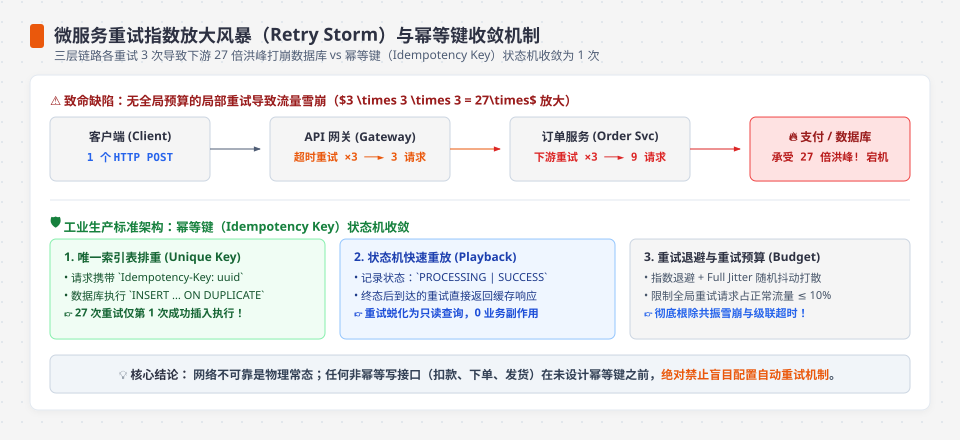
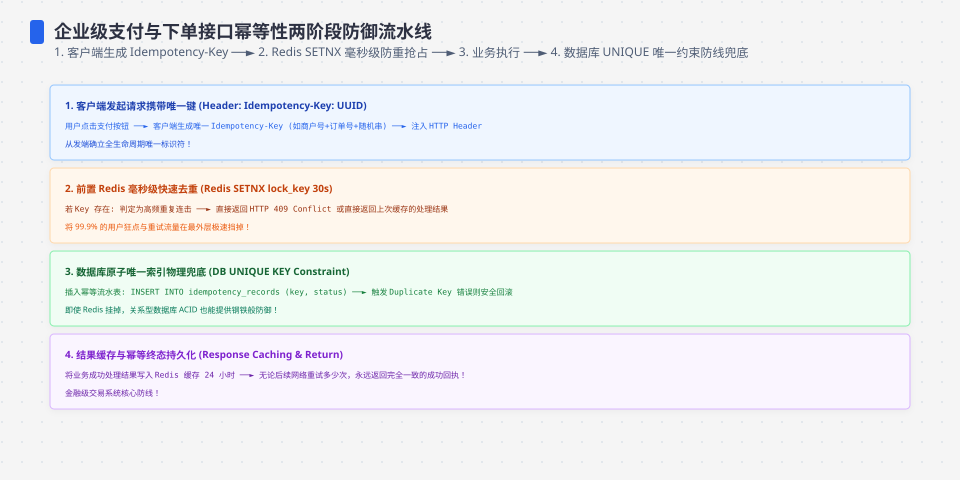
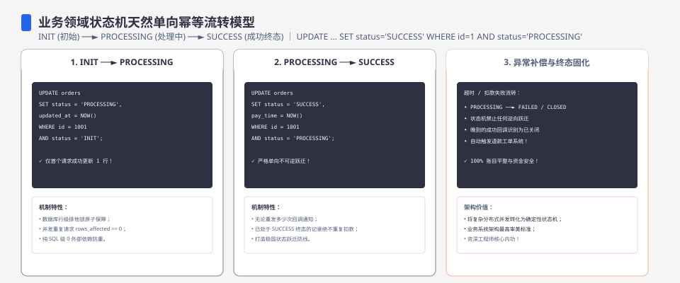
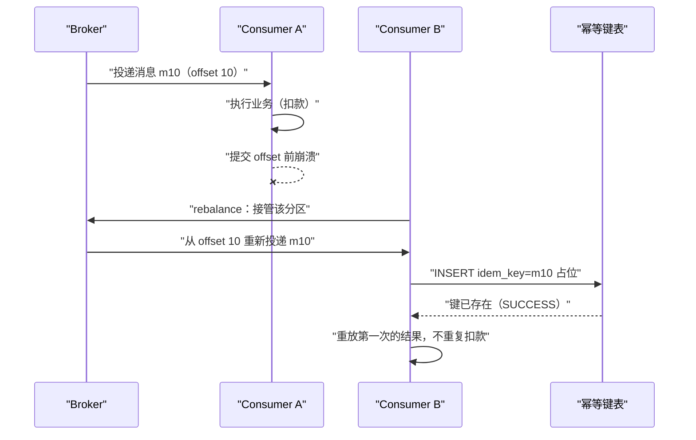
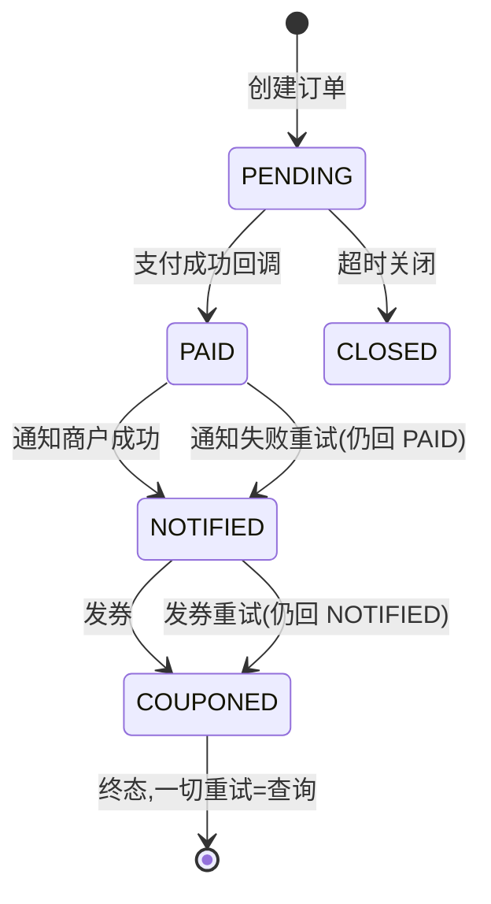
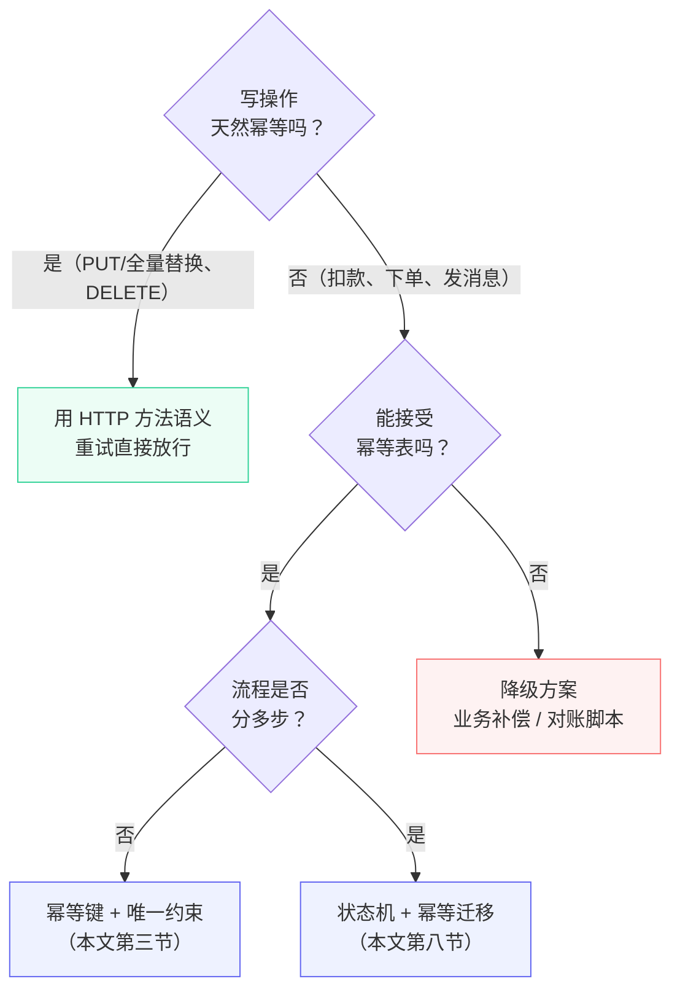

**TL;DR：** 请求可能已经执行、但响应没有到达；重试次数也不是固定常数。若客户端、网关和服务三层各自最多发起 3 次尝试，**27 是这个配置下的乘法上界，不是线上观测值**。幂等性工程也不是一句“只执行一次”就能覆盖所有副作用：单一权威数据库里的唯一约束可以裁决 claim，状态机可以表达进行中和终态，跨支付方或消息系统的结果未知仍需要对账、供应商幂等键或补偿。选型先问：写操作的权威效果在哪个事务边界内？再决定使用 HTTP 语义、幂等键、状态机还是对账。

## 一、重试的必要与代价

先承认一个前提：**网络故障与超时不可避免会出现**——丢包、对端 GC 停顿、负载均衡摘除、机器崩溃重启，都会让请求"发出去了但没收到响应"。客户端有时只能靠重试自救，但重试要付出三重代价：

1. **放大**：每一层都可能再次尝试。若请求 → 网关（最多 ×3）→ 服务 A（最多 ×3）→ 服务 B（最多 ×3），理论上界是 `3 × 3 × 3 = 27` 次；真实次数还受 deadline、熔断和错误分类影响；
2. **超时叠加**：各层的 attempt timeout、退避和调用 deadline 必须相容；把每层都设成固定 3 秒并不会自动得到一个可用的用户体验预算；
3. **语义破坏**：可安全重试的读操作也要先确认没有关键副作用；写操作若没有幂等合同，则可能重复扣款、下单或发消息。



*图注：非幂等写路径上，重试次数会按配置相乘；在单一权威存储的语义范围内，幂等键可以让重复请求重放同一个结果，但不自动覆盖外部副作用。*

三个工程事实需要同时记住：**超时并不代表请求没执行**（响应丢失 ≠ 未处理）；**"重试就能解决"的假设在写路径上不成立**；**exactly-once 只在明确的事务/系统边界内有意义**。跨越网络、支付方或外部消息系统时，常见做法是至少一次投递 + 幂等化 + 对账，而不是用一句 exactly-once 覆盖未知结果。目标不是消灭重试，而是让重试的副作用可裁决、可重放或可补偿。




## 二、HTTP 方法语义：RFC 9110 怎么说

动手建幂等表之前，先白捡一个零成本方案：**有些操作根本不需要幂等键，HTTP 方法语义已经保证了重试安全。** RFC 9110 §9.2.2 给了权威定义：

> "A request method is considered 'idempotent' if the intended effect on the server of multiple identical requests with that method is the same as the effect for a single such request. Of the request methods defined by this specification, PUT, DELETE, and safe request methods are idempotent."
>
> —— RFC 9110：https://www.rfc-editor.org/rfc/rfc9110.html#section-9.2.2

也就是说：PUT、DELETE，以及全部安全方法（GET/HEAD/OPTIONS/TRACE）是幂等的；**POST 不在其列**。这段定义的三个细节比定义本身更重要：

**第一，"幂等"承诺的是资源的终态，不是响应。** 原文紧接着补了一句 "though the response might differ"——DELETE 一个不存在的资源，第一次可能 200、第二次 404，但资源终态都是"不存在"，这就是幂等。所以别拿"响应一样不一样"去判断幂等，看的是"效果"。

**第二，幂等方法 ≠ 无副作用。** 同一段原文明确说：服务端可以"log each request separately, retain a revision control history, or implement other non-idempotent side effects"。扣款这种操作做成 PUT 也是幂等的——重复 PUT 不会重复扣，但每次请求都会被记账、进审计、触发回调。副作用允许存在，只要它们不改变资源终态。

**第三，RFC 把"自动重试"的资格交给幂等性。** 原文说幂等方法之所以被单独区分，是因为请求在客户端还没读到响应时可以自动重复；这正是第一节"放大"的对冲。反过来，RFC 对非幂等请求要求客户端不要在未确认语义幂等时自动重试，代理也不能把未知的非幂等请求当成安全重试。**网关层自动重试 POST 之前，必须有业务幂等合同，不能只看 HTTP 方法名。**

这一节的结论与第九节决策树的第一问呼应：写操作若确实是全量替换、删除这类可重放语义，HTTP 方法合同可以省掉一张专门的幂等表；资源版本、权限审计和其他副作用仍然要单独设计。

## 三、幂等键：唯一约束是最朴素也最可靠的闸门

幂等键（idempotency key）的思路：客户端为每次"业务上只该发生一次"的操作生成一个键，服务端在**明确的作用域**内落一笔记录——例如租户、操作类型和键的组合。数据库唯一约束可以在一个权威存储内裁决并发 claim，但不能替外部支付方或消息 broker 提供原子性。Stripe 的 API 文档是一个公开工程例子：客户端传 `Idempotency-Key` 头，服务端保存请求与结果，重复键按其合同重放或返回冲突。

```sql
CREATE TABLE idempotency_keys (
  id           BIGINT PRIMARY KEY AUTO_INCREMENT,
  scope        VARCHAR(128) NOT NULL,             -- 租户/操作/资源等作用域
  idem_key     VARCHAR(255) NOT NULL,
  request_hash CHAR(64)     NOT NULL,             -- 同键不同语义请求必须冲突
  status       VARCHAR(16)  NOT NULL,  -- IN_PROGRESS / SUCCESS / FAILED
  response     JSON,                   -- 第一次执行的结果,用于重放
  created_at   DATETIME(3) NOT NULL DEFAULT CURRENT_TIMESTAMP(3),
  lease_until  DATETIME(3) NULL,
  fencing_token BIGINT NOT NULL DEFAULT 0,
  UNIQUE KEY uk_idem_scope_key (scope, idem_key),
  KEY idx_idem_created_at (created_at),
  KEY idx_idem_claim_lease (status, lease_until)
) ENGINE=InnoDB;
```

下面是**关键流程节选**（扣款为例），省略了类型、驱动错误类型、响应编码和事务重试；它只适用于业务写入与幂等记录位于同一权威数据库事务中的情况。若 `debitTx` 调用的是外部支付方，不能把这段代码当成跨系统原子方案。

```go
func HandleDebit(ctx context.Context, scope, key, accountID string, amount int64) (*Receipt, error) {
    // 1. 开启事务:占位与执行业务必须落在同一事务(见正文规则),
    //    否则"占位成功但业务没执行"的间隙会被重试发现,导致重复扣款
    tx, err := db.BeginTx(ctx, nil)
    if err != nil {
        return nil, err
    }
    defer tx.Rollback() // 未走到 Commit 时兜底回滚(重复 Rollback 是安全的)

    // 2. 占位:唯一约束在 INSERT 执行瞬间生效(即时约束),
    //    所以并发重试仍然只有一个 INSERT 成功,事务内检测不受影响
    requestHash := hashDebitRequest(accountID, amount) // 规范化业务字段后计算
    _, err = tx.ExecContext(ctx,
        `INSERT INTO idempotency_keys (scope, idem_key, request_hash, status)
         VALUES (?, ?, ?, 'IN_PROGRESS')`, scope, key, requestHash)
    if err != nil {
        // 区分错误类型:只有唯一键冲突才算"键已存在"——
        // MySQL 错误码 1062(DUPLICATE ENTRY)。生产代码建议用驱动类型精确判断,
        // 例如 go-sql-driver/mysql 的 mysqlErr.Number == 1062 或 errors.Is;
        // 这里用错误文本匹配做示意,不额外引入依赖
        if !strings.Contains(err.Error(), "1062") {
            return nil, err // 其它错误:直接返回,不当作"键已存在"处理
        }

        // 3. 键已存在:事务里没有需要提交的写入,回滚后查已有记录,不重新执行
        tx.Rollback()
        rec, err := findByIdemKey(ctx, scope, key)
        if err != nil {
            return nil, err
        }
        if rec.Status == "SUCCESS" {
            return rec.Receipt, nil // 重放第一次的结果
        }
        return nil, ErrDuplicateInProgress // 仅适用于另有已提交 claim 的状态机模型
    }

    // 4. 第一次执行真正业务(扣款):debitTx 使用 tx 上的同一连接,与占位同事务
    receipt, err := debitTx(ctx, tx, accountID, amount)
    status := "SUCCESS"
    var resp any = receipt
    if err != nil {
        status, resp = "FAILED", err // FAILED 允许客户端换键重试
    }

    // 5. 回填结果(用相同键 UPDATE 自己占的那行,仍在同一事务)
    if _, err := tx.ExecContext(ctx,
        `UPDATE idempotency_keys SET status=?, response=?
         WHERE scope=? AND idem_key=? AND request_hash=?`, status, resp, scope, key, requestHash); err != nil {
        return nil, err
    }

    // 6. 提交:占位、业务、回填要么全部生效,要么全部回滚
    if err := tx.Commit(); err != nil {
        return nil, err
    }
    return receipt, err
}
```

四个细节决定这套代码的成败：

- **事务边界必须诚实**——若幂等表在 MySQL 而业务在另一个库或支付方，两者之间就不是原子的；此时需要外部系统的幂等键、outbox、回调状态机和对账，不能套用“同一事务”；
- **`IN_PROGRESS` 只属于已提交 claim 的模型**：上面的单库同事务流程在提交前崩溃会回滚占位，不会留下死行；若选择先提交 claim 再异步执行，才需要 lease、接管者和未知结果合同；
- **`FAILED` 语义**：是否允许用新键重试取决于业务失败是否已经产生外部副作用；不能仅凭一个字符串状态判断安全；
- **请求体指纹**（request_hash）：同一键配不同请求体必须拒绝，防止客户端 bug 复用键；指纹怎么算才稳定，见第四节。

### 一个常见的误解：INSERT 幂等键表失败不代表请求重复

把"INSERT 报错"直接当成"键已存在"，是幂等键实现里最常见的错误——这正是上面 `HandleDebit` 里区分 1062 与其它错误的原因。INSERT 失败至少有两种完全不同的来源：

- **唯一键冲突（MySQL 错误码 1062）**——才是重复请求，可以安全地走"查表重放"；
- **网络中断 / 主库宕机**——服务端可能根本没执行（重试后 INSERT 会成功），也可能执行了但响应在路上丢了（重试后撞 1062）。此时结果**未知**，不是"重复"。

判定只有几行（生产代码建议用驱动类型精确判断，例如 go-sql-driver/mysql 的 `*mysql.MySQLError`）：

```go
var mysqlErr *mysql.MySQLError
if errors.As(err, &mysqlErr) && mysqlErr.Number == 1062 { // 唯一键冲突:键已存在 → 查表重放
    return replayResult(ctx, key)
}
return nil, err // 其它错误:结果未知 → 按重试语义处理,不是重放语义
```

把非 1062 错误误判成"键已存在"，重试会走上"查表重放"路径，而表中根本没有这行——该执行的操作永远没执行完；反过来把 1062 误判成其它错误，客户端换新键重试，同一笔业务会真的执行两遍。**1062 → 重放；其余 → 结果未知（重试，不重放）。**

本地演示：从仓库根目录运行 `cd experiments && go run ./idempotency`。它用一个互斥锁模拟“唯一约束 + 结果重放”，20 个并发调用中只有 1 次首次执行；它没有数据库、进程崩溃、重启、外部支付或多实例证据，只能证明这个教学模型的输出。2026-08-17 本机原始输出保存在 `evidence/idempotency-engineering/2026-08-17-local/`。

真实数据库版在 `experiments/idempotency-db/main.go` 里复用同一套 `HandleDebit` 流程（INSERT 占位 → 执行 → 回填 → 提交），连博客本机的 MySQL 8（`blog-mysql`，端口 13306，库 `idemtest`，`UNIQUE KEY uk_idem_scope_key (scope, idem_key)`）。从仓库根目录运行：

```bash
cd experiments && go run ./idempotency-db
```

2026-08-19 本机三幕实测：

```text
幕1 并发100同key同指纹: created=1 replayed=99 in_progress=0 幂等表行数=1 扣款次数=1
幕2 同key异指纹: conflict（期望 conflict）
幕3 重建连接后同指纹重放: replayed 扣款次数=1（期望保持 1）
```

三幕分别验证了文章里三个论断：并发重试下唯一约束只放行 1 次首次执行（1062 裁决，其余 99 个重放同一结果）；同键配不同 `request_hash` 被显式拒绝而不是静默重放（第四节指纹合同的运行时执行）；进程重启（重建连接池）后幂等记录仍在，重放不重复扣款。原始输出、逐步命令与 go-sql-driver/mysql 版本见 `evidence/idempotency-engineering/2026-08-19-local/`。这个实验证明的是单库同事务模型（占位、扣款、回填同事务提交）；它仍然不证明跨库/外部支付方原子性、多实例并发或真实扣款通道语义。




## 四、请求指纹的工程细节：同键不同请求体，怎么才算"不同"

request_hash 的用途是拒绝"同一个幂等键、不同的请求体"——但"请求体"怎么定义，决定指纹是可靠的还是纸糊的。最容易犯的错是直接对客户端传来的原始字节做哈希：客户端序列化的字段顺序不同（`{"amount":1}` vs `{"amount":1,"currency":"cny"}` 缺字段）、数字格式不同（`1` vs `1.0`）、易变字段抖动，都会让同一笔业务算出两个指纹，然后被误判为"同键不同请求体"而拒绝。

正确做法是**服务端规范化后再哈希**：把请求体解析成固定结构体，只对"业务语义字段"重新序列化，易变字段全部排除：

```go
// 请求指纹：只对"业务语义"字段做哈希。
// 时间戳、trace_id、随机数、客户端版本这类不属于业务效果的字段通常不进指纹，
// 否则同键同业务会因为字段抖动被误拒
type debitRequest struct {
    AccountID string `json:"account_id"`
    Amount    int64  `json:"amount"`
    Currency  string `json:"currency"`
}

func fingerprint(req *debitRequest) string {
    canonical, err := json.Marshal(req) // 结构体字段顺序固定，序列化字节稳定
    if err != nil {
        panic(err)
    }
    sum := sha256.Sum256(canonical)
    return hex.EncodeToString(sum[:])
}
```

规范化有两条边界值得单独说明。**数字精度**：金额用 int64 分而不是 float，`100.0` 与 `100` 在 float 序列化下可能不一样，整数分则稳定。**数组顺序**：取决于业务语义——购物车 SKU 列表的顺序本身是语义（用户排的序），保留；标签集合的顺序不是，先排序再哈希。拿不准就按"服务端解析后的结构是否相同"来判定，而不是"字节是否相同"。

还有一条纪律：**幂等键本身不进指纹**——它本来就是区分请求的维度，算进去只会让"同键"这个概念自相矛盾。

## 五、幂等键的卫生：TTL、清理与回收

幂等表不是建完就不管的表。每笔业务一行，日单量百万时一年就是三亿行，所以它必须回答三个问题：过期行怎么清、死行怎么接管、保留期怎么定。

**保留期与重放窗口的关系** 是设计基准：客户端最晚什么时候还会重试，幂等行就要活到什么时候。退避、调用 deadline、客户端重启和人工重放都要计入窗口；“7 天”不是通用默认值，必须由业务风险、退款/对账窗口和存储成本决定。**保留期短于重放窗口，超期后的重试就可能再次执行**——“重放”和“重执行”的分界线就是权威记录是否仍然存在。

**过期清理**：按带索引的时间列分批删除，避免一次长事务。分区可以降低清理成本，但数据库对分区表唯一键有额外约束，不能把下面的表定义直接复制到所有 MySQL 版本：

```sql
-- 7 天只是示例窗口；生产值必须来自重放/对账合同。
-- 分批删除（每批 1000 行，避免长事务锁）
DELETE FROM idempotency_keys
 WHERE created_at < NOW(3) - INTERVAL 7 DAY
 LIMIT 1000;
```

**已提交 claim 的 `IN_PROGRESS` 回收** 有两种职责：回收进程负责"清扫"，新请求负责"接管"。清扫是兜底，真正让业务自愈的是接管——只有在业务已经把 claim 独立提交、并且确认旧执行者不再拥有执行权时，才允许后来的请求用**条件 UPDATE** 把执行权抢过来。不要把固定 60 秒当作安全答案：lease 必须大于可证明的执行时间和续租容错，并且要考虑旧执行者恢复后的 fencing。

```sql
-- 伪 SQL：只有 request_hash 相同且 lease 已过期的请求才能竞争接管。
-- 影响行数 = 1 → 拿到新的 lease/fencing token；
-- 影响行数 = 0 → 别人已接管，或已有终态，回到"查表重放"分支。
UPDATE idempotency_keys
   SET status     = 'IN_PROGRESS',
       lease_until = ?,
       fencing_token = fencing_token + 1
 WHERE scope = ?
   AND idem_key = ?
   AND request_hash = ?
   AND status = 'IN_PROGRESS'
   AND lease_until < CURRENT_TIMESTAMP(3);
```

这个 UPDATE 的价值在于它把"判断 lease 是否过期"和"抢占执行权"合并成一条条件写入；两个并发请求最终只有一个能影响 1 行。但 lease 只能解决“谁可以继续尝试”的裁决，不能自动撤销已经发给旧执行者的外部请求；外部资源还必须检查 fencing token，或由供应商幂等键/对账承担未知结果。

## 六、没有单库可依赖时：Redis 版幂等键

第三节的整套方案默认"有一张可以放幂等表的单点数据库"。分库分表之后这个前提没了：幂等表跟着业务键分片，重试可能落在不同分片；性能敏感的场景下，每次操作多两次 SQL 事务也不划算。这时候 Redis 版幂等键是常见替代——占位和结果都放 Redis：

```bash
# 占位：键不存在才写入，SET 的 NX+EX 组合在 Redis 单命令内是原子的
redis-cli SET "idem:req_123" "IN_PROGRESS" NX EX 3600
# -> OK      ：拿到执行权，继续执行业务
# -> (nil)   ：键已存在，读结果键重放

# 第一次执行完成后，把结果写进结果键（TTL 与占位键一致）
redis-cli SET "idem:req_123:result" '{"status":"SUCCESS","receipt":"rc-42"}' EX 3600

# 重复请求：结果键存在就直接重放
redis-cli GET "idem:req_123:result"
```

与数据库版对比，差异全在一致性保证的形态上：

| 维度 | MySQL 幂等表 | Redis 版 |
| :--- | :--- | :--- |
| 原子占位 | 唯一约束，事务内 | SET NX EX，单命令原子 |
| 结果持久化 | 与业务同库同事务提交 | 结果键另写，业务与占位不原子 |
| 过期机制 | 自建清理任务 | 键自带 TTL |
| 崩溃语义 | 已提交 claim 需要 lease/fencing 或人工对账 | TTL 会释放键，但旧执行者可能仍在运行，不能称为天然安全 |
| 一致性前提 | 单库 | Redis 主从/集群，切换窗口有丢键风险 |
| 适用场景 | 业务库在手，强一致优先 | 无单点库、性能敏感、可容忍小窗口 |

两个必须写进代码的注意点。第一，**业务失败时占位键不会自动变 FAILED**：占位与业务不在同一事务里，业务失败必须通过状态写入、显式接管或对账决定下一步；简单 `DEL` 可能让仍在执行的旧请求与新请求并发产生副作用。第二，**Redis 的可用性窗口直接影响幂等性窗口**：主从切换丢失未同步的键、TTL 到期、网络分区或旧 worker 越过 lease，都可能导致重执行——这和 MySQL 版"单库事务"的保证不是一个量级，选它之前先确认业务能接受并补上 fencing/供应商幂等。

## 七、消息队列的重复消费：同一个幂等键问题的另一种形态

写路径的重复不只来自 HTTP 重试。消息队列把"重复"变成了默认行为：**at-least-once 投递下，消息可能被投递不止一次**，重复的来源有三个，全都在消费端可见：

1. **发送超时重投**：发送方超时后无法区分"没发出去"与"发出去了但 ack 丢了"，只能重投——这是所有 MQ 共通的重复来源；
2. **消费端崩溃**：处理完消息、还没提交 offset 就崩溃，重启后从最后提交的 offset 重放，已处理的消息再处理一遍；
3. **rebalance 转手**：consumer 加入/退出导致分区重新分配，新消费者从最后提交的 offset 继续消费，未提交的部分重复。

Kafka 的幂等生产者解决了其中一条的一半：在支持的版本和配置下，`enable.idempotence` 可以让 broker 按 producer ID 与分区序号抑制同一 producer session 的重试重复。官方文档同时强调了边界：进程重启拿到新 producer ID，或应用层自己重发，都不自动落在同一个去重合同内。至于 Kafka 事务 + `read_committed` 的 exactly-once，也主要覆盖 Kafka 内部的读写；消费端把消息写进外部系统的那一步，Kafka 事务管不到，版本和客户端配置还需现场核对。

所以消费端的账还是要自己算：



消费端去重和第三节的幂等键是**同构的**：消息里带上业务键（订单号、交易号），消费端把它当 `idem_key` 落幂等表或状态机，重复消息走"查当前状态"而不是"再执行一次"。区别只在入口：HTTP 重试靠客户端传键，MQ 重投靠消息自带键。把"每个环节各自去重"换成"消费端一处去重"，是消息链路最省事的幂等化方式。

## 八、状态机：让"结果"本身幂等

幂等键解决"同一请求只执行一次"，但业务里还有一类问题它管不到：**步骤间的重试**——比如支付回调流程：收到回调 → 更新订单 → 通知商户 → 发券，其中任何一步重试，前面的步骤会重复。解法是把业务流程建成**状态机**，为每个迁移定义前置状态和可观察结果，重试从"盲目重放步骤"变成"查当前状态并决定是否继续"：



核心规则是：**状态迁移必须有条件，终态要可重复读取**——`PAID` 收到重复支付回调不会"再付一次"，只是确认自己是 `PAID`。实现上状态迁移必须加条件（`WHERE status = 'PENDING'`），防止乱序迁移覆盖已确认状态：

```sql
-- 条件迁移:只有 PENDING 允许变为 PAID,重放/乱序不会覆盖终态
UPDATE orders SET status='PAID' WHERE id=? AND status='PENDING';
```

这套思路与[缓存一致性](/writing/cache-consistency)里的版本校验同构：**用"版本/状态"代替"时间/幂等"，把不可判定的重试变成可判定的查询**。

### 深化：状态迁移的并发安全

`WHERE status='PENDING'` 的条件迁移防得住"乱序覆盖终态"，防不住"读旧状态 → 判断 → 写"的三步非原子：多副本下两个节点同时读到 PENDING、同时迁移到 PAID，后写者覆盖先写者，而 WHERE 条件察觉不到"我读的是旧副本"。

两个最小方案：

1. **迁移事件也走唯一约束**：每次迁移落一条事件记录（表或队列），同一迁移只有一次能占位成功，谁先占位谁赢；
2. **乐观锁版本列**：`UPDATE orders SET status='PAID', version=version+1 WHERE id=? AND version=?`，影响行数为 0 即冲突，回到"重读状态 → 重放迁移"。

共同原则：**迁移的胜负由唯一约束或版本判定，不交给"读到旧状态"的信任**——重试从"可能重复执行"变成"只能赢一次"，与第三节幂等键的占位思想同构。

## 九、选型：幂等键、状态机还是 HTTP 语义？



| 方案 | 核心机制 | 覆盖场景 | 成本 |
| :--- | :--- | :--- | :--- |
| HTTP 语义幂等 | PUT/DELETE 的目标效果可重放 | 全量更新、删除 | 低（不另建幂等键，但仍需实现资源语义） |
| 幂等键 | 唯一约束 + 结果重放 | 单步写操作 | 中（表 + 流程） |
| 状态机 | 终态 + 条件迁移 | 多步流程 | 高（建模 + 迁移） |
| 补偿/对账 | 事后检测抵消 | 无法前置幂等时兜底 | 高（对账延迟） |

## 十、演练：故障注入清单

幂等性靠上线前排练验证，而不是等"重复扣款"上用户账单。把第二节到第七节讲过的每一条机制，都对应一个可以注入的故障：

| 注入动作 | 预期行为 | 靠哪条机制 |
| :--- | :--- | :--- |
| kill -9 正在处理的实例 | 在已提交 claim 的模型中，lease/fencing 或对账裁决下一步；同库事务模型则占位随事务回滚 | 第五节 claim 模型 |
| 同键同请求体重放 100 次 | 在单一权威存储的合同内最多一次 claim，其余拿到同一终态或明确处理中 | 唯一约束 + 重放 |
| 同键不同请求体 | 拒绝，不执行 | 第四节请求指纹 |
| 20 个并发同键请求 | 单库原子模型中只有一个权威 claim；其余重放或等待，不把外部副作用自动算成一次 | INSERT 占位 |
| 清空幂等表后重放旧键 | 重新执行一次——验证保留期边界 | 第五节保留期 |

最后一条最有信息量：它把"保留期 ≥ 重放窗口"变成可验证的规则。生产里出现"同一笔操作执行了两遍"时，第一件事不是只翻业务代码，而是同时查幂等行、清理任务、保留期和外部副作用记录——**如果行没了，可能是保留期设计、清理竞态或状态存储丢失，不能先验归因。**

## 十一、重试预算与 SLA

给"重试"本身装上限流阀：**重试必须有预算**（次数 × 退避上限），并且**超时与重试预算要写进 SLA**。

在每次尝试都独立受同一个延迟分位数约束、且忽略退避与排队的教学模型里，用户等待可近似写成 **P99 延迟 × 尝试次数**。例如 200ms × 5 = 1s 只是这个模型的算术，不是尾延迟上界；真实合同还要写调用 deadline、每次 attempt timeout、退避/jitter、重试条件和取消传播。SLA 上写"P99 200ms"并不等于用户体验 200ms，预算数字必须绑定同一条调用链和同一时间窗口。

退避策略一行建议：固定退避适合低并发、延迟不敏感的场景；指数退避 + jitter（`min(base × 2^n, cap)` 加随机化）通常更能分散重试风暴。要点不是背算法，而是让"次数、单次超时、退避上限、总 deadline"形成一个能在故障测试中兑现的预算。

这条纪律和[优雅停机的预算分配](/writing/graceful-shutdown-in-go)是同一种思维方式：**凡是有上限的资源，都先分预算，再谈实现**。

## 参考资料

1. Stripe API 文档：Idempotent Requests（幂等键的官方工程定义与语义）—— https://docs.stripe.com/api/idempotent_requests
2. PayPal Engineering Blog：Idempotency in Payment Processing（支付场景的状态机与幂等键实践）—— https://medium.com/paypal-tech/improving-our-idempotency-systems-57d0bc4f9bb4
3. AWS 官方文档：Making retries safe with idempotent APIs（幂等与重试预算）—— https://docs.aws.amazon.com/whitepapers/latest/build-secure-and-reliable-applications-aws/making-retries-safe-with-idempotent-apis.html
4. Distributed Systems Course（M. Kleppmann）：Exactly-once semantics 的不可实现性与 at-least-once + idempotency—— https://www.cl.cam.ac.uk/teaching/2122/ConcDisSys/dist-sys-notes.pdf
5. MySQL 官方文档：服务器错误参考（1062：ER_DUP_ENTRY 唯一键冲突）—— https://dev.mysql.com/doc/refman/8.0/en/error-messages-server.html
6. RFC 9110：HTTP Semantics §9.2.2（幂等方法定义与自动重试规则）—— https://www.rfc-editor.org/rfc/rfc9110.html#section-9.2.2
7. Apache Kafka 官方文档：Message Delivery Semantics（幂等生产者、exactly-once 边界与 at-least-once）—— https://kafka.apache.org/documentation/#semantics
8. Redis 官方文档：SET 命令（NX/EX 原子占位）—— https://redis.io/docs/latest/commands/set/
9. 本机教学模型（互斥锁）与 MySQL 8 实测分别落盘：`evidence/idempotency-engineering/2026-08-17-local/`（单进程模拟）与 `2026-08-19-local/`（真实唯一约束三幕）；数据库实验不覆盖 Redis、第三方支付方或多实例。

> 延伸阅读：重试放大的超时视角来自停机排空,见[SIGTERM 之后发生了什么:把优雅停机做成一件确定的事](/writing/graceful-shutdown-in-go)；主从延迟导致读旧数据时,幂等校验正是"读从 + 版本校验"的兜底,见[主从复制延迟 300ms 的账单:读路径设计的三种姿势](/writing/replication-lag-read-paths)；时钟回拨造成的重复与逆序,最终也靠幂等兜底,见[时间戳会骗人:时钟回拨与分布式系统的顺序幻觉](/writing/clock-skew-distributed-systems)。
