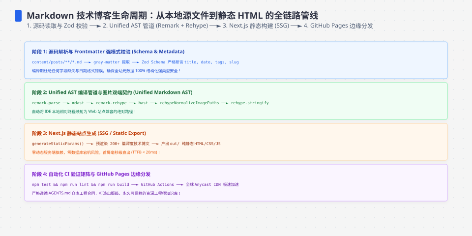
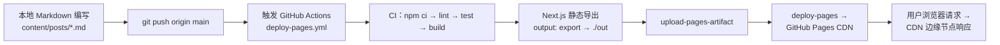
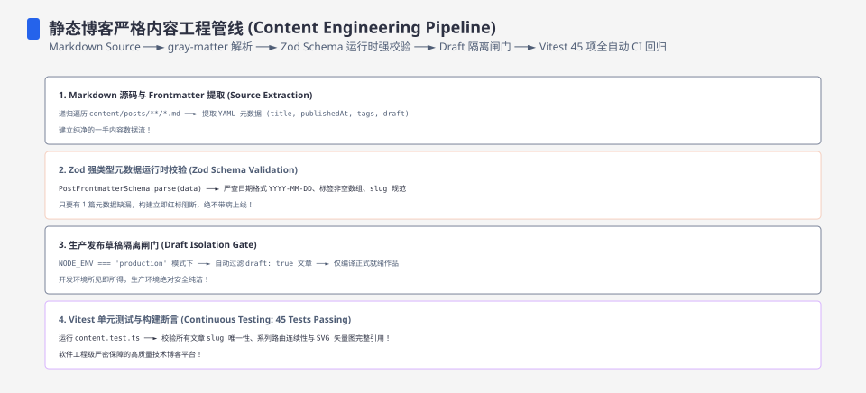
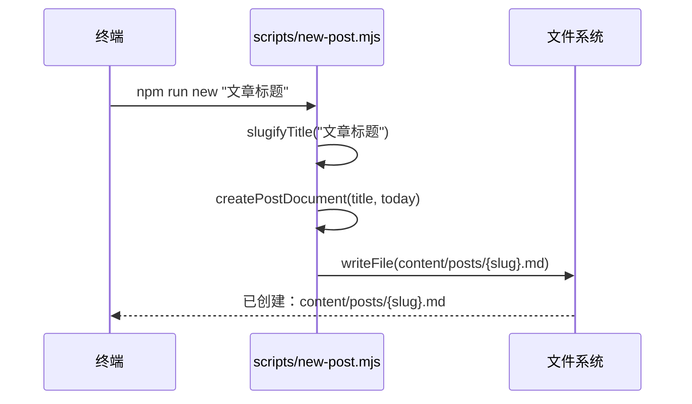
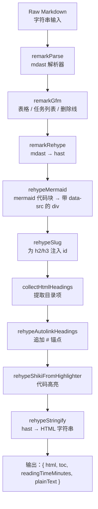
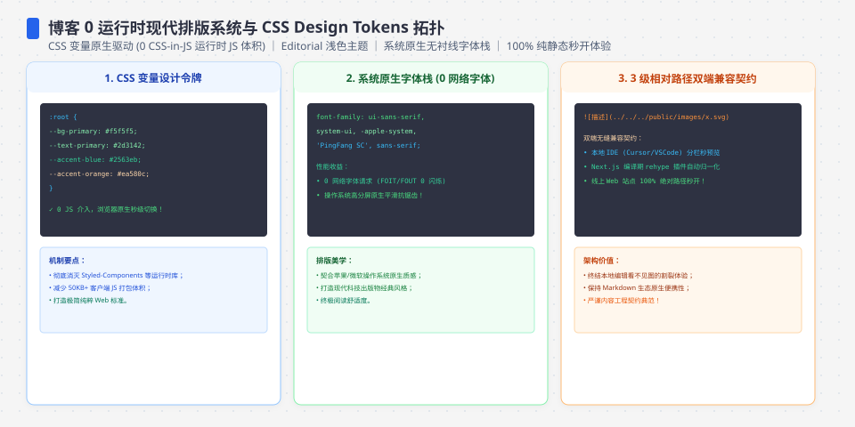
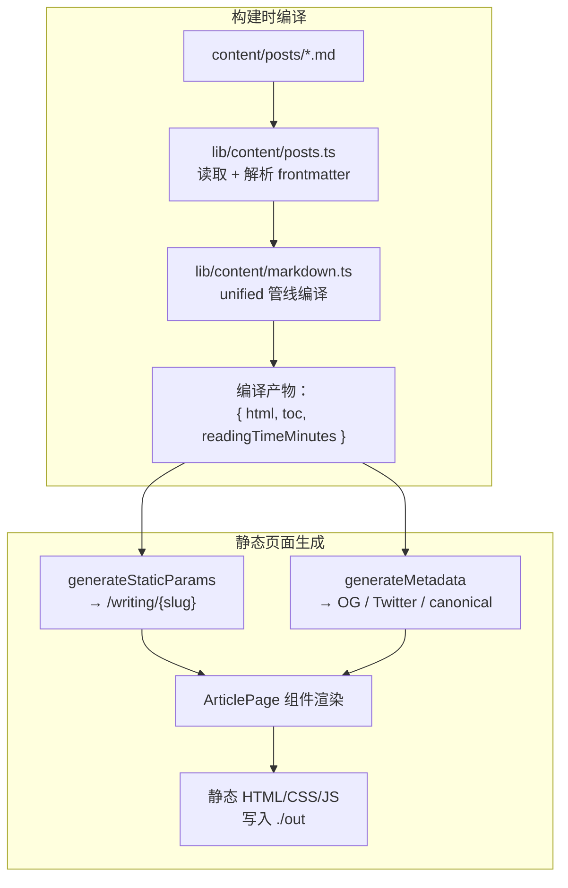
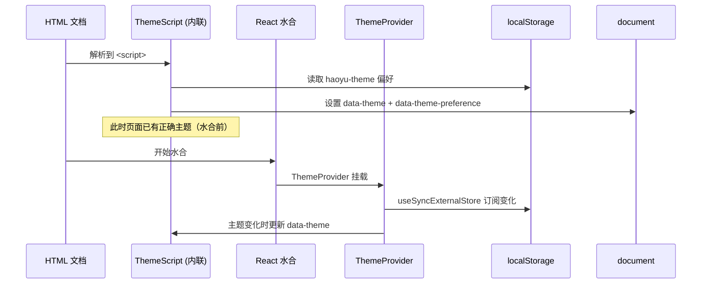
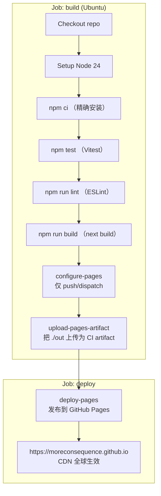
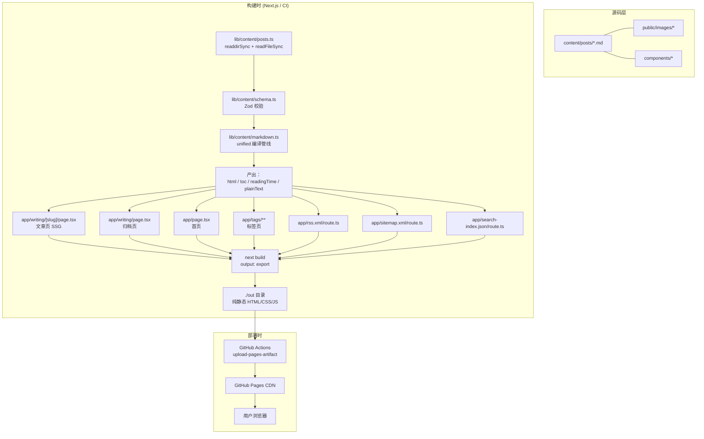

**TL;DR：** 这套博客系统由 `content/posts/` 目录下的 Markdown 文件驱动，经过 unified 编译管线转化为 HTML，由 Next.js 静态生成页面，最终通过 GitHub Actions 自动构建并部署到 GitHub Pages。全程无数据库、无 CMS、无运行时服务端。


---



## 一、 全链路总览

从敲下键盘到读者在浏览器中看到页面，一篇博客经历以下阶段：



整个过程没有运行时服务器。`next build` 在 CI 环境生成纯静态的 HTML/CSS/JS，上传到 GitHub Pages 后，通过它的全球 CDN 分发。




## 二、 触发：如何开始一篇新文章

### 2.1 脚手架：`npm run new`

运行 `npm run new "文章标题"`，调用 `scripts/new-post.mjs`：



生成的 Markdown 包含 YAML frontmatter 骨架：

```yaml
---
title: "文章标题"
description: "请在这里填写一句话摘要"
publishedAt: "2026-07-26"
tags: ["待整理"]
draft: true
featured: false
---
```

`slugifyTitle` 使用 Unicode 属性正则 `\p{Letter}` 和 `\p{Number}`，支持中文标题自动转成 kebab-case 文件名。

### 2.2 Frontmatter 的守门员：Zod 校验

在编译管线的起点，`lib/content/schema.ts` 用 Zod 定义了严格的 frontmatter 合约：

```typescript
const calendarDate = z.string().refine(isCalendarDate, "必须使用真实的 YYYY-MM-DD 日历日期");

export const postMetaSchema = z.object({
  title: z.string().trim().min(1),
  description: z.string().trim().min(1),
  publishedAt: calendarDate,
  updatedAt: calendarDate.optional(),
  tags: z.array(z.string().trim().min(1)).min(1),
  draft: z.boolean().default(false),
  featured: z.boolean().default(false),
  series: z.string().trim().min(1).optional(),
});
```

注意 `isCalendarDate` 不只是校验格式——它会用 `Date.UTC` 构造日期并逐字段比对，拒绝 2 月 30 日这类不存在日期。

## 三、 编译管线：从 Markdown 到 HTML

这是整个系统最核心的部分。位于 `lib/content/markdown.ts`，使用 unified 的 remark → rehype 管线：



### 3.1 代码高亮：Shiki 双主题方案

用 Shiki 4 配合 JavaScript 正则引擎（无 WASM 依赖），一次编译产出两个主题的 CSS 类名：

```typescript
.use(rehypeShikiFromHighlighter, highlighter, {
  themes: { light: "github-light", dark: "github-dark" },
  defaultColor: false,  // 关键：不内联颜色，交给 CSS 变量
})
```

`defaultColor: false` 意味着 Shiki 不在 `<span>` 上写死颜色值，而是生成 `style="--shiki-light: #..."` 这样的 CSS 变量。页面通过 `[data-theme]` 属性切换哪组变量生效：

```css
[data-theme="paper"] .article-prose pre code span {
  color: var(--shiki-light);
}
[data-theme="midnight"] .article-prose pre code span {
  color: var(--shiki-dark);
}
```

Highlighter 实例是单例模式，只初始化一次：

```typescript
let highlighter: ReturnType<typeof createHighlighter> | undefined;

export function createBlogHighlighter() {
  highlighter ??= createHighlighter({ ... });
  return highlighter;
}
```

### 3.2 目录提取与锚点

`collectHtmlHeadings` 是一个 rehype 插件函数，遍历 hast 树，收集所有 h2/h3 的 id、标题文字和层级深度，排除脚注标签。最终生成的 `toc` 数组传给 `TableOfContents` 组件，由 IntersectionObserver 驱动滚动高亮。

### 3.3 阅读时间与纯文本

`reading-time` 包计算分钟数（最少 1 分钟）。`plainText` 是粗暴但有效的去语法文本（去掉代码块、Markdown 符号），用于 Fuse.js 全文搜索。

### 3.4 源码解剖：一篇 Markdown 从文件到 HTML 的每一步

前面按主题讲了高亮、目录与阅读时间，这一节换个切法：按函数调用顺序把整条管线过一遍。同一个 `compileMarkdown`（lib/content/markdown.ts L93-135），九个插件各一步：

```typescript
// lib/content/markdown.ts L96-123（节选，autolink 与高亮选项已省略）
const file = await unified()
  .use(remarkParse)                                 // ① 字符串 → mdast
  .use(remarkGfm)                                   // ② 表格 / 任务列表 / 删除线
  .use(remarkRehype, { allowDangerousHtml: false }) // ③ mdast → hast
  .use(rehypeMermaid)                               // ④ mermaid 代码块 → data-src div
  .use(rehypeSlug)                                  // ⑤ 标题注入 id
  .use(collectHtmlHeadings(toc))                    // ⑥ 提取目录（只读）
  .use(rehypeAutolinkHeadings, { ... })             // ⑦ 追加 # 锚点
  .use(rehypeShikiFromHighlighter, highlighter, { ... }) // ⑧ 代码高亮
  .use(rehypeStringify)                             // ⑨ hast → HTML 字符串
  .process(markdown);
```

- ① **remarkParse**：字符串 → mdast 抽象树。它只做结构还原不做校验——"非法" Markdown 在这里只是被解析成某种结构，错误通常表现为渲染结果怪，而不是编译报错。
- ② **remarkGfm**：补 CommonMark 之外的 GitHub 方言（表格、任务列表、删除线、自动链接）。缺了它，表格会原样输出成竖线文本。
- ③ **remarkRehype**：mdast → hast 的 AST 转换。`allowDangerousHtml: false` 是关键安全选项：正文里的原始 HTML 被丢弃而不是透传——防止文章内容注入 `<script>`。
- ④ **rehypeMermaid**：构建期结构替换（核心代码见下），把 `<pre><code class="language-mermaid">` 换成带 data-src 的 div。注意它不解析图表语法——不认识 flowchart/sequenceDiagram，只认 class 名：

```typescript
// lib/content/markdown.ts L76-84（节选）
if (codeEl?.type === "element" && codeEl.tagName === "code" && classes.includes("language-mermaid")) {
  const text = (codeEl.children ?? []).map((c: MarkdownNode) => (c.value ?? "")).join("");
  parent.children![index] = {
    type: "element",
    tagName: "div",
    properties: { className: ["mermaid"], dataSrc: text },
    children: [{ type: "text", value: text }],
  };
  return;
}
```

源码文本同时放进 `dataSrc` 属性与 div 的文本子节点——后者让运行时能"还原"源码（主题切换时 MermaidRenderer 会读 `data-src` 重置内容，见 5.1）。

- ⑤ **rehypeSlug**：给 h2/h3 注入 id，锚点和目录都依赖它。
- ⑥ **collectHtmlHeadings(toc)**：遍历 hast 把标题的 id/文字/深度写进 toc 数组（L43-66），并用 `isFootnoteLabel`（L30-41）排除脚注标签。它只读不改——目录是编译的副产品，不是第二次解析。
- ⑦ **rehypeAutolinkHeadings**：给标题追加 `#` 锚点（behavior: "append"，content 是文本 `#`，L103-113）。它不生成目录——那是 ⑥ 的活。
- ⑧ **rehypeShikiFromHighlighter**：只处理代码节点，其余原样放行（选项细节见 3.1）。
- ⑨ **rehypeStringify**：hast 序列化成 HTML 字符串，管线出口。

`compileMarkdown` 的返回值（L125-134）交代了四个产物：`html` 交给 `ArticleBody` 注入；`toc` 驱动侧边栏目录；`readingTimeMinutes` 展示阅读时长；`plainText` 是去掉代码块与 Markdown 符号的粗糙纯文本，喂给 Fuse.js 搜索索引——搜索不依赖渲染后的 HTML，正是因为它用的是一份独立的文本。

进入管线前还有第 0 步：frontmatter 校验。`parsePostSource`（lib/content/posts.ts L10-45）用正则切出 `---` 块（L12-14），YAML 解析后交给 Zod（L31）：

```typescript
// lib/content/schema.ts L20-24（节选）
export const postMetaSchema = z.object({
  title: z.string().trim().min(1),
  description: z.string().trim().min(1),
  publishedAt: calendarDate,
  updatedAt: calendarDate.optional(),
```

`title`/`description` 拒绝空白串；`publishedAt` 走 `calendarDate`（L16-18），由 `isCalendarDate`（L5-14）背书：先用 `Date.UTC` 构造再逐字段比对，2 月 30 日这种"格式合法但不存在"的日期会被拒。校验失败不是警告而是抛错（L33-38 把每个 issue 拼进错误信息）——fail fast，坏 frontmatter 在构建期就死掉，而不是带病上线。注意 schema 不管正文：正文只走 markdown 管线，frontmatter 是唯一"机器必须读懂"的部分。

最后是排序与过滤。`readPostSources`（L62-76）读完全部文件后依次调用：

```typescript
// lib/content/posts.ts L47-60（节选）
export function sortPosts(posts: PostSource[]) {
  return [...posts].sort((a, b) =>
    b.meta.publishedAt.localeCompare(a.meta.publishedAt),
  );
}

export function filterPublished(
  posts: PostSource[],
  environment = process.env.NODE_ENV,
) {
  return environment === "production"
    ? posts.filter((post) => !post.meta.draft)
    : posts;
}
```

`sortPosts` 用 `localeCompare` 按 publishedAt 字符串排序——ISO 日期（YYYY-MM-DD）的字典序等于时间序，所以不需要解析成 Date。`filterPublished` 只在 production 过滤草稿：`next dev` 时草稿照常出现（本地预览可见），CI 构建（NODE_ENV=production）时被剔除——同一个函数两种行为，决定权在环境变量。注意这两步只操作元数据，不碰正文：真正编译发生在 `getAllPosts`（L82-97），且结果按环境缓存在 `compiledPostCache`（L104）里，保证同一构建中每篇 Markdown 只编译一次。




## 四、 静态生成：Next.js App Router 如何产出页面

### 4.1 文章页 `writing/[slug]/page.tsx`

这是一个全静态页面。`generateStaticParams` 在构建时遍历所有 Markdown 文件，生成静态路径：

```typescript
export async function generateStaticParams() {
  return getPostSources("production").map((post) => ({ slug: post.slug }));
}
```

页面渲染时，`ArticleBody` 接收预编译的 HTML，通过 `dangerouslySetInnerHTML` 注入。客户端组件 `CodeCopy` 和 `MermaidRenderer` 作为 side-effect 组件，增强已渲染的静态 HTML。



### 4.2 首页、归档页、标签页

| 路由 | 文件 | 功能 |
|------|------|------|
| `/` | `app/page.tsx` | 精选、最新、主题标签 |
| `/writing` | `app/writing/page.tsx` | 按年份归档 |
| `/tags` | `app/tags/page.tsx` | 所有标签索引 |
| `/tags/[tag]` | `app/tags/[tag]/page.tsx` | 某标签下的文章列表 |

首页通过 `featured` 标记筛选精选文章，取前 2 篇展示，最新 3 篇在下方列表，去重后取前 8 个标签做主题导航。

### 4.3 数据端点（同样是静态的）

四个端点都声明 `dynamic = "force-static"`，在构建时产出：

| 端点 | 功能 | 库模块 |
|------|------|--------|
| `/rss.xml` | RSS 2.0 Feed + CDATA 全文 | `lib/feeds.ts:createRssXml` |
| `/sitemap.xml` | XML Sitemap | `lib/feeds.ts:createSitemapXml` |
| `/search-index.json` | Fuse.js 搜索索引 | `lib/search.ts:buildSearchIndex` |
| `/robots.txt` | 搜索引擎指引 | `lib/feeds.ts:createRobotsTxt` |

搜索运行时在客户端进行。`SearchDialog` 组件挂载后异步 fetch `search-index.json`，用 Fuse.js 在浏览器端做模糊匹配，支持键盘导航：

```typescript
new Fuse(documents, {
  threshold: 0.36,
  ignoreLocation: true,
  keys: [
    { name: "title", weight: 0.42 },
    { name: "tags", weight: 0.25 },
    { name: "description", weight: 0.2 },
    { name: "text", weight: 0.13 },
  ],
})
```

## 五、 客户端运行时：增强静态页面

由于是纯静态站点，所有动态行为都发生在客户端。关键组件：

### 5.1 Mermaid 图表渲染

Mermaid 采用两段式架构：**构建期识别包裹，运行时渲染增强**。

**构建期：rehypeMermaid 插件。** 位于 `lib/content/markdown.ts` 的 `rehypeMermaid` 插件在 hast 树上找到 `<pre><code class="language-mermaid">` 结构，取出代码块源码文本，把整个 `<pre>` 替换成携带 `data-src` 属性的 `<div class="mermaid">`：

```typescript
// lib/content/markdown.ts:rehypeMermaid（节选）
if (codeEl?.type === "element" && codeEl.tagName === "code" &&
    classes.includes("language-mermaid")) {
  const text = /* 拼接 code 子节点的源码文本 */;
  parent.children[index] = {
    type: "element",
    tagName: "div",
    properties: { className: ["mermaid"], dataSrc: text },
    children: [{ type: "text", value: text }],
  };
}
```

**运行时：MermaidRenderer 组件。** `mermaid-renderer.tsx` 挂载后 `mermaid.initialize({ startOnLoad: false })` 手动接管，再调用 `mermaid.run({ querySelector: ".mermaid" })` 为每个 div 生成 SVG，并包裹上 Diagram/Source 双栏工具条；点击图表打开全屏 Portal 模态框，展示原始未缩放 SVG。渲染结果依赖主题 CSS 变量，组件用 MutationObserver 监听 `data-theme` 变化，切主题时把已渲染的 div 重置回源码文本后重新调用 `mermaid.run()`。

### 5.2 主题切换：零闪烁方案

主题系统由三部分协作：

1. **`ThemeScript`**：作为内联 `<script>` 放在 `<head>` 最前面。在 React 水合之前从 `localStorage` 读取偏好，设置 `data-theme` 属性，彻底消除 FOUC。
2. **`ThemeProvider`**：客户端 Context Provider，管理偏好状态，监听系统颜色方案变化。
3. **CSS 变量**：两个主题 `paper` 和 `midnight` 定义在 `:root` 和 `[data-theme="midnight"]` 下，所有组件引用 `var(--accent)` 等变量。



### 5.3 阅读辅助

文章排版为固定最优值（正文 1rem、行距 1.85、内容宽 960px），不做用户可调项——博客读者就是作者本人，调节功能是伪需求。

`ReadingProgress` 监听 `scroll` 事件，在页面顶部显示渐变进度条。

### 5.4 一个常见的误解：Markdown 是在浏览器里解析的

**变体一："rehype 插件在运行时执行 mermaid 渲染"。** 不——`rehypeMermaid`（lib/content/markdown.ts L68-91）是构建期插件，只做结构识别：把 mermaid 代码块替换成带 data-src 的 div（L78-83），一个语法字符都不解析；真正的渲染在客户端，由 `MermaidRenderer` 挂载后调用 `mermaid.run({ querySelector: ".mermaid" })` 完成（mermaid-renderer.tsx L96）。**变体二："前端组件在浏览器里解析 Markdown"。** 也不对——构建期管线已把整篇正文转成 HTML 字符串，浏览器收到的页面里没有任何 Markdown 源文本，`ArticleBody` 注入的是编译产物（app/writing/[slug]/page.tsx L85），客户端只做增强（复制按钮、图表、主题切换、阅读控制），不做解析。解析留在构建期，换来的是零运行时解析开销，以及一份搜索引擎可以直接抓取的静态 HTML。

## 六、 构建与部署：GitHub Actions 全自动

### 6.1 next.config.ts

```typescript
const nextConfig: NextConfig = {
  output: "export",
  trailingSlash: true,
  images: { unoptimized: true },
};
```

`output: "export"` 意味着 `next build` 输出纯静态文件到 `./out` 目录，不产生任何 Node.js 服务端代码。

### 6.2 CI/CD 工作流

`.github/workflows/deploy-pages.yml` 定义了两阶段任务：



关键细节：

- **Test gate**：`npm test` 在 `npm run build` 之前运行，测试失败则构建被阻断，不会部署。
- **Lint gate**：`npm run lint` 也在 build 前执行；代码规则错误不会进入 Pages artifact。
- **Artifact gate**：`configure-pages`、`upload-pages-artifact` 和 deploy 只在 push/手动触发时继续；Pull Request 只验证 build job，不覆盖线上环境。
- **PR 保护**：Pull Request 触发 build job（跑测试和构建验证），但跳过 `configure-pages` 和 `deploy`，不会意外覆盖线上环境。
- **并发控制**：`concurrency: group: pages` + `cancel-in-progress: true`，新的推送自动取消正在运行的前一次部署。

### 6.3 推送即发布

开发者在 `main` 发布路径上通常只需要提交并推送：

```bash
git add -A && git commit -m "新文章" && git push
```

之后可以在 GitHub 仓库的 Actions 标签页查看实时日志：

1. `build` 任务：安装依赖 → 测试 → lint → 构建 → 上传 Pages artifact
2. `deploy` 任务：等待 build 成功后发布 artifact，并回写 Pages 环境 URL

具体耗时应以目标 commit 的 Actions 日志为准。本文没有保存一份稳定的 CI 时间基线，因此不把“几十秒”或“几分钟”写成发布合同。

## 七、 架构全景图



## 八、 关键设计决策

### 8.1 为什么不用数据库 / CMS / ISR？

静态导出意味着零运行时依赖、零安全补丁、零服务器费用。对于个人技术博客（每周 1-2 篇更新），ISR 的按需重验证没有意义——所有页面在构建时就已经确定了。

### 8.2 为什么不用 MDX？

纯 Markdown + 统一编译管线更可控。MDX 引入 JSX 运行时复杂度，而本博客需要的扩展（Mermaid、代码高亮、图片点击放大）都可以通过客户端 side-effect 组件实现，不需要侵入内容格式。

### 8.3 为什么缓存编译结果？

`getAllPosts` 在单个构建中可能被多次调用（文章页、归档页、RSS、Sitemap、搜索索引）。`compiledPostCache` 是一个简单的 `Map<string, Promise<CompiledPost[]>>`，确保每篇 Markdown 只编译一次：

```typescript
const compiledPostCache = new Map<string, Promise<CompiledPost[]>>();
```

### 8.4 为什么不用 Hugo / Astro 这类纯 SSG？

这套系统的内容管线（unified + remark + rehype + Zod + 阅读时间 + 搜索索引）全部跑在 Node.js/TypeScript 里。选 Next.js 静态导出的理由不是"Next.js 更强"，而是**内容管线已经在这个生态里，换引擎等于重写管线**。把三种方案摊开对比：

| 维度 | Next.js 静态导出 | Hugo | Astro |
| :--- | :--- | :--- | :--- |
| 内容管线 | unified/remark/rehype，npm 生态直接复用 | Goldmark，插件用 Go 模板或 Hooks | remark/rehype 可用，但受框架管线约束 |
| 交互增强 | React 客户端组件 + 水合（本文档的 Mermaid 渲染器、主题切换、复制按钮都靠它） | 模板语言，交互要靠手写 JS | 岛屿架构，可以挂框架组件，但集成成本高于 App Router |
| 目录 / 高亮 / 阅读时长 | 同一份 Node 代码在构建期算出 | 需要模板语言或外部工具重新实现 | 需要跟着框架的集成方式重做 |
| 构建速度 | 全量编译；耗时取决于文章数、Shiki、Next 页面数量和 CI 机器 | 增量构建极快 | 增量构建快 |
| 依赖体积 | node_modules 数百 MB | 单二进制，无依赖 | 比 Next.js 轻 |
| 内容格式 | 任意：Markdown / MDX / JSON 均可驱动 | Markdown 一等公民 | Markdown 一等公民 |

诚实地讲，Hugo 和 Astro 在构建速度与依赖体积上全面占优——个人博客量级下，那两点的优势完全用不上，而"交互增强要跨出框架生态重写"的代价却要立即支付。这套博客的关键交互（矢量图渲染、双主题切换、代码复制）全是 React 组件，保留 App Router 意味着这些组件零迁移成本。**选型的判据不是"谁构建更快"，而是"内容管线和交互代码，换引擎后要重写多少"。** 后者为零，才是静态导出选 Next.js 的真正理由。

### 8.5 图片策略：为什么 SVG 优先、为什么关掉图片优化

6.1 里 `images: { unoptimized: true }` 是一行容易误读的配置。它的直接原因是：`output: "export"` 模式下没有 Next.js 图片优化服务可跑（优化器是 Node 运行时组件），所有图片必须构建期就绪。深一层的原因是这套博客的插图全是矢量图：

- **正文插图全部是 SVG 或矢量渲染**：架构图、时序图、状态图要么是 `public/images/*.svg`，要么由 Mermaid 在客户端渲染。矢量图与文章内容同源，改架构=改文档=改图，不存在"截图过期"的同步问题；
- **位图只有封面与分享图**：数量少、变更多，构建期一次性压缩即可，不值得为它们引入运行时优化链路；
- **`unoptimized` 的代价是显式的**：谁用位图谁自己负责体积，构建管线不偷偷优化——这符合全站"系统不替作者做判断"的原则（见[把写作还给 Markdown](/writing/building-a-markdown-blog) 的"保留必要的摩擦"一节）。

顺带说明 alt 文本的纪律：每张图都带描述性 `alt`，SVG 插图尤其重要——矢量图的文本内容（节点名、流程说明）搜索引擎读不到，`alt` 是它们唯一可被索引的通道。

## 九、 写在本地，活在线上

这个系统的核心哲学是：**内容即文件，构建即部署**。

- 你不需要登录任何后台
- 你不需要担心数据库迁移
- 你不需要配置服务器
- 你只需要 `git push`

每次推送，GitHub Actions 自动跑测试、构建、部署。如果构建失败，线上版本不受影响。如果测试不通过，根本进不了构建阶段。

整套系统的技术栈：

| 层 | 技术 |
|----|------|
| 内容格式 | Markdown + YAML frontmatter |
| 内容校验 | Zod |
| Markdown 编译 | unified + remark + rehype |
| 代码高亮 | Shiki 4（双主题 CSS 变量） |
| 前端框架 | Next.js 16 (App Router) + React 19 |
| 图表渲染 | Mermaid（客户端运行时） |
| 全文搜索 | Fuse.js（浏览器端 fuzzy match） |
| CI/CD | GitHub Actions |
| 托管 | GitHub Pages (CDN) |

## 常见问题

**问：新增一篇文章后需要重新部署吗？**

不需要手动操作。`git push origin main` 会触发当前 workflow；只有 build、测试、lint 和 artifact 步骤成功，deploy job 才会继续。发布耗时和失败原因以对应 Actions run 为准，不应照抄某一次运行的时间。

**问：草稿文章会被部署到线上吗？**

不会。`lib/content/posts.ts` 中的 `filterPublished` 函数在 `NODE_ENV=production` 时过滤掉所有 `draft: true` 的文章。CI 环境自动使用 production 模式。

**问：可以本地预览吗？**

可以。`npm run dev` 启动 Next.js 开发服务器（热更新），`npm run build && npx serve out` 模拟生产环境的静态导出结果。

**问：搜索功能需要后端服务吗？**

不需要。所有文章的标题、描述、标签和正文在构建时被提取为 `search-index.json`，部署在 `/search-index.json` 端点。浏览器端加载后用 Fuse.js 做模糊匹配。

**问：文章很多之后构建会变慢吗？**

文章编译按篇组织，缓存只在单次构建进程内复用；整体耗时会随文章数量、代码高亮语言、静态路由数量、依赖版本和 CI 机器变化。要判断瓶颈，应保存一次目标 checkout 的 `npm run build` 输出和 wall-clock，再把 Shiki、Markdown 编译与页面生成分别测量，不能沿用旧文章的时间样张。

**问：新增图片时需要单独压缩吗？**

正文插图用 SVG 或 Mermaid，不存在压缩问题；位图（封面、分享图）在放进 `public/images/` 前压缩一次即可——`images.unoptimized: true` 意味着管线不替你做这件事，这也符合全站"系统只负责编排、内容质量作者负责"的原则。

**问：这套架构能换成 Hugo 或 Astro 吗？**

能，但代价是把内容管线和全部客户端交互组件（Mermaid 渲染器、主题切换、目录高亮）按新生态重写一遍。选型对比见 8.4：判据不是构建速度，而是"换引擎后要重写多少"。

## 参考资料

1. Next.js 官方文档：output export（静态导出配置）—— https://nextjs.org/docs/app/api-reference/config/next-config-js/output
2. Next.js 官方文档：generateStaticParams（构建期静态路径生成）—— https://nextjs.org/docs/app/api-reference/functions/generate-static-params
3. unified.js 官方文档：remark / rehype 编译管线 —— https://unifiedjs.com/
4. rehype-shiki GitHub：Shiki 的 rehype 集成 —— https://github.com/shikijs/shiki
5. actions/deploy-pages GitHub：GitHub Pages 部署 Action —— https://github.com/actions/deploy-pages
6. Fuse.js 官网：轻量级模糊搜索 —— https://fusejs.io/
7. Mermaid 官方文档：图表渲染 —— https://mermaid.js.org/

> 延伸阅读：写作体验的另一面——为什么内容即文件：从编辑者的视角看这套静态工作流的动机与权衡，见[把写作还给 Markdown](/writing/building-a-markdown-blog)。
