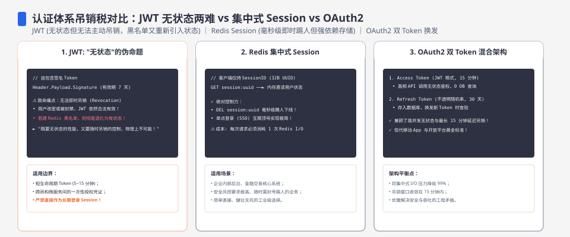
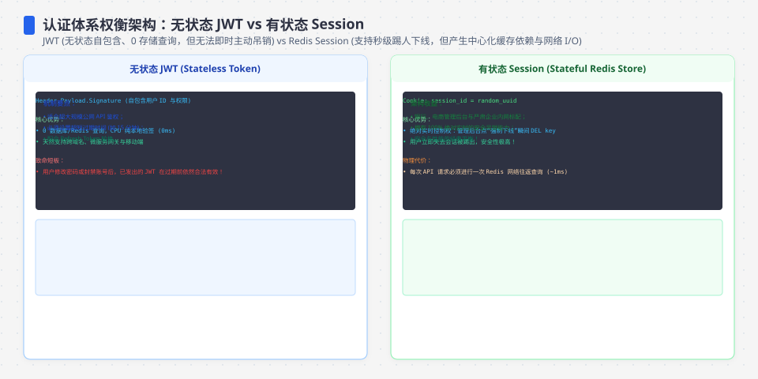
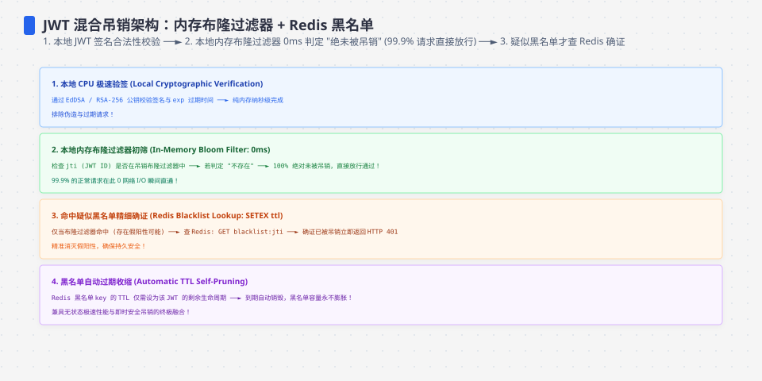
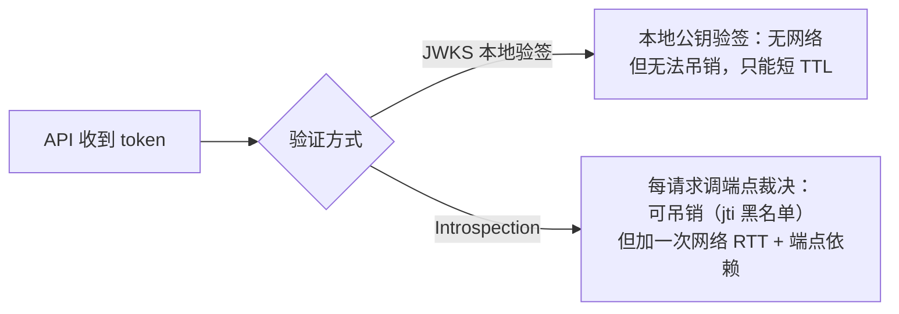

**TL;DR：** JWT 不是比 Session 更安全的方案，它只是把「吊销」这个问题外包给了过期时间。无状态验证意味着服务端手里没有可删的记录，想踢人只能三选一付税：维护 denylist（黑名单存哪）、把 TTL 压短（泄露窗口变小但用户频繁重登）、或引入 introspection 端点（让 token 可吊销，但每请求多一次网络裁决）。Session 与 JWT 不是非此即彼的二选一，而是「状态存哪」的一条连续谱：token 自身（JWT）、服务端存储（Session）、以及中间的「JWT 签发 + 端点裁决」（introspection）。决定用哪种，先回答一个问题：你的业务能不能接受「封禁延迟到 TTL 才生效」。


---



## 一、先立反直觉：JWT 不是更安全，是把吊销外包给了过期时间

`token` 的两种实现里，JWT 最常被当成「更先进、更安全」的那个，因为它「无状态」——验证请求时不用查任何存储，本地拿着公钥验一遍签名就行。这确实省掉了一块服务端状态，但代价藏在「无状态」的反面：**服务端没有任何可以删除的记录**。

Session 能「踢人」：删掉服务端那行，下次请求立刻 401。JWT 默认不能：token 已经发给客户端了，本地验签根本不看服务端，`exp` 不到，token 就一直有效。所谓「到期即失效」不是 JWT 的吊销能力，而是把「吊销」这个即时操作改写成「等过期」这个定时操作。登录态的安全有一半发生在认证那一刻，另一半发生在「需要立刻让它失效的时候」——token 泄露、账号被盗、员工离职、风控命中。这一半，裸 JWT 默认欠账。

所以第一个反直觉判断是：**Session 在「能踢人」这个语义上天然更强，JWT 不是。** 这个差异不是实现细节，是状态位置决定的语义承诺，后面三种方案的对比都从这里展开。




## 二、JWT 的机制与三笔税：验签免查库，但吊销、过期、重放都要额外付

先看 JWT 怎么工作。一个 RS256 签名的 JWT 是三段 base64url：

```text
header.payload.signature
eyJhbGciOiJSUzI1NiIsInR5cCI6IkpXVCJ9 . {claims} . <RSA-SHA256 签名>
```

`header` 声明算法（`alg`），`payload` 是 claims（`sub` 用户、`iat`、`exp`、`jti`），`signature` 是私钥对 `header.payload` 的 RSA 签名。验证方持有公钥：验签名通过 + `exp` 没过期，就信任 payload。关键在**验证不需要访问任何服务端状态**——签发者知道谁签的，但每个 API 只做本地 CPU 计算。TLS 那篇里讲过公钥验签的原理[^tls]，这里不重复：RSA 验签是数学运算，不是查库。

这本机一次运行的量级是：Session 的 Map 查一次约 0.07µs（p50 0.08µs），本地 RSA 验签约 20–22µs 均值（p50 约 18µs）[^bench]。即验签比查一次内存 Map 慢两个数量级，但仍远快于任何一次数据库查询（几百微秒到毫秒量级）或网络往返。「JWT 比 Session 快」在本地路径上大体成立，但差的不是安全，是存储访问换 CPU。

「无状态」省下的存储，换来了三笔税：

**税一：吊销税（黑名单存哪）。** 要踢人，只能按 `jti`（token 的唯一 ID）维护一份 denylist，验证时先查它。于是你绕了一圈又建了一个有状态的服务——denylist 本身就是张缓存，它有自己的 TTL、一致性和命中率问题。更麻烦的是 denylist 与「已签发 token 的过期时间」存在时间窗口：清掉的黑名单记录如果比 token 还早到期，就白清；如果留着，就得存到该 token 的 `exp` 之后。这正好是同系列《缓存一致为什么比缓存命中难》[^cache]里的失效窗口问题：denylist 的一致性永远是工程题，不是数学题。很多团队为了省这张黑名单，选择直接承受下面的税二。

**税二：过期税（TTL 长短与泄露窗口）。** 不维护黑名单，吊销就退化成「等 `exp`」。TTL 压到 10 分钟，泄露窗口就 10 分钟，但用户 10 分钟重登一次，体验和风控都受不了；TTL 放到 7 天，体验好了，泄露窗口 7 天。这是把「吊销」和「体验」焊在一起的一道税，没有免费解：要么付黑名单的存储与一致性成本，要么付更长的泄露窗口。

**税三：重放税。** 无状态 token 没有「一次性」语义，同一个 token 可以无限重放（客户端崩溃重发、中间人重放），服务端默认看不出区别。要防，又得回到状态：`jti` + denylist（用后即废，记住上次用过的 jti）、绑定设备指纹……每一项都在把「无状态」重新变成「有状态」。点破本质：**重放检测必然需要有人记住「上次用过的 token」**，只要这个记忆不存在，重放就测不出来——这不是 JWT 的 bug，是「状态不在服务端」的必然推论，凡是需要「这次用的 token 和上次不同」的语义，都需要有人记住上次。

## 三、Session 的机制与两笔账：踢人等于删记录，代价是每请求一次存储

Session 把状态放回服务端：登录成功时生成一个随机不透明 id，服务端存一行 `{sessionId → userId, 过期时间}`，客户端只持有这个 id。验证请求 = 拿 id 查存储。

它换来最硬的语义承诺：**踢人 = delete，删了就是没了，下一次请求立即 401**。本机实验里同一把 API，Session 删记录后同一 token 的下次验证从 200 直接变 401，而裸 JWT 踢了之后依旧 200——因为 JWT 侧根本没有可删的东西[^bench]。这行输出就是整篇的论点浓缩。

Session 也付两笔账：

**账一：每请求一次存储访问的延迟与单点。** 单机 Session 是内存 Map（亚微秒），一上分布式就变成 Redis/DB，每请求多一次网络 RTT。更糟的是存储变成新的单点：Redis 挂了，登录态全灭；Session 存储的可用性直接是 API 的可用性。JWT 把这块从请求路径上拿掉了，Session 要还。

**账二：状态粘性与扩容成本。** Session 存储要承载在线用户量级、要跨机房同步、要多端会话管理。无状态化的诉求（水平扩容、请求打到任意实例都行）正是 JWT 想解决的，Session 需要额外的基础设施去补。

但这笔账要看清：Session 的「踢人立即生效」不是免费的，它依赖「存储删得掉」且「存储本身可用」。这是语义承诺，不是魔法。




## 四、OAuth2：先分清协议与 token，再选四种流程

OAuth2 和 Session/JWT 不是同一层：**Session/JWT 是实现「这个 token 怎么验证」的方案，OAuth2 是「怎么安全地拿到并换发 token」的协议**。OAuth2 发的 token 底层可以是 JWT（本地验签或 introspection 验），也可以是 opaque token（只能 introspection 验）。先分清这层，再谈流程选型。

四类流程，各自解决一个场景：

- **授权码 + PKCE（authorization code + PKCE）是浏览器场景的标准。** 用户在授权服务器登录后，拿到的是授权码而不是 token；授权码经浏览器重定向（redirect_uri）交给客户端，再由客户端用它走后端通道换 access token——token 本身不经过浏览器地址栏和前端 JS（这正是 PKCE 的前提：码会经过浏览器，所以才有被拦截的风险）。PKCE 的 `code_verifier` 防的是授权码被拦截：攻击者截到码没有 verifier 也换不到 token。老式 implicit flow 把 token 直接塞给前端，等价于把访问凭证暴露给浏览器环境——新实现都不该再用它。**为什么是它而不是别的：** 只有这个流程让「用户在场 + 凭证不进前端 + 可防拦截」三者同时成立。
- **client credentials 是服务器到服务器。** 没有用户，只有系统身份，`client_id + client_secret` 换 token，token 只在机器之间流转。**为什么：** 场景里不存在「用户授权」，再走授权码就是无意义的多一步。
- **refresh token 与轮换（rotation）。** access token 短命（分钟级），refresh token 长命。轮换 = 每次刷新签发新 RT、作废旧 RT；一旦检测到旧 RT 被重用，说明有复制，立即吊销整条会话。**为什么：** access token 短命压缩了泄露窗口（税二），RT 轮换给了「检测重放」的抓手（税三），两笔税都压了下来，代价是刷新接口自己变成要重点保护的高价值目标。
- **opaque token + introspection（RFC 7662）是「给无状态 token 装回吊销能力」的办法。** API 不本地验签，而是每请求调授权服务器的 introspection 端点，由端点裁决 `active: true/false`。jti 上黑名单，端点直接判 inactive——吊销立即生效，同时 API 保持「看起来无状态」。注意端点的返回值（`active`、`jti`、`sub`、`exp`）就是一份 API 契约，调用方依赖的是字段而不是字段值的偶然形状——这套「先定响应形状再定实现」的做法，和「把原理变成服务」系列里讲的 API 形状设计[^shape]是同一件事。

introspection 的价值在它买回了税一和税二：可吊销、不用给每个 API 配黑名单。代价是网络依赖：**每请求一次 introspection RTT，且端点可用性变成 API 可用性的一部分。** 本机实验里 introspection 用进程内函数模拟，只证明了路径本身是「验签 + 查 denylist」的 CPU 成本（与本地验签同量级）[^bench]；真实部署要再加一次网络 RTT——局域网约 0.1ms 量级，跨城/跨洋 10–100ms 量级，都是量级不是实测，取决于拓扑与缓存。

于是出现两条典型的验证路径，决策轴是「要可吊销还是要免网络」：



**jwks vs introspection 一句话判断：** jwks 买「快和无网络依赖」，交出吊销；introspection 买「可吊销」，交出每请求一次 RTT 和端点可用性。两者可以组合：access token 用短 TTL JWT + jwks 本地验签（把泄露窗口压到分钟级），敏感操作再走 introspection 复核——用税二去补税一。

## 五、决策矩阵与生产判断：给「能踢人」定价

把三家的语义承诺摆到一张表上：

| 维度 | Session | 裸 JWT（本地验签） | JWT + introspection / opaque |
| --- | --- | --- | --- |
| 状态位置 | 服务端存储 | token 自身 | token + 端点裁决 |
| 踢人 | 删记录，立即生效 | 只能等 `exp` | jti 进黑名单，立即生效 |
| 每请求验证成本 | 一次存储访问（单机亚微秒，分布式 +1 RTT） | 本地验签（本机约 20µs 量级） | 本地验签 + 1 次 introspection RTT |
| 无状态扩容 | 需要共享存储 | 天然 | API 无状态，端点有状态 |
| 关键风险 | 存储单点、延迟 | 泄露窗口 = TTL、无重放检测 | 端点可用性、RTT 延迟 |

对应到生产场景的判断：

- **B2C 网站，需要「封禁立即生效」（风控、盗号、人工客服踢人）** → Session 或 JWT+introspection。裸 JWT 的短 TTL 只是把窗口从「小时」压到「分钟」，不是「立即」。如果产品承诺「点封禁立刻失效」，本地验签 JWT 兑现不了这个承诺。
- **微服务内部 API，token 要跨服务透传，没有浏览器，可接受分钟级窗口** → 短 TTL JWT + jwks 本地验签。无网络依赖、天然水平扩容，代价是泄露窗口等于 TTL，靠「内部网络 + 短 TTL」兜底。
- **第三方开放平台** → OAuth2 授权码 + PKCE 签发；API 侧 opaque + introspection（要对第三方做到「撤销即失效」）优先于 jwks，因为你管不了第三方的 token 存放环境。
- **token 放哪，是另一层安全账**：JWT 放 `localStorage`，XSS 一读到就拿走全部凭证（无 CSRF 面，因为不自动携带）；放 cookie 要开 `HttpOnly`（挡 XSS 读）、`Secure`（只走 HTTPS）、`SameSite`（默认 Lax，防跨站携带），但 cookie 防不了 CSRF 的跨站携带本质，写操作仍需 CSRF token。**默认 HttpOnly + Secure + SameSite=Lax 的 cookie，写操作加 CSRF token**，而不是为了「方便前端读」塞进 localStorage。

最后是 JWT 最容易踩的两个反例，实现时直接写死：

- **`alg=none`**：攻击者把 header 的 `alg` 改成 `none`，去掉签名段，payload 随便写。防御：服务端固定只接受 `RS256`，遇到任何其他 `alg` 直接拒。
- **RS256→HS256 算法混淆**：服务端用 RSA 私钥签（RS256），但验证时若信任客户端声明的 `alg`，攻击者可以把 `alg` 改成 `HS256`（HMAC 对称密钥），然后把服务器的**公钥**当 HMAC 密钥来签——公钥是公开的，攻击者等于自己给自己签 token。防御：验签算法必须与签发算法固定一致，且验签密钥用私钥的匹配公钥，绝不用客户端声明定算法。

本实验的 `verifyJwt` 把这两条都显式拦截了：只接受 RS256，验签用固定的公钥[^bench]。

## 六、实验入口：experiments/auth-ledger

同一个 `/api/profile`，用 Session / JWT / JWT+introspection 三种方式各实现一遍，压测对比验证延迟，并演示「踢人」三种方式的生效差异。仓库根目录运行，零依赖（Node ≥ 18）：

```bash
node experiments/auth-ledger/server.js            # 压测 + 踢人演示
node experiments/auth-ledger/server.js --server   # 起真实 HTTP 服务，curl 验证
```

本机一次输出（2026-08-19，Node v24.19.0）：Session 查 Map 约 0.07µs（p50 0.08µs）；本地 RSA 验签均值约 20–22µs（p50 约 18µs）；进程内 introspection 与本地验签同量级（均值约 20µs）。踢人演示：Session 删记录后同一 token 立即 401；裸 JWT 踢后依旧 200；JWT+introspection 的 jti 进黑名单后立即 401[^bench]。

以上是单次运行的本地量级，不是稳定分界线，也不能当线上结论：① 本机 p99 与均值在不同批次间都会波动（RSA p99 曾见 29–91µs），p99 落在噪声内，不能推出「introspection 比 JWT 慢」；② introspection 的真实成本是网络 RTT，本实验只覆盖了端点本身的 CPU；③ 当前没有多实例、真实 Redis denylist 与跨机房压测。本文保持这些限制，若要发布网络结论，应先用 `--server` 加真实授权端点保存并发压测原始输出。

## 参考资料

- [RFC 7519：JSON Web Token (JWT)](https://www.rfc-editor.org/rfc/rfc7519)
- [RFC 7662：OAuth 2.0 Token Introspection](https://www.rfc-editor.org/rfc/rfc7662)：introspection 端点响应结构（`active` 必填，`jti`/`sub`/`exp` 可选）与调用语义。
- [RFC 7636：PKCE](https://www.rfc-editor.org/rfc/rfc7636)：授权码拦截防护。
- [RFC 6749 §4.4：Client Credentials](https://www.rfc-editor.org/rfc/rfc6749#section-4.4)：无用户场景的机器间凭证。
- [OWASP：JWT Cheat Sheet](https://cheatsheetseries.owasp.org/cheatsheets/JSON_Web_Token_for_Java_Cheat_Sheet.html)：算法混淆（`alg=none`、RS256/HS256 混淆）与防御。
- 实验代码：`experiments/auth-ledger/server.js` 及 `README.md`。

[^tls]: 见《TLS 握手全流程》[/writing/tls-handshake-deep-dive](/writing/tls-handshake-deep-dive)中公钥验签与证书部分的原理：验签是「用公钥验证私钥签名的数学运算」，验证方不需要持有任何会话状态。
[^cache]: 见《缓存一致为什么比缓存命中难》[/writing/cache-consistency](/writing/cache-consistency)：denylist 本质是一张缓存，其 TTL 与失效窗口就是该篇讲的「一致性没有终点」问题。
[^shape]: 见《API 形状是合同》[/writing/service-api-shape](/writing/service-api-shape)：校验失败、冲突与成功必须一起定义，introspection 端点的 `active` 字段就是 API 侧要稳定依赖的机器契约。
[^bench]: 本机实验见 `experiments/auth-ledger/`（`server.js` 一次运行的输出记录在 `README.md`），2026-08-19 原始输出见 `evidence/jwt-session-oauth2-revocation/2026-08-19-local/run.out`。数字是单次运行的本地量级，非稳定分界线。
