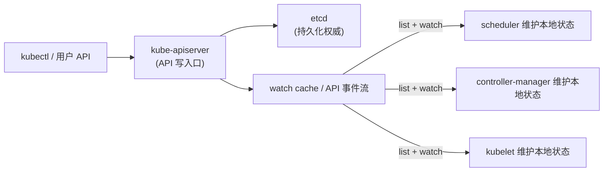
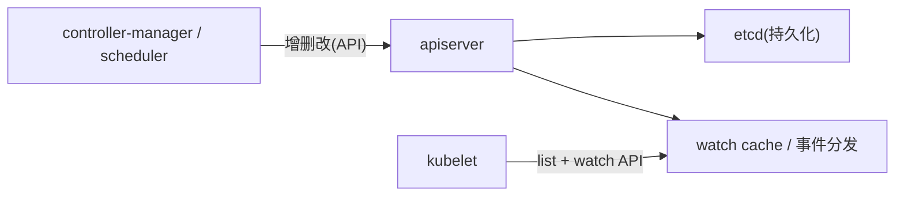
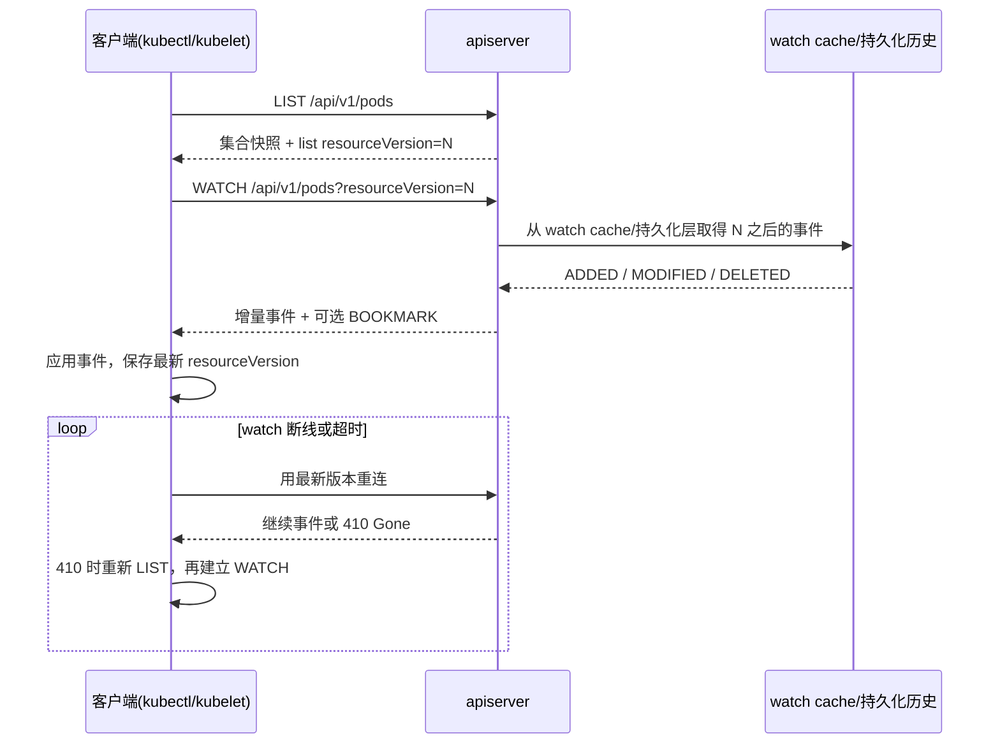

**TL;DR：** Kubernetes 控制面不是“每个 watcher 直连 etcd”的广播总线，而是 **apiserver 解释 API 语义、维护 watch/cache、向客户端提供 list + watch；etcd 保存持久化权威状态**。`resourceVersion` 是服务端版本字符串：对象的值表示该对象最近一次修改，列表的值表示集合快照；只能在同一 API resource type 内按文档比较，客户端应原样回传，不能把它当跨资源的全局时钟。watch 落后到服务端不再保留的版本时可能得到 `410 Gone`，需要重新 list 再接 watch；`resourceVersion=0` 也不是“从 etcd revision 0 重放”。

## 一、控制面不是三剑客，是 API 权威、缓存与事件流

初学者最常见的印象是“apiserver + scheduler + etcd 三个二进制”。更准确的切法是：**客户端把 API 请求交给 apiserver，apiserver 负责认证、准入、默认值、校验、版本和 watch 语义；etcd 负责持久化；控制器通过 list/watch 在自己的进程内维护缓存和期望状态**。



- 核心 API 客户端通常通过 apiserver 交互；控制器之间不应绕过 API 直接共享彼此的内存状态。
- 写必须穿过 apiserver 的准入（admission）、默认值、校验，再落到 etcd。
- 读：控制器先建立一个一致的初始状态，再持续消费增量；apiserver 的 watch cache 可以减少每个 watcher 对 etcd 的直接压力。



## 二、resourceVersion：同类资源的游标，不是全局时钟

`resourceVersion` 是服务端内部版本的字符串表示，客户端的正确动作是**原样保存、原样回传**，而不是解析后自行加一。要先区分对象版本和集合版本：

1. **对象版本**：某个对象的 `metadata.resourceVersion` 表示它最近一次被修改的版本。
2. **集合版本**：list 响应的 `metadata.resourceVersion` 表示集合快照建立时的版本；它不是把集合中每个对象的版本抹成同一个值。
3. **比较范围有限**：同一 API resource type 的版本字符串可以按 Kubernetes 文档比较；Pod 和 Deployment 的版本不能拼成一条跨资源时间线。扩展 API server 还可能使用不可按数字排序的版本字符串，客户端应尊重服务端合同。
4. **watch 依赖起点**：客户端先 list 得到集合快照版本，再以该版本启动 watch，消费之后的变化。服务端不再保留起点时可能返回 `410 Gone`，客户端必须重新 list，而不是猜测丢掉了什么。



**容易误用的边界**：watch 是状态同步机制，不是“每个变化永远保留”的队列。客户端必须处理连接断开、超时、bookmark 和 `410 Gone`；还要让事件处理具备幂等性，因为本地缓存重建可能重新观察已有对象。它也不自动承诺每一次业务读都是线性一致的最新读。

## 三、读一致性要先选语义，再谈 etcd

客户端各看各的增量，那“读的时候谁保证最新”？答案不是“所有请求都直接做 etcd quorum read”，而是先看请求的 `resourceVersion` 与 `resourceVersionMatch` 语义，再看 apiserver 是否可以从 watch cache 满足它：

| 请求意图 | 参数方向 | 能承诺什么 | 不能偷换成什么 |
| :--- | :--- | :--- | :--- |
| 建立当前状态后继续追踪 | list 得到集合 `resourceVersion`，watch 从它开始 | 快照之后的变化按事件流交付；断线要重连/重建 | 不是跨资源全局顺序，也不是消息永不丢失的队列 |
| 只要不早于某个版本 | `resourceVersionMatch=NotOlderThan`（主要用于 list） | 返回的数据不早于给定版本，具体是否最新由语义决定 | 不是“每个对象的 RV 都相同” |
| 必须是指定集合版本 | `resourceVersionMatch=Exact` | 版本不可用时可能 `410 Gone`；客户端要处理失败 | 不是让任意旧版本永久可读 |
| 要求最新/线性一致读 | 按当前 Kubernetes 版本文档使用未设置或显式一致性语义 | 可能需要 apiserver 与持久化层确认进度；新版本也可能由已追平的 watch cache 满足 | 不能把普通缓存读、watch 事件和最新读混成一个 SLA |

`resourceVersion=0` 是另一个高频误区：在 get/list/watch 的不同组合里，它表示“允许从任意可用版本开始”或“从任意版本初始化 watch”，不是“从 etcd revision 0 开始重放”。如果客户端需要精确版本或“不早于某版本”，必须同时使用文档规定的参数组合，而不是把 `0` 当魔法值。

etcd lease 也不能被泛化成“所有 Pod 状态都靠 lease 续期”。lease 是 etcd 的租约原语；Kubernetes 的节点心跳、对象生命周期、控制器重试和 kubelet 状态各有自己的 API 合同。讲控制面时，要把“etcd 提供的机制”和“Kubernetes 哪个组件实际使用它”分开。

**真正的代价账**是：watch cache 能减少重复 list 和每个 watcher 的持久化读取，但它需要内存、事件分发和重建成本；要求更强读语义时，apiserver 需要确认缓存已经追平持久化层，或者走更昂贵的路径。读的“新鲜度”、watch 的“连续性”和 etcd 的“持久化权威”是三种不同承诺。

## 四、用一个真实集群观察 list/watch 的两段状态

```bash
# 以下命令需要当前 kubeconfig 有权限访问目标集群；本文没有把某个集群的输出保存为 raw。

# 先拿集合快照和它的 resourceVersion
kubectl get pods -o json > /tmp/pods.list.json
RV=$(kubectl get pods -o jsonpath='{.metadata.resourceVersion}')

# 从刚才的集合版本开始 watch，允许服务端发送 bookmark
kubectl get --raw "/api/v1/pods?watch=true&resourceVersion=${RV}&allowWatchBookmarks=true"

# 显式要求一个集合版本；服务端/版本不可用时要能处理 410 Gone
kubectl get --raw "/api/v1/pods?resourceVersion=${RV}&resourceVersionMatch=Exact"

# 对照：resourceVersion=0 不是从 etcd revision 0 重放；watch 的 0 语义允许从任意可用版本初始化。
kubectl get --raw "/api/v1/pods?watch=true&resourceVersion=0"
```

观察时至少记录四件事：集合响应的 `metadata.resourceVersion`、事件对象的 `metadata.resourceVersion`、是否收到 `BOOKMARK`、断线重连后是否需要重新 list。若想测试 `410 Gone`，必须让 watch 起点老于目标集群保留的历史；没有对应集群版本、watch-cache 配置和 raw，就不能把某个固定秒数写成通用窗口。

在支持 streaming list 的较新 Kubernetes 版本中，还可以用 `sendInitialEvents=true` 请求由 watch 流发送初始 `ADDED` 事件，再以 `BOOKMARK` 标记同步点；该参数要求配合 `resourceVersionMatch=NotOlderThan`，并且仍要按目标集群版本和 feature gate 验证。它是 list + watch 的 API 形状演进，不是 etcd revision 0 的别名。

## 五、控制器实现里最容易出错的三处边界

1. **不要把每个请求都变成独立 watcher**：控制器应复用长连接和本地 informer/shared cache，按 selector 缩小资源集合，并设置处理队列、重试和 resync 预算。watcher 数量、对象大小和事件扇出都会转成 apiserver 内存与 CPU 成本。
2. **断线不等于状态可猜**：watch 断了、收到 `410 Gone` 或事件处理失败时，先按客户端库的恢复合同重新 list，再建立 watch；不要用“最后看到的几个事件”拼出一个假状态。事件 handler 也必须幂等，因为重建会重新触发 add/update 逻辑。
3. **不要把 etcd 当业务消息队列**：高频业务数据直接进入控制面会同时增加持久化写入、watch-cache 事件、序列化和 fan-out 压力。compaction 可能使旧起点不可用，但“所有 watcher 不断 410”不是一个无需测量的必然结论；应分别看 apiserver watch-cache、etcd compaction、事件处理延迟和重建次数。

## 六、结论：resourceVersion 只在正确的 API 语义里提供增量连续性

Kubernetes 的控制面可以这样记：**apiserver 承担 API 权威与事件分发，etcd 保存持久化状态，控制器用 list + watch 维护本地投影，`resourceVersion` 把快照和后续变化接起来**。它不是跨资源全局时钟，也不是永不丢失的消息队列；`resourceVersion=0` 不是 revision 0，`410 Gone` 不是客户端可以忽略的偶发错误，普通 watch 也不等于线性一致读。

下一步：在有权限的测试集群保存一次 list 响应、同 RV 的 watch 流、bookmark 和断线恢复记录，并把 Kubernetes 版本、API server 配置、selector、事件量和恢复动作一起写进 evidence。没有这组 raw，就只把本文当 API 语义说明，不把某个 watch-cache 保留时长写成生产 SLO。

## 参考资料
1. Kubernetes 官方：API concepts（List / Watch / resourceVersion）—— https://kubernetes.io/docs/reference/using-api/api-concepts/
2. Kubernetes 源码：apiserver 的 etcd3 watch 实现—— https://github.com/kubernetes/kubernetes/tree/master/staging/src/k8s.io/apiserver
3. etcd 文档：存储模型与 revision—— https://etcd.io/docs/v3.5/learning/
4. etcd 文档：op-guide 并发与一致性—— https://etcd.io/docs/v3.5/op-guide/
5. client-go informer/cache 的实现入口—— https://github.com/kubernetes/client-go/tree/master/tools/cache

> 延伸阅读：watch 背后的版本号就是 [Raft 的任期与日志复制](/writing/raft-consensus-term-log-replication) 在 etcd 里的化身；节点消失、状态流失时的优雅下线见 [Kubernetes 里优雅下线为什么特别难](/writing/kubernetes-graceful-termination)；全量快照与增量之间的对账，和 [主从复制延迟的三种读路径](/writing/replication-lag-read-paths)是同一份账。
