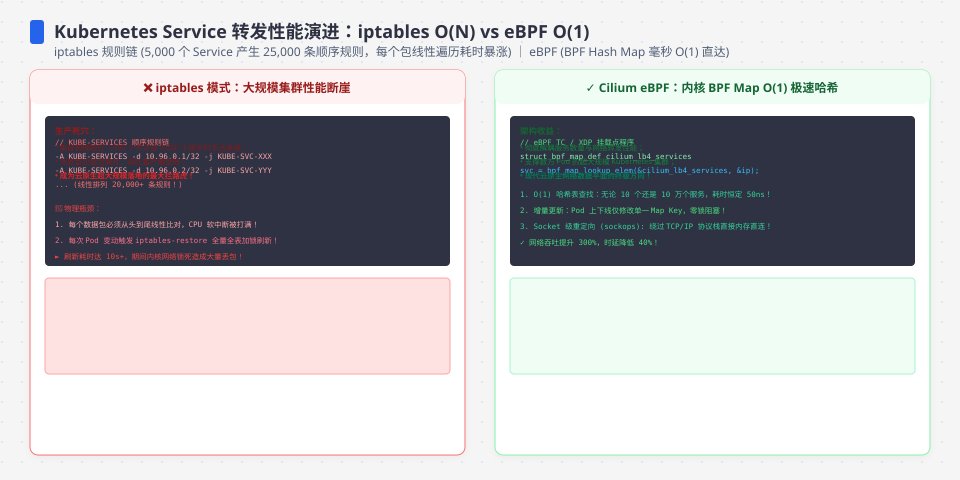
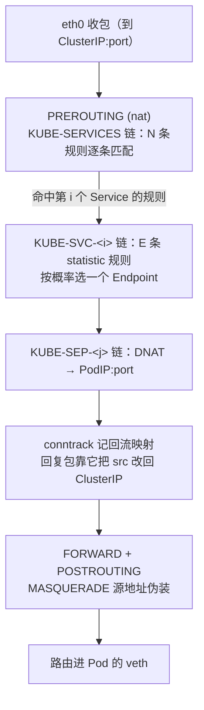
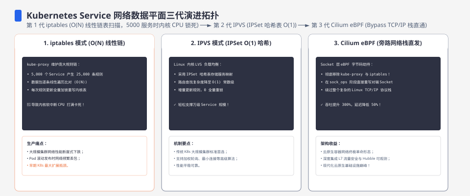
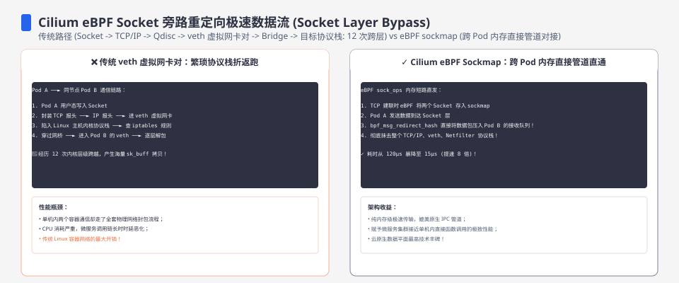

**TL;DR：** 你以为 Service 是个"虚拟 IP 转发"，其实默认实现里根本没有"转发"这回事——kube-proxy 的 **iptables 模式把每个 Service 翻译成一组 DNAT 规则**，流量到达 ClusterIP 的代价是**在 NAT 规则链里从链头逐条匹配到命中**。匹配成本与规则规模线性相关：N 个 Service × E 个 Endpoint ≈ N×(E+1) 条规则，每个新连接平均要扫 N/2 条外层规则再加 E/2 条 Endpoint 规则。规则上万时，**新建连接率高的服务**CPU 与延迟双涨，conntrack 表满还直接丢新连接。**IPVS 把服务表换成内核哈希表，查表 O(1)、与规则规模无关**；**eBPF（Cilium）更进一步把 datapath 压进内核态/网卡**，用 BPF map 做 O(1) 直查并去掉 iptables 与 nf_conntrack 的开销。选型是"规则规模 × 性能预算"的账：几百个 Service 时线性成本在噪声里，上万 Service、新建连接率高的集群才轮到换 datapath。


---



## 一、先立反直觉：Service 不是虚拟 IP，是内核里的一串 DNAT 规则

ClusterIP 听起来像虚拟 IP：一个地址，一堆后端。但在 iptables 模式里，**内核里不存在"ClusterIP 转发"这个动作**。kube-proxy 做的事情是：watch 到 Service 和 Endpoint 变化后，用 iptables 规则把"目标为 ClusterIP:port 的新连接"**改写（DNAT）成某个 Endpoint 的 PodIP:port**。



iptables 的匹配语义是**"从链头往下逐条匹配，第一条命中即处理并返回"**。所以"流量到了 Service"这个动作，在默认实现里真实发生的事是：**遍历了 KUBE-SERVICES 链上 N 条规则，直到命中的那一条**，再跳进这个 Service 自己的链，再遍历 Endpoint 规则完成 DNAT。

一个容易被面试官追问的诚实细节：kube-proxy 对 **NodePort / ExternalIP 用 ipset 合并成了常数条规则**（ipset 是内核哈希集合，一次成员判断 O(1)），但 **ClusterIP 仍是每 Service 一条规则，线性匹配还在**；Service 内部的选路也是每 Endpoint 一条 `statistic` 随机规则。也就是说，ipset 只缓解了 NodePort 那一路的规则爆炸，ClusterIP 主路径的线性成本原样保留。




## 二、kube-proxy 的三条路：userspace / iptables / IPVS

| 模式 | datapath 在哪 | 选路机制 | 典型形态 | 主要代价 |
| :--- | :--- | :--- | :--- | :--- |
| userspace | kube-proxy 用户态进程 | 起监听端口，自己转发 | 最老的默认 | 每包两次用户态/内核态切换，吞吐差，仅历史遗留 |
| **iptables** | 内核 netfilter | NAT 规则链，逐条匹配 | 长年默认 | 匹配成本随 Service/Endpoint 规则量线性涨 |
| **IPVS** | 内核 IPVS 模块 | 哈希表查虚拟服务 + 调度器选真实后端 | 大集群推荐 | 查表 O(1)，但有内核版本与 L4 粒度限制 |

官方文档明确写了大集群建议转向 IPVS 的理由：iptables 模式下规则随 Service/Endpoint 增长、内核要逐条遍历，CPU 与延迟随之上升。userspace 模式早已退出主路径，现在讨论选型其实是 iptables / IPVS / eBPF 三者。

**上游动向（核对日期 2026-08-16）：** Kubernetes 已启动用 **nftables** 替代 kube-proxy 的 iptables/IPVS 数据面工作，IPVS 模式自 v1.35 弃用（KEP-5495）、v1.36 移除，nftables 自 v1.33 GA。方向是明确的：iptables 的线性语义迟早要换。本文讲的"线性 vs 哈希直查"的成本结构，换到 nftables 上依然成立——nftables 默认链同样是线性匹配，只有明确写集合/哈希结构才 O(1)。

## 三、iptables 的实现：线性匹配的成本模型与 conntrack 的角色

### 规则量与每连接成本

一个 N 个 Service、每 Service E 个 Endpoint 的集群，iptables 数据面里大致有：

- KUBE-SERVICES 链：**N 条**（每 Service 一条，匹配 dst ClusterIP:port）；
- 每个 Service 一条 KUBE-SVC-* 链：**E 条** statistic 规则（每 Endpoint 一条）；
- 每个 Endpoint 一条 KUBE-SEP-* 链：内部 DNAT 是常数几条，不随规模增长。

总规则量级 ≈ **N×(E+1)**。每个新连接的代价是**外层平均 N/2 次匹配 + 内层平均 E/2 次匹配**（假设目标 Service 均匀分布、规则首命中即停）。

模型推导出的量级（不是实测）：

| Service 数 N | Endpoint/Service E | 规则总量 ≈ N×(E+1) | 每个新连接平均匹配次数 ≈ N/2 + E/2 |
| --- | --- | --- | --- |
| 100 | 4 | 500 | ~52 |
| 1,000 | 4 | 5,000 | ~502 |
| 5,000 | 4 | 25,000 | ~2,502 |
| 10,000 | 4 | 50,000 | ~5,002 |

### 一个必须讲对、也常被讲错的点：线性遍历按"新连接"计，不是按"每个包"

**DNAT 规则只在每个新连接的首个包上求值。** 内核 nf_nat 的逻辑是：首个包走完规则链、把 NAT 映射写进 conntrack 连接表；此后同一条连接的包直接从 conntrack 表项里取映射做地址改写，**不再重走 KUBE-SERVICES 链**。所以线性成本是**摊到每个新连接上**的，不是每个包。

这带来一个常被忽略、但对选型关键的推论：**规则规模伤害的是新建连接率高的负载**。无 keep-alive 的 HTTP、频繁重连的 gRPC/客户端、每个请求都新开连接的短连接服务，新建连接数直接乘进规则遍历次数——N=10,000 时每个新连接多付约 5,000 次规则求值，连接率越高劣化越明显。而长连接为主（HTTP/2、连接池）的服务，稳定态每个包主要花在 conntrack 查表（O(1) 哈希）和 FORWARD 链的过滤规则上，规则增长的影响温和得多。**这也是为什么很多集群几千个 Service 也不觉得慢：他们的连接是复用的。**

把这个推论换算成可感的数字：一个每秒新建 10,000 条连接的集群，在 N=10,000 Service 时，每秒要在链上多做约 5,000 次 × 10,000 连接 ≈ **5×10⁷ 次规则求值/秒**——这不是延迟抖动，是实打实的 CPU 开销。连接率不变、规则量翻倍，这一项开销就翻倍。所以"我 Service 很少，为什么要在乎"和"我 Service 很多，为什么没感觉"，答案都在连接率上。

### conntrack 的角色：表满丢包是硬故障

iptables 的 DNAT 依赖 conntrack：每个新连接占一条连接表项，回复包靠它把源地址改回 ClusterIP。于是新建连接越密、每连接越频繁，**conntrack 表压力越大**（表项数只随连接数增长；Service 规则多只是集群更大的伴随信号，不直接占表项）。`nf_conntrack_max`（内核 sysctl，默认等于 `nf_conntrack_buckets`，现代 ≥4GB 内存内核常见 262144、老内核/小内存为 65536，见参考资料 #4）被占满后，**新连接会被直接丢弃**，内核日志打 `nf_conntrack: table full, dropping packet`——表象是 Service"间歇性不可用"，根因不是后端挂了，是 conntrack 表满了。规则上万 + 高连接率，是把这个故障提前引爆的两根引线。

**本机关系验证分成两层**（见文末）：仓库里的 `rule-match-sim.go` 跑出的平均匹配步数与上表逐行一致（步数是推导结果）；它同时打印的 ns/包计时只是**用户态 Go 循环的模拟值**（本机已复跑，原始输出见 `evidence/k8s-iptables-ebpf-service/2026-08-19-local/`，不算内核 datapath 证据）。真实 kind 集群（`kind-bench.sh`）的每轮 ms/req-s 属于内核 datapath 的真实基准，需要宿主机内核功能与虚拟机权限才能跑，超出的本文证据链——本文用推导步数确立关系，用官方文档确立机制，模拟值只作量级方向，不断言内核实测。




## 四、IPVS：内核哈希表的 O(1) 直查，大集群为什么换

IPVS 是内核里独立的 L4 负载均衡模块。它不靠"遍历规则找 Service"，而是维护一张**按 (协议, 地址, 端口) 哈希的服务表**：收到包先哈希查表命中虚拟服务（O(1)，与集群里有多少 Service 无关），再走调度器（round-robin / least-conn 等）选一个真实后端。kube-proxy 的 IPVS 模式只是把 Service/Endpoint 同步成内核的 Virtual Server / Real Server（走 netlink），查表和选路全在内核。

关键对比落到语义承诺：

| 维度 | iptables 模式 | IPVS 模式 |
| :--- | :--- | :--- |
| 服务查表 | 线性遍历 KUBE-SERVICES 链 | 哈希表 O(1)，与 Service 总量解耦 |
| 选后端 | statistic 随机（概率近似） | rr / wrr / lc / sh 等调度算法 |
| 连接跟踪 | 依赖 nf_conntrack，表满丢包 | Service 选路用自带连接表（conn_tab），不依赖 nf_conntrack 做 DNAT 映射 |
| 规则面 | 随 N×E 线性增长 | 每 Service 一个 VS，规模不敏感 |

**为什么大集群换 IPVS**：把"查 Service"从 O(规则数) 降成 O(1)，datapath 的固定成本与集群规模解耦，几千上万 Service 时 CPU/延迟曲线不再跟着规则量爬。

**取舍（为什么不是银弹）**：IPVS 是纯 L4，做不了 7 层分发；NAT / DR / TUN 三种转发模式各有前提（DR 要求后端回包直连、TUN 要求内核支持）；kube-proxy 的 IPVS 模式仍会留少量 iptables 兜底规则（MASQUERADE、hairpin、个别协议回退），只是不随 Service 数线性增长。另外要诚实：IPVS 的 O(1) 是"查服务表"常数，least-conn 这类调度器本身是 O(后端数) 的——只是单个 Service 的后端数，和全局 Service 规模解耦了。

## 五、eBPF / Cilium：把 datapath 压进内核态和网卡，去掉 iptables 与 conntrack 开销

Cilium 的 kube-proxy replacement（`kubeProxyReplacement=true`）直接**不装 kube-proxy**（kubeadm `--skip-phases=addon/kube-proxy`），Service 的 ClusterIP / NodePort / LoadBalancer / ExternalIP 全部用 eBPF 程序实现。hook 点三处，越靠前越快：

- **socket 层**（`connect` / `sendmsg` / `recvmsg`）：东-西向 ClusterIP 流量在**发起系统调用时**就把目标直接改成后端 PodIP，**根本不产生 NAT、不占 conntrack**——这是和 iptables 最本质的差异；
- **TC**：主 hook，负责策略执行、VXLAN/Geneve 封装解封、宿主机转发；
- **XDP**：在**网卡驱动层**、skb 尚未分配时就处理，南北向 NodePort/LoadBalancer 的 DNAT 在这里做（需要网卡原生 XDP 支持，如 i40e/mlx5）。

查表结构与 iptables/IPVS 都不同：**Service 与后端都在 BPF map 里**（`lb4_services` / `lb4_backends`，按 (proto, addr, port) 哈希），程序无锁读 map，O(1)。后端变更只是原子更新 map，不用重写几百条规则。连接跟踪换成 BPF 自己的 CT map，或在直连路由 + BPF 组网下用 `installNoConntrackIptablesRules` 直接绕开 nf_conntrack。Cilium 官方性能文档报告在常见负载下吞吐与延迟相对 iptables 数据面都有显著优势（量级数倍，来源见参考资料，**本机未复现，不算本文实测**）。

落地后的验证视角也完全不同：iptables 模式查 `iptables-save | grep KUBE-SVC-`，Cilium 则查 `cilium-dbg status | grep KubeProxyReplacement` 和 `cilium-dbg bpf lb list`——同一个 Service，一边是几百条文本规则，一边是一张 BPF map 的几行记录，这正是两种数据面的直观分界。

**取舍（为什么不是所有集群都换）**：eBPF 换来的性能是拿内核版本下限（5.x+）和排障复杂度换的——问题排查从 `iptables-save` 变成 `bpftool` / map dump；程序加载、内核兼容、CNI 升级都是新增运维面。纯性能账上几百个 Service 的小集群根本回不了本。**eBPF 真正的卖点是顺带的**：同一套 datapath 还能做网络策略、可观测（L7 指标）、多集群——Cilium 的性价比来自"一套 BPF 数据面覆盖 LB + 策略 + 观测"，而不是只为了快那几微秒。

## 六、结论：怎么选，算"规则规模 × 性能预算"

| 场景 | 建议 | 为什么 |
| :--- | :--- | :--- |
| Service < 500，连接复用充分 | iptables 默认即可 | 线性成本摊在每连接，500 条规则的遍历在噪声里 |
| Service 数千、新建连接率高、p99 敏感 | IPVS 或 eBPF | 连接率是放大器，规则量 × 连接率才等于真实代价 |
| 已上 Cilium（策略/多集群/观测） | 直接开 kubeProxyReplacement | 一套 BPF 数据面替代 kube-proxy，避免两套 datapath 并存 |
| 新集群、上游追踪激进 | 留意 nftables 模式 | iptables 线性语义迟早退役，别在新项目上押旧默认 |

（同负载下两模式的真实差距，需要用 kind 造 N 个 Service 对照运行 `kind-bench.sh`，并保存 iptables vs IPVS 每轮 ms/req/s；当前没有这份集群原始输出。）

决策前先量化三件事：**Service 与 Endpoint 的规则量级**（`iptables-save | grep -c KUBE-SVC-`）；**新建连接率**（连接是秒级新建还是长连接池复用）；**当前 p99 是否在涨**。规则量大但连接复用好，IPTABLES 未必是瓶颈；规则量小但每请求都新建连接，也是同样的账。**先把 conntrack 表满这个硬故障检查了**（`/proc/sys/net/netfilter/nf_conntrack_max` 与 `sysctl net.netfilter.nf_conntrack_count`），再谈换不换 datapath。

一句话判断：**iptables 的默认不是 bug，它的线性成本在"规则量 × 连接率"足够大之前不值得为它付费**；值得付的那一刻，IPVS 是低门槛的 O(1)，eBPF 是连 conntrack 都省掉的下一个台阶。

### 实验入口

两条可运行路径都在 `experiments/k8s-svc-net/`：

```bash
# 路径一（秒级，轻量，已验证可运行）：模拟规则匹配步数 + 本机计时
cd experiments/k8s-svc-net && go run rule-match-sim.go

# 路径二（分钟级，需 docker + kind ≥ v0.18）：真集群 iptables vs IPVS 逐轮延迟
N=200 ROUNDS=20 bash experiments/k8s-svc-net/kind-bench.sh all
```

**发布前证据清单**（注明机器/内核 `uname -r`/kind 版本/N/ROUNDS，多跑几次取中位数）：

1. `rule-match-sim.go` 的 ns/包计时两列（验证"线性 vs 常数"的相对形状）；
2. `kind-bench.sh` 每轮 ms 与 req/s（iptables 随 N 劣化、IPVS 持平）；
3. `iptables-save | grep -c KUBE-SVC-` 打印出的真实规则数与模型 N×(E+1) 的对照。

## 参考资料

1. Kubernetes Service（代理模式：userspace / iptables / IPVS，大集群 IPVS 建议）—— https://kubernetes.io/docs/concepts/services-networking/service/
2. kube-proxy 参考文档（模式说明与 nftables/IPVS 上游动向，核对日期 2026-08-16）—— https://kubernetes.io/docs/reference/command-line-tools-reference/kube-proxy/
3. Linux Virtual Server IPVS（哈希服务表与调度算法）—— http://www.linuxvirtualserver.org/software/ipvs.html
4. Linux 内核 nf_conntrack sysctl（`nf_conntrack_max` 与表满行为）—— https://docs.kernel.org/networking/nf_conntrack-sysctl.html
5. Cilium：无 kube-proxy 集群（kubeProxyReplacement）—— https://docs.cilium.io/en/stable/network/kubernetes/kubeproxy-free/
6. Cilium：网络性能官方文档（eBPF vs iptables 数据面对比，倍数见官方 benchmark，本机未复现）—— https://docs.cilium.io/en/stable/operations/performance/

> 延伸：Service 选路要建新连接，而连接质量本身是另一笔成本（[socket 背压与慢消费者](/writing/socket-backpressure-slow-consumer)）；Service 规则由 kube-proxy 从 watch 事件刷进内核，这条链路是[控制器 watch 与 etcd 的增量账](/writing/k8s-controller-watch-etcd)；datapath 的 CPU 预算和容器配额是同一台机器上的邻居（[requests 与 limits 的两本账](/writing/k8s-requests-limits-cgroup)、[调度器的 filter 与 score](/writing/k8s-scheduler-resource-ledger)）。
