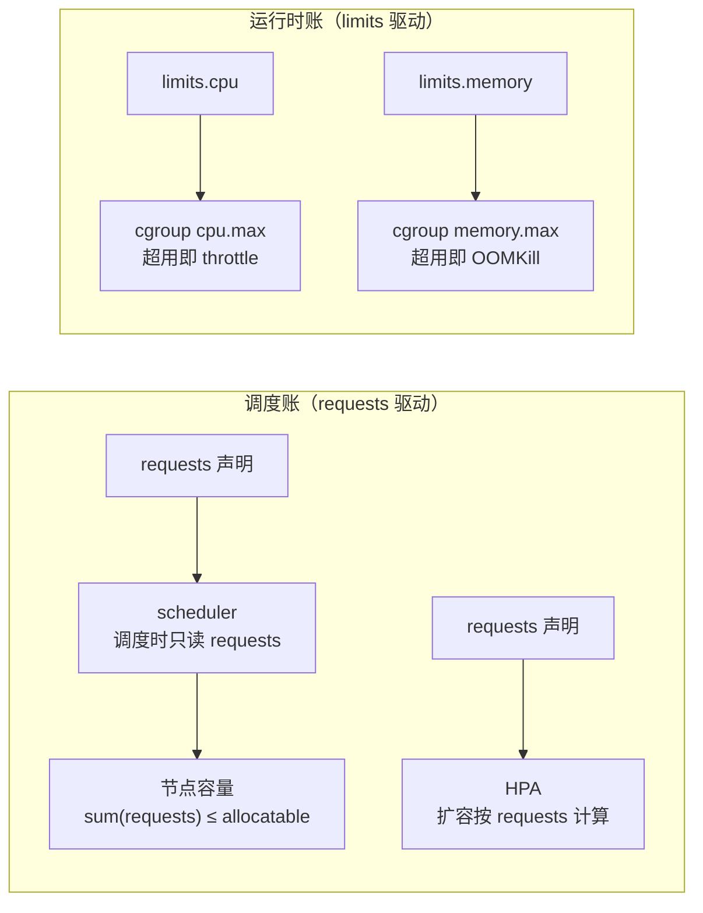

**TL;DR：** Kubernetes 的资源管理不是一份天真的预算，而是**两本账**：`requests` 主要用于调度和资源竞争权重，`limits` 由 kubelet/运行时传给 cgroup，约束运行时上限。调度器不会用某个节点此刻的实际空闲量替代 requests；CPU limit 超过后通常表现为 throttle，内存 limit 超过后由内核在压力条件下触发 OOM 处理，可能杀掉申请超限的进程。`memory.high` 是 cgroup v2 的回收压力阈值，不是“内存不会被杀”的保险。是否设置 CPU limit 应由延迟、租户隔离、节点超卖和实测 throttle 决定，不能写成所有服务都适用的禁令。

## 一、事故现场：两张互相矛盾的监控截图

值班屏幕上同时挂着两张图：

- 图一：某服务的 CPU 实际用量长时间是"声称需要量"的 2 倍以上，Pod 却频繁出现 `CPU Throttling`，P99 延迟带规律的尖峰；
- 图二：另一个服务实际内存离 limit 还差 30%，却在半夜被 `OOMKilled`，重启循环。

运维凭直觉给图一加了 `limits.cpu`，给图二调大了 `limits.memory`，结果：图一的抖动更频繁了（limits 越小 throttle 越狠），图二照杀不误（limit 调大只是推迟了被杀的时刻，没改变它为什么死）。两种修法的方向全错。

这两张图问的是同一个问题：**requests 与 limits 到底各管哪一段？** 一句话答案：**requests 管调度时的资源声明，limits 管运行时的上限和压力反应**。两者分别在 API、调度器、kubelet、运行时和 Linux cgroup 中生效，不能用一张监控图代替全部口径。

## 二、Requests 与 Limits：调度账 vs 运行时账

拿一段 YAML 说事：

```yaml
resources:
  requests:
    cpu: "500m"
    memory: "512Mi"
  limits:
    cpu: "1"
    memory: "1Gi"
```

- `requests.cpu: 500m` = 0.5 核。调度器把 Pod 放到一台**剩余可调度量 ≥ 0.5 核**的节点上。关键在措辞：是"剩余可调度量"，不是"实际空闲"。Kubernetes 的调度器只认"你承诺了要这么多"的数字，不跑去看这台节点此刻 CPU 用了多少——资源账是按声明的承诺总量（requests）结算的，不是按实测用量。
- `limits.cpu: 1` 走的是另一条路径：在使用 Linux cgroup 的常见运行时中，kubelet/运行时会把它换算成 cgroup 的 CPU 配额（cgroup v2 常见表现是 `cpu.max`，旧内核可能是 v1 的 CFS quota）。具体周期、是否启用 CFS quota 和运行时实现要以节点配置为准。



两本账没有一个是"实际用量"：调度器不懂现场，内核不知道"申请"这个词。于是 requests 设得大、limits 设得小全节点"看起来"还剩很多容量、但别人的 Pod 排不进来、自己的 Pod 一直 throttle 的怪事，就同时成立了。

## 三、CPU：超限是被限速，不是被杀死

内核给每个 cgroup 规定一个**结算周期内的额度（quota）**。在常见 Linux CFS quota 配置中，cgroup v2 的 `cpu.max` 写作 `quota period`（单位微秒），但周期和 burst 可能由节点、kubelet 或运行时配置改变。一个教学配置可以是 `limits.cpu: 1` 对应 `100000 100000`、`500m` 对应 `50000 100000`；这不是所有集群的原始输出。额度用完后，cgroup 可能在当前周期剩余时间被 throttle，`cpu.max.burst` 等配置还会改变突发行为。

```text
# 一个容器的 cgroup v2 状态，limits.cpu=500m
$ cat /sys/fs/cgroup/<path>/cpu.max
50000 100000

# 限速统计就长这样
$ cat /sys/fs/cgroup/<path>/cpu.stat
usage_usec    33941210
nr_periods    425
nr_throttled   17          # 有多少个周期被限速
throttled_usec 30241      # 累计被限速的总时长
```

被 throttle 通常不是被杀，而是在当前配额周期的剩余时间等待后继续。对 CPU 密集批任务，这是速度上限；对延迟敏感服务（网关、API、数据库连接池的代理层），周期性等待可能抬高尾延迟，但幅度要通过 `cpu.stat`、请求延迟和节点竞争实测。limit=1 而工作负载短时需要 2 核时，确实可能反复触发 throttle，但不能仅凭配置推导固定的 p99。

**结论先行：延迟敏感服务要先测 CPU limit 的代价，再决定是否设置。** 不设 limit 时，容器通常在节点空闲时可以使用更多 CPU，在竞争时按权重争用；设了 limit 后，超出配额会受到 throttle。requests 往往参与竞争权重，但具体 cgroup 配置、QoS 和运行时实现仍要核对。稳定延迟、强租户隔离和成本控制可能给出不同答案，不能把“不设 CPU limit”写成普遍最佳实践。

## 四、内存：只有二进制——超限即杀死

CPU 和内存的本质区别：**CPU 是可压缩资源**（超限暂停即可），**内存不可压缩**（超了没地方放，只能杀进程回收）。cgroup v2 给内存两个字段：

```text
memory.max    # 硬上限：超了就 OOM Kill
memory.high   # 软阈值：超了启动回收压力，先不杀
memory.swap.max
```

`memory.max` 是 cgroup 的硬限制，但**超过它不等于在同一时刻必然立刻杀进程**：内核会在分配和内存压力路径上尝试回收，无法满足分配时才进入 OOM 处理，实际结果还可能是容器进程退出、被重启或节点级 eviction。`memory.high` 超过后会施加回收和阻塞压力，不能保证最终不会触发 `.max` 或节点 OOM。

**"用量"比你想的大**：cgroup 可能计入匿名内存、文件页缓存、内存 backed volume 等，具体口径要看层级和运行时。`kubectl top` 通常来自 Metrics API 的 working set 等指标，不能直接当成 RSS，也不能据此断言 file cache 已经或没有计入 limit。遇到 OOM，要把容器状态、kubelet 事件、cgroup `memory.current`/`memory.stat`/`memory.events` 和应用 profile 对齐。`memory.events` 里的 `high` 记录高压事件，`oom`/`oom_kill` 记录 OOM 路径，不存在通用的 `throttle` 字段。

OOM 顺序由 **QoS 档位**决定，不是随机抽签：

| QoS 档位 | 判定（按 Pod 中所有容器） | 典型 oom_score_adj 方向 | 不能据此推出 |
| :--- | :--- | :--- | :--- |
| Guaranteed | 每个容器的 requests == limits | 通常更低 | 一定不会被容器级或节点级 OOM 终止 |
| Burstable | 至少一个容器 requests < limits | 按 requests/limits 和实现计算 | 固定的中间优先级 |
| BestEffort | 一个资源也没声明 | 通常更高 | 一定是第一个被杀候选 |

QoS 会影响 oom_score_adj 和 kubelet 的驱逐排序，但它不是“同一节点上 Guaranteed 一定安全、BestEffort 一定先死”的绝对顺序。实际结果还取决于 Pod 的使用量、节点级压力、系统进程、memory backed volume 和 OOM 发生在容器级还是节点级。排障应记录 `oom_score_adj`、Pod QoS、事件和 cgroup 计数，而不是只看 QoS 标签。

## 五、账本与决策表：什么场景该用哪个

| 场景 | 建议 | 为什么 |
| :--- | :--- | :--- |
| 延迟敏感的网关 / API / DB 代理 | **不设 CPU limits**，内存照设 | throttle 牺牲尾部延迟，比不过让 CFS 竞争；内存必须封顶防拖爆节点 |
| 批处理 / 计算任务 | 设 CPU limits | 算得清上一步总耗时，小抖动无感 |
| 任意服务的内存 | 以 cgroup 口径和故障预算设 limits | 不设可能让工作负载争用节点内存，但 limit 不是唯一的防护 |
| Java / JIT 型应用 | 注意 cgroup 感知（Linux 上 JVM 会读 cgroup 限） | 内存实际占用 > limit 即 OOM 重启，成本高 |
| HPA 按 CPU/内存利用率扩容 | 检查 requests 与指标定义 | 资源利用率常以 requests 为分母，但 HPA 也支持绝对值和自定义指标，不能概括成“只看 requests” |

**反向直觉最值钱的一句**：当 HPA 使用 CPU/内存 utilization 时，`requests` 往往是利用率分母之一；如果 `requests` 设得虚高，利用率会显得偏低，可能延迟扩容，而不是必然“过度激进”。如果使用绝对值或自定义指标，分母又不同。**低 request + 高用量**可能使利用率快速升高，**高 request + 低用量**可能使利用率长期偏低。要解释扩容，必须把 HPA metric、target、requests 和实际指标放在同一时间线。

## 六、结论：requests 决定调度，limits 决定运行时代价

requests 与 limits 是两本账：requests 主要管调度和竞争权重，limits 管运行时上限及超限后的压力反应，调度器和内核也都受配置、版本和运行时影响。**CPU limit 通常表现为 throttle，memory limit 触发的是反应式 OOM 路径**，都不能从 YAML 单独推出业务 p99 或必然的重启结果。要算清自己的账，至少回答三问：业务尾延迟受不受 throttle 影响？cgroup 实际统计了哪些内存？我的 QoS、eviction 和 OOM 证据分别是什么？

**下一步可动手（在 disposable kind/k3s 节点中验证）：** 给一个容器设 `requests=200m/limits=200m`，用 `stress-ng` 压 CPU，保存 `cpu.max`、`cpu.stat`、Pod 指标和请求延迟；再用受控输入观察 `memory.current`、`memory.events`、Pod 事件与重启原因。不要把 `kubectl top`、cgroup 和节点 `free` 当成同一口径，也不要在共享集群里直接施加 OOM 实验。当前文章没有本机 Kubernetes raw，因此这是一份实验协议，不是已在线验证的结果。

## 参考资料

1. Kubernetes 官方文档 *Resource Management for Pods and Containers*（requests/limits 语义与 QoS 分档）—— https://kubernetes.io/docs/concepts/configuration/manage-resources-containers/
2. Kubernetes 官方文档 *Task: Assign Memory Resources* / *Assign CPU Resources*（示例）—— https://kubernetes.io/docs/tasks/configure-pod-container/
3. 内核文档 *cgroup v2*（cpu.max、memory.max/high、memory.events）—— https://docs.kernel.org/admin-guide/cgroup-v2.html
4. 内核文档 *CFS Bandwidth Control*（quota/period、throttle 语义）—— https://docs.kernel.org/scheduler/sched-bwc.html
5. Kubernetes 官方文档 *Horizontal Pod Autoscaling*（资源利用率、绝对值与自定义指标）—— https://kubernetes.io/docs/tasks/run-application/horizontal-pod-autoscale/

> 延伸阅读：redis 的"写放大"与 CPU throttle 是同一家族的账，见[把 Redis 当消息队列的三笔账](/writing/redis-as-mq-consume-groups)；同一批 cgroup 约束也管着"下线"那段流程，见[Kubernetes 里优雅下线为什么特别难](/writing/kubernetes-graceful-termination)；在计算资源账单旁边，还有一笔[两阶段提交与 Saga/Outbox 的选择](/writing/distributed-transactions-2pc-saga)。
