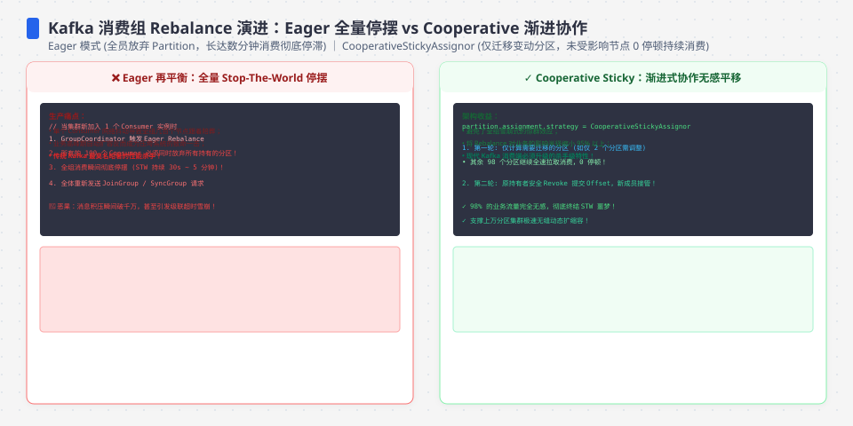
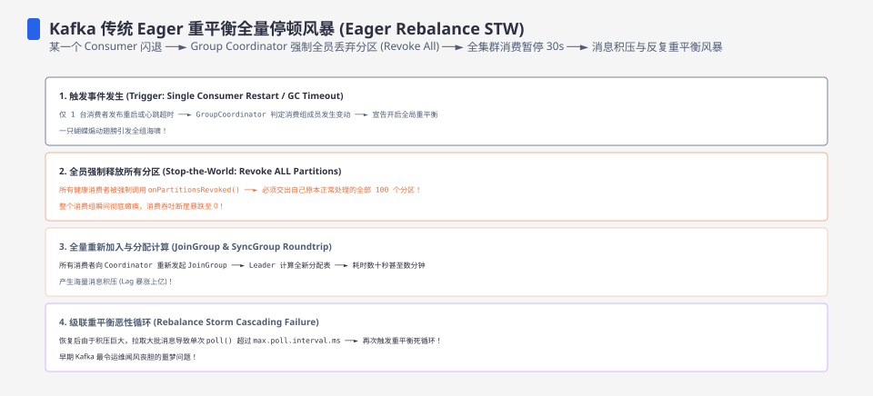
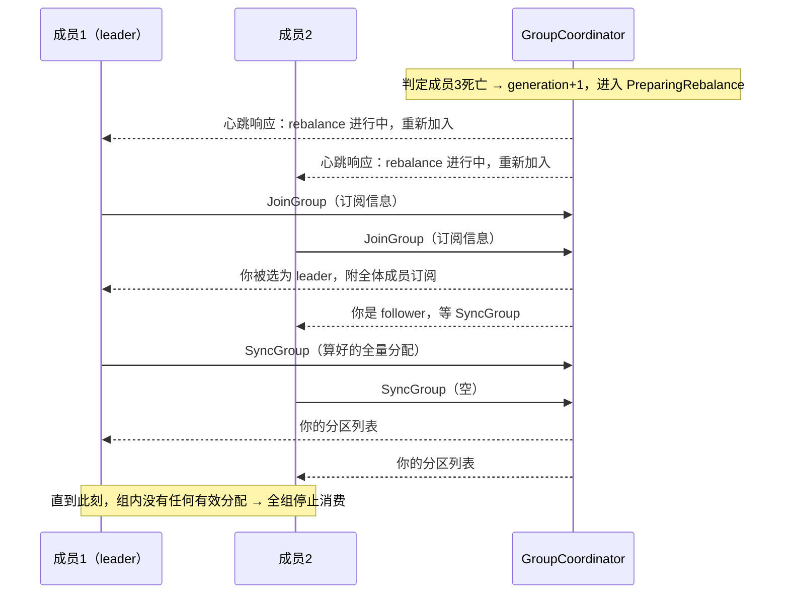
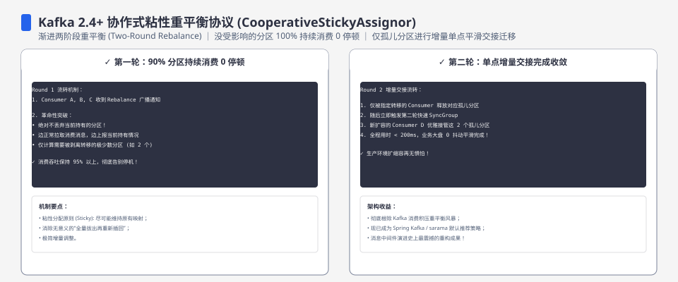

**TL;DR：** 经典（eager）再平衡的语义是**先全部撤销、再全部重分配**：从 coordinator 判定有成员加入/离开/超时的那一刻起，到 JoinGroup/SyncGroup 两阶段跑完，消费组不持有任何有效分配，这段 stop-the-world 空窗里全组停止消费，而生产不停，lag 就按“生产速率 × 停摆时长”陡增。窗口 ≈ 检测（经典协议的 session timeout）+ 通知全体重加入（最慢的成员决定）+ 分配计算；成员越多、越慢，窗口越长。止血分三层：Sticky 只少搬、CooperativeSticky（KIP-429）改成只停要搬的分区、KIP-848 在 Kafka 3.7 先以 Early Access 出现、Kafka 4.0 起 GA，把分配协议改成增量路径。关键反直觉点：**经典协议里一个成员出问题或加入，代价可能由全组承担**。


---



## 一、场景：一次扩容，消费整组停电

半夜给一个消费订单事件流、峰值 5k msg/s 的 group 扩容：从 2 个消费者加到 6 个，想压掉 lag。加第一个消费者时，监控里看到的不是新成员平滑上线，而是**整组消费速率掉到 0**、lag 开始爬升；等新成员真正拿到分区，组才恢复。接着加第二个，又停一次。加 4 个成员 ≈ 4 次全组停摆，lag 越滚越高——你为了降 lag 扩容，反而把 lag 抬了起来。

另一种打开方式：组里某个成员一次 Full GC 停了 60 秒，超过默认 session.timeout（45s）——coordinator 判定它死亡、踢出组、触发 rebalance，**连累整个组**停电；这个成员恢复后重新加入，如果它再次超时，就是第二次全组停电。就算它及时恢复，处理也慢到超过 max.poll.interval.ms，结局相同。

先记住这个结论再往下看：扩容、成员挂死、滚动发布，任何一个成员的动静都会把整个组拖进空窗。这是协议语义决定的，不是故障。




## 二、消费组协议：coordinator、心跳与两个超时各守什么

**GroupCoordinator**。一个 group 的 coordinator，是集群里拥有该 group 对应 `__consumer_offsets` 分区的那个 broker（group.id 哈希进 50 个默认 offset 分区，落到哪个分区就由哪个 broker 协调）。它管三件事：成员（谁在组里、generation 几何）、分配（rebalance 时怎么分）、offset（提交与读取）。组自身有个状态机：Empty → PreparingRebalance → CompletingRebalance → Stable → Dead。

**心跳与 session.timeout.ms**。成员定期发心跳，coordinator 在 `session.timeout.ms`（Kafka 3.0 起默认 45000ms，3.0 前为 10000ms，见 KIP-735 与官方 consumer 配置文档）内没收到某成员心跳，就判它死亡、剔除并触发 rebalance。`heartbeat.interval.ms` 默认 3000ms，官方建议不超过 session 的 1/3。现代 Java 客户端里心跳由独立后台线程发、不随 poll 阻塞；Kafka 3.0 把默认 session 从 10s 提到 45s 的官方理由是另外两条：多云环境瞬断/GC 常导致 10s 误踢、误踢触发两次 rebalance；且默认 `request.timeout.ms`=30s 大于 10s 的 session，连接未干净断开时客户端要等 30s 重连、组早已把它踢掉。

**max.poll.interval.ms**。默认 300000ms（5 分钟，官方文档值）。如果消费者迟迟不调 poll()（一条消息处理了 6 分钟、GC 卡住），coordinator 认为它「活但僵住」，把它移出组、触发 rebalance。它和 session.timeout 的分工是：**session 管「心跳没了」（死），max.poll 管「心跳还在但 poll 停了」（僵）**。Kafka 0.10.1（KIP-62）之前心跳是跟着 poll 走的，处理慢就会假死；解耦之后才有了「心跳正常但 poll 停滞」这种被 max.poll 单独兜住的形态。

**触发 rebalance 的四类事件**：成员加入（扩容）、成员优雅离开（close）、成员被判定死亡（两个超时之一）、订阅/分配需要变化。注意一个不对称：扩容是主动的、优雅的，但代价和挂死一样是全组空窗。

顺带一句对比：Kafka 把消费进度（offset）放在 broker、由 coordinator 管，所以才有「成员变动要重新分配」这件事；Redis Streams 用 XREADGROUP + PEL，成员增减不会触发全组重排——两种记账哲学的差别，见 [Redis 当消息队列的账](/writing/redis-as-mq-consume-groups)。

## 三、eager 再平衡的两阶段：为什么必须先全部 revoke

经典协议一次 rebalance 走 JoinGroup + SyncGroup 两阶段：



机制上三个要点：

**generation 递增是围栏，不是开销。** 每次 rebalance，coordinator 把组的 epoch 加一，旧一代成员提交的 offset 会被拒绝。这等于给被踢出局的成员发了一个失效标记——和分布式锁里 lease 过期后的 fence token 是同一件事（见 [分布式锁的 fence 与 lease](/writing/distributed-lock-fence-lease)）。没有它，被踢的旧消费者继续提交 offset，会把新成员的进度冲掉。

**为什么必须全部 revoke 再重分。** 分配是（成员、订阅、分区）三元组的全局函数。eager 的选择是「先停、再算、再发」：任何时刻最多一个成员持有某分区，不会出现两个成员同时消费同一分区引发的重复与 offset 竞争。它不是 bug，是用一段全局空窗换分配正确性的取舍。协作式协议后来改变了这个等式，见第五节。

**窗口由哪几段构成。** 检测（崩溃 = 最长一个 session.timeout；优雅离开 ≈ 即时）→ 通知其余成员（最多一个 heartbeat.interval）→ 全体重加入（最慢的成员决定，因为 coordinator 要等齐）→ leader 计算分配 → SyncGroup 下发。停摆 ≈ 这些之和。另一个要点：**eager 下「全员停摆」这个性质与分区数无关**——不管组里 8 个分区还是 8 万个，停的都是全组；分区越多，只是 leader 的分配计算（尤其 Sticky 这种组合优化）和 SyncGroup 分发的绝对耗时越大。




## 四、代价账：停摆怎么随规模涨，风暴怎么把 lag 滚雪球

**lag 尖峰与窗口的关系是算术**：`lag 尖峰 ≈ 生产速率 × 停摆窗口`。按此公式估算（非实测）：生产 5k msg/s 的组停摆 10s，积压 5 万条；回补靠「消费峰值 − 生产」的净消化速率，生产逼近消费峰值时永远追不平。这也是为什么「降 lag 先扩容」往往适得其反——每加一个成员先付一次停摆的账。

**停摆随规模怎么涨。** 不是「分区多所以停得久」的线性账，而是串行慢链：最慢的成员重加入、一次心跳间隔、leader 分配。成员翻倍，重加入的串行等待与分配规模一起涨。最坏窗口以数十秒计——默认 session 45s，一次挂死触发的 rebalance，光检测就可能等满 45s（由 Kafka 默认值推算的量级）。生产里常见的止血操作是先把 session 调到 10s 级，把最坏窗口压到秒级到十秒级。

**rebalance 风暴。** 一个反复超时的成员（处理超 5 分钟被踢 → 恢复 → 再加入 → 再超时）会把组拖进「踢出-重加入-踢出」循环。每轮循环 = 一次全组停摆 + 一代 generation 变更 + 旧代 offset 提交被拒；被踢成员恢复时从最后提交的 offset 重拉，把 at-least-once 的重复窗口也放大（消费端怎么把重复变无害，见 [exactly-once 是营销话术](/writing/exactly-once-message-delivery)）。风暴期间 lag 只涨不跌——这是告警里「消费组持续 rebalancing、lag 飙升」的机理，不是玄学。

**滚动发布是最容易被忽略的风暴源。** 逐个重启消费者，每个成员断开都触发一次全组 rebalance，发布窗口 ≈ 成员数 × 单次停摆。发布卡点一般不是新代码，是再平衡。滚动发布策略与蓝绿切换的取舍见 [部署策略：金丝雀与蓝绿](/writing/deployment-canary-blue-green)。

**本机把整条链跑出来了**（`experiments/kafka-rebalance/`，单节点 KRaft Kafka 3.9.0、classic 协议、3 成员 8 分区，原始采样见 `evidence/kafka-rebalance/2026-08-18-local/kafka-rebalance.csv`）：稳态消费约 200–400 msg/s；`docker pause consumer-2` 冻结整个 cgroup 模拟物理挂死（注意 `SIGSTOP` 对 Java 容器无效、组状态全程 Stable，见实验 README）后约 1 秒，组从 Stable 进入 **PreparingRebalance，该采样点消费速率归零**，再平衡完成后恢复稳态——「踢出 → 全组停 → 追回 lag」的因果链在单点上肉眼可见。本机一次结果：挂死到停摆窗口约 0.5–1s、恢复后追回窗口期间积压；窗口宽度随成员数、网络 RTT 与协调器负载扩大，本机量级不代表生产。实验还顺带修了一个镜像坑：apache/kafka 镜像模板把 `advertised.listeners` 硬编码为 localhost 且不认 `KAFKA_ADVERTISED_LISTENERS` 环境变量，不覆盖配置的话容器内客户端会连自己、组永远起不来。

## 五、对策：Sticky、CooperativeSticky 与 KIP-848 三层止血

先分清两类改进：**改数学**（少搬哪些分区）和**改协议**（只停该停的）。前两档都改不动协议，第三档才动。

**分配策略层（仍是 eager 协议，只是搬得聪明点）：**

| 策略 | 承诺的语义 | 取舍 |
| :--- | :--- | :--- |
| Range | 每主题内连续分段 | 实现最简；成员数不整除时倾斜；rebalance 几乎全搬 |
| RoundRobin | 跨主题整体轮转 | 分布最均衡；零粘性，rebalance 全搬 |
| Sticky | 平衡优先，其次尽量不搬 | 减少搬动；分配是组合优化，计算比前两者贵 |

Range/RoundRobin/Sticky 的共同点：协议没变，改变的是「搬哪些」的数学。对「先全部 revoke」这个全局空窗毫无帮助。

**协议层第一档：CooperativeSticky（KIP-429，Kafka 2.4 起）。** 改协议本身：成员**保留不用搬的分区、只 revoke 必须搬的**，rebalance 分多轮收敛。典型效果是扩容时只有让位给新成员的那几个分区停电，其余分区全程在消费——把「全局停电」缩成「局部让位」，空窗从「整个组」变成「被搬走的那几个分区」。代价：全组成员必须用协作式协议（eager/cooperative 混用是配置错误）；收敛需要多轮（通常两轮内）；Sticky 的组合优化成本依旧在。

**协议层第二档：KIP-848 新消费组协议。** Kafka 3.7 只是 Early Access；Apache Kafka 4.0 起该协议 GA。服务端通过 feature/version 机制启用新 group coordinator，客户端需要设置 `group.protocol=consumer` 才使用新协议；具体配置名和默认值要跟目标 Kafka 版本的官方文档走，不能继续沿用 3.7 preview 的说法。核心改动：用 `ConsumerGroupHeartbeat` 等增量协议替代 classic 的 JoinGroup/SyncGroup 全局屏障，成员心跳响应可以携带分配或 revoke 信息，分配也可以由 broker 端负责。**为什么它能降成本**：classic 协议下任何变化都要全体成员重加入，新协议把变化局部化，减少全组同步等待，但升级仍需要核对客户端、broker、assignor 和回滚兼容性。

**参数止血（不改协议，先止损）。** 对 classic group，可以把 `session.timeout.ms` 从默认 45s 调到 10s 级，压缩最坏检测窗口，代价是网络抖动容易被误判死亡；调大 `max.poll.interval.ms` 可以避免“处理慢一点就被踢”，代价是踢出反应变慢；`group.initial.rebalance.delay.ms` 影响启动时成员等待。Kafka 4.0 的 consumer protocol 还会把 heartbeat/session 的控制权更多交给 broker 侧，不能把 classic 客户端参数直接套过去。监控上盯三样：group 处于 Stable 态的时间占比（健康度）、rebalance 次数/分钟、lag 曲线的斜率（斜率为正的时长就是空窗）。

优先级建议：先参数止损，再考虑把分配换成 Sticky，协议级改动（CooperativeSticky 或 KIP-848）要付「全客户端升级 + 可能切 KRaft」的账——但只有它俩能真正消灭「全组停电」这个性质。

## 六、结论：把 rebalance 当一等公民的运维对象

三句话收束：**经典 eager 的 stop-the-world 是协议语义，不是故障**——用全局空窗换分配正确性；**扩容、挂死、滚动发布都会触发它，风暴会让一次秒级抖动升级成 lag 滚雪球**；**止血优先级是参数 → 数学 → 协议**，前两档止损、最后一档才治本。面试里能讲清「为什么必须全部 revoke」「generation 为什么递增」「KIP-429 与 KIP-848 分别在改什么」，比背默认值值钱得多。

下一步可执行：翻出生产里最近一次 lag 告警的时序，对照第三节的窗口构成，估算「检测」和「重加入」各占几秒；然后跑一遍实验入口的复现，把扩容/挂死触发 rebalance 的消费速率曲线留档，用第一节的公式对一次账。

## 附录：实验入口——在本机复现一次停摆

脚手架在 `experiments/kafka-rebalance/`（含 `kraft-server.properties` 覆盖文件：apache/kafka 镜像模板硬编码 `advertised.listeners=localhost`、不认 `KAFKA_ADVERTISED_LISTENERS` 环境变量，不覆盖的话容器内客户端会连自己，组永远起不来）：docker compose 起单节点 KRaft Kafka（钉住 classic 协议），脚本建 8 分区 topic、起循环 producer（约 1000 msg/s）与 3 个消费者，第 15s 用 `docker pause` 冻结一个成员（`docker kill -s STOP` 对 OrbStack 上的 Java 容器实测无效，组状态全程 Stable，这是实际踩出来的坑），每 0.5s 采样组状态与消费速率到 `kafka-rebalance.csv`。

```bash
cd experiments/kafka-rebalance
./run.sh          # 全自动：起 broker → 建 topic → 起 producer/消费者 → 采样 → 汇总
```

本机实测曲线（2026-08-18，单节点 KRaft Kafka 3.9.0，采样见 `evidence/kafka-rebalance/2026-08-18-local/kafka-rebalance.csv`）：稳态 ~200–400 msg/s；15s pause 成员后，约 1 秒进入 PreparingRebalance 且**该采样点消费速率归零**，再平衡完成回到 Stable、速率恢复并追回窗口期积压。零区间宽度即为停摆窗口（本机一次结果，约 0.5–1s），与第一节公式对账一致。

## 参考资料

1. Kafka 官方 consumer 配置文档（session.timeout.ms / heartbeat.interval.ms / max.poll.interval.ms 默认值）—— https://kafka.apache.org/documentation/#consumerconfigs
2. KIP-429：Kafka Consumer Incremental Rebalance Protocol—— https://cwiki.apache.org/confluence/display/KAFKA/KIP-429%3A+Incremental+Cooperative+Rebalancing+in+Kafka
3. KIP-848：The Next Generation of the Consumer Rebalance Protocol—— https://cwiki.apache.org/confluence/display/KAFKA/KIP-848%3A+The+Next+Generation+of+the+Consumer+Rebalance+Protocol
4. Apache Kafka 4.0 release announcement（KIP-848 GA）—— https://kafka.apache.org/blog/2025/03/18/apache-kafka-4.0.0-release-announcement/
5. Kafka Consumer Rebalance Protocol（4.3 文档，classic/consumer protocol 与配置边界）—— https://kafka.apache.org/43/operations/consumer-rebalance-protocol/
6. KIP-735：Increase default consumer session timeout（Kafka 3.0，10s→45s）—— https://cwiki.apache.org/confluence/display/KAFKA/KIP-735%3A+Increase+default+consumer+session+timeout
7. Kafka 官方 broker 配置—— https://kafka.apache.org/documentation/#brokerconfigs

> 延伸阅读：再平衡让全组停摆期间，offset 提交窗口与重复消费怎么兜，见 [exactly-once 是营销话术：一条消息的一生](/writing/exactly-once-message-delivery)；generation 作为失效标记的来龙去脉，见 [分布式锁：fence、lease 与锁的失效](/writing/distributed-lock-fence-lease)；Kafka 与 Redis Streams 两种消费记账哲学的分界，见 [Redis 当消息队列的账](/writing/redis-as-mq-consume-groups)。
