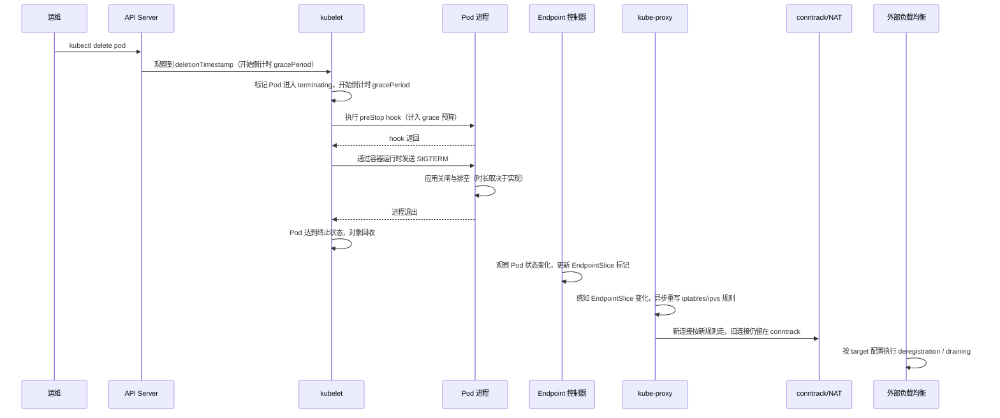

**TL;DR：** 优雅下线不是一个固定的“十秒流程”，而是多条时序叠在一起：`terminationGracePeriodSeconds` 约束容器停止，EndpointSlice 暴露终止状态，代理和负载均衡各自传播变更，已经建立的连接还可能继续复用旧后端。**先定义新连接停止、在途请求完成、旧连接关闭这三个验收点，再用时间戳和抓包验证每一层**；不要把某个集群、某个云 LB 的默认值写成 Kubernetes 的通用保证。

## 一、从一个可复现的发布假设开始

下面是用于建立排查方法的构造场景，不是本仓库已经在线验证的事故数据：一个 Deployment 有 32 个副本，滚动更新分批替换；应用日志显示 SIGTERM 后约 1 秒完成排空，没有 SIGKILL，但发布窗口里下游仍收到一批超时。

如果监控图上的超时与 Pod 生命周期吻合，不能直接推出“信号发出后还被打了十秒”；需要先确认请求到底来自新连接、复用连接、Service、服务网格还是外部 LB。真正的问题是：**从一个进程决定退出，到不同流量来源都停止使用它，中间发生了什么？**

## 二、SIGTERM 到连接消失，要穿过四层

先纠正一个直觉：`kubectl delete pod` 不是"点一下，Pod 消失"。它是一个 API 调用，随后一串分布式系统依次接力。从 SIGTERM 发出到流量彻底离开这个 Pod，链路是这样：

每一层都有自己的时延和语义，逐层拆：

**第一层，kubelet 与 Pod 对象。** API Server 记录删除时间戳和 grace period 后，节点上的 kubelet 开始本地终止流程。`preStop` hook 必须先完成，之后容器运行时才会发送 TERM；hook 的耗时也计入 `terminationGracePeriodSeconds`，并不是与 SIGTERM 并行的额外时间。默认 grace period 是 30 秒，但 Pod 可以显式配置，强制删除、节点故障和 sidecar 还会改变实际路径。进程退出后 kubelet 才能完成容器和 Pod 的收尾；若总耗时超过预算，仍可能被 SIGKILL。应用侧应先停止接受新工作，再排空已有工作，见[SIGTERM 之后发生了什么：把优雅停机做成一件确定的事](/writing/graceful-shutdown-in-go)。

**第二层，EndpointSlice 的标记传播。** 对由 Service selector 管理的 Pod，控制面会评估是否把它从可用端点中移出；当前 EndpointSlice API 用 `terminating`、`serving`、`ready` 三个 condition 表达不同语义。终止端点的 `ready` 会变为 `false` 以兼容旧消费者，但若业务需要在排空期间继续服务，应观察 `serving`，不能只看 `ready`。这些字段是 API 语义，不等于每个自定义控制器、服务网格或外部 LB 都会按同一方式消费；集群版本、代理实现和 `publishNotReadyAddresses` 配置都应纳入验证。控制器更新本身是异步的，API watch → EndpointSlice 更新 → 下游消费者观察之间没有一个可由文章给出的通用毫秒或秒数。

**第三层，kube-proxy 的数据面同步。** 即使 EndpointSlice 更新了，kube-proxy 也要把它翻译成所选代理模式的数据面规则。iptables 模式同时有事件触发的最小同步周期和周期性重同步；当前文档列出的 `--iptables-min-sync-period` 默认值为 1 秒，`--iptables-sync-period` 默认值为 30 秒，但发行版、配置文件和代理模式可能不同。这里的“30 秒”是清理/重同步参数，不是每次 EndpointSlice 变化都要等待的固定延迟；实际更新应看 kube-proxy 配置、指标和节点上的规则快照。控制面对象与节点规则之间也没有强一致承诺。

**第四层，连接状态与外部负载均衡。** 这是最容易把“新连接已摘除”和“所有流量已消失”混为一谈的一层。至少要分开两个机制：

1. 已建立的连接通常不会因为一条新规则出现就重新选择后端。对经过 conntrack 的 NAT 流，后续报文会沿着已有状态处理；连接池复用多久、代理是否主动关闭、服务端是否发送 FIN/RST，决定它什么时候结束。`nf_conntrack_tcp_timeout_established` 是 Linux 内核配置项，不能把某个内核版本的默认值当作 Kubernetes 或云环境的通用时长。
2. 外部负载均衡有自己的摘除协议。某些 AWS ALB/NLB 目标组属性的默认 deregistration delay 是 300 秒，但这只是特定产品和配置的默认值，而且“停止新连接”“等待在途请求”“处理长连接”在不同 LB、协议和模式下并不等价。必须核对目标组配置与观测结果，不能据此推出所有集群都要等待 300 秒。

## 三、三个反直觉的事实

**事实一：摘除是状态传播，不是一个瞬时 API。** 应用把 readiness 探针打成失败、Pod 进入 terminating，都不等于所有来源的流量立即停下。后面还有 EndpointSlice 消费者、kube-proxy 或服务网格、外部 LB，以及存量连接。要把“新连接停止”与“在途请求结束”分开验收，并按实际数据面观察 EndpointSlice、代理规则/状态、LB target health 和连接关闭事件；只看其中一个对象不够。

**事实二：新连接何时停，取决于消费者的实现；老连接不会因为 EndpointSlice 更新自动换后端。** Service proxy 通常忽略 `terminating` endpoint，但在所有端点都处于 terminating 等情况下，仍可能把流量发给同时 `serving` 的 terminating endpoint，以避免滚动更新期间丢失服务；自定义 LB、服务网格和外部 LB 可能有自己的解释。对已有 TCP 连接，连接池、代理和 conntrack 会继续沿旧路径处理，直到连接协议或上层策略让它结束。因此“Pod 从流量中消失”至少要报告两个时间：最后一个新连接命中旧 Pod 的时间、最后一个旧连接结束的时间。

**事实三：外部负载均衡可能拥有独立于 Pod 的生命周期。** `terminationGracePeriodSeconds` 只约束 Pod 的终止预算，不会自动配置云 LB 的 target draining。LB 的 target health、deregistration、连接迁移和重试策略必须单独核对；如果 Pod 已经被强制终止，LB 仍可能把存量连接的失败表现延迟到客户端重试时才暴露。发布完成后的偶发连接错误，应该用 LB target 事件、客户端连接复用日志和 FIN/RST 时间线去归因，而不是直接归因于某一个“默认 300 秒”。

## 四、用三个验收点拆开下线时间

不要先问“为什么是十秒”，先为一次下线定义三个可观测时间点：`T_new-stop`（最后一个新连接不再命中旧 Pod）、`T_inflight-drain`（在途请求完成或超时）、`T_conn-close`（最后一个复用连接关闭）。它们的顺序可能不同，数值必须来自目标集群和目标 LB 的实测。

| 环节 | 要记录的证据 | 影响哪个验收点 | 能否直接调参 |
| :--- | :--- | :--- | :--- |
| API 删除时间戳 → kubelet 开始终止 | Pod `deletionTimestamp`、kubelet/container runtime 事件 | 三者都可能影响 | 只能通过节点与控制面容量间接改善 |
| `preStop` → TERM → 应用退出 | hook 日志、进程信号、请求排空指标、SIGKILL 计数 | `T_inflight-drain`、`T_conn-close` | 应用实现与 grace 配置可以调，但总预算有限 |
| EndpointSlice 条件变化 | `terminating` / `serving` / `ready` 的资源版本与时间戳 | 主要影响 `T_new-stop` | 观察消费者是否支持，不能只调 Pod |
| kube-proxy/服务网格规则更新 | 代理指标、配置、节点数据面快照 | 主要影响 `T_new-stop` | 取决于代理模式和发行版配置 |
| conntrack 与连接池 | 连接建立/复用/FIN/RST、idle timeout | `T_conn-close` | 缩短连接寿命有吞吐和握手成本 |
| 外部 LB target draining | target health 事件、deregistration 配置、请求日志 | 三者可能都影响 | 调小窗口会增加中断风险，必须配合协议和重试验证 |

关键结论就一句话：**grace period 管的是容器终止预算，管不了所有来源的流量收尾**。如果在途请求、连接复用和 LB target draining 没有被纳入验收，单看 Pod 已删除只能证明对象生命周期结束，不能证明用户侧无错误。

## 五、对策：每一层都有一件能做的事

| 层 | 做法 | 代价 |
| :--- | :--- | :--- |
| 应用 | 收到停止信号后停止接收新业务、排空在途请求，并为客户端连接设置可解释的关闭策略；`http.Server.Shutdown` 只是 Go HTTP 服务的一部分能力 | 请求完成率、排空耗时、SIGKILL 数量 |
| Endpoint | 让发布控制器、探针和 Service selector 的语义一致；必要时观察 EndpointSlice 的 `terminating` / `serving` 条件，而不是只改一个 readiness 返回值 | `kubectl get endpointslice -l kubernetes.io/service-name=<svc> -o yaml --watch` |
| kube-proxy / 服务网格 | 先确认实际代理模式、配置和同步指标，再讨论同步周期；不能通过换模式直接推导出业务零错误 | 代理指标与节点数据面快照 |
| conntrack | 让客户端或代理按业务可接受的 idle/max-age 策略主动轮换连接；代价是更多握手、TLS 和连接建立压力 | 抓包看 FIN/RST、连接复用和重连时点 |
| LB | 明确 target deregistration、健康检查、长连接和重试语义，按目标业务调节窗口并做中断测试 | target 状态事件、LB 日志与发布窗口错误率 |

工程上的判断：**默认先不要调任何内核、LB 参数，先加观测**。把“SIGTERM 之后发生了什么”变成发布时可量化的指标：从删除时间戳到 TERM、从 TERM 到最后一个请求、从最后一个新连接到最后一个旧连接、被 SIGKILL 的实例数、发布窗口的 5xx/连接错误率。然后逐层确认：是 EndpointSlice 消费者还没更新？代理数据面还没同步？连接池还挂着？还是 LB target 仍在排空？看到具体是哪一层，再动哪一层。

## 六、结论：用连接和时间戳验收下线，而不是用 Pod 消失验收

Kubernetes 里优雅下线难，不是因为存在一个神秘的固定延迟，而是因为它跨过了应用、kubelet、控制面、节点数据面、连接状态和外部负载均衡多个故障域。进程可以控制自己的关闸和排空，却不能把 EndpointSlice、kube-proxy、服务网格、conntrack 与云 LB 变成一个原子操作。

对策是把验收拆成可复现的协议：记录删除时间戳、hook/TERM、EndpointSlice condition、代理规则、LB target 状态、请求完成和连接 FIN/RST；分别报告新连接停止、在途请求完成和旧连接关闭。没有真实集群、目标 LB 和连接复用方式的实验，就只能给出验证方法，不能把“十秒”“30 秒”或“300 秒”写成生产保证。

## 参考资料

1. Kubernetes 文档：Pod Lifecycle（Terminating 流程、terminationGracePeriodSeconds、SIGKILL 兜底）—— https://kubernetes.io/docs/concepts/workloads/pods/pod-lifecycle/
2. Kubernetes 文档：Container Lifecycle Hooks（preStop 时序与 gracePeriod 预算）—— https://kubernetes.io/docs/concepts/containers/container-lifecycle-hooks/
3. Kubernetes 文档：Endpoint Slice 终止条件（terminating / serving 标记）—— https://kubernetes.io/docs/concepts/services-networking/endpoint-slices/
4. Kubernetes 文档：kube-proxy 配置（iptables-sync-period、proxy-mode）—— https://kubernetes.io/docs/reference/command-line-tools-reference/kube-proxy/
5. AWS 官方文档：NLB 目标组属性（deregistration 默认 300s、传播延迟）—— https://docs.aws.amazon.com/elasticloadbalancing/latest/network/edit-target-group-attributes.html
6. AWS 官方文档：ALB 目标组属性（deregistration delay）—— https://docs.aws.amazon.com/elasticloadbalancing/latest/application/load-balancer-target-groups.html
7. Linux 内核文档：nf_conntrack TCP 超时（established 默认 5 天）—— https://wiki.nftables.org/wiki-nftables/index.php/Conntrack_tools

> 延伸阅读：SIGTERM 之后应用侧的四步：关闸、排空、收尾、兜底，见[SIGTERM 之后发生了什么：把优雅停机做成一件确定的事](/writing/graceful-shutdown-in-go)；排空超时后客户端重试如何放大错误，见[重试会放大一切错误：幂等性工程的完整账本](/writing/idempotency-engineering)。
