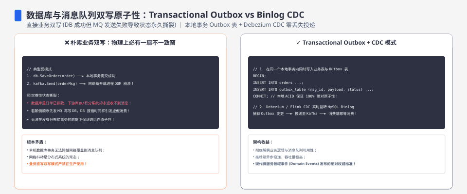
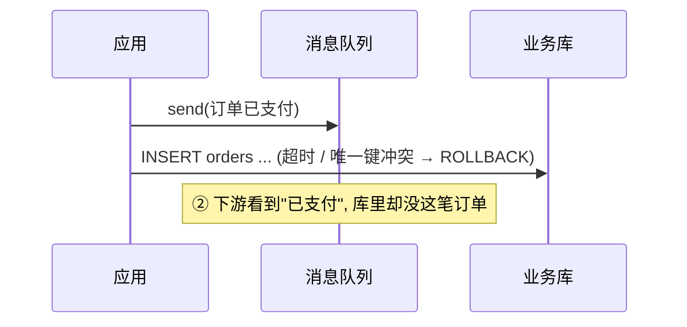
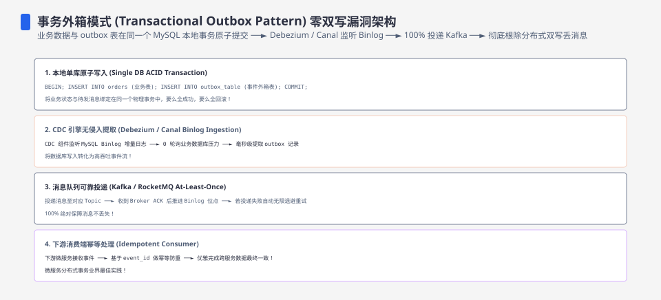
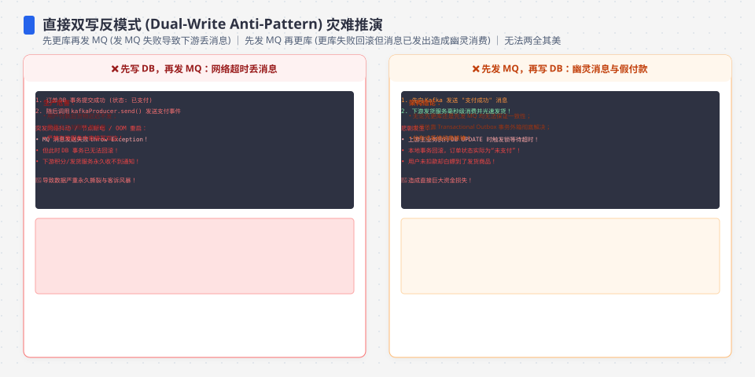

**TL;DR：** 只要「业务库」和「消息队列」是两个独立存储，任何「两边各写一份」的实现都必然存在一扇窗：要么 **DB 提交成功、MQ 没发出去（丢事件）**，要么 **MQ 发出去了、DB 事务回滚（脏事件）**。这不是网络抖动，是**两个存储之间不存在共同事务**的结构性结果。Transaction Outbox 的解法是把事件表写进业务库的**同一个本地事务**，让「业务提交」与「事件落库」原子发生，再让一个可重试的 relay 去背 at-least-once；binlog CDC（canal / Debezium）则是「把 binlog 当现成 outbox」的偷懒版——它省掉事件表和 relay，代价是事件语义（格式、DELETE、schema 演进、生命周期）全部跟着数据库走。两条路都只承诺**最终一致 + 消费幂等**，区别是这扇窗由谁关、开在哪一层。


---



## 一、双写为什么必有一扇窗：两个反例

「双写」就是应用代码自己动手，先写业务库、再发消息：

```go
// 伪代码：业务库和消息队列各写一份
BEGIN;
  INSERT INTO orders(id, amount, status) VALUES (1001, 880, 'PAID');
COMMIT;              // ① 写业务库
mq.Publish(event);   // ② 写消息队列
```

直觉上「先 DB 后 MQ、顺序固定就没事」。错，固定顺序只是把一扇窗换到另一扇窗。

**反例一（丢事件窗口）**：DB 的 COMMIT 已经返回成功，进程在 `mq.Publish` 执行前崩溃（或网络超时把 publish 当成失败、随后进程退出）。订单在库里是 `PAID`，消息却永远没发出去。

```mermaid
sequenceDiagram
    participant App as 应用
    participant DB as 业务库
    participant MQ as 消息队列
    App->>DB: BEGIN; INSERT orders; COMMIT
    Note over DB: ① 订单已支付
    App->>App: (publish 前崩溃 / 超时后退出)
    Note over MQ: ② 事件永远没到 —— 丢失
    Note over DB: 库里有订单, 下游却不知道
```

**反例二（脏事件窗口）**：把顺序反过来先发 MQ，或者 DB 的 COMMIT 失败回滚。消息在队列里躺着，库里没有这笔订单，下游按消息去查业务数据，查不到。



两扇窗说的是同一件事：**跨两个存储没有原子性**。单库的原子性靠它自己的提交协议（WAL + 锁）在一台机器内实现；两个存储之间不存在「共同提交」这个动作，两次写之间的任何失败都会让两侧进入不一致。想把两个存储塞进同一个提交，就得引入 2PC 那样的协调者——而[分布式事务：2PC 为什么没人敢用](/writing/distributed-transactions-2pc-saga)讲过，协调者自己的崩溃会让所有参与者悬挂锁死。所以「双写必然有窗」不是实现没写好，是问题形状决定的：要么接受这扇窗，要么付出协调者的代价。




## 二、事务性 Outbox：把事件请进业务事务

Outbox 的思路一句话：与其保证「业务写」和「发消息」原子，不如让「发消息」根本不存在于跨库路径上——事件先作为一行数据写进业务库、和业务同事务提交；真正「发给 MQ」的动作后置，交给一个独立的 relay 进程去做。

```sql
BEGIN;
  INSERT INTO orders(id, amount, status) VALUES (1001, 880, 'PAID');
  INSERT INTO outbox(id, event_type, payload, status, created_at)
    VALUES ('evt-1001', 'order.paid', '{"order_id":1001,"amount":880}', 'PENDING', NOW());
COMMIT;   -- 订单行与事件行, 同一个事务, 要么都可见要么都不可见
```

原子性不再依赖任何跨库协议，而是**业务库自己的 COMMIT**：事件行是业务表的一份同库副本，两者之间没有窗。这是它和 2PC 的分界线——[2PC 用协调者换来跨库原子](/writing/distributed-transactions-2pc-saga)，Outbox 用「把第二个写折叠进第一个事务」换掉协调者，代价是发送被后置。

Relay（发送者）是下一个要写对的部分：

```go
// 伪代码：relay 轮询扫描 → 发送 → 标记
for {
  rows := SELECT * FROM outbox WHERE status='PENDING'
              ORDER BY created_at LIMIT 100;       // 每轮一批
  for _, r := range rows {
    if err := mq.Publish(r.Payload); err == nil {
      UPDATE outbox SET status='SENT' WHERE id=r.id AND status='PENDING';
    }
  }
  time.Sleep(100 * time.Millisecond);              // 轮询间隔 = 事件延迟下界
}
```

relay 必须处理一个结构性问题——**「发完没标」的重发**：`mq.Publish` 成功返回了，但紧接着的 `UPDATE ... SET status='SENT'` 失败（进程崩溃、连接断开、超时后重连）。下一轮轮询看到这条还是 `PENDING`，于是**再发一次**。所以 Outbox 的投递语义天生是 **at-least-once**：不丢，但可能重复，重复窗口就是「publish 与 markSent 之间的崩溃」。注意这个重复不是 bug——你无法区分「没发出去」和「发出去了但没标」，只能默认重发，代价由消费端吸收。这正是[exactly-once 是营销话术](/writing/exactly-once-message-delivery)讲过的：传输层没有 exactly-once，只有 at-least-once + 幂等。

因此 Outbox 方案有一条铁律：**消费端必须幂等**。消费端在执行业务（更新订单状态、给用户加积分）的同时，把事件的主键写进幂等表，两者也放在**同一个本地事务**里——重复事件到达时先查幂等表，命中就跳过。[幂等性工程的完整账本](/writing/idempotency-engineering)说的就是这个：幂等键要能天然来自业务（order_id 而非随机 message_id），幂等写必须与业务写同事务，否则会出现「幂等表写了业务没写」或反过来的新窗。

Outbox 的代价，一条一条数：

- **业务事务变肥**：每条业务写都多插一行事件，事务范围变大，行锁持有时间变长，写入量成倍增长。
- **事件延迟下界 = 轮询间隔**：relay 多久扫一次，事件至少要等到下一次扫描；当前内存演示没有把该延迟与真实数据库、网络和 broker 延迟混在一起。
- **outbox 表膨胀**：`SENT` 的历史行不清理会无限增长，定期 delete 本身就是一套运维。
- **relay 的高可用**：多个 relay 实例要避免同一条被两个实例同时发（用 `UPDATE ... WHERE status='PENDING'` 的行级 CAS 或按分片锁），单实例挂了要有补位。

## 三、binlog CDC：把 binlog 当现成的 outbox

CDC（Change Data Capture）把上一节的问题反过来问：**能不能连 outbox 表都不用自己建？** 答案是能——因为 MySQL 本身已经替你在事务提交的同时写好了这本「变更账」：binlog。只要 binlog 是可复现的格式，里面就有一行一行的「已提交变更事件」，而且这些事件只属于**已提交**的事务——[MySQL 的三条日志](/writing/mysql-redo-undo-binlog)讲过，InnoDB 的 redo 与服务器的 binlog 靠两阶段提交保持一致，未提交事务的变更不会进 binlog。所以 binlog 天然满足「与业务同事务、无脏事件」：**它就是一个数据库帮你写好的 outbox**。

canal、Debezium 这类组件就是「binlog 的读者」：连上 MySQL，以 replica 的身份模拟主从复制，把 binlog 流解析成行事件，再转成你要的消息（投到 MQ、Kafka 或直接进下游）。要跑对，有三个前提必须讲清：

**前提一：binlog 必须是 ROW 格式。** STATEMENT 格式记的是 SQL 语句，遇到 `UPDATE ... SET c = RAND()` 或 `NOW()` 这种执行期才确定的值，解析出来无法还原真实行变更。canal 和 Debezium 都要求 `binlog_format=ROW`，每个事件是行级的 before/after 镜像（UPDATE 有两张镜像，DELETE 只有 before）。

**前提二：必须维护 position 续传。** 每个 CDC 实例持有「读到了哪个 binlog 文件的哪个位置」（`SHOW MASTER STATUS` 里的 File + Position），处理完下游后把新位置落盘（Debezium 存自己的 offset topic，canal 存 zookeeper（HA 模式）或本地文件/内存）。position 的提交时机决定投递语义：**处理了下游、但 position 还没落盘时崩溃 → 重启后从旧位置重读 → 重复**。所以 CDC 同样是 at-least-once，消费端同样必须幂等——这和 outbox 的「发完没标」是同一个重复窗口的不同形态。

**前提三：要分得清「读日志」和「读业务状态」。** 这是 CDC 最容易用错的地方：它看到的永远是 binlog 里的**事件流**，不是业务表**当前的样子**。区别立刻体现在三类场景：

- **删除**：业务删了一行，binlog 记 DELETE，事件也必须是个删除事件——而你在 outbox 里可能压根没设计过「删除事件」。
- **重复更新**：同一行被 UPDATE 三次，binlog 就有三条事件，一条都不合并；outbox 由业务自己发事件，你可以选择「只发最终状态」。
- **状态感知**：binlog 事件不知道「这条变更对应业务流程的哪一步」，它只知道「这一行被改成了什么」。

这决定了 CDC 的适用面：它擅长「数据库的忠实镜子」——搜索索引、缓存重建、数仓同步、审计；它不适合「业务领域事件」——「订单支付成功、通知积分系统」这类语义在应用层，CDC 替你发的只会是「orders 表某行被 UPDATE 了」，下游还得猜这行改动意味着什么。

CDC 的代价，对照 outbox 的代价看：

- **binlog 体积**：ROW 格式的 binlog 体积通常大于 STATEMENT（见 MySQL 官方 replication 格式章节），全量行变更都进日志，事件量大，解析开销高。
- **schema 演进**：binlog 事件格式跟随表结构。加一列、改字段类型，CDC 的解析就要跟着升级——Debezium 用 schema history 处理版本演进，canal 得自己管。而 outbox 的 payload 是你手写的 JSON，改事件结构只动生产端。
- **数据生命周期不在你手里**：binlog 有保留期（MySQL 8.0 的 `binlog_expire_logs_seconds` 官方默认 30 天），position 落后于清理点就**永久断流**，只能全量重建。outbox 的 SENT 行你随时能删。
- **没有「发完」这个水位**：binlog 不能删（它服务主从复制与恢复），CDC 也没有 SENT 状态——它只有 position 一个滑窗，处理到哪完全靠 offset，追不上的代价比 outbox 大。




## 四、Outbox 与 CDC：八维对照

| 维度 | 事务性 Outbox | binlog CDC |
| :--- | :--- | :--- |
| 事件延迟 | 轮询间隔决定，秒级下界 | 流式解析，亚秒级到秒级，跟随复制链路 |
| 业务侵入 | 事务里多写一张表 + 一套 relay | 零侵入，不动业务代码与表结构 |
| 一致性来源 | 事件表与业务表同库同事务 | binlog 与业务同事务（redo/binlog 两阶段） |
| 事件语义 | 自己定义 payload：可合并、只发最终态 | 跟随行变更：多次 UPDATE 多条事件、DELETE 必须处理 |
| 重复处理 | 「发完没标」→ relay 重发 | position 未提交 → 重启重读 |
| 消费端 | 必须幂等 | 必须幂等 |
| schema 演进 | 改自己的 JSON | 跟随表结构，需 schema 管理 |
| 生命周期 | outbox 表自己清 | binlog 有保留期，追不上即断流 |

落到**语义承诺差异**：Outbox 承诺「业务提交 ⟺ 我定义的事件可读」在同一个事务里成立，事件是**你的领域语义**；CDC 承诺「每个已提交的行变更都会被日志记录、可以被读到」，事件是**数据库的观察视角**。前者把窗开在你自己控制的表上，后者把窗开在数据库的日志上。

**为什么**这么选：如果下游要消费的是业务流程语义（支付成功、订单创建），事件本来就是业务的一部分，选 Outbox——语义控制全、和业务一起演进；如果下游要的是数据同步（搜索索引、数仓、缓存），你只是想让别人知道「库里发生了什么」，选 CDC——零侵入、天然实时。硬要总结一句：**outbox 是业务主动生产事件，CDC 是数据库被动暴露变更。**

## 五、实验入口：三扇窗各关一次

实验在 `experiments/outbox-demo/`，一个纯 Go、无外部依赖的最小演示（内存 store 用一把锁模拟「业务 + 事件同事务」），依次演示三件事：双写的丢事件窗口、outbox 的「发完没标」重发、消费端幂等表吸收重复。

```bash
cd experiments && go run ./outbox-demo
```

预期输出四段：① 双写路径下订单已提交但事件丢失；② relay 第一轮 publish 后「崩溃」没标记，第二轮重发同一条，MQ 收到 2 条；③ 消费端幂等表命中，业务实际只执行 1 次；④ 末尾输出一次「业务+事件原子写」的开销量级。

> 边界：demo 第 4 段输出的是内存状态机的量级参考（本机 2026-08-19 复跑：10 万次原子写 75.31ms、单次约 753ns；2026-08-18 首次记录为 53.96ms/约 539ns，两次都在几百 ns 量级；原始输出见 `evidence/outbox-cdc-dual-write-atomicity/2026-08-19-local/run.out`），证明的是失败形状与一致性语义，不是真实 MySQL/网络的延迟数字。真实环境的 relay 轮询间隔、事务 fsync 与 CDC 端到端延迟属于生产验证项，本文不据此下性能结论。

## 六、结论：跨组件一致性的最小单元是同一事务

把三条路放回同一个问题——跨组件原子性怎么获得：

- **2PC** 试图让两个存储同时提交，代价是引入一个会崩溃、且崩溃即悬挂的协调者（详见[分布式事务](/writing/distributed-transactions-2pc-saga)）。
- **SAGA** 放弃原子、接受最终一致，用补偿处理已提交的步骤，代价是「补偿必然成功」这个更难的假设压给业务。Outbox 和 SAGA 的关系在这里：Outbox 不解决 SAGA 的补偿问题，它解决的是 SAGA 里**「最不该失败的那个副作用」——事件发送**。SAGA 的 T1（扣款）提交后，C1 补偿要业务自己写；而 outbox 让「发送事件」这个副作用**可以被重放而不是需要补偿**——业务不可逆的部分仍归 SAGA 管，发送这个可重试的部分归 outbox 管。
- **Outbox / CDC** 是第三条：**把第二个写折叠进第一个事务**。要么亲手把事件写成业务库的一行（Outbox），要么借用数据库已经写好的 binlog（CDC）。两条路都只承诺最终一致 + 消费幂等，区别只在谁控制那扇窗、窗开在哪里。

所以结论不是一个方案，是一个判断标准：**跨组件一致性的最小单元是「同一事务」**——你能把多少个「必须一起发生」的写放进同一个本地事务，你就不需要多少跨库魔法；放不进去的部分（MQ、下游库），一律用 at-least-once + 幂等兜底，而不是继续加协调者。

下一步可执行的动作：把你系统里最核心的「业务写 + 发消息」代码画一遍时序，标出这扇窗在哪；然后决定是自己建 outbox 表还是接 CDC——如果接 CDC，先查两件事：`binlog_format` 是不是 ROW、binlog 保留期够不够你的消费链路追（position 落后就断流）；无论走哪条路，消费端先把幂等表建起来。

## 参考资料

1. Transactional Outbox 模式（Microservices.io）—— https://microservices.io/patterns/data/transactional-outbox.html
2. MySQL 官方：二进制日志与 binlog_format（ROW 体积说明）—— https://dev.mysql.com/doc/refman/8.0/en/binary-log.html
3. MySQL 官方：binlog_expire_logs_seconds（保留期默认值）—— https://dev.mysql.com/doc/refman/8.0/en/server-system-variables.html#sysvar_binlog_expire_logs_seconds
4. Debezium 文档：MySQL Connector（position 续传与 schema history）—— https://debezium.io/documentation/reference/stable/connectors/mysql.html
5. Canal 文档（阿里，MySQL binlog 解析）—— https://github.com/alibaba/canal

> 延伸阅读：投递语义为什么只有 at-least-once，见[exactly-once 是营销话术](/writing/exactly-once-message-delivery)；消费端幂等表的完整套路，见[重试会放大一切错误](/writing/idempotency-engineering)；2PC 的悬挂与 SAGA 的补偿为什么贵，见[分布式事务](/writing/distributed-transactions-2pc-saga)；binlog 与 redo 的两阶段提交，见[MySQL 的三条日志](/writing/mysql-redo-undo-binlog)。
