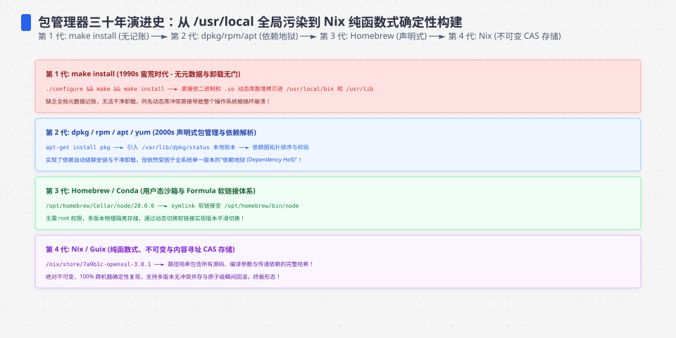
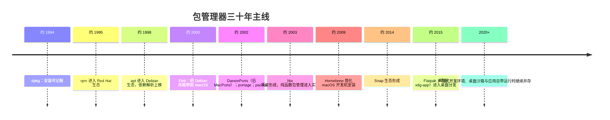
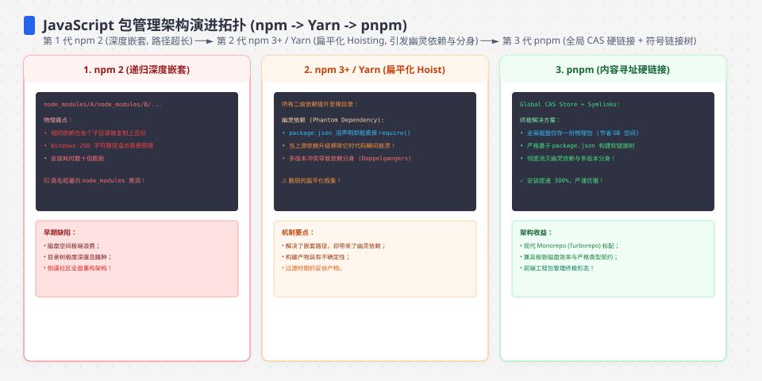
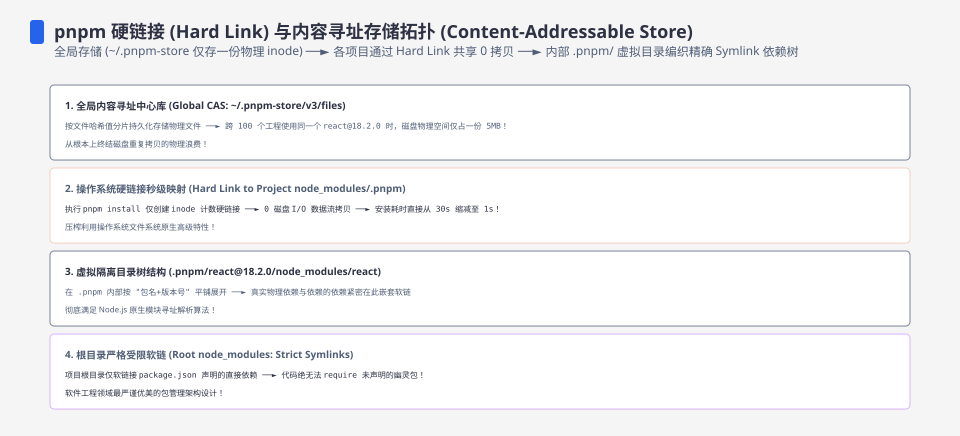

**TL;DR：** 包管理器不能只按“安装速度”比较，至少要问五件事：依赖由谁解析、文件由谁拥有、升级是否有事务边界、运行时是否隔离、供应链和回滚证据在哪里。`apt/dnf` 主要服务发行版一致性，`pacman/portage` 把发行版策略交给用户，Homebrew 服务 macOS 开发机，Nix 提供路径隔离与声明式/可回滚工作流，但“哈希路径”不自动证明构建 bit-for-bit 可复现；Flatpak、Snap、AppImage 面向桌面分发，隔离、更新和系统集成取舍不同。推荐只能按场景给起点，不能把 2026 年的生态偏好写成所有团队的默认答案。

---

## 一、起点：没有包管理器的时代在赌什么

手工 `./configure && make && make install` 的世界，三项风险全裸着：

1. **没有依赖清单**：没人记录"我装过哪些文件、它们属于哪个软件、这个软件还依赖别的什么"。
2. **安装不可逆**：`make install` 没有卸载的概念，装错了只能翻编译日志手工反操作，慢且易错。
3. **不同来源互相打架**：`/usr/local/bin` 与 `/usr/bin` 可能并存两份同名程序，PATH 顺序决定谁赢，靠肉眼调试。

于是 Unix/Linux 世界的包管理器不断把这三个问题自动化和规范化：**依赖怎么声明、文件装到哪、怎样卸载与升级**。回滚、快照、沙箱和可复现构建是后来叠加的能力，不能从“有包清单”直接推出。每一代只是在这些问题上选择不同边界。

时间线标的是项目形成、发布或进入生态的近似窗口，不等同于“首次出现”“成为默认”或当前维护状态；历史年份与当前默认值应回到项目官方档案和版本文档核对。

## 二、第一代：把"安装"变成可记录的——dpkg、rpm（1994–1995）

dpkg 在 Debian 早期形成并于 1994 年进入公开历史，是 `.deb` 包的底层安装、查询和卸载工具。它把文件清单、包元数据和依赖声明写进可查询的本地数据库：**安装可记录、文件有归属、卸载有依据**。它本身不是完整的仓库解析与系统升级策略，这个边界很重要。

RPM 在 1990 年代中期进入 Red Hat 生态，和 dpkg 一样负责包格式、元数据与本地事务；具体发行版版本和发布日期应按项目档案核对。RPM 与 dpkg 是同一类底层工具的两种实现——包格式、元数据和依赖命名不同，仓库与高层求解器另算。

这一代解决的问题：安装能记录、能查询、能卸载；坑也随之而来：**依赖解析靠包内声明，声明不全或成环就无解**，"依赖地狱"（dependency hell）一词由此诞生。`rpm -i` 时代装一个软件要先手动一次攒齐它要的所有依赖，像解连环锁。

## 三、第二代：把"依赖解析"变成可解的题——apt、yum、dnf（1998–2015）

手动逐个攒依赖太累，那就让机器算。APT 在 1990 年代后期形成并运行在 dpkg 之上：它增加仓库索引、版本选择、依赖求解和下载策略，最后把已选事务交给 dpkg 执行。用户只需声明“我要装 X”，但最终结果仍受仓库、pinning、架构、版本约束和本地配置影响，不是数学上唯一的依赖答案。

Red Hat 系先有 RPM，随后由 YUM 和 DNF 提供仓库、元数据和高层事务；Fedora 在 2010 年代逐步转向 DNF，RHEL 的具体默认值按发行版版本核对。**apt 与 yum/dnf 都把“更新元数据 → 选择依赖 → 执行事务”组合起来**，这是这一代的核心贡献，但它们的 solver、仓库策略和事务恢复能力并不相同。

实现上也有差别：不同版本的 apt、libdnf/dnf 和发行版插件使用不同的求解与策略，不能用“一个手写、一个 SAT、一个更慢”概括所有版本。`.deb` 与 `.rpm` 生态长期并列，选择通常跟随发行版、镜像、支持周期和组织运维能力。

| | apt/Debian 系 | dnf/RHEL 系 |
| :--- | :--- | :--- |
| 底层包格式 | `.deb`（dpkg） | `.rpm`（rpm） |
| 解析器 | apt 依赖规则 | libsolv（SAT 求解） |
| 仓库 | Debian 官方 + Ubuntu PPA | Fedora 官方 + EPEL |
| 事务/回滚 | 有安装事务，但不等同于全系统快照 | `dnf history` 可记录/undo/rollback 部分事务，受当前状态和版本影响 |

## 四、第三代：把"选择权"交给用户——portage 与 pacman（2002）

同期出现两个把用户选择权往前推的结构：

- **Portage**（约 2000 年代初随 Gentoo 生态成熟）：从 BSD ports 类系统继承“源码 + 编译参数”模型。每个包以 ebuild 描述，USE flags 允许选择特性；代价是构建时间、维护成本和二进制缓存覆盖率取决于包与硬件，不能用“几十分钟/数小时”当作统一基线。
- **pacman**（约 2000 年代初随 Arch Linux 生态形成）：仍是二进制包 + 元数据仓库，但把同步与升级做成简洁命令，AUR 则是社区构建脚本/包来源，不应与官方仓库混为一谈。代价是滚动发行版的兼容性和修复责任更多交给用户。

两者的哲学都是"**系统是用户的选择，不是发行版的选择**"。现实是两个都留了学费：portage 的学习曲线陡、只吸引乐意折腾的少数；Arch 的滚动发布让用户得常修系统。它们没有成为主流，但留下了"包内参数可摸"的思想遗产。

## 五、岔路一：Nix——把安装输入与路径显式化（约 2003 起）

2003 年前后，Eelco Dolstra 的研究和 Nix 项目把安装模型重新定义了一遍：

- 包不装进传统共享目录，而是装进 **`/nix/store/<hash>-name/`**；这个标识编码了 derivation 的输入和依赖图。不同输入通常落到不同 store path，因此多版本可以并存，升级和 profile 切换也能保留旧代供回滚。
- 依赖声明进入构建环境，未声明的主机资源不应被构建过程随意读取；这能把一类“在我的机器上能编译”的错误提前暴露。
- 但 store path 哈希不自动等于 bit-for-bit 可复现：源码固定、输入锁定、构建过程无时间/随机/网络等未声明影响、目标架构一致，以及缓存/签名策略都影响最终证据。Nix 提供复现和回滚的机制，不替项目消除所有不确定性。

代价是：生态需要按 Nix 的表达式、sandbox、channels/flakes 和 binary cache 约定维护，学习曲线较陡；旧 store path 也要等 profile 不再引用后才能安全垃圾回收。它适合声明式开发环境、需要多版本共存或希望把依赖输入显式化的 CI，但“可复现”必须由锁定输入和重建/对比实验来证明，而不是由 `/nix/store` 路径本身证明。

## 六、macOS 这条线：Fink → MacPorts → Homebrew（2000–2009）

macOS 的包管理史和 Linux 平行但另起炉灶：系统自带 GUI 与命令行工具，开发者却仍需要编译器、库和可并存的版本；因此 Fink、MacPorts、Homebrew 选择了不同的 prefix、源码/二进制和依赖策略。

**约 2000 年，Fink** 把 dpkg/apt 风格带到 Mac，提供仓库与依赖解析；它与系统 SDK、编译链和包维护节奏之间的取舍，影响了后来生态的选择。历史判断应以项目档案和当前维护情况为准，不能只用“包旧/被边缘化”概括。

**2002 年前后，DarwinPorts**（后来改名为 **MacPorts**）继承 BSD ports 的源码编译模型，默认使用 **`/opt/local`**，与系统 prefix 隔离。优点是编译选项与依赖边界可控；代价是构建时间、磁盘和升级维护成本，具体体验取决于是否有二进制包和目标包。它至今仍是可用的替代方案，但“默认”应按团队已有资产而不是流行度判断。

**约 2009 年，Max Howell 发起 Homebrew**，一举换赛道：

- **安装位置**：默认 prefix 是 **`/usr/local`（Intel）或 `/opt/homebrew`（Apple Silicon）**，使用默认 prefix 还能获得更完整的 bottle 覆盖；这不等于不会安装独立依赖或不会与系统软件并存。
- **依赖策略**：formula 会声明并优先使用 Homebrew 自己管理的依赖；某些系统库和工具可能作为外部依赖或 keg-only 项出现，不能概括成“借用系统 OpenSSL”。实际依赖以 `brew deps`、formula 和当前平台为准。
- **配方即代码**：formula 描述源码、构建参数和依赖，历史上以 tap/Git 维护；现代 Homebrew 还会通过 API 和 bottle 服务分发，不能假设每次操作都需要本地完整仓库。贡献仍需遵守审核、测试和平台支持规则。
- **bottle 机制**：有匹配平台和 prefix 的预编译二进制时，Homebrew 会优先下载；没有 bottle、使用非默认 prefix 或显式要求源码构建时，成本会完全不同，不能用“下载几秒”作为通用体验。
- **cask**：对 GUI 应用（.dmg/.pkg）用 `brew install --cask` 安装，把"去官网下载拖进 Applications"也脚本化。

结论：Homebrew 的优势是低摩擦的开发机体验、bottle 覆盖和成熟的 formula/cask 生态；它不是系统快照工具，也不提供 Nix 那种天然的多版本隔离和声明式回滚。升级可能联动依赖，旧版本清理也有自己的规则；需要稳定构建的团队应使用 lockfile、容器/CI 镜像或其他环境管理手段。Homebrew 在 macOS 开发机上很常见，但“事实标准”不等于所有组织的唯一选择。

## 七、桌面分发分叉：Flatpak、Snap 与 AppImage（约 2014–2015 起）

桌面应用的分发在 Linux 撕开新战场：**开发者不想替每个发行版、每个 glibc、每个 Gtk/Qt 变体各编一份**，发行版也不想让系统依赖被 app 绑架。于是三路"扁平化"答案：

| | AppImage | Snap | Flatpak |
| :--- | :--- | :--- | :--- |
| **出身** | 起源可追溯到 klik 等项目，具体格式与工具版本需按项目历史核对 | Canonical 的 snap 生态，沿用了 click 时代的一些经验 | xdg-app 项目后更名为 Flatpak；具体年份按官方历史核对 |
| **核心形态** | 单个可执行文件 `.AppImage` | squashfs 打包 + snapd 系统服务 | OSTree 内容寻址 + Bubblewrap 沙箱 + 权限 portal |
| **依赖** | 通常把运行时依赖放进单文件，但仍要考虑目标发行版基础库、驱动和打包策略 | snap 包与 base snap 组合，运行依赖由 snapd 管理 | 应用绑定 runtime，也可捆绑 runtime 没有的库 |
| **隔离/沙箱** | AppImage 文件本身不是沙箱；程序按普通用户/系统权限运行 | snapd 结合 AppArmor、seccomp 等机制，实际权限看接口和配置 | 默认 sandbox，文件、网络、设备等访问通过权限与 portal 暴露 |
| **更新** | 文件替换和更新器由发行者/用户选择，格式本身不提供统一更新策略 | snapd 负责刷新策略，企业环境可配置/延迟更新 | repository 对象版本化，`flatpak update` 可升级，具体 remote 由系统配置 |
| **痛点** | 体积、基础库兼容、签名/更新/沙箱需另配 | 中心化服务、自动刷新和权限/接口语义需要运营治理 | runtime、portal 和 sandbox 权限会增加打包与调试成本 |

一句话对照：**AppImage 卖“一个文件，发布者自己负责运行边界”；Flatpak 卖“runtime + sandbox + portal + repository”；Snap 卖“由 snapd 管理的包、接口与刷新策略”**。选择应先看目标发行版、GUI 集成、权限模型、更新控制和供应链责任；没有证据支持把 Flatpak、Snap 或 AppImage 之一称为所有 Linux 桌面的事实标准，Ubuntu 默认路径与其他发行版的默认路径也不同。

## 八、一张总账：主流管理者的语义承诺

| 维度 | dpkg/apt | rpm/yum-dnf | pacman | Homebrew | Nix | Flatpak |
| :--- | :--- | :--- | :--- | :--- | :--- | :--- |
| **历史位置** | dpkg / apt：1990 年代形成 | rpm / yum / dnf：1990–2010 年代演进 | 2000 年代初形成 | 2009 年前后形成 | 2000 年代初形成 | xdg-app/Flatpak：2010 年代形成 |
| **适用系统** | Debian/Ubuntu | RHEL/Fedora | Arch | macOS（亦可 Linux） | 多平台 | Linux 桌面 |
| **安装位置** | `/usr` 全局 | `/usr` 全局 | `/usr` | `/usr/local` 或 `/opt/homebrew` | `/nix/store` 隔离 | runtime 共享目录 |
| **依赖策略** | 仓库求解 | 仓库求解 | 仓库/社区包 | formula 声明 + Homebrew 依赖/bottle | derivation 输入与路径显式 | runtime + 应用捆绑库 |
| **回滚** | 依赖重装/版本选择；不等同系统快照 | history undo/rollback 有边界，不能替代备份 | 通常依赖重新同步/降级 | 无系统级事务快照；旧版本和 pinning 另算 | profile/generation 可回滚；GC 前提是旧路径仍可达 | repository 版本可升级/降级，应用状态另算 |
| **隔离** | 系统全局 prefix | 系统全局 prefix | 系统全局 prefix | 独立 prefix，但不等于沙箱 | store path 隔离；不是权限沙箱 | sandbox + portal，权限由 manifest/remote 决定 |

竖着读这张表，历史的“答案”主线是：本地包格式先解决文件归属和安装记录，仓库工具再解决版本选择与依赖求解；隔离型系统进一步把路径、构建输入或运行权限显式化。Nix 的 hash 能帮助识别 derivation 输入和 store path，但“装进哈希目录”不等于依赖、构建和发布已经被证明可复现。

## 九、当前推荐：按故障边界选择，而不是按流行度选择

| 场景 | 可作为起点的选择 | 需要额外验证的边界 |
| :--- | :--- | :--- |
| Linux 服务器基础包 | 发行版自带（Debian 系 apt、RHEL/Fedora 系 dnf） | 生命周期、仓库镜像、事务失败恢复、回滚/备份方案 |
| Linux 桌面 GUI | Flatpak、发行版包或 Snap，按目标发行版和权限需求选 | runtime/portal、沙箱权限、更新控制、GPU/文件集成 |
| 开发机 / 多版本共存 | 语言级工具 + 项目 lockfile；需要跨项目系统依赖时评估 Nix | shell/flake 输入锁定、二进制缓存信任、团队学习成本 |
| macOS 开发工具 | Homebrew、MacPorts 或官方 installer，按已有工具链选 | prefix、bottle 覆盖、联动升级、单用户权限和旧版本策略 |
| 可复现 CI/部署 | 固定基础镜像/锁文件，或 Nix + 固定输入与重建验证 | 构建是否确定、架构是否一致、缓存签名、供应链来源和运行时状态 |

一个反直觉提醒：**“跨发行版通用”不是唯一标准，事务与回滚也不天然更优**。服务器最重要的可能是安全补丁、镜像可审计和失败恢复；桌面最重要的可能是权限和 GUI 集成；CI 最重要的可能是锁定输入与可重建证据。Nix、Flatpak 和 AppImage 解决的边界不同，不能把某一项优势外推成整个软件生命周期的保证。

## 十、结论：包管理器卖的是一组边界，不是一条安装命令

三十年的账没有绕开一个问法：**依赖怎么解决、文件由谁拥有、失败如何恢复、运行时隔离到哪里**。dpkg/rpm 解决本地安装记录，apt/dnf 解决仓库和依赖选择，portage/pacman 把构建/发行版策略交给用户，Homebrew 降低 macOS 开发机摩擦，Nix 把路径和构建输入显式化，Flatpak/Snap/AppImage 则重新划分桌面应用的运行与更新边界。它们没有一个能同时给出系统补丁、沙箱、bit-for-bit 重建和无状态回滚；选型的第一步是写清楚你真正需要哪一种证据。

**下一步可动手：** 先只做只读检查：在 macOS 上运行 `brew list --versions`，在 Linux VM 中运行 `dnf history` 或 `apt list --installed`，记录它们分别能证明什么、不能证明什么。若机器已经安装 Nix，再运行 `nix shell nixpkgs#hello -c hello` 并查看 `nix path-info`；不要把安装包管理器本身当成无风险的十分钟实验。要证明可复现，另建一个固定输入的最小 derivation，在两台同架构环境重建并比较输出哈希。

## 参考资料

1. dpkg 项目与历史 —— https://wiki.debian.org/Dpkg
2. Debian 的 APT 历史 —— https://wiki.debian.org/Apt
3. RPM 官网 —— https://rpm.org/
4. DNF 命令参考（history、undo、rollback 的边界）—— https://dnf.readthedocs.io/en/latest/command_ref.html
5. Arch Wiki：pacman —— https://wiki.archlinux.org/title/Pacman
6. Homebrew 文档 —— https://docs.brew.sh/
7. MacPorts 官网与历史 —— https://www.macports.org/
8. Fink 项目主页 —— https://www.finkproject.org/
9. Nix 官方：How Nix Works（store path、依赖、回滚与构建确定性边界）—— https://nixos.org/guides/how-nix-works/
10. Flatpak 官方：Basic concepts（runtime、sandbox、portal、repository）—— https://docs.flatpak.org/en/latest/basic-concepts.html
11. Snap 官方文档 —— https://snapcraft.io/docs
12. AppImage 官方 Wiki（History）—— https://github.com/AppImage/AppImageKit/wiki/History
13. AppImage 官方：Concepts（单文件与系统依赖边界）—— https://docs.appimage.org/introduction/concepts.html

> 延伸阅读：包管理器与事务、回滚的取舍，和[两阶段提交与 Saga/Outbox 的选择](/writing/distributed-transactions-2pc-saga)是同一种心态；把依赖冲突这种"并发写同一资源"的账，见[数据库死锁的等待图](/writing/database-deadlock-wait-graph)；把"启动快不快"放大到整台机器的包管理，见[理解事件循环](/writing/understanding-event-loops)。
