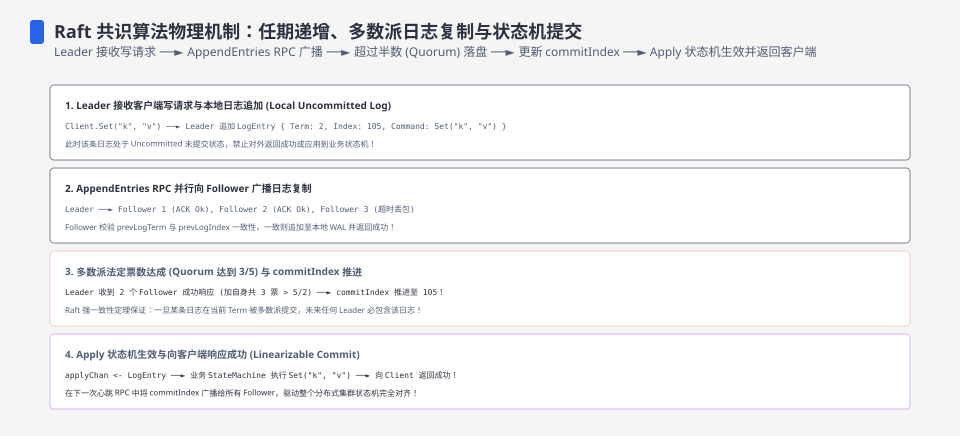
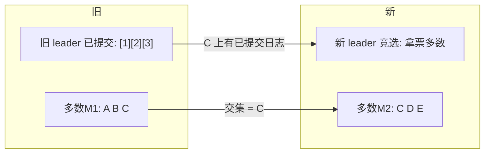
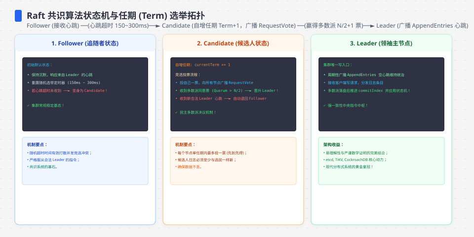
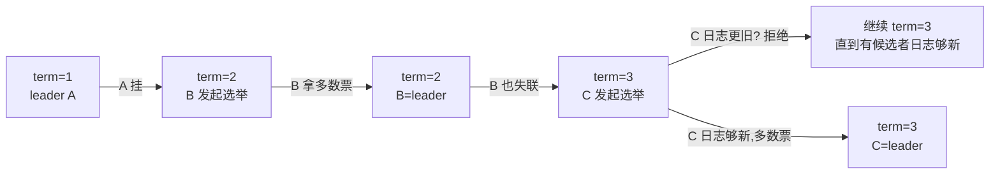
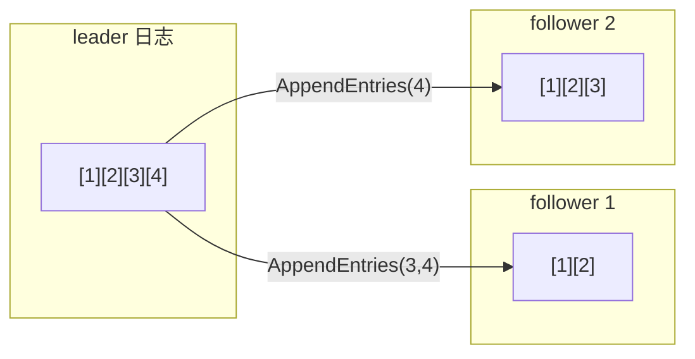
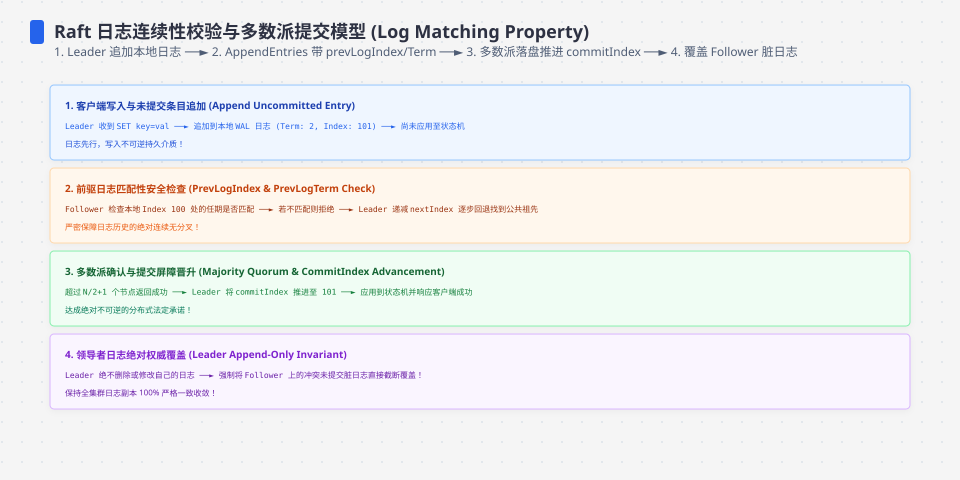

**TL;DR：** Raft 的多数派不是“民主表决”，而是**任意两个多数集合必有交集**的集合性质；它为已提交条目的保留提供基础，但不单独完成选举安全。任期让旧 leader 失效，日志匹配规则让候选者不能用更旧的日志拿到多数票，提交规则把多数复制与状态机应用连起来。未提交的日志后缀可以在网络分区中分叉，之后被新 leader 删除/覆盖；真正不可回退的是已提交前缀。ReadIndex、lease read、WAL/fsync 还分别属于读线性化和持久性合同，不能压成“多数派解决一切”。


---



## 一、多数派：不是"大多数同意"，是"不可能各拿一半"

所有共识协议（Paxos/Raft/Zab）的根基是同一个集合性质：**任何两个多数集合必有交集**。3 节点里多数=2，任意两组多数 {A,B} 与 {B,C} 交于 B；5 节点里多数=3，任意两组都有交集（且 >1）。

这个性质直接推出共识的核心表白：**上一任 leader 已提交的日志，必然出现在新 leader 的多数里**——因为已提交表明它已被某个多数复制；新 leader 要当选，又要从多数拿票。两个多数相交的那几个节点上的日志，就是新旧 leader 的"共同记忆"。



所以多数派买的不是"表态权"，是**可用性的边界**：写要等多数确认而非全部，意味着"最多容忍 (N-1)/2 台挂掉"，也意味着"当分区两边各占一半时，没有一边能达成多数"——这就是"分区时不会出现两个 leader"的决定性机制。**多数派：唯一不变量。**




## 二、任期：把时间切成段，一段只认一个 leader

停机恢复、网络重划之后，旧 leader 与新政选的候选者可能同时存在。谁说了算？答案是**任期（term）**——每个节点持一个单调递增的计数器，任何 request/response 都带 term：



选举安全规则只有两条：

1. **一个任期最多一个 leader**（多数派交集保证 term 内不重复）。
2. **term 顶格的节点打赢**：收到携带更大 term 的消息，自我降级并更新自己的任期（leader 一收到更大 term 就缴枪）；term 更小则拒绝。

脑裂的确不是被"投票"防住的——**是被任期 + 只认当前 term 的票防住的**：旧 leader 的任期已经过期，followers 不再认它，它自己也会在收到更大 term 时退位。任期把"谁有权当 leader"变成一条单调的线。

## 三、日志复制：只有一条从尾往尾长的线

新 leader 上任后，日志如何走？Raft 的原则是**单向追加 + 前缀一致**：



- **数据一致性**：follower 在某个时刻可能拥有 leader 的旧前缀加一个冲突后缀，并不保证整条日志始终是当前 leader 的前缀。AppendEntries 带上前一条的 index/term；不匹配时 follower 拒绝，leader 回退 `nextIndex`，找到共同前缀后覆盖冲突的未提交后缀。
- **提交**：leader 不能只用“某条日志复制到多数”一句话描述所有 term；Raft 对当前 term 的条目有提交规则，旧 term 的条目通常通过提交一个当前 term 条目间接提交。之后 leader 才推进 `commitIndex` 并通知 followers。
- **完整性（safety）**：已提交条目会出现在之后每一个 leader 的日志里。选举限制要求候选日志至少不落后于投票者；多数交集和日志匹配定理共同保证已提交前缀不会被冲突后缀覆盖。

这条设计的安全边界不是“每个节点任何时刻都只有一条相同日志”，而是：相同 index/term 的条目内容一致，已提交条目不会被未来 leader 覆盖，未提交的冲突后缀可以被截断。Raft 让这组不变量可检查；它不消除网络分区期间的未提交分叉，也不自动让任意读请求线性化。




## 四、实验：etcd 分区复现

可以在 disposable 的 3 节点 etcd 集群里做分区实验，观察 majority 的边界；下面只是实验方案，不是本机已经保存的 raw。在一个 3 节点集群里模拟“把一个节点隔离”：

```bash
# 3 成员 etcd, 把节点 C 的 peer 端口（默认 2380）与外界断开:
sudo iptables -A INPUT -p tcp --dport 2380 -j DROP

# 等待超过该集群配置的 election timeout；不要把默认值写成跨版本常数
etcdctl endpoint status --cluster
# 观察: A 与 B 能互相选主吗？C 能当选吗?
```

在网络规则、端口方向和 etcd 版本都正确的前提下，预期观察：

1. **C 在少数侧无法完成选举**：它要拿 2/3 票，可大多数节点不可达 → 持续选举超时却无法提交选举结果。**多数派确保少数侧不能独立形成有效 leader 任期**。
2. **A/B 在多数侧正常选主**，日志在 A/B 之间正常复制。
3. **恢复网络后**，C 在下个任期会从 leader 处补齐缺失的日志（AppendEntries 回退 + snapshot）。

诚实注明：单机多进程或单机多容器的 etcd 实验里“分区”是通过防火墙规则制造的连通性变化，不等价于生产网络设备、磁盘、时钟和进程调度故障；本文当前没有保存 `etcdctl`、WAL、leader 变化和恢复时间 raw。本节只能作为实验设计，不能证明某个集群的 election timeout、故障恢复 p99 或生产可用性。

## 五、生产里 Raft 的四张表

| 事项 | 是什么 | 机制对应 |
| :--- | :--- | :--- |
| 写必须多数成功 | 只有多数回复才 commit，才算成功返回 | 日志复制 + commitIndex |
| 磁盘必须同步 | follower 要把日志写盘才可接受新条目 | AppendEntries + fsync |
| 读也要线性一致 | 明确使用 ReadIndex 或满足时钟/租约前提的 lease read | 不能只凭“当前是 leader”或本地缓存 |
| 恢复靠快照 | 日志太长，定期把状态固化成快照 | compact + snapshot |

## 六、结论：Raft 只承诺已提交历史不会被安全地改写

Raft 的安全性来自三组不变量：**多数派交集**保存已提交历史，**任期与投票规则**淘汰旧 leader，**日志匹配**允许发现共同前缀并覆盖未提交冲突后缀。它给出的是：在协议正确实现、持久化合同成立且多数可达时，已提交日志不会被未来 leader 安全地改写；它不保证少数分区继续写、不消除未提交分叉，也不替应用自动提供线性一致读。

下一步：在 disposable etcd 集群完成分区实验，保存 leader/term、`etcdctl endpoint status`、WAL 和恢复时间；再分别验证普通读、ReadIndex/线性一致读与 lease read 的合同。没有这些 raw，就把文章当协议推演，不把约 1s election timeout 或恢复时间当作当前生产证据。

## 参考资料

1. Raft 原论文：In Search of an Understandable Consensus Algorithm—— https://raft.github.io/raft.pdf
2. Raft 官方动态可视化—— https://thesecretlivesofdata.com/raft/
3. etcd 官方文档：集群成员与容错—— https://etcd.io/docs/v3.5/op-guide/clustering/
4. etcd 官方文档：故障与读一致性（ReadIndex）—— https://etcd.io/docs/v3.5/op-guide/failures/

> 延伸阅读：多数派选出一个 leader 后，leader 怎么让两个数据库同时提交，见[分布式事务：2PC 为什么没人敢用](/writing/distributed-transactions-2pc-saga)；把日志推给消费端（讲顺序、去重），见[exactly-once 是营销话术：一条消息的一生](/writing/exactly-once-message-delivery)；把 Raft 与 MySQL 主从的对齐和代价对照，见[主从复制延迟 300ms 的账单](/writing/replication-lag-read-paths)。
