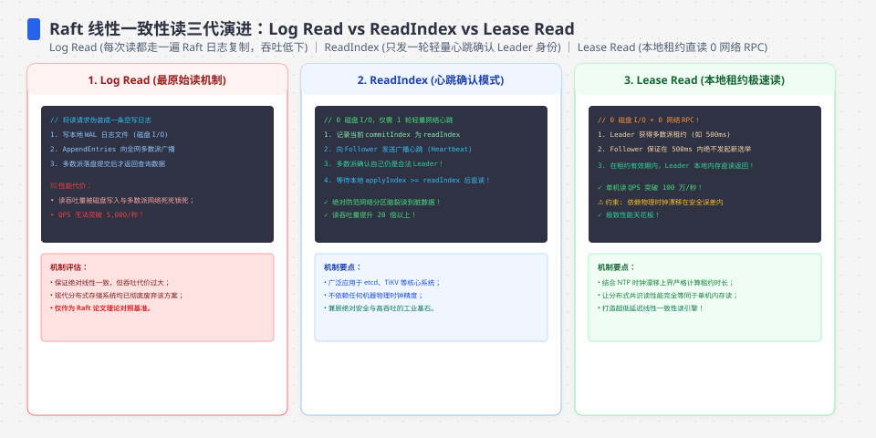
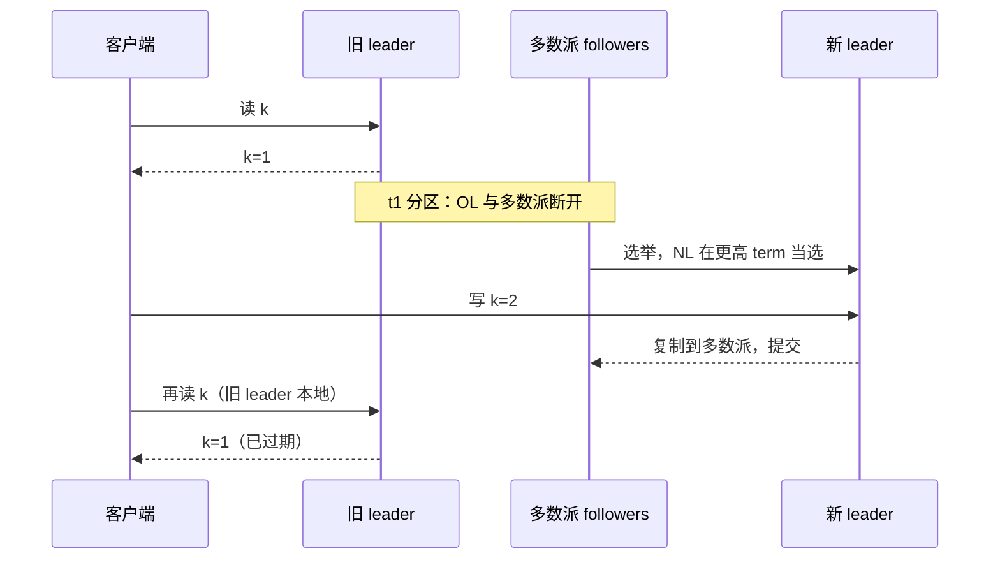
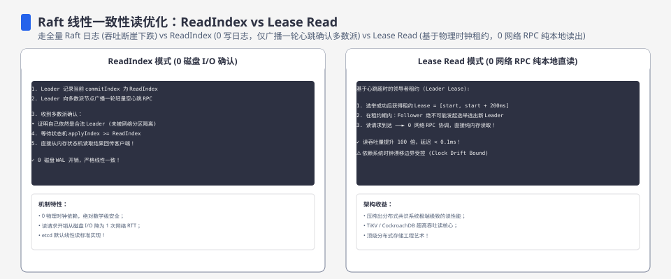
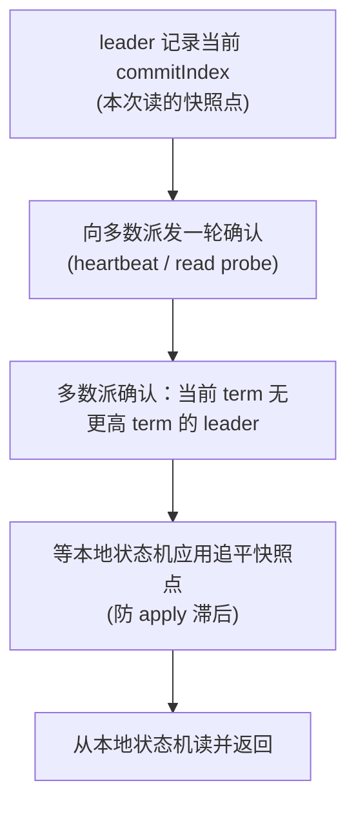
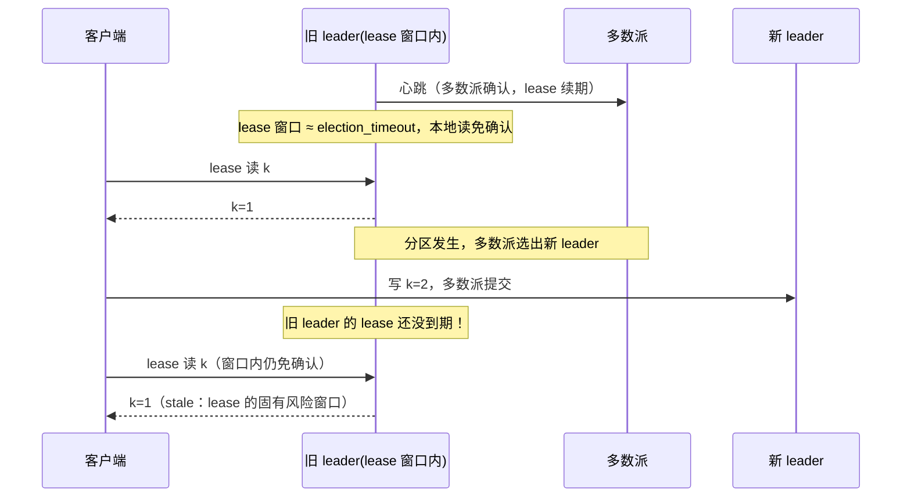
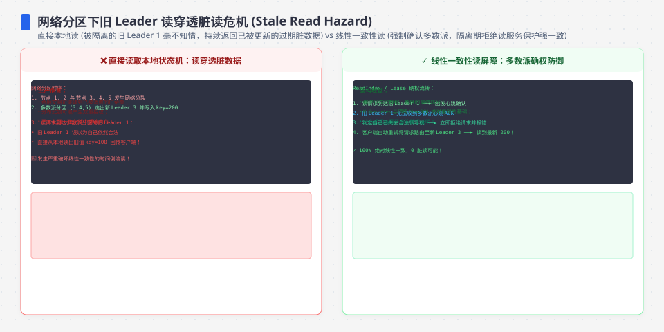

**TL;DR：** 直接读 Raft leader 的内存不是线性一致读。leader 的合法性是"当期的"：它可能已被分区、任期已过期，只是自己还没收到消息。线性一致读必须向多数派确认"我仍是当前任期的 leader"，这就是 Raft 论文 §8.3 的 **ReadIndex**——记下 commitIndex → 向多数派发一轮确认 → 等本地应用追平 → 本地读，代价约一次心跳往返。省钱的路有两条，各有代价：把读当日志条目提交（最贵，等同一次写）；**Lease read** 在 election timeout 窗口内免确认（≈0 往返），但依赖"时钟单调且偏移有界"，分区时旧 leader 会在窗口内吐旧值——这是固有风险，不是 bug。etcd 客户端默认走 linearizable（ReadIndex），serializable 是显式 opt-in 的便宜档。一句话：**读的线性一致是拿多数派往返换的；省掉这轮往返，就要拿时钟和 stale 窗口来换。**


---



## 一、leader 本地读为什么可能是旧值

写必须过多数派：只有被多数节点复制确认，条目才提交。所以"系统里已提交的最新值"只存在于**多数派这个整体**里，任何单节点都只是它的镜像——而镜像会过期。

"读 leader 本地 = 读到最新值"成立的前提是：这个 leader 依然合法。合法性不是永久的：



这个 k=1 不是 bug：旧 leader 没收到更高 term 的消息，不知道自己已经失势；它本地保存的还是旧状态。多数派提交了 k=2，但发生在它看不见的地方。**单节点内存不是系统的内存，多数派才是。** 这就是"读也要过多数派"的全部理由——上一篇文章把它埋在"读也要线性一致，leader 需 ReadIndex / lease"那一格，这篇展开成三条路。




## 二、两档读语义：etcd 的 linearizable 与 serializable

etcd 的 KV 读分两档，语义承诺完全不同：

| 档位 | 语义承诺 | 谁服务 | 往返代价 |
| :--- | :--- | :--- | :--- |
| linearizable（默认） | 读到"已提交的最新值"，与写、其他读全局线性 | 仅 leader，且要过多数派确认（ReadIndex） | ≈1 次心跳 RTT |
| serializable（opt-in） | 任意成员本地快照；可能旧，顺序不保证线性 | 任意节点本地读 | ≈0 |

客户端默认是 **linearizable**：etcd 官方 API 保证给出 strict serializability，Jepsen 对 etcd 3.4.3 的测试也确认默认 KV 操作全是严格串行一致；serializable 是显式开启的便宜档（etcdctl `--consistency=s`、client `WithSerializable()`）。

为什么"过多数派"能换到线性一致：任何两个多数派必有交集（上一篇文章的核心），所以"我此刻能拿到多数派的确认"就排除了"别处有一个更高 term 的 leader 已经提交了更新值"的可能。这轮确认买的不是数据，是**领导权的合法性**。

serializable 的代价很真实：它可能旧。Teleport 的工程师在移除 `WithSerializable` 的 PR 里记录过后果——serializable 模式下 "Create 之后的 Get 可能返回 NotFound"。这正是 stale read 最直观的形态，也是第三节三条路要防的东西。

## 三、三条读路径：写日志、ReadIndex、Lease read

### 1. 写日志读：把读也提交（最贵）

把读请求当作普通日志条目，走完整提交：追加 → 复制到多数派 → fsync → apply。读和写因此共享同一条日志、同一个 commitIndex，天然线性一致。代价是**一个读的成本等于一个写**，读比写多的系统完全负担不起。它的价值是兜底：ReadIndex 和 lease 都有假设，写日志读是"什么假设都不做"的保险。

顺带一提：Raft 里"新 leader 上任先提交一个空/no-op 条目"用的正是这个机制——commit 一个空条目，把当前 term 的 commitIndex 顶到最新，让上一任提交的日志得到本任期多数派的确认。这是用日志换线性化的最小动作。

### 2. ReadIndex：一次心跳确认（论文 §8.3）



四步拆开看：

1. **记录 commitIndex**——本次读能依赖的最早提交点。不记录就直接读，可能读到"读发起之后才提交"的值，更危险的是读到还没提交的滞后状态。
2. **向多数派确认**——排除"别处有更高 term 的 leader"。这轮确认只验领导权，不搬数据；数据最新由日志复制保证。
3. **等应用追平**——快照点可能尚未 apply 到状态机，直接读会读到滞后状态，所以要等 commitIndex 追平。
4. **本地读**——此时本地状态至少包含快照点的全部已提交值。

**ReadIndex 不与写并发冲突**：它不追加日志、不进复制流程，只读 commitIndex + 发一轮确认；写继续走日志。读写并发时互不阻塞，吞吐远高于"写日志读"。代价是**约一次心跳 RTT**。

### 3. Lease read：时间窗内免确认（用时钟换延迟）

原理：leader 只要在最近一个 election timeout 内收到过多数派的心跳确认，就能推断"多数派还认我"。因为任何新 leader 当选都至少需要一个选举周期（多数节点选举超时到期 → 发起投票 → 拿多数票），而那个周期还没到——此刻不可能有第二个 leader。于是窗口内的读免确认：



两个风险，都必须诚实写出来：

**风险一：时钟假设。** lease 的窗口是 leader 用本地时钟量的（"距离上次多数派确认过了多久"），选举超时也是各节点用本地时钟量的。时钟单调、偏移有界是前提——时钟回拨或漂移会让"旧 leader 的 lease"和"多数派的选举"两个窗口错位。这正是《时间戳会骗人》讲的那类假设。etcd-raft 源码 `ReadOnlyOption` 的注释把这个风险写得很直白：`ReadOnlyLeaseBased` 依赖 leader lease、会受时钟漂移影响，时钟偏移无界时 leader 可能持 lease 超过应有时长。

**风险二：分区窗口。** 即便时钟完全正常，多数派选新 leader + 提交新值也可能快过旧 leader 的 lease 到期——窗口内旧 leader 的 lease 读照样吐旧值。**这是 Lease read 的固有风险，不是实现 bug。** 我在第五节用迷你 Raft 专门复现了它。

所以 etcd-raft 的读选项默认是 `ReadOnlySafe`（ReadIndex），`ReadOnlyLeaseBased` 只是可选优化；TiKV 等用 lease 读，是把弱一致读（stale read）单独开一条通道，并明确接受这个窗口。普通业务拿 lease 读到的旧值去写，等于把正确性押在时钟上——上一篇文章的 fencing token 就是给这种场景兜底的：**lease 窗口里读到的旧值可以被后续写拒绝，只要目标存储校验 token 的单调性。**




## 四、etcd 实践：默认线性、Follower 读、K8s 为什么大量走串行读

- **客户端默认 linearizable**，serializable 是显式 opt-in。系统给的默认是贵的线性读；生产里真正便宜的读，是被"显式降级"出来的。
- **Follower 读**：serializable 读可以打到任意成员（客户端连着 follower 也能读）；linearizable 读必须到 leader 走 ReadIndex。所以"Follower 读"天然是弱一致读。
- **K8s 控制面为什么大量走串行读**：apiserver 用 watch 缓存的资源版本号（resourceVersion）+ 事件流回答大部分 GET/LIST/WATCH，落后了靠增量追平、收 410 从头重建——正确性不靠"每一次 GET 都是最新"。历史上不设 resourceVersion 的一致读（如 `kubectl get`）是直接穿透 etcd 做 quorum 读的；v1.31 起 `ConsistentListFromCache` 默认开启后，这类读也从缓存服务、但会先做一次廉价的 etcd revision 探测保持线性一致。真正"容忍旧值"的代价由 controller 的 LIST+WATCH 模型承担，强一致只留给必须的 API。这是"读一致性按数据敏感度分层"的典型。
- 一句话取舍：分界线不是"哪个更高级"，而是"**用户愿不愿意为旧值付钱**"。控制面付得起（旧一点，事件流会追平）；交易、竞态、token 校验付不起。

## 五、实测与边界：三条路的量级与 Lease 的时钟假设

本机实测（教学原型 `experiments/raft-read`，进程内 channel，RTT≈0，只反映往返次数排序；以下为 2026-08-18 落盘样本，原始输出见 `evidence/raft-linearizable-read-leases/2026-08-18-local/run.log`）：

```
[phase A] leader = node 1 (term 1)
serial read   : mean 1.6µs（0 次往返，本地读）
readindex read: mean 7.8µs（1 次心跳往返 + commitIndex 追平）
write-log read: mean 4.4µs（一轮提交：日志追加 + 多数确认）
```

上面的数值是一次运行的示例，只展示「往返次数」的排序：serial（0 次往返）明显低于 readindex 与 write-log；**readindex 与 write-log 在进程内都是一次往返，二者的相对顺序在多次运行间不稳定（本机重跑有 write-log 快于 readindex 的样本）**，不能据此下「哪个更贵」的结论——「写日志读最贵」是生产论证（多付一轮 fsync），不是这个教学原型能证实的。

**必须标注的局限**：这是教学原型——日志在内存、消息走进程内 channel、没有 fsync 和真实网络。µs 数值只反映"往返次数"的排序，不迁移到生产；进程内模型里 ReadIndex 和写日志都是"一次往返"所以数值接近，生产里写日志多付 fsync，ReadIndex 只付一轮心跳。

生产量级按 Raft 论文与 etcd 文档的机制写（约）：串行读 ≈ 0 往返；ReadIndex ≈ 1 次心跳 RTT（局域网亚毫秒到几毫秒、跨机房/公网到几十毫秒量级，取决于网络）；写日志读 ≈ 1 轮提交（复制 + 多数派 fsync）。给不出通用毫秒数——所以实验只测"往返次数排序"，量级按文档。

分区下的 stale 窗口（Phase B，本机实测，2026-08-18 样本，见 `evidence/raft-linearizable-read-leases/2026-08-18-local/run.log`；以下为节选并加注释）：

```
t=352ms  readindex 读: ok=false → 分区下拒绝，不吐旧值
t=352ms  serial 读:   val="1" —— 旧值照常返回
t=352ms  lease 读:    val="1" —— lease 窗口内照样吐旧值
t=658ms  新 leader node 2 提交 k=2（旧 leader 的 lease=2.5s 尚未到期）
t=658ms  serial 读: k=1 —— STALE
t=658ms  lease 读:  k=1 —— STALE（lease 固有风险窗口）
t=2.902s lease 过期 → 回落 ReadIndex → 拒绝，不再吐旧值
```

关键观察：ReadIndex 分区下拒绝（不吐旧值）；serial 与 lease 在窗口内吐旧值；lease 过期后自动回落 ReadIndex。实验里我把旧 leader 的 lease 刻意拉长到 2.5s，让"多数派选新 leader + 提交新值"发生在 lease 窗口内——正常配置下 lease=election timeout，这个窗口要窄得多，但**方向不变**：窗口存在，且由时钟与分区时机决定。

**Lease 的时钟假设在本文是模型推演，不是实测。** 要量化"时钟偏移达到选举超时的多少比例时，旧 leader 的 lease 窗口与多数派的选举窗口错位"，需要跑带时钟偏移的 etcd/容器集群；本文只在本机原型里把窗口拉长演示了机制（见上文的 2.5s），偏移比例的定量关系属于保留的扩展实验（命令见实验入口），不给数字。

## 六、实验入口：本机条件下的读路径比较

```bash
cd experiments/raft-read
go run main.go
```

观察点：Phase A 三路延迟的往返次数排序（串行 < ReadIndex ≈ 写日志）；Phase B 分区注入后 readindex 拒绝 / serial 与 lease 吐旧值 / lease 过期回落。改 `leaseNanos` 和 `readRPCTimeout` 看窗口大小如何改变 stale 时长。

时钟偏移实验目前只保留执行设计：用 docker 起 3 节点 etcd，对 leader 容器注入时钟偏移（libfakedatetime 等），对比"多数派选出新 leader 并提交的时刻"与"旧 leader lease 过期的时刻"：

```bash
# docker 起 3 节点 etcd（官方 docker-compose 示例）
docker compose up -d
etcdctl endpoint status --cluster   # 确认 leader
# 对 leader 容器注入时钟偏移，观察 linearizable 读何时开始返回旧值
```

诚实注明：`experiments/raft-read` 是本地教学原型，已在本机（macOS / darwin-arm64 / Go 1.25.1，`experiments/go.mod` 声明 go 1.25，2026-08-18 复跑）跑通并输出上述结果，原始输出见 `evidence/raft-linearizable-read-leases/`；Phase B 把「分区下旧 leader 的行为差异」完整跑出来了：serial 与 lease 读在窗口内吐旧值、readindex 拒绝、lease 过期后回落 ReadIndex。它复现的是读路径的语义与 stale 窗口，不模拟生产网络分区与时钟偏移。真实 etcd 集群与时钟偏移注入属于本文未覆盖的扩展项，已保留执行设计（见实验入口），不构成已证结论。

## 七、结论：线性一致读必须过多数派，Lease 是"用时钟换延迟"的优化

- **串行读**：0 往返，可能旧——适合"旧一点没事"的读。
- **ReadIndex**：1 次心跳往返，无时钟假设——etcd 默认线性读的实现。
- **写日志读**：1 轮提交，什么假设都不做——读成本等于写成本，兜底用。
- **Lease read**：0 往返但有窗口——把正确性押在"时钟单调、偏移有界、分区窗口小于 lease"上，窗口内旧 leader 必然吐旧值，需要存储层 fencing 兜底。

| 场景 | 用 | 别用 | 为什么 |
| :--- | :--- | :--- | :--- |
| 计数、缓存、控制面读 | serializable（opt-in） | linearizable | 旧值可接受，省多数派往返 |
| 需要"读到最新"、不能旧 | ReadIndex（linearizable） | lease | 无时钟假设，语义干净 |
| 只读热点、明确接受弱一致 | 单独开一条 lease/stale 通道 | 混在强一致读里 | 窗口风险要单独标注、单独兜底 |
| 分布式锁 / token 校验的读 | linearizable + fencing | serializable | token 校验读到旧值，fencing 就白做 |

下一步：跑一遍实验看 stale 窗口（十分钟）；翻 etcd-raft 源码里 `ReadOnlySafe` / `ReadOnlyLeaseBased` 的实现；如果你在跟着我造轮子，迷你 LSM 之后，**迷你 Raft 是下一个值得手写的项目**——把它写到能正确处理分区和读路径，"多数派到底买了什么"就落地了。

## 参考资料

1. Raft 原论文 §8.3（只读查询处理、ReadIndex 协议）—— https://raft.github.io/raft.pdf
2. etcd 官方文档：API guarantees（默认 strict serializable / serializable opt-in）—— https://etcd.io/docs/v3.5/learning/api_guarantees/
3. etcd 官方文档：故障与读一致性（ReadIndex）—— https://etcd.io/docs/v3.5/op-guide/failures/
4. etcd-raft 源码：`raft.go` 中 `ReadOnlyOption`（`ReadOnlySafe` / `ReadOnlyLeaseBased` 及注释）
5. Jepsen: etcd 3.4.3 分析（确认默认严格串行一致）—— https://jepsen.io/analyses/etcd-3.4.3
6. Teleport PR #17051（serializable 模式下 Create 后 Get 可能 NotFound，故移除该选项）—— https://github.com/gravitational/teleport/pull/17051

> 延伸阅读：多数派为什么必然相交、leader 怎么被选出来，见[共识不是多数派投票：Raft 的任期与日志复制](/writing/raft-consensus-term-log-replication)；lease 读把正确性押在时钟上，时钟为什么会骗人，见[时间戳会骗人：时钟回拨与分布式系统的顺序幻觉](/writing/clock-skew-distributed-systems)；lease 窗口里读到旧值拿去写怎么兜底，见[分布式锁卖的不是互斥：fencing token 才是真正的租约](/writing/distributed-lock-fence-lease)；K8s 控制面为什么能用串行读 + watch 撑起状态对齐，见[Kubernetes 控制面的莫比乌斯环：apiserver、watch 与 etcd 的增量账](/writing/k8s-controller-watch-etcd)。想自己造一个能跑分区实验的共识实现，迷你 LSM 是[造一个迷你 LSM：写放大与读放大，同一份数据的两张账](/writing/mini-lsm-write-amplification)留下的轮子，迷你 Raft 是下一个。
