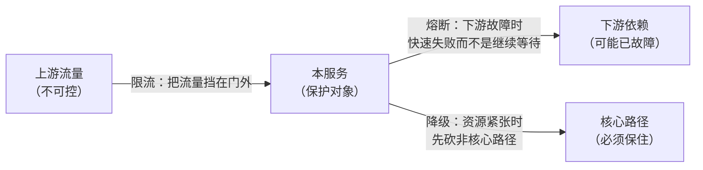
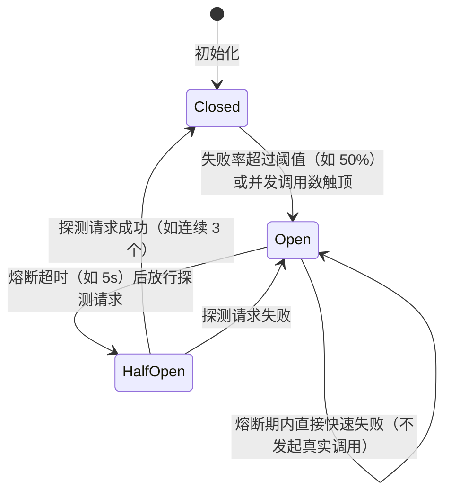

**TL;DR：** 限流、熔断、降级回答三个不同的问题：限流管“上游流量超预期怎么办”，熔断管“下游已经故障怎么办”，降级管“资源不够时先牺牲谁”。它们分别改变准入、出站调用和业务结果，不能互相替代。本文把 rate、burst、并发和排队这几个限流参数分开，再把熔断、超时、重试和降级放进同一条故障预算里。所有 `50%`、`5s` 和 `1400 QPS` 都只作为演示输入，不是默认配置或生产承诺。

## 一、 三个问题，三种手段

先看一个典型的故障链：大促流量翻十倍 → 网关照单全收 → 订单服务线程池打满 → 依赖的库存服务被拖垮 → 超时重试让故障放大 → 整个交易链路雪崩。这条链上每个环节都可以拆出"高可用三件套"各自该管的那一段：



- **限流（rate limiting）**：上游的流量是我们无法控制的，防护位在本服务的入口。超过容量的请求要么拒绝、要么排队，**目的：别让本服务过载**。
- **熔断（circuit breaker）**：下游已经故障时，继续把请求发过去只会让"请求排队超时"变成"本服务线程池也耗尽"。防护位在出站调用上，**目的：快速失败，切断故障蔓延**。
- **降级（degradation）**：资源（线程、连接、缓存、算力）不够时，决定**牺牲什么保什么**。目的：核心路径可用，非核心路径让位。

三者最常见的混用错误：把"限流阈值调高"当"高可用"，或者"熔断触发后靠重试恢复"——前者是在错误的位置防错流量，后者是把故障放大器的开关打开了。定位是第一步：先分清你要防的是哪一段。

## 二、 限流：算法家族与阈值来源

### 2.1 四种算法的取舍

```text
固定窗口：  按秒/分钟计数，超过阈值拒绝。实现最简单，但窗口边界会突刺：
            59.9 秒和 60.1 秒各放行满额 → 瞬时 2 倍流量穿墙。

滑动窗口：  把窗口切成长度固定的若干小格，逐格滑动统计。精确到格粒度，
            边界问题缓解但没根除，内存开销随格子数增长。

漏桶：      请求进桶排队，底部以恒定速率输出。输出永远平滑，代价是
            突发流量全部被削平——适合保护"承受不了毛刺"的下游。

令牌桶：    桶里以固定速率补令牌，请求取令牌放行。桶容量即允许的
            突发上限，既平滑又允许 burst。最常用，Guava、Redis 版
            实现遍地都是。
```


*图注：令牌桶的"容量"决定突发上限，漏桶的输出速率恒定；前者适合服务入口，后者适合保护数据库等对毛刺敏感的下游。*

"固定窗口会边界突刺"不是背诵的考点，是可以复现的算术。用一个最小程序实测（`experiments/rate-limit/main.go`，limit=100/s，990ms 与 1000ms 窗口边界各均匀来 100 个请求）：

```
seed=42    固定窗口放行 200   滑动窗口放行 100   令牌桶放行 101
seed=7     固定窗口放行 200   滑动窗口放行 100   令牌桶放行 101
seed=2026  固定窗口放行 200   滑动窗口放行 100   令牌桶放行 101
```

三个 seed 结果一致，不是随机抖动，是结构差异：

命令、Go 版本和原始 stdout 保存在 `evidence/rate-limiting-circuit-breaker/2026-08-17-local/`。这个快照只验证窗口边界的算术，不验证 Redis、网关或真实服务的容量。

- **固定窗口放行 200**：990ms 的 100 个归窗口 0（0~999ms），1000ms 的 100 个归窗口 1——两个窗口各自满额，实际上 10ms 内涌入了 200 个请求，限流器形同虚设。这是固定窗口的固有缺陷：窗口边界两侧各放 100%，任何"边界附近的高峰"都 2 倍穿墙。
- **滑动窗口放行 100**：1000ms 时窗口覆盖 [0, 1000]，990ms 的请求还在窗内，配额已被占用，新请求被拒。代价是必须滚动计数，窗口 = 格数组 × 格粒度，格子越细精度越高、内存越大。
- **令牌桶放行 101**：990ms 消耗完 100 个令牌，1000ms 时只补了 ~1 个，几乎全部拒绝——它不是"跨窗口放行"，而是把 burst 严格限制在容量的 100，且 1 秒后自动恢复满额。代价是"瞬时均匀的流量"会被均匀削平，突发尖峰反而能过（这正是它要的）。

选择算法前先写清楚三个合同：平均速率 `rate`、允许的瞬时突发 `burst`、超过能力后是拒绝还是排队。入口可以选择令牌桶，也可以选择并发上限或基于队列的 admission control；出站调用常常更关心连接池和下游并发，而不是再套一个 QPS 桶。固定窗口适合粗粒度配额，但必须接受边界突刺。单机实现可以使用进程内计数器，分布式实现可以使用 Redis、网关或服务网格，但“计数 + 判断”必须在同一个权威时钟和原子操作下完成。技术选型不能替代语义选择。

### 2.2 阈值不是拍脑袋，是算出来的

限流阈值不是拍脑袋的 `P × 0.7`。更可复核的流程是：

1. 压测：用比生产大一倍的流量压本服务，画出"QPS → P99 延迟"曲线。**记录拐点**：P99 开始陡升的那个 QPS，记作 `P`。
2. 留余量：根据 P99、错误预算、连接池和下游容量决定安全区间，并把选择理由写成配置变更记录；安全余量不是跨服务通用的百分比。
3. 按维度切分：全局限流之外，可以加单用户、租户、IP 或 API key 限制，但要说明代理地址、NAT 和恶意轮换对维度的影响。
4. 压测回归：每次容量变化（发布、加节点、改配置）后重新压，阈值跟着基线走。

整条流程的关键是第 1 步真的有数据：`P99 从 X 跳到 Y` 必须来自压测机输出，而不是"感觉 2000 差不多"。没有基线就没有阈值——"限流 50% 流量"这种数字本质是跳过了压测。

## 三、 熔断：三态状态机与重试的仇

### 3.1 三态与转移条件

熔断器是典型的状态机：**closed（关闭）→ open（打开）→ half-open（半开）**。



- **Closed**：正常转发，滑动窗口内统计失败率（一般是"最近 10 秒的请求"而非累计计数——累计计数会把几分钟前的故障算进现在的判断）。
- **Open**：所有调用直接抛错，**不发出真实请求**——这是熔断的本质价值：下游在故障，一个请求都不浪费。熔断超时后进入半开。
- **HalfOpen**：放 1~3 个探测请求试试水。成功则关闭熔断器，失败则回到打开。探测量是关键的权衡：放多了等于没熔断，放少了恢复慢。

### 3.2 熔断、超时和重试必须共享一次调用预算

**错误一：熔断和重试叠加成风暴。** 客户端超时 100ms、最多重试 3 次时，一次用户请求最多可能产生 4 次下游尝试；如果每一层都这样做，乘数会沿调用树放大。重试策略应只针对明确可重试的失败，带退避和抖动，受上游剩余 deadline 限制，并在熔断器打开后快速失败。服务还要记录“用户请求数”和“下游尝试数”两套计数，否则看不出放大倍数。

**错误二：只配置一个模糊的超时。** 熔断器通常要等一次调用结束，才能把 timeout 记入失败窗口；如果没有单次调用 deadline，连接池和线程池可能先耗尽，熔断还没有足够样本。正确做法是把上游总 deadline、单次调用 timeout、重试次数和熔断统计窗口写在同一张预算表里，并验证取消信号真的传到了 HTTP client、数据库或 RPC 层。

**错误三：粒度没有对齐故障域。** 一个熔断器管整个下游集群，可能把健康实例一起挡掉；按每个实例拆得过细，又可能因单实例样本太少而抖动。粒度应按路由、操作和故障域决定，例如把 `inventory.check` 与 `inventory.reserve` 分开，并让服务发现和熔断器共享实例健康信息。不要把“按实例”当成所有部署拓扑的唯一答案。

### 3.3 参数从哪里来

- **失败率阈值**：取业务可容忍的错误率上限，并先定义样本最小值；窗口内只有 1 个请求时，不应因为 1 次失败就代表整个下游。
- **统计窗口**：覆盖足够样本，同时短到能响应故障；窗口单位可以是请求数、时间或两者的组合。
- **熔断超时**：与下游恢复特征、探测成本和用户 deadline 一起定；半开阶段还要限制并发探测数，避免恢复中的下游再次被冲垮。

这三组参数在 Hystrix、resilience4j、Sentinel 里都有默认值，默认值只适合"没压测过"的起步阶段——同限流阈值一样，熔断参数最终要靠故障注入实验来校准：定期杀掉一个下游节点，观察熔断器是否在预期时间内打开并恢复。

## 四、 降级：预案不是故障时才做的决定

降级最容易做成"出事了才开会讨论砍什么"——那时系统已经半瘫，任何决定都带着恐慌。正确的做法是**提前定义降级预案并编码进去**，故障时只是"按下开关"：

1. **分级**：把功能分成核心（交易、登录）、次核心（推荐、个性化）、非核心（消息、统计）。降级顺序永远是"先非核心后核心"。
2. **兜底**：每个可降级的功能都要有降级实现——静态数据、缓存、默认值、上一版本结果。没有降级实现的"降级"只是把功能换成报错。
3. **自动与手动的分工**：熔断触发后自动走降级路径（缓存兜底）；跨功能的降级（砍推荐、砍消息）要手动开关，自动降级到"砍掉核心功能"是运维事故。
4. **降级的反向风险**：降级后缓存成为唯一数据源，缓存过期时间、更新路径都要重新审视——"降级到缓存"最怕的是缓存本身失效。

与熔断的衔接是：熔断器 open 之后，调用方走降级分支（兜底数据 / 默认响应），而不是裸抛异常。这样用户看到的是"推荐位暂时不可用"，而不是整个页面 500。

## 五、 一次完整的故障推演

把三件套串起来推演一个带明确假设的“秒杀大促”模型。以下数字是演示输入，不是压测结果：

1. **限流**：假设入口令牌桶 `rate=1400/s`、`burst=200`，输入流量 5000 QPS。被拒绝的请求必须拿到明确的 429、`Retry-After` 或客户端退避合同，不能让调用方立即重试。
2. **熔断**：假设库存检查的失败样本达到最小值，且调用 timeout 被计入失败窗口。熔断器打开后只停止这一个故障域的调用，不应把不依赖库存的读路径一并挡掉。
3. **降级**：库存展示是次核心功能，可以返回带时间戳的缓存或“暂不可用”；下单写路径不能因为展示降级就伪装库存检查成功。
4. **收尾**：恢复时由有限的半开探测确认依赖健康，再逐步放量。是否出现 500、恢复花费多久、缓存是否过期，都要靠演练的 raw 指标回答，不能从状态机图推导出来。

这套组合的每一环都要单独压测、故障注入和回滚。限流器要验收 429、队列和公平性；熔断器要验收 timeout、取消、半开并发和恢复；降级要验收数据新鲜度、写路径安全和开关审计。没有这些 raw 结果，状态机只是设计图，不是高可用证据[^1]。

[^1]: 延伸阅读：Hystrix 的 wiki 文档虽然项目已停更，但三态状态机和线程隔离的图解依然是最好的入门材料；resilience4j 与 Sentinel 的官方文档对应本文所有参数；《Designing Data-Intensive Applications》第 8 章对故障处理的讨论是更高一层的视角。

## 六、参考资料：算法与熔断器状态合同

- [Resilience4j：CircuitBreaker](https://resilience4j.readme.io/docs/circuitbreaker)：Closed、Open、Half Open 状态与滑动窗口统计。
- [Resilience4j：Getting Started](https://resilience4j.readme.io/docs/getting-started-4)：限流、重试、熔断和降级组合时的配置入口。
- [RFC 9293：TCP](https://www.rfc-editor.org/rfc/rfc9293)：拥塞和传输可靠性背景，避免把应用层限流误认为网络拥塞控制。
- [Google SRE Book：Handling Overload](https://sre.google/sre-book/handling-overload/)：过载保护、负载削减与恢复策略。
