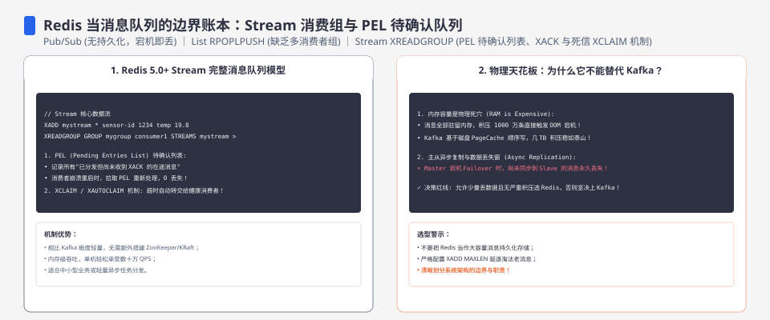
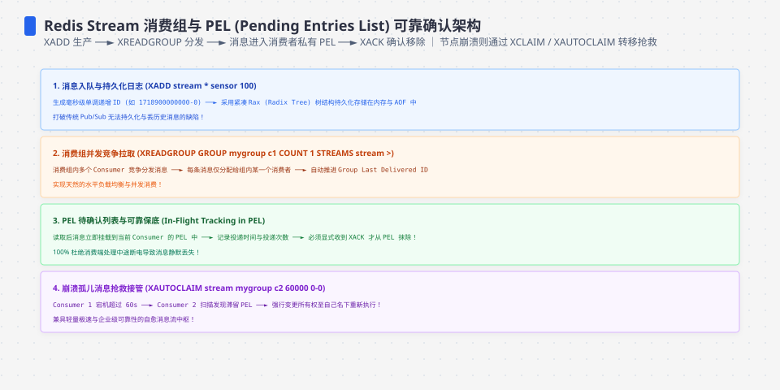
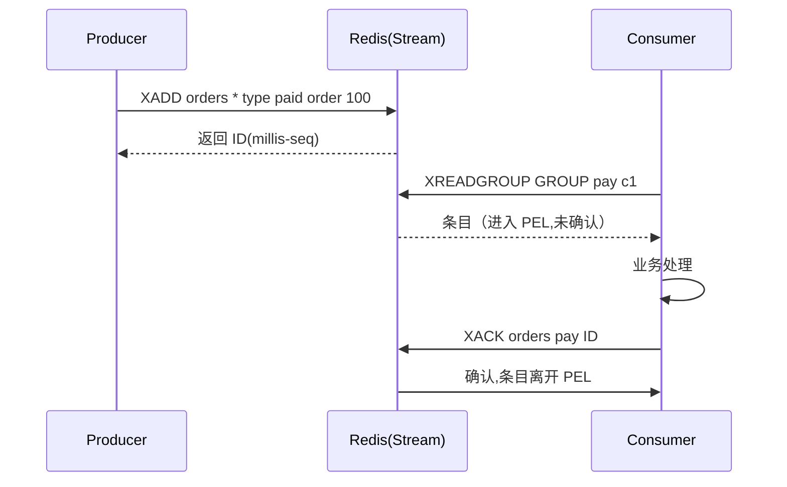
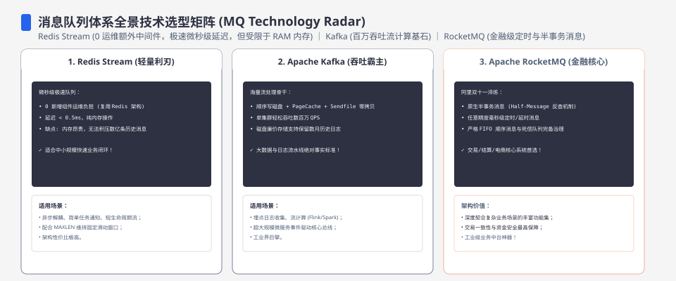

**TL;DR：** Redis 能做消息队列，但“能不能”从来不是问题，“**这消息丢了算谁的**”才是。选它之前先判定：消息是否允许丢失、是否需要失败重投、历史要保留多久、主从切换能否接受异步复制窗口。**List** 的阻塞弹出没有 ack；**Pub/Sub** 不保存离线消息；**Streams** 用消费组、PEL、XACK 和 XAUTOCLAIM 管理未确认条目，但 **XACK 不会删除 Stream entry，历史是否可回放取决于 XTRIM/保留策略**。Kafka 通常提供更明确的长期保留和独立 offset；Redis Streams 适合已有 Redis、规模和保留边界可控、业务能承担幂等的任务流。


---



## 一、场景先行：先用三条线砍掉一半的"想用"

最便宜的自检是三连问：**丢一秒钟的消息能忍吗？消息消费失败需要重投吗？未来半年会不会要回放历史？**

### 适用 Redis 的三条线

1. **延迟是刚需，比持久历史更贵**：希望少一层 broker，且能接受目标部署环境下的内存/网络延迟；不要把 0.1–0.5ms 写成所有网络和客户端的保证。
2. **事件是"瞬态"的**：任务、通知、缓存失效信号、日志扇出——过了业务窗口就没价值，不指望回溯。
3. **不想为低量事件养一座集群**：系统里本来就有 Redis，多一个命令少一篇架构文档。

### 禁区（反例表）

| 场景 | 为什么是禁区 |
| :--- | :--- |
| 支付/账务事件 | 丢 1 秒 = 对不上账；Redis 主从切换还可能丢已 ack 的一条 |
| 审计、合规留痕 | 需要"可呈现的完整链"，不是"尽量不丢" |
| 需要回放重算 | 业务重演旧消息（如补数据）时必须能追溯到历史 |
| 多机房强一致投递 | Redis 复制是异步的，跨机房断链就丢出同步窗口 |
| 高吞吐长期堆积 | Streams 需要显式保留/裁剪策略；不设边界会让内存和持久化空间持续增长 |

**一句话场景判据**：这条消息**消费完之后还需要存在**吗？如果要长期回溯、独立消费进度和跨集群复制，优先评估 Kafka/Pulsar；如果只需受控保留的任务流，Redis Streams 可以进入候选，但必须把 `XTRIM`、AOF/RDB、复制和幂等写进合同。




## 二、三副账，各卖一种语义

### 1. List：取走即焚——没有 ack 不是缺陷，是诚实

`LPUSH` 入队、`BRPOP` 阻塞出队，底层是 O(1) 双端链表：

```bash
$ LPUSH queue job:1 job:2 job:3
$ BRPOP queue 0
# 返回队尾一条,它已经离开队列
```

Streams 的最小可运行顺序不是直接 `XREADGROUP`，而是先创建消费组；下面的 `0` 表示从流中已有的最早 ID 开始建立组：

```bash
$ XGROUP CREATE orders pay 0 MKSTREAM
$ XADD orders * type paid order 100
$ XREADGROUP GROUP pay c1 COUNT 1 BLOCK 1000 STREAMS orders >
# 返回一条消息；它进入 pay 组的 PEL，尚未被 XACK
```

没有 ack：`BRPOP` 一返回消息就弹掉，消费方当场崩 = 这条永久消失。把它当任务队列，等于口头宣布"**不能失败的任务流**"。List 的处境其实诚实：它**本来就不是 MQ**，只是"一个能当队列使的数据结构"。想补至少一次，得在业务里自己写待确认表——那就等于手写 Streams。

### 2. Pub/Sub：广播即焚——丢是语义的一部分

`PUBLISH`/`SUBSCRIBE`，消息只发给**那一刻在线且在订阅**的连接；无落盘、无订阅者时直接蒸发，Redis 官方文档明示不保证可靠投递。注意：**它和 List 的"丢"不是同一件事**——List 是"你没做完就弹走了"，Pub/Sub 是"没人看就不存在"。前者是责任问题，后者是广播固有的语义。它只适合：实时房间/即时通知这类"错过就算了"，以及"扇出一条缓存失效信号清多端"。

### 3. Streams：把记账权做进协议

Redis 5.0 的 Streams 是 Redis 团队对"MQ 语义"的正面回应。四个命令是一组完整模型：

- `XADD`：追加，返回该 Stream 内单调的 ID（通常是毫秒-序号）。
- `XGROUP CREATE`：建消费组（一条流可被多组独立消费）。
- `XREADGROUP`：取走后**进入本组 PEL（pending entries list）**，此时还不算消费完。
- `XACK`：做完才确认，只把条目从当前消费组的 PEL 移除；Stream entry 仍保留，直到显式 `XTRIM`、删除 stream 或其他保留策略清理。同组另一成员可对仍在 PEL 的条目使用 `XAUTOCLAIM` 认领重试。



**这个演进说明 MQ 卖的不是一个吞吐数字，而是记账合同**：List/Pub/Sub 不给你 Streams 那样的消费组和 pending 记录；Streams 给的是“未确认可被认领”的至少一次路径。它仍可能因为实例故障、持久化/复制配置、裁剪和消费者实现而丢失或重复；“可重放”只对仍在 Stream 保留范围内的 entry 成立。恰好一次效果仍需要消费方幂等或同事务写入。

## 三、把能力列成一张可勾选的表

| 能力 | List | Pub/Sub | Streams | Kafka |
| :--- | :---: | :---: | :---: | :---: |
| 消息确认（ack） | 无 | 无 | ✅（PEL+XACK） | ✅（offset 提交） |
| 消费组（共享进度） | 无 | 无 | ✅ | ✅ |
| 崩溃后重投 | 无 | 无 | ✅ XAUTOCLAIM | ✅ seek 回溯 |
| 持久化上限（断电丢多少） | 依 AOF/RDB | 无消息持久化 | 依 AOF/RDB、fsync 和复制配置 | 依 broker/producer/replica 配置 |
| 历史回溯 | 无 | 无 | 保留期内可按 ID 读取；PEL 只记录未确认 | 依 retention/offset 回退 |
| 背压 | ✅ BRPOP | 阻塞 | 消费推进慢消息变多 | 依赖 lag 水位线 |

**注意两种"丢"别混淆**：第 4 行的"断电丢多少"和第 3 行的"消费崩溃重投"是两件事——前者是存储安全，后者是投递语义。**List 两个都欠账，Streams 只欠第一个**，这就是为什么"至少一次"总被拿来放在 Streams 的账上。




## 四、断电与 ack 时机：把死法摆到一张表

一条消息从 `XADD` 成功到 `XACK`，中间崩在哪决定它生死：

| 崩溃发生 | Streams（需显式配置持久化） | List | Pub/Sub |
| :--- | :--- | :--- | :--- |
| 入队后、消费前节点断电 | 取决于 AOF/RDB、fsync、操作系统/存储和复制配置 | 同理 | 消息不保存 |
| 消费方已收到、XACK 前崩 | 留在 PEL,可认领重投 | 已弹出,永久丢 | N/A |
| 主从切换、异步复制未追上 | 切换瞬间未同步条目丢失 | 同上 | N/A |
| 满内存淘汰（maxmemory） | stream key 可能被逐出 | 同类 | N/A |

**账收拢**：`appendfsync everysec` 是一个 fsync 调度策略，不是跨操作系统、文件系统、磁盘和复制链路的硬 SLA；只有把配置、故障模型和实测恢复结果写在一起，才能对“最多丢多少”作出有边界的承诺。异步复制还会引入主从切换窗口，不能被 AOF 的本地落盘策略抵消。

## 五、与 Kafka 的分界：这里藏着这道题最深的那个点

多数争论停在"吞吐够不够"——那是最不关键的维度。真正的分界是**两个不同的消费记账哲学**：

- **Kafka**：消费者进度（offset）存在 broker，消息在磁盘上保留（按 retention 配置），可以回退到很久以前重跑。**它卖的是一块"可回溯的历史"**。适合数据管道、审计、需要"重新处理过去"的系统。
- **Streams**：PEL 只记“未确认”，`XACK` 只改变当前消费组的 pending 状态，不删除 Stream entry；能否按 ID 回读，取决于 entry 是否仍在保留范围内，以及是否被 `XTRIM`、删除或淘汰。**它卖的是一张可重投的责任表加一段受控历史**，适合“清单型任务流”，不适合默认当成无限事件日志。

**为什么 Kafka 常常更适合长生命周期事件**：它把保留期、消费者 offset 和回放操作作为一等配置；这正好对应数据管道、审计和重算需求。**什么时候 Redis 反而更对**：已有 Redis、任务流保留边界明确、部署规模受控，而且业务可以用幂等承接重复——这时 Kafka 的独立 broker、分区和运维成本未必值得。一句话引脚：**场景在“流”（要长期流水账）先评估 Kafka，场景在“清单”（要催办和重投）才评估 Streams。**

## 六、决策四问（选型落点）

1. 我忍得了丢多少？→ 等于 0 → 不是 Redis 菜单。
2. 这是"事件流"还是"任务清单"？ 要回溯的"流"→ Kafka；"做完就完"的"清单"→ 可以考虑。
3. 谁承诺"至少一次"？ Streams 靠 PEL + 重投；你要么接受至少一次，要么在消费端建幂等。
4. 我愿付的运维账单？ 已经是 Redis 环境 → Streams；要从零引集群 → 先怀疑"该不该在这件事上为 Redis 买这个单"。

四问全过 → 上 Streams；再根据丢失上限配置 AOF、fsync、复制和淘汰策略，并用断电/主从切换演练验证，而不是把某个配置名直接当成可靠性结论。

## 七、结论与下一步

Redis 做 MQ 的深水区不在于原理，而在于**每一种丢失和回放责任都必须有明确归属**。能力对比看 ack、消费组、重投、保留和独立进度，不看脱离负载与持久化配置的吞吐数字；Streams 与 Kafka 也不是“谁更快”的简单替代，而是“受控任务历史”和“可独立回放的事件日志”两种不同承诺。最终决策应落在配置、故障演练和消费端幂等证据上，而不是一句“Redis 开了 AOF 就可靠”。

下一步动手（约 10 分钟可复现）：
1. 在本机先执行 `XGROUP CREATE`，再跑 `XADD` → `XREADGROUP` → `XPENDING` → `XAUTOCLAIM`；同时验证 `XACK` 后 entry 仍能被 `XRANGE` 读到——这才是 Streams 的“至少一次路径”与“历史保留”两个不同事实。
2. 翻自己代码里所有"用 Redis List 当队列"的地方，先回答这张表上的三行：① 崩了会不会丢 ② 有没有在写重试 ③ 是不是被 MAXLEN 剪掉过——三行都逃得过，才轮得到讨论 log。

## 参考资料
1. Redis 官方：Streams / consumer groups—— https://redis.io/docs/data-types/streams/
2. Redis 官方：Pub/Sub 可靠性说明—— https://redis.io/docs/data-types/pubsub/
3. Redis 官方：RDB 与 AOF 持久化—— https://redis.io/docs/reference/persistence/
4. Redis 官方：XAUTOCLAIM—— https://redis.io/docs/latest/commands/xautoclaim/

## 附录 A：持久化四档与"最大丢多少"

| 档位 | 断电最多丢 |
| :--- | :--- |
| `appendonly no`（纯内存） | 全部清空 |
| RDB 快照（按配置的 save 间隔） | 最后一次成功快照之后的一切；上限由配置和故障模型决定 |
| AOF `everysec`（显式配置） | 通常受 fsync 调度窗口影响，但不是硬性的 1 秒 SLA |
| AOF `always`（显式配置） | 每次写都请求 fsync；操作系统、文件系统、设备和复制仍是边界 |

> 延伸阅读：消息"至少一次"的语义怎么考，见[exactly-once 是营销话术：一条消息的一生](/writing/exactly-once-message-delivery)；重投放大错误、要靠幂等收尾，见[重试会放大一切错误：幂等性工程的完整账本](/writing/idempotency-engineering)；队列没人吃时的那背压，见[Socket 背压：慢消费者如何盯住你的服务](/writing/socket-backpressure-slow-consumer)；异步复制延迟造成的读旧读新，见[主从复制延迟 300ms 的账单](/writing/replication-lag-read-paths)。
